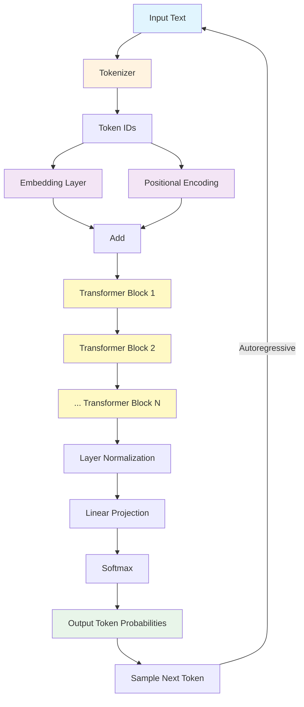
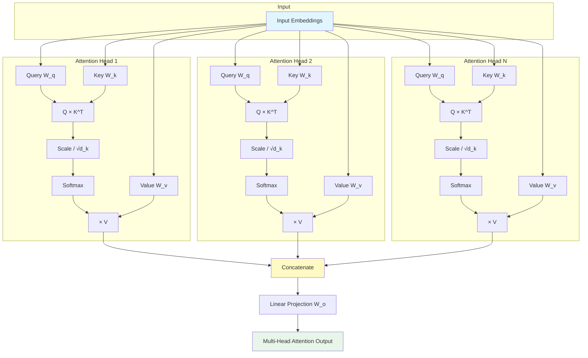
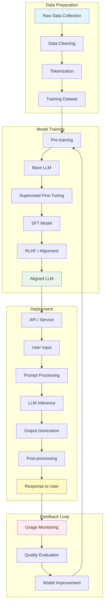

# Module 1: Diagrams — Generative AI & Prompting

This directory contains text-based and Mermaid diagrams illustrating key concepts from Module 1.

---

## 1. LLM Architecture Overview

### Mermaid Diagram



### ASCII Architecture Diagram

```
┌─────────────────────────────────────────────────────────────────────┐
│                        LLM ARCHITECTURE                              │
├─────────────────────────────────────────────────────────────────────┤
│                                                                      │
│  Input Text                                                          │
│       │                                                              │
│       ▼                                                              │
│  ┌─────────────┐                                                     │
│  │  Tokenizer  │  "Hello world" → [15496, 995]                       │
│  └──────┬──────┘                                                     │
│         │                                                            │
│         ▼                                                            │
│  ┌─────────────┐    ┌─────────────────────┐                          │
│  │  Embedding  │ +  │ Positional Encoding │ → Combined Representation│
│  └──────┬──────┘    └─────────────────────┘                          │
│         │                                                            │
│         ▼                                                            │
│  ┌─────────────────────────────────────────────────────────────┐     │
│  │              TRANSFORMER BLOCKS (× N layers)                 │     │
│  │  ┌──────────────────────────────────────────────────────┐   │     │
│  │  │  Layer 1                                              │   │     │
│  │  │  ┌──────────────┐    ┌──────────────┐                 │   │     │
│  │  │  │ Multi-Head   │    │ Feed-Forward │                 │   │     │
│  │  │  │ Attention    │───▶│ Network (MLP)│                 │   │     │
│  │  │  │ + LayerNorm  │    │ + LayerNorm  │                 │   │     │
│  │  │  └──────────────┘    └──────────────┘                 │   │     │
│  │  └──────────────────────────────────────────────────────┘   │     │
│  │  ┌──────────────────────────────────────────────────────┐   │     │
│  │  │  Layer 2                                              │   │     │
│  │  │  ... (same structure, shared or different weights)    │   │     │
│  │  └──────────────────────────────────────────────────────┘   │     │
│  │  ...                                                         │     │
│  │  ┌──────────────────────────────────────────────────────┐   │     │
│  │  │  Layer N                                              │   │     │
│  │  └──────────────────────────────────────────────────────┘   │     │
│  └─────────────────────────────────────────────────────────────┘     │
│         │                                                            │
│         ▼                                                            │
│  ┌──────────────┐    ┌──────────────┐    ┌──────────────┐           │
│  │ Layer Norm   │───▶│ Linear Proj. │───▶│   Softmax    │           │
│  └──────────────┘    └──────────────┘    └──────┬───────┘           │
│                                                  │                   │
│                                                  ▼                   │
│                                    Probability Distribution          │
│                                    over Vocabulary                   │
│                                                  │                   │
│                                                  ▼                   │
│                                    Sample Next Token                 │
│                                    (autoregressive generation)       │
└─────────────────────────────────────────────────────────────────────┘
```

---

## 2. Prompt Engineering Workflow

### Mermaid Diagram

```mermaid
flowchart LR
    A[Define Task] --> B[Design Initial Prompt]
    B --> C[Send to LLM]
    C --> D{Evaluate Output}
    D -->|Good| E[Deploy/Use]
    D -->|Needs Improvement| F[Analyze Issues]
    F --> G[Refine Prompt]
    G --> C
    
    subgraph Prompt Components
        H[System Prompt]
        I[Context]
        J[Instruction]
        K[Examples]
        L[Input Data]
        M[Output Format]
    end
    
    B --- Prompt Components
    
    style A fill:#e1f5fe
    style E fill:#e8f5e9
    style D fill:#fff9c4
    style F fill:#ffebee
```

### ASCII Workflow Diagram

```
┌─────────────────────────────────────────────────────────────────────┐
│                    PROMPT ENGINEERING WORKFLOW                       │
├─────────────────────────────────────────────────────────────────────┤
│                                                                      │
│   ┌──────────┐     ┌──────────────┐     ┌──────────┐                │
│   │  Define  │────▶│   Design     │────▶│  Send to │                │
│   │   Task   │     │   Prompt     │     │   LLM    │                │
│   └──────────┘     └──────────────┘     └────┬─────┘                │
│                                               │                      │
│                                               ▼                      │
│                                        ┌──────────────┐              │
│                                   ┌───▶│  Evaluate    │              │
│                                   │    │   Output     │              │
│                                   │    └──────┬───────┘              │
│                                   │           │                      │
│                          ┌────────┴────────┐  │                      │
│                          │                 │  │                      │
│                     ┌────▼────┐      ┌─────▼──┐│                      │
│                     │  Good   │      │ Needs  ││                      │
│                     │ Output  │      │Improvement│                    │
│                     └────┬────┘      └────┬───┘│                      │
│                          │                │    │                      │
│                          ▼                ▼    │                      │
│                   ┌──────────────┐  ┌──────────┴───┐                │
│                   │  Deploy /    │  │  Analyze     │                │
│                   │   Use        │  │  Issues      │                │
│                   └──────────────┘  └──────┬───────┘                │
│                                            │                        │
│                                            ▼                        │
│                                     ┌──────────────┐                │
│                                     │  Refine      │────────────────┘
│                                     │  Prompt      │   (iterate)
│                                     └──────────────┘                │
│                                                                      │
│  ┌─────────────────────────────────────────────────────────────┐     │
│  │                    PROMPT COMPONENTS                         │     │
│  │  ┌────────────┐ ┌──────────┐ ┌────────────┐                 │     │
│  │  │  System    │ │ Context  │ │ Instruction│                 │     │
│  │  │  Prompt    │ │          │ │            │                 │     │
│  │  └────────────┘ └──────────┘ └────────────┘                 │     │
│  │  ┌────────────┐ ┌──────────┐ ┌────────────┐                 │     │
│  │  │  Examples  │ │  Input   │ │   Output   │                 │     │
│  │  │ (Few-shot) │ │   Data   │ │   Format   │                 │     │
│  │  └────────────┘ └──────────┘ └────────────┘                 │     │
│  └─────────────────────────────────────────────────────────────┘     │
└─────────────────────────────────────────────────────────────────────┘
```

---

## 3. Transformer Attention Mechanism

### Mermaid Diagram



### ASCII Attention Diagram

```
┌─────────────────────────────────────────────────────────────────────┐
│                   MULTI-HEAD SELF-ATTENTION                          │
├─────────────────────────────────────────────────────────────────────┤
│                                                                      │
│  Input: X (sequence of token embeddings)                             │
│  Shape: [seq_len, d_model]                                           │
│                                                                      │
│  ┌─────────────────────────────────────────────────────────────┐     │
│  │                    LINEAR PROJECTIONS                        │     │
│  │                                                              │     │
│  │  Q = X × W_q    (Query: what to look for)                   │     │
│  │  K = X × W_k    (Key: what each token contains)             │     │
│  │  V = X × W_v    (Value: actual content)                     │     │
│  └─────────────────────────────────────────────────────────────┘     │
│                               │                                      │
│           ┌───────────────────┼───────────────────┐                  │
│           ▼                   ▼                   ▼                  │
│  ┌───────────────┐  ┌───────────────┐  ┌───────────────┐            │
│  │   HEAD 1      │  │   HEAD 2      │  │   HEAD N      │            │
│  │               │  │               │  │               │            │
│  │ Q₁K₁ᵀ/√d_k    │  │ Q₂K₂ᵀ/√d_k    │  │ QₙKₙᵀ/√d_k    │            │
│  │     ↓         │  │     ↓         │  │     ↓         │            │
│  │  Softmax      │  │  Softmax      │  │  Softmax      │            │
│  │     ↓         │  │     ↓         │  │     ↓         │            │
│  │  × V₁         │  │  × V₂         │  │  × Vₙ         │            │
│  │     ↓         │  │     ↓         │  │     ↓         │            │
│  │  Output₁      │  │  Output₂      │  │  Outputₙ      │            │
│  └───────┬───────┘  └───────┬───────┘  └───────┬───────┘            │
│          │                  │                  │                     │
│          └──────────────────┼──────────────────┘                     │
│                             ▼                                        │
│                    ┌─────────────────┐                               │
│                    │   CONCATENATE   │                               │
│                    │  [Out₁; Out₂;   │                               │
│                    │   ...; Outₙ]    │                               │
│                    └────────┬────────┘                               │
│                             ▼                                        │
│                    ┌─────────────────┐                               │
│                    │  LINEAR PROJ.   │  × W_o                         │
│                    └────────┬────────┘                               │
│                             ▼                                        │
│                    ┌─────────────────┐                               │
│                    │     OUTPUT      │  Shape: [seq_len, d_model]    │
│                    └─────────────────┘                               │
│                                                                      │
│  Formula:                                                            │
│  Attention(Q,K,V) = softmax(QKᵀ / √d_k) × V                         │
│  MultiHead(Q,K,V) = Concat(head₁,...,headₙ) × W_o                   │
└─────────────────────────────────────────────────────────────────────┘
```

### Attention Visualization (Token Relationships)

```
Input: "The cat sat on the mat"

Attention weights for token "sat":

         The    cat   sat    on   the   mat
         │      │     │      │     │     │
    The  ├──────┼─────┼──────┼─────┼─────┤  0.05
    cat  ├──────┼─────┼──────┼─────┼─────┤  0.35  ← Strong connection
    sat  ├──────┼─────┼──────┼─────┼─────┤  0.20  ← Self-attention
    on   ├──────┼─────┼──────┼─────┼─────┤  0.10
    the  ├──────┼─────┼──────┼─────┼─────┤  0.05
    mat  ├──────┼─────┼──────┼─────┼─────┤  0.25  ← Strong connection
         │      │     │      │     │     │
         
    "sat" attends most strongly to "cat" (subject) and "mat" (location)
```

---

## 4. Generative AI Pipeline

### Mermaid Diagram



### ASCII Pipeline Diagram

```
┌─────────────────────────────────────────────────────────────────────┐
│                     GENERATIVE AI PIPELINE                           │
├─────────────────────────────────────────────────────────────────────┤
│                                                                      │
│  PHASE 1: DATA PREPARATION                                           │
│  ─────────────────────────                                          │
│                                                                      │
│  ┌──────────┐    ┌──────────┐    ┌──────────┐    ┌──────────┐       │
│  │  Collect │───▶│  Clean   │───▶│ Tokenize │───▶│  Dataset │       │
│  │  Data    │    │  & Filter│    │          │    │  Ready   │       │
│  └──────────┘    └──────────┘    └──────────┘    └──────────┘       │
│                                                                      │
│  PHASE 2: MODEL TRAINING                                             │
│  ─────────────────                                                  │
│                                                                      │
│  ┌──────────┐    ┌──────────┐    ┌──────────┐    ┌──────────┐       │
│  │Pre-train │───▶│   Base   │───▶│   SFT    │───▶│  Aligned │       │
│  │  (Self-  │    │   LLM    │    │(Instruction│   │  Model   │       │
│  │supervised)│    │          │    │ Tuning)  │    │ (RLHF)   │       │
│  └──────────┘    └──────────┘    └──────────┘    └──────────┘       │
│                                                                      │
│  PHASE 3: DEPLOYMENT & INFERENCE                                     │
│  ─────────────────────────────                                      │
│                                                                      │
│  ┌──────────┐    ┌──────────┐    ┌──────────┐    ┌──────────┐       │
│  │  User    │───▶│  Prompt  │───▶│   LLM    │───▶│  Output  │       │
│  │  Input   │    │Processing│    │Inference │    │Generation│       │
│  └──────────┘    └──────────┘    └──────────┘    └────┬─────┘       │
│                                                       │              │
│                                                       ▼              │
│                                                ┌──────────┐          │
│                                                │  Post-   │          │
│                                                │processing│          │
│                                                └────┬─────┘          │
│                                                     │                │
│                                                     ▼                │
│                                                ┌──────────┐          │
│                                                │ Response │          │
│                                                │ to User  │          │
│                                                └──────────┘          │
│                                                                      │
│  PHASE 4: MONITORING & IMPROVEMENT                                   │
│  ────────────────────────────────                                   │
│                                                                      │
│  ┌──────────┐    ┌──────────┐    ┌──────────┐                       │
│  │ Monitor  │───▶│ Evaluate │───▶│ Improve  │───▶ (back to training)│
│  │ Usage    │    │ Quality  │    │ Model    │                       │
│  └──────────┘    └──────────┘    └──────────┘                       │
│                                                                      │
└─────────────────────────────────────────────────────────────────────┘
```

---

## 5. Prompt Engineering Techniques Comparison

```
┌─────────────────────────────────────────────────────────────────────────────────────┐
│                        PROMPT ENGINEERING TECHNIQUES                                 │
├──────────────────┬──────────────────────────────┬────────────────────────────────────┤
│   Technique      │   Description                │   Example                          │
├──────────────────┼──────────────────────────────┼────────────────────────────────────┤
│                  │                              │                                    │
│  Zero-Shot       │ No examples provided         │ "Classify: 'Great product!' → ?"   │
│                  │                              │                                    │
├──────────────────┼──────────────────────────────┼────────────────────────────────────┤
│                  │                              │ "Good → Positive                   │
│  Few-Shot        │ 2-5 examples in prompt       │  Bad → Negative                    │
│                  │                              │  OK → ?"                           │
├──────────────────┼──────────────────────────────┼────────────────────────────────────┤
│                  │                              │ "Q: 2+3×4=?                        │
│  Chain-of-Thought│ Step-by-step reasoning       │  A: 2+3×4 = 2+12 = 14              │
│                  │                              │  Now solve: 5+2×6=?"               │
├──────────────────┼──────────────────────────────┼────────────────────────────────────┤
│                  │                              │ Thought: Need to search            │
│  ReAct           │ Reasoning + Tool use         │ Action: search(...)                │
│                  │                              │ Observation: ...                   │
├──────────────────┼──────────────────────────────┼────────────────────────────────────┤
│                  │                              │ Approach 1: ... Pros/Cons          │
│  Tree of Thoughts│ Multiple reasoning paths     │ Approach 2: ... Pros/Cons          │
│                  │                              │ Evaluate and select best           │
├──────────────────┼──────────────────────────────┼────────────────────────────────────┤
│                  │                              │ Generate 5 answers,                │
│  Self-Consistency│ Multiple outputs, vote       │ take majority vote                 │
│                  │                              │                                    │
├──────────────────┼──────────────────────────────┼────────────────────────────────────┤
│                  │                              │ "Return JSON with keys:            │
│  Structured      │ Force specific format        │  name, age, role"                   │
│  Output          │                              │                                    │
├──────────────────┼──────────────────────────────┼────────────────────────────────────┤
│                  │                              │ Step 1: Extract                    │
│  Prompt Chaining │ Sequential prompt calls      │ Step 2: Analyze                    │
│                  │                              │ Step 3: Summarize                  │
└──────────────────┴──────────────────────────────┴────────────────────────────────────┘
```

---

## 6. LLM Limitations and Mitigations

```
┌─────────────────────────────────────────────────────────────────────────────────────┐
│                        LLM LIMITATIONS & MITIGATIONS                                 │
├──────────────────┬──────────────────────────────┬────────────────────────────────────┤
│   Limitation     │   Impact                     │   Mitigation                       │
├──────────────────┼──────────────────────────────┼────────────────────────────────────┤
│                  │                              │                                    │
│  Hallucination   │ Incorrect facts              │ RAG, verification,                 │
│                  │                              │ grounded generation                │
├──────────────────┼──────────────────────────────┼────────────────────────────────────┤
│  Context Window  │ Limited input length         │ Chunking, summarization,           │
│                  │                              │ hierarchical retrieval             │
├──────────────────┼──────────────────────────────┼────────────────────────────────────┤
│  Knowledge       │ Outdated information         │ Web search, fine-tuning,           │
│  Cutoff          │                              │ RAG with current data              │
├──────────────────┼──────────────────────────────┼────────────────────────────────────┤
│  Bias            │ Unfair outputs               │ Auditing, filtering,               │
│                  │                              │ diverse examples                   │
├──────────────────┼──────────────────────────────┼────────────────────────────────────┤
│  Non-determinism │ Inconsistent outputs         │ temperature=0, seed,               │
│                  │                              │ structured output                  │
├──────────────────┼──────────────────────────────┼────────────────────────────────────┤
│  Reasoning       │ Multi-step logic errors      │ Chain-of-thought,                  │
│  Depth           │                              │ decomposition, tool use            │
├──────────────────┼──────────────────────────────┼────────────────────────────────────┤
│  Math Precision  │ Arithmetic errors            │ Calculator tool, code              │
│                  │                              │ execution                          │
├──────────────────┼──────────────────────────────┼────────────────────────────────────┤
│  Cost/Latency    │ Expensive, slow              │ Caching, smaller models,           │
│                  │                              │ batching, streaming                │
└──────────────────┴──────────────────────────────┴────────────────────────────────────┘
```

---

## 7. Responsible AI Framework

```
                    ┌─────────────────────────────────────┐
                    │        RESPONSIBLE AI                │
                    └──────────────┬──────────────────────┘
                                   │
          ┌────────────┬───────────┼───────────┬────────────┐
          ▼            ▼           ▼           ▼            ▼
    ┌──────────┐ ┌──────────┐ ┌──────────┐ ┌──────────┐ ┌──────────┐
    │ FAIRNESS │ │TRANS-    │ │ACCOUNT-  │ │ PRIVACY  │ │  SAFETY  │
    │          │ │PARENCY   │ │ABILITY   │ │          │ │          │
    ├──────────┤ ├──────────┤ ├──────────┤ ├──────────┤ ├──────────┤
    │• Bias    │ │• Model   │ │• Human   │ │• Data    │ │• Content │
    │  testing │ │  docs    │ │  review  │ │  minim.  │ │  filter  │
    │• Diverse │ │• Explain │ │• Audit   │ │• Consent │ │• Rate    │
    │  data    │ │  ability │ │  trails  │ │  mgmt    │ │  limits  │
    │• Subgroup│ │• Confidence│• Error  │ │• Secure  │ │• Abuse   │
    │  analysis│ │  scores  │ │ reporting│ │  handling│ │  detect  │
    └──────────┘ └──────────┘ └──────────┘ └──────────┘ └──────────┘
```
