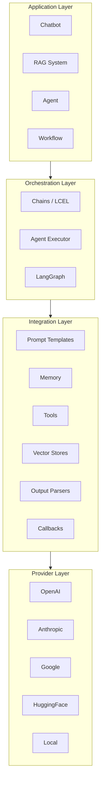
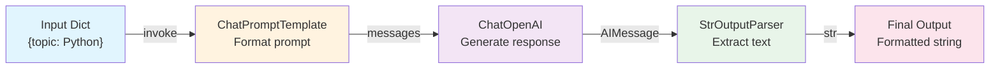
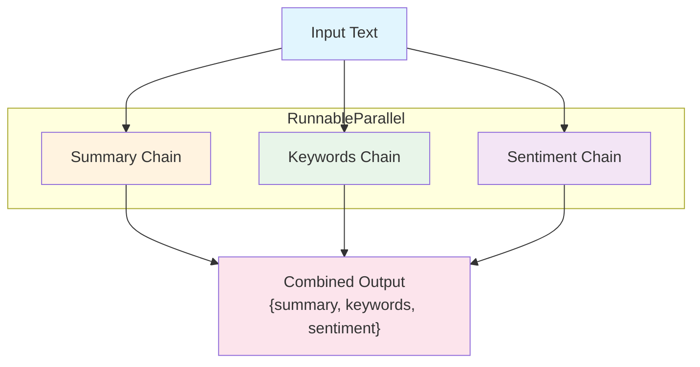
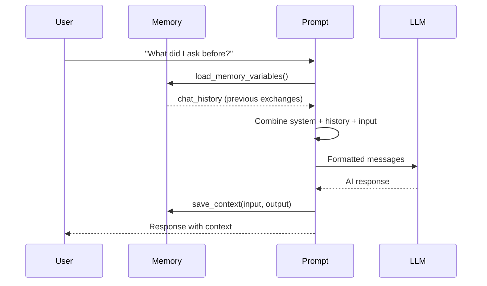
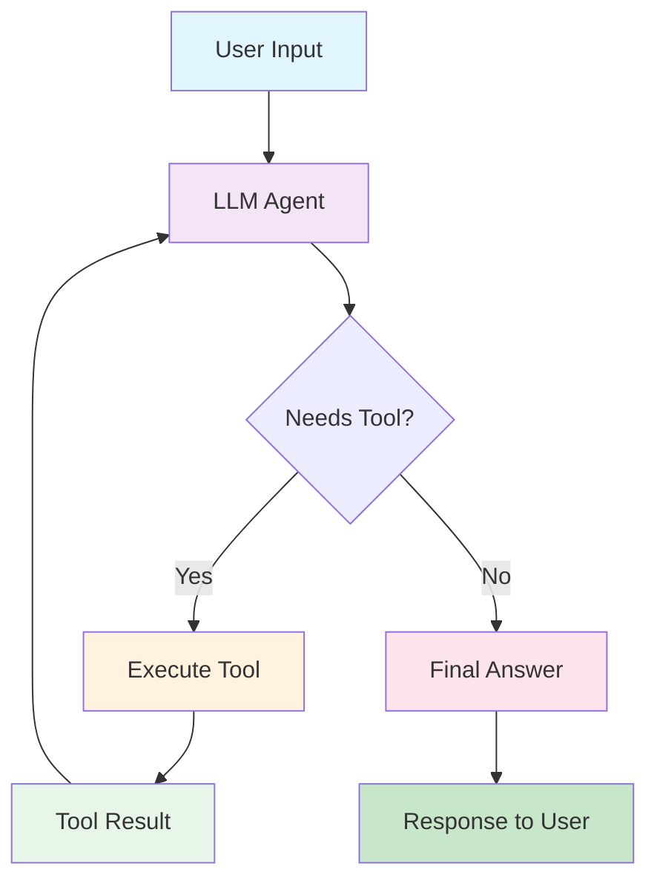
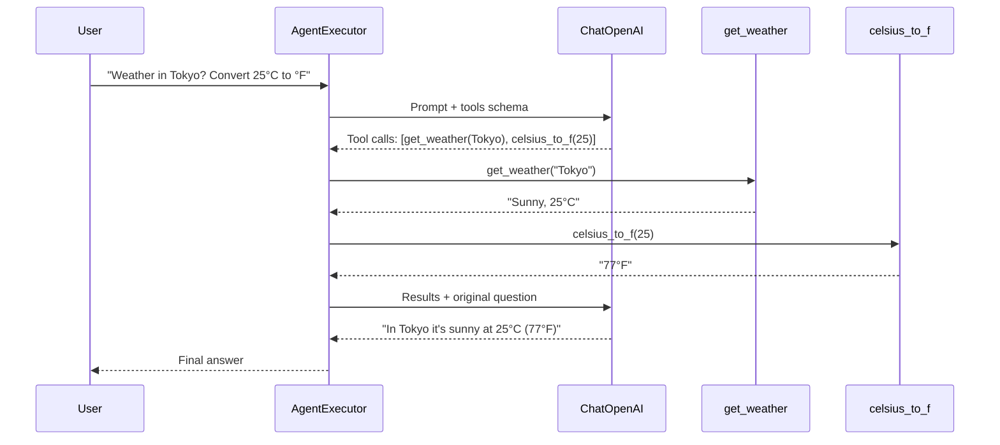
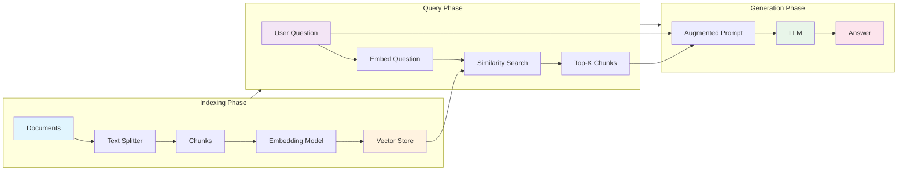

# Module 2: LangChain Framework — Diagrams

This directory contains text-based and Mermaid diagrams illustrating key LangChain concepts.

---

## 1. LangChain Architecture

### Layered Architecture

```
┌─────────────────────────────────────────────────────────────────────┐
│                        APPLICATION LAYER                             │
│  ┌──────────┐  ┌──────────┐  ┌──────────┐  ┌──────────────────┐    │
│  │ Chatbot  │  │   RAG    │  │  Agent   │  │ Workflow Engine  │    │
│  └──────────┘  └──────────┘  └──────────┘  └──────────────────┘    │
├─────────────────────────────────────────────────────────────────────┤
│                      ORCHESTRATION LAYER                             │
│  ┌──────────┐  ┌──────────┐  ┌──────────┐  ┌──────────────────┐    │
│  │  Chains  │  │  Agents  │  │  Graphs  │  │    Workflows     │    │
│  │  (LCEL)  │  │Executor  │  │(LangGraph)│  │   (Custom)       │    │
│  └──────────┘  └──────────┘  └──────────┘  └──────────────────┘    │
├─────────────────────────────────────────────────────────────────────┤
│                      INTEGRATION LAYER                               │
│  ┌────────┐ ┌────────┐ ┌────────┐ ┌────────┐ ┌────────┐ ┌───────┐  │
│  │Prompts │ │ Memory │ │ Tools  │ │Indexes │ │Parsers │ │Calls  │  │
│  └────────┘ └────────┘ └────────┘ └────────┘ └────────┘ └───────┘  │
├─────────────────────────────────────────────────────────────────────┤
│                        PROVIDER LAYER                                │
│  ┌────────┐ ┌──────────┐ ┌────────┐ ┌──────────┐ ┌──────────────┐  │
│  │ OpenAI │ │ Anthropic │ │ Google │ │ Hugging  │ │ Local Models │  │
│  │        │ │  Claude   │ │ Gemini │ │  Face    │ │  (Ollama)    │  │
│  └────────┘ └──────────┘ └────────┘ └──────────┘ └──────────────┘  │
└─────────────────────────────────────────────────────────────────────┘
```

### Mermaid Diagram



---

## 2. Chain Execution Flow (LCEL)

### Linear Chain Flow

```
┌──────────────┐     ┌──────────────┐     ┌──────────────┐     ┌──────────────┐
│   Input      │────>│   Prompt     │────>│    Model     │────>│   Parser     │
│  Dict        │     │  Template    │     │  (LLM/Chat)  │     │  (Output)    │
│              │     │              │     │              │     │              │
│ {"topic":    │     │ "Tell me     │     │  Generates   │     │  Structured  │
│  "Python"}   │     │ about        │     │  raw text    │     │  output      │
│              │     │ {topic}"      │     │              │     │  (str/json)  │
└──────────────┘     └──────────────┘     └──────────────┘     └──────────────┘
```

### Mermaid Diagram



### Parallel Chain Flow

```
                    ┌──────────────────┐
                    │   Input Text     │
                    └────────┬─────────┘
                             │
              ┌──────────────┼──────────────┐
              │              │              │
              ▼              ▼              ▼
     ┌──────────────┐ ┌──────────────┐ ┌──────────────┐
     │ Summary      │ │ Keywords     │ │ Sentiment    │
     │ Chain        │ │ Chain        │ │ Chain        │
     └──────┬───────┘ └──────┬───────┘ └──────┬───────┘
            │                │                │
            └────────────────┼────────────────┘
                             ▼
                    ┌──────────────────┐
                    │  Combined Output │
                    │  {summary,       │
                    │   keywords,      │
                    │   sentiment}     │
                    └──────────────────┘
```

### Mermaid Diagram



---

## 3. Memory Integration Pattern

### Conversation Flow with Memory

```
┌─────────────────────────────────────────────────────────────────┐
│                        User Input                               │
│                     "What did I ask before?"                    │
└────────────────────────────┬────────────────────────────────────┘
                             │
                             ▼
┌─────────────────────────────────────────────────────────────────┐
│                    Memory Load                                   │
│  ┌───────────────────────────────────────────────────────────┐  │
│  │ ConversationBufferMemory                                  │  │
│  │ ┌───────────────────────────────────────────────────────┐ │  │
│  │ │ Human: What is Python?                                │ │  │
│  │ │ AI: Python is a programming language...               │ │  │
│  │ │ Human: Who created it?                                │ │  │
│  │ │ AI: Guido van Rossum created Python in 1991.          │ │  │
│  │ └───────────────────────────────────────────────────────┘ │  │
│  └───────────────────────────────────────────────────────────┘  │
└────────────────────────────┬────────────────────────────────────┘
                             │
                             ▼
┌─────────────────────────────────────────────────────────────────┐
│              Prompt + History + Current Input                   │
│  ┌───────────────────────────────────────────────────────────┐  │
│  │ System: You are a helpful assistant.                      │  │
│  │ Human: What is Python?                                    │  │
│  │ AI: Python is a programming language...                   │  │
│  │ Human: Who created it?                                    │  │
│  │ AI: Guido van Rossum created Python in 1991.              │  │
│  │ Human: What did I ask before?                             │  │
│  └───────────────────────────────────────────────────────────┘  │
└────────────────────────────┬────────────────────────────────────┘
                             │
                             ▼
┌─────────────────────────────────────────────────────────────────┐
│                        LLM Response                             │
│              "You previously asked about Python                 │
│               and who created it."                              │
└────────────────────────────┬────────────────────────────────────┘
                             │
                             ▼
┌─────────────────────────────────────────────────────────────────┐
│                    Memory Save                                   │
│  ┌───────────────────────────────────────────────────────────┐  │
│  │ Save: {input: "What did I ask before?",                   │  │
│  │        output: "You previously asked about..."}           │  │
│  └───────────────────────────────────────────────────────────┘  │
└─────────────────────────────────────────────────────────────────┘
```

### Mermaid Diagram



### Memory Type Comparison

```
┌─────────────────────────────┬────────────────────────────────────┐
│ Memory Type                 │ Storage Strategy                   │
├─────────────────────────────┼────────────────────────────────────┤
│ ConversationBufferMemory    │ All messages stored                │
│                             │ [M1, M2, M3, M4, M5, ...]          │
├─────────────────────────────┼────────────────────────────────────┤
│ ConversationBufferWindow    │ Last N messages only               │
│                             │ [..., M(n-2), M(n-1), Mn]          │
├─────────────────────────────┼────────────────────────────────────┤
│ ConversationSummaryMemory   │ Single summary string              │
│                             │ "User asked about Python..."       │
├─────────────────────────────┼────────────────────────────────────┤
│ SummaryBufferMemory         │ Summary + recent messages          │
│                             │ [Summary, M(n-1), Mn]              │
├─────────────────────────────┼────────────────────────────────────┤
│ VectorStoreRetrieverMemory  │ Semantic search in vector store    │
│                             │ Retrieve top-k relevant memories   │
└─────────────────────────────┴────────────────────────────────────┘
```

---

## 4. Agent-Tool Interaction Loop

### ReAct Agent Loop

```
┌──────────────────────────────────────────────────────────────────┐
│                         START                                     │
│                    User: "What is 23 * 45?"                      │
└──────────────────────────────┬───────────────────────────────────┘
                               │
                               ▼
                    ┌─────────────────────┐
                    │    THOUGHT          │
                    │ "I need to multiply │
                    │  23 by 45. I'll use │
                    │  the calculator."   │
                    └──────────┬──────────┘
                               │
                               ▼
                    ┌─────────────────────┐
                    │    ACTION           │
                    │ Tool: calculator    │
                    │ Input: "23 * 45"    │
                    └──────────┬──────────┘
                               │
                               ▼
                    ┌─────────────────────┐
                    │   OBSERVATION       │
                    │ Tool Output: "1035" │
                    └──────────┬──────────┘
                               │
                               ▼
                    ┌─────────────────────┐
                    │    THOUGHT          │
                    │ "I now have the     │
                    │  answer: 1035"      │
                    └──────────┬──────────┘
                               │
                               ▼
                    ┌─────────────────────┐
                    │  FINAL ANSWER       │
                    │ "23 * 45 = 1035"    │
                    └──────────┬──────────┘
                               │
                               ▼
                    ┌─────────────────────┐
                    │       END           │
                    └─────────────────────┘
```

### Mermaid Diagram



### Tool Calling Agent Architecture

```
┌─────────────────────────────────────────────────────────────────────┐
│                         TOOL CALLING AGENT                          │
│                                                                     │
│  ┌─────────────────────────────────────────────────────────────┐   │
│  │                      LLM (GPT-4/Claude)                     │   │
│  │                                                             │   │
│  │  Input: "What's the weather in Tokyo and convert 25°C to °F"│   │
│  │                                                             │   │
│  │  Output: [Tool Calls]                                       │   │
│  │    1. get_weather(city="Tokyo")                             │   │
│  │    2. celsius_to_fahrenheit(celsius=25)                     │   │
│  └──────────────────────────┬──────────────────────────────────┘   │
│                             │                                       │
│              ┌──────────────┴──────────────┐                       │
│              ▼                             ▼                       │
│  ┌─────────────────────┐     ┌─────────────────────┐              │
│  │  get_weather Tool   │     │ celsius_to_fahrenheit │              │
│  │  → "Sunny, 25°C"    │     │ → "77°F"              │              │
│  └──────────┬──────────┘     └──────────┬──────────┘              │
│             │                           │                          │
│             └──────────────┬────────────┘                          │
│                            ▼                                       │
│              ┌─────────────────────────┐                          │
│              │    LLM Synthesizes      │                          │
│              │ "In Tokyo it's sunny    │                          │
│              │  at 25°C, which is 77°F"│                          │
│              └─────────────────────────┘                          │
└─────────────────────────────────────────────────────────────────────┘
```

### Mermaid Diagram



---

## 5. RAG Pipeline (Bonus)

### Retrieval-Augmented Generation Flow



---

## 6. Complete LangChain Application Flow

```
┌─────────────────────────────────────────────────────────────────────┐
│                     LANGCHAIN APPLICATION                           │
│                                                                     │
│  ┌─────────┐    ┌──────────┐    ┌──────────┐    ┌──────────────┐  │
│  │  User   │───>│  Input   │───>│  Chain   │───>│   Output     │  │
│  │ Interface│    │Validation│    │Execution │    │  Formatting  │  │
│  └─────────┘    └──────────┘    └────┬─────┘    └──────────────┘  │
│                                      │                              │
│              ┌───────────────────────┼───────────────────────┐     │
│              │                       │                       │     │
│              ▼                       ▼                       ▼     │
│  ┌──────────────────┐  ┌──────────────────┐  ┌──────────────────┐ │
│  │     Memory       │  │     Tools        │  │   Vector Store   │ │
│  │ ┌──────────────┐ │  │ ┌──────────────┐ │  │ ┌──────────────┐ │ │
│  │ │Conversation  │ │  │ │Web Search    │ │  │ │Document      │ │ │
│  │ │History       │ │  │ │Calculator    │ │  │ │Chunks        │ │ │
│  │ │Summary       │ │  │ │API Calls     │ │  │ │Embeddings    │ │ │
│  │ └──────────────┘ │  │ └──────────────┘ │  │ └──────────────┘ │ │
│  └──────────────────┘  └──────────────────┘  └──────────────────┘ │
│                                                                     │
│  ┌─────────────────────────────────────────────────────────────┐   │
│  │                    Callbacks & Monitoring                    │   │
│  │  ┌──────────┐  ┌──────────┐  ┌──────────┐  ┌──────────┐   │   │
│  │  │Token     │  │Latency   │  │Error     │  │Cost      │   │   │
│  │  │Tracking  │  │Tracking  │  │Handling  │  │Tracking  │   │   │
│  │  └──────────┘  └──────────┘  └──────────┘  └──────────┘   │   │
│  └─────────────────────────────────────────────────────────────┘   │
└─────────────────────────────────────────────────────────────────────┘
```
