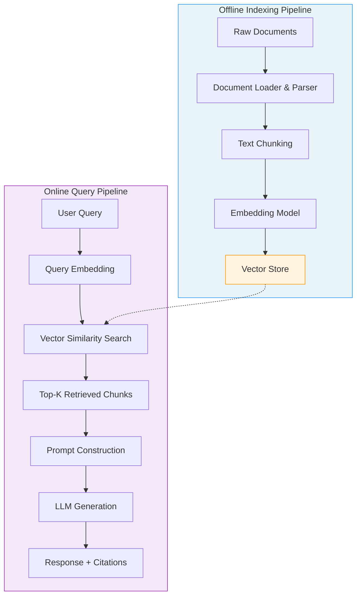
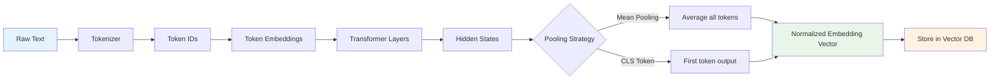
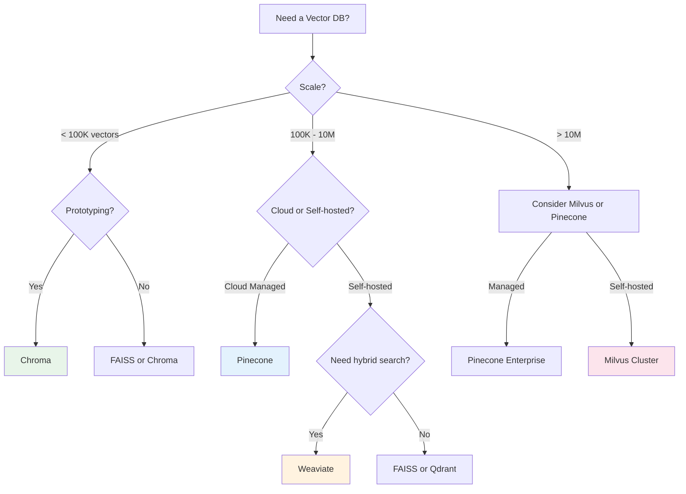
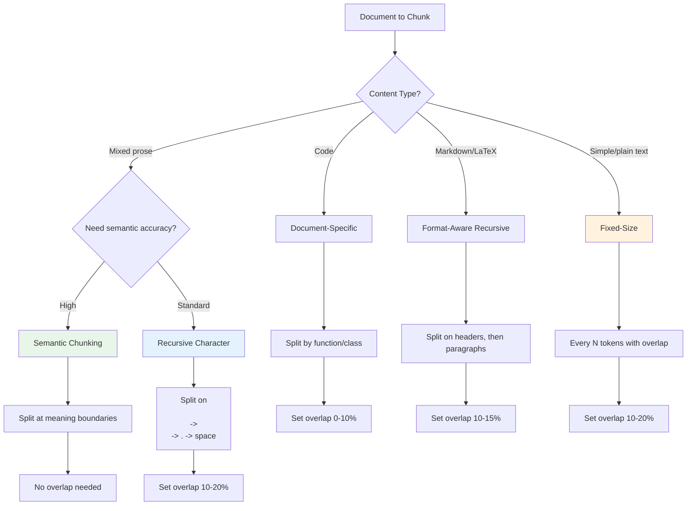
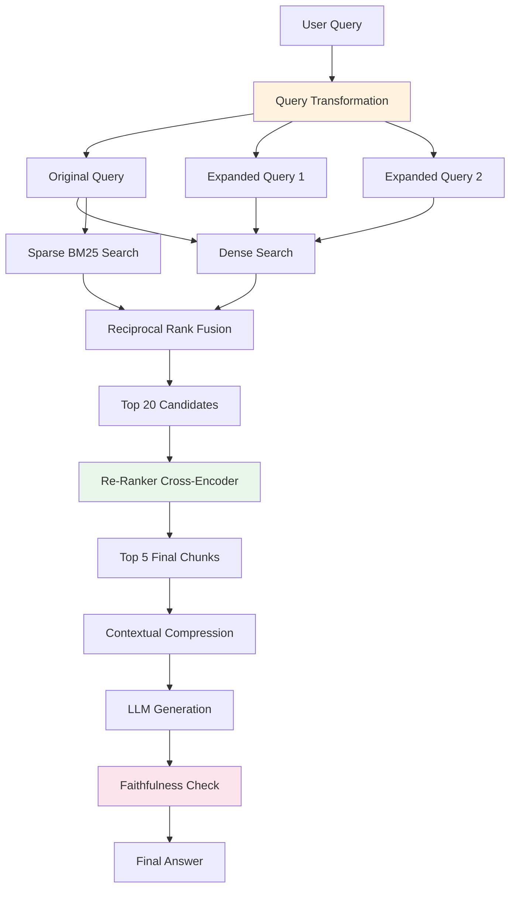

# Module 3: RAG & Vector Databases — Diagrams

Visual reference for RAG architecture, embedding pipelines, vector databases, chunking strategies, retrieval flows, and evaluation frameworks.

---

## 1. RAG Architecture Overview

### High-Level RAG Pipeline

```
+---------------------------------------------------------------------------+
|                           RAG SYSTEM ARCHITECTURE                          |
+---------------------------------------------------------------------------+
|                                                                            |
|  OFFLINE (Indexing) PIPELINE              ONLINE (Query) PIPELINE          |
|                                                                            |
|  +----------+                             +--------------+                 |
|  | Raw Docs |                             |  User Query  |                 |
|  | PDF/HTML |                             |  "What is X?"|                 |
|  | Markdown |                             +------+-------+                 |
|  +----+-----+                                    |                         |
|       |                                   +------v-------+                 |
|  +----v-----+                             |   Embedding  |                 |
|  |  Loader  |                             |    Model     |                 |
|  |& Parser  |                             +------+-------+                 |
|  +----+-----+                                    |                         |
|       |                                    Query Vector                     |
|  +----v-----+                                    |                         |
|  | Chunking |                             +------v-------+                 |
|  | Strategy |                             |    Vector    |                 |
|  +----+-----+                             |  Similarity  |                 |
|       |                                   |    Search    |                 |
|  +----v-----+                             +------+-------+                 |
|  |Embedding |                                    |                         |
|  |  Model   |                             +------v-------+                 |
|  +----+-----+                             |  Top-K Docs  |                 |
|       |                                   +------+-------+                 |
|  +----v-------------+                           |                         |
|  |   Vector Store   |+------- stored ----- +----v--------------+          |
|  |  (Chroma/FAISS/  |      embeddings      |   LLM Generator   |          |
|  |   Pinecone)      |                      |  "Given context,  |          |
|  +------------------+                      |   answer the Q"   |          |
|                                            +----+--------------+          |
|                                                 |                         |
|                                            +----v-------+                 |
|                                            |  Response  |                 |
|                                            | + Citations |                 |
|                                            +------------+                 |
+---------------------------------------------------------------------------+
```

### Mermaid — RAG System Architecture



---

## 2. Embedding Pipeline

### Text to Vector Conversion

```
+--------------------------------------------------------------+
|                   EMBEDDING PIPELINE                          |
+--------------------------------------------------------------+
|                                                               |
|  "Machine learning is a subset      +---------------------+  |
|   of artificial intelligence"  ---> |  Tokenizer          |  |
|                                     |  [Machine, learning, |  |
|                                     |   is, a, subset,     |  |
|                                     |   of, artificial,    |  |
|                                     |   intelligence]      |  |
|                                     +----------+----------+  |
|                                                |              |
|                                     +----------v----------+  |
|                                     |  Transformer Encoder |  |
|                                     |  +----------------+  |  |
|                                     |  | Self-Attention  |  |  |
|                                     |  | Feed-Forward    |  |  |
|                                     |  | Layer Norm      |  |  |
|                                     |  +----------------+  |  |
|                                     +----------+----------+  |
|                                                |              |
|                                     +----------v----------+  |
|                                     |  Pooling Layer       |  |
|                                     |  (Mean/CLS Token)    |  |
|                                     +----------+----------+  |
|                                                |              |
|  Vector: [0.023, -0.187, 0.451,               v              |
|           ..., 0.089]         <---- Dense Vector (1536-d)    |
|                                                               |
+--------------------------------------------------------------+
```

### Mermaid — Embedding Generation Flow



### Embedding Model Comparison

```
+-----------------------------------------------------------------------+
|                    EMBEDDING MODEL COMPARISON                          |
+-------------------+--------+-----------+--------+--------------------+
| Model             | Dims   | Max Tokens| Type   | Best For           |
+-------------------+--------+-----------+--------+--------------------+
| text-embed-3-sm   | 1536   | 8191      | Cloud  | General purpose    |
| text-embed-3-lg   | 3072   | 8191      | Cloud  | High accuracy      |
| BGE-large-en      | 1024   | 512       | Local  | Open source        |
| E5-large-v2       | 1024   | 512       | Local  | Multilingual       |
| nomic-embed-text  | 768    | 8192      | Local  | Long documents     |
| all-MiniLM-L6-v2  | 384    | 256       | Local  | Fast/speed         |
+-------------------+--------+-----------+--------+--------------------+
| Higher dimensions = richer representation, more storage/compute        |
| Longer max tokens = can embed larger chunks without truncation         |
+-----------------------------------------------------------------------+
```

---

## 3. Vector Database Comparison

### Feature Matrix

```
+------------------------------------------------------------------------------+
|                     VECTOR DATABASE COMPARISON                                |
+--------------+----------+----------+----------+----------+------------------+
| Feature      | FAISS    | Chroma   | Pinecone | Weaviate | Milvus           |
+--------------+----------+----------+----------+----------+------------------+
| Type         | Library  | DB       | Cloud    | Hybrid   | DB               |
| Deployment   | Local    | Local    | SaaS     | Either   | Self-hosted      |
| Scalability  | RAM      | Millions | Billions | Millions | Billions         |
| Index Types  | 10+      | HNSW     | Proprietary| HNSW   | 7+               |
| Metadata     | Limited  | Yes      | Yes      | Yes      | Yes              |
| Hybrid Search| No       | Yes      | Yes      | Yes      | Yes              |
| GPU Support  | Yes      | No       | N/A      | No       | Yes              |
| License      | MIT      | Apache   | Proprietary| BSD    | Apache           |
+--------------+----------+----------+----------+----------+------------------+
| Setup Effort | Medium   | Low      | Low      | Medium   | High             |
| Cost         | Free     | Free     | $$       | Free/$   | Free/$           |
+--------------+----------+----------+----------+----------+------------------+
|                                                                            |
| Use FAISS: Research, large local datasets, need GPU acceleration           |
| Use Chroma: Prototyping, small apps, learning RAG                          |
| Use Pinecone: Production, managed, zero-ops                                |
| Use Weaviate: Production, hybrid search, self-hosted option                |
| Use Milvus: Massive scale, distributed, enterprise                         |
+------------------------------------------------------------------------------+
```

### Mermaid — Vector DB Selection Decision Tree



---

## 4. Chunking Strategies

### Strategy Comparison

```
+---------------------------------------------------------------------------+
|                        CHUNKING STRATEGIES                                 |
+---------------------------------------------------------------------------+
|                                                                            |
|  FIXED-SIZE CHUNKING                                                       |
|  +------------+------------+------------+------------+                    |
|  | Chunk 1    | Chunk 2    | Chunk 3    | Chunk 4    |                    |
|  | ########## | oo######## | oo######## | oo######## |                    |
|  | 500 chars  | 500 chars  | 500 chars  | 500 chars  |                    |
|  +------------+------------+------------+------------+                    |
|  oo = overlap (50 chars)                                                   |
|  + Simple, fast  x Breaks sentences/paragraphs                            |
|                                                                            |
|  RECURSIVE CHARACTER CHUNKING                                              |
|  +------------------+------------------+------------------+               |
|  | Paragraph 1      | Paragraph 2+3    | Paragraph 4      |               |
|  | + Sentence split | + Word boundary  | + Remainder      |               |
|  +------------------+------------------+------------------+               |
|  Splits: \n\n -> \n -> . -> " " -> ""                                     |
|  + Respects structure  x May still split mid-idea                         |
|                                                                            |
|  SEMANTIC CHUNKING                                                         |
|  +-----------------------+  +----------------+  +------------------+      |
|  | Topic A               |  | Topic B        |  | Topic C          |      |
|  | (high internal sim)   |  | (boundary)     |  | (high internal)  |      |
|  +-----------------------+  +----------------+  +------------------+      |
|  Splits where embedding similarity drops below threshold                   |
|  + Topically coherent  x Variable sizes, slower, costs embeddings        |
|                                                                            |
|  DOCUMENT-SPECIFIC CHUNKING                                                |
|  +----------+----------+----------+----------+                            |
|  | Function | Function | Class    | Method   |                            |
|  | def foo  | def bar  | class X  | def m1   |                            |
|  +----------+----------+----------+----------+                            |
|  + Preserves code/docs structure  x Requires custom parsers               |
|                                                                            |
+---------------------------------------------------------------------------+
```

### Mermaid — Chunking Decision Flow



---

## 5. Retrieval Flow

### Standard vs. Advanced Retrieval

```
+---------------------------------------------------------------------------+
|                      STANDARD RAG RETRIEVAL                                |
+---------------------------------------------------------------------------+
|                                                                            |
|  Query --> Embed --> Vector Search --> Top-K --> LLM --> Answer           |
|                                                                            |
|  Simple but limited: may miss relevant docs, no re-ranking               |
|                                                                            |
+---------------------------------------------------------------------------+

+---------------------------------------------------------------------------+
|                      ADVANCED RAG RETRIEVAL                                |
+---------------------------------------------------------------------------+
|                                                                            |
|                    +--- Dense Search (embeddings) ---+                     |
|                    |                                  |                     |
|  Query --> Query --+                                  +--> Reciprocal -->  |
|           Transform|                                  |    Rank Fusion     |
|                    +--- Sparse Search (BM25) ---------+        |           |
|                                                                |           |
|                                                           +----v----+      |
|                                                           | Top 20  |      |
|                                                           |candidates|     |
|                                                           +----+----+      |
|                                                                |           |
|                                                           +----v----+      |
|                                                           |Re-ranker|      |
|                                                           |(cross-  |      |
|                                                           |encoder) |      |
|                                                           +----+----+      |
|                                                                |           |
|                                                           +----v----+      |
|                                                           | Top 5   |      |
|                                                           | final   |      |
|                                                           +----+----+      |
|                                                                |           |
|                                                    +-----------v--------+  |
|                                                    |  Compression       |  |
|                                                    |  (extract key      |  |
|                                                    |   sentences)       |  |
|                                                    +-----------+--------+  |
|                                                                |           |
|                                                    +-----------v--------+  |
|                                                    |  LLM Generate      |  |
|                                                    |  + Faithfulness    |  |
|                                                    |    Check           |  |
|                                                    +-----------+--------+  |
|                                                                |           |
|                                                           +----v----+      |
|                                                           | Answer  |      |
|                                                           +---------+      |
+---------------------------------------------------------------------------+
```

### Mermaid — Retrieval Strategies



---

## 6. Evaluation Framework

### RAG Evaluation Dimensions

```
+------------------------------------------------------------------------------+
|                      RAG EVALUATION FRAMEWORK                                 |
+------------------------------------------------------------------------------+
|                                                                               |
|                         +------------------+                                  |
|                         |    User Query    |                                  |
|                         +--------+---------+                                  |
|                                  |                                            |
|                    +-------------v--------------+                             |
|                    |                            |                             |
|           +--------v---------+        +--------v---------+                   |
|           |  RETRIEVAL       |        |  GENERATION      |                   |
|           |  EVALUATION      |        |  EVALUATION      |                   |
|           +--------+---------+        +--------+---------+                   |
|                    |                            |                             |
|  +-----------------+------------+   +----------+-----------+                 |
|  |                 |            |   |         |            |                 |
|  v                 v            v   v         v            v                 |
| +------+  +----------+  +------+  +--------+  +----------+  +--------+      |
| |Preci-|  |          |  |      |  |Faithful|  | Answer   |  |        |      |
| |sion  |  | Recall   |  | MRR  |  | ness   |  |Relevance |  |Correct |      |
| |  @k  |  |   @k     |  |      |  |        |  |          |  |  ness  |      |
| +--+---+  +----+-----+  +--+---+  +---+----+  +----+-----+  +---+----+      |
|    |           |           |           |            |            |           |
|    v           v           v           v            v            v           |
|  "Are the   "Did we     "Is the    "Is the      "Does the    "Is the        |
|   retrieved  find all   first      answer       answer       answer         |
|   docs       relevant   relevant   grounded     relevant     factually      |
|   relevant?" docs?"     result     in context?" to query?"   correct?"      |
|                          first?"                                             |
|                                                                               |
+------------------------------------------------------------------------------+
|                                                                               |
|  METRIC FORMULAS                                                             |
|                                                                               |
|  Precision@k = |relevant intersection retrieved| / k                         |
|  Recall@k    = |relevant intersection retrieved| / |all relevant|            |
|  MRR         = 1/N x 1/rank_i                                                |
|  F1          = 2 x (Precision x Recall) / (Precision + Recall)               |
|  NDCG        = DCG / IDCG (position-weighted relevance)                      |
|                                                                               |
|  RAGAS Framework:                                                            |
|  +-- Context Precision: Are retrieved chunks relevant?                       |
|  +-- Context Recall: Do chunks cover the ground truth?                       |
|  +-- Faithfulness: Is answer supported by context?                           |
|  +-- Answer Relevancy: Does answer address the question?                     |
|                                                                               |
+------------------------------------------------------------------------------+
```

### Mermaid — Evaluation Pipeline

```mermaid
flowchart LR
    subgraph Dataset["Evaluation Dataset"]
        Q[Questions]
        GT[Ground Truth Answers]
        CT[Relevant Contexts]
    end

    subgraph Retrieval["Retrieval Metrics"]
        P[Precision@k]
        R[Recall@k]
        M[MRR]
        N[NDCG]
    end

    subgraph Generation["Generation Metrics"]
        F[Faithfulness]
        AR[Answer Relevancy]
        CR[Context Relevancy]
    end

    subgraph EndToEnd["End-to-End"]
        E2E[Correctness + Fluency]
    end

    Q --> RAG[RAG System]
    RAG --> Retrieved[Retrieved Chunks]
    RAG --> Answer[Generated Answer]

    Retrieved --> P
    Retrieved --> R
    CT --> P
    CT --> R
    Retrieved --> M
    GT --> N

    Answer --> F
    CT --> F
    Answer --> AR
    Q --> AR
    Retrieved --> CR
    Q --> CR

    Answer --> E2E
    GT --> E2E

    style Retrieval fill:#e3f2fd
    style Generation fill:#e8f5e9
    style EndToEnd fill:#fff3e0
```

### Evaluation Metrics Summary Table

```
+-----------------------------------------------------------------------+
|                    EVALUATION METRICS SUMMARY                          |
+-------------------+---------------+----------------+-----------------+
| Metric            | Component     | Measures       | Target          |
+-------------------+---------------+----------------+-----------------+
| Precision@k       | Retrieval     | Relevant/total | > 0.8           |
| Recall@k          | Retrieval     | Found/all      | > 0.9           |
| MRR               | Retrieval     | First relevant | > 0.7           |
| NDCG              | Retrieval     | Rank quality   | > 0.8           |
| Faithfulness      | Generation    | Groundedness   | > 0.9           |
| Answer Relevancy  | Generation    | Topic match    | > 0.85          |
| Context Relevancy | Retrieval+Gen | Chunk quality  | > 0.8           |
| Correctness       | End-to-End    | Factual match  | Task-dependent  |
+-------------------+---------------+----------------+-----------------+
| Use RAGAS, DeepEval, or custom LLM-as-Judge for automated eval       |
+-----------------------------------------------------------------------+
```
