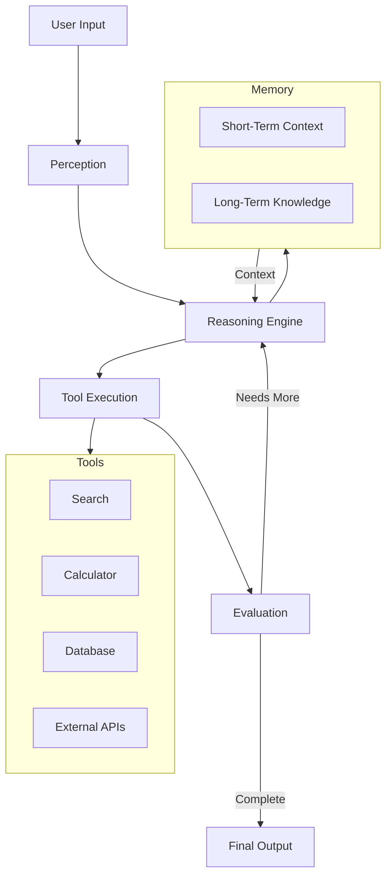
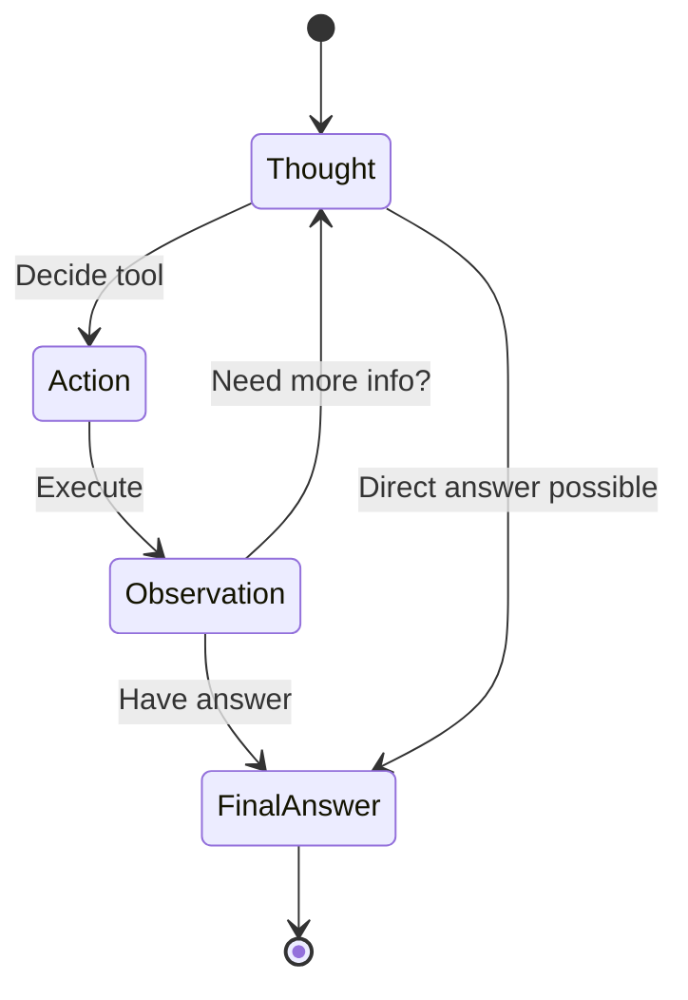
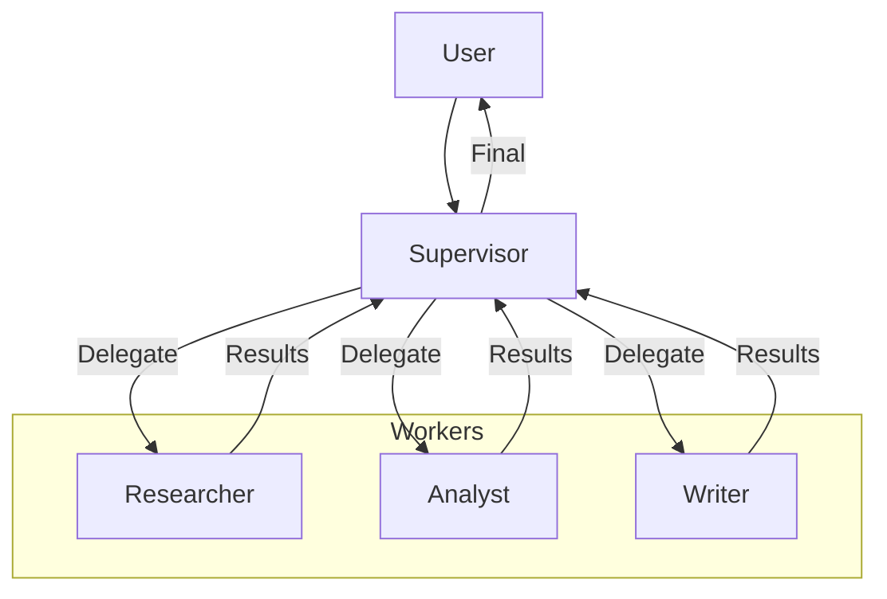
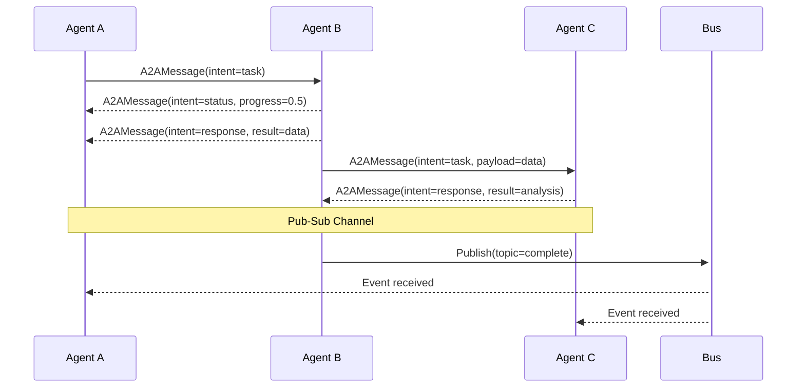
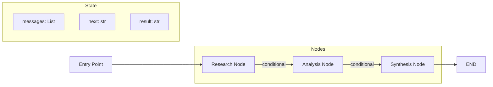

# Module 4: Agentic Systems - Diagrams

This directory contains text-based diagrams illustrating key concepts from Module 4: Agentic Systems.

## Table of Contents
- [Agent Architecture Overview](#agent-architecture-overview)
- [ReAct Loop](#react-loop)
- [Multi-Agent Orchestration Patterns](#multi-agent-orchestration-patterns)
- [A2A Communication Flow](#a2a-communication-flow)
- [LangGraph Agent State Machine](#langgraph-agent-state-machine)

---

## Agent Architecture Overview

### Core Agent Components

```
┌─────────────────────────────────────────────────────────────────┐
│                        AI AGENT                                 │
│                                                                 │
│  ┌─────────────┐    ┌─────────────┐    ┌─────────────┐         │
│  │  PERCEPTION │───▶│   REASONING │───▶│    ACTION   │         │
│  │             │    │     (LLM)   │    │   (Tools)   │         │
│  └──────┬──────┘    └──────┬──────┘    └──────┬──────┘         │
│         │                  │                  │                 │
│         │                  ▼                  │                 │
│         │         ┌─────────────┐             │                 │
│         │         │  REFLECTION │◀────────────┘                 │
│         │         │ (Evaluation)│                               │
│         │         └──────┬──────┘                               │
│         │                │                                      │
│         ▼                ▼                                      │
│  ┌─────────────────────────────────┐                            │
│  │           MEMORY                │                            │
│  │  ┌───────────┐ ┌─────────────┐  │                            │
│  │  │ Short-Term│ │ Long-Term   │  │                            │
│  │  │ (Context) │ │ (Knowledge) │  │                            │
│  │  └───────────┘ └─────────────┘  │                            │
│  └─────────────────────────────────┘                            │
│                                                                 │
└─────────────────────────────────────────────────────────────────┘
         │                                        │
         ▼                                        ▼
  ┌──────────────┐                        ┌──────────────┐
  │    INPUT     │                        │    OUTPUT    │
  │ (User Query, │                        │ (Response,   │
  │  Events)     │                        │  Actions)    │
  └──────────────┘                        └──────────────┘
```

### Agent Autonomy Spectrum

```
Level 0          Level 1          Level 2          Level 3          Level 4          Level 5
No Autonomy      Assisted         Semi-Auto        Conditional      High Auto        Full Auto
     │               │               │               │               │               │
     ▼               ▼               ▼               ▼               ▼               ▼
┌─────────┐   ┌─────────┐   ┌─────────┐   ┌─────────┐   ┌─────────┐   ┌─────────┐
│  LLM    │   │Copilot  │   │Propose/ │   │Bounded  │   │Oversight│   │Fully    │
│Complete │──▶│Human    │──▶│Approve  │──▶│Autonomy │──▶│Mode     │──▶│Autonomous│
│         │   │Reviews  │   │         │   │         │   │         │   │         │
└─────────┘   └─────────┘   └─────────┘   └─────────┘   └─────────┘   └─────────┘
   Simple       Code          Customer       DevOps         Trading       Autonomous
   Chat         Assistant     Support        Deploy         Agent         Vehicle
```

---

## ReAct Loop

### ReAct Pattern Flow

```
                    ┌─────────────────────────────────────────────┐
                    │                                             │
                    ▼                                             │
┌──────────┐   ┌──────────┐   ┌──────────┐   ┌──────────┐        │
│  USER    │──▶│ THOUGHT  │──▶│  ACTION  │──▶│OBSERVATION│        │
│  QUERY   │   │(Reason)  │   │(Execute) │   │(Observe) │        │
└──────────┘   └──────────┘   └──────────┘   └────┬─────┘        │
                                                  │               │
                                    ┌─────────────┴──────────┐    │
                                    │                        │    │
                                    ▼                        ▼    │
                          ┌─────────────────┐      ┌──────────────┐│
                          │  Need more info?│      │ Final Answer ││
                          │  YES ───────────┼──────┤    NO        ││
                          └─────────────────┘      └──────┬───────┘│
                                   │                     │        │
                                   └─────────────────────┘        │
                                                                  │
                         ┌────────────────────────────────────────┘
                         │
                    ┌────┴─────┐
                    │ THOUGHT  │
                    │(Analyze) │
                    └────┬─────┘
                         │
                         ▼
                  ┌─────────────┐
                  │  FINAL      │
                  │  ANSWER     │
                  └─────────────┘
```

### ReAct Execution Trace

```
Step 1: THOUGHT
├─ "I need to find the current population of Tokyo"
│
Step 2: ACTION
├─ Tool: search
├─ Input: "Tokyo population 2024"
│
Step 3: OBSERVATION
├─ Result: "Tokyo's estimated population is 14.09 million (2024)"
│
Step 4: THOUGHT
├─ "I have the population data. The question also asks about growth rate."
│
Step 5: ACTION
├─ Tool: search
├─ Input: "Tokyo population growth rate"
│
Step 6: OBSERVATION
├─ Result: "Tokyo's population growth rate is approximately -0.3% annually"
│
Step 7: THOUGHT
├─ "I now have all the information needed to answer the question."
│
Step 8: FINAL ANSWER
└─ "Tokyo's population is 14.09 million with a -0.3% annual growth rate."
```

---

## Multi-Agent Orchestration Patterns

### 1. Supervisor Pattern

```
                         ┌─────────────────┐
                         │   SUPERVISOR    │
                         │  (Coordinator)  │
                         └────────┬────────┘
                                  │
                    ┌─────────────┼─────────────┐
                    │             │             │
                    ▼             ▼             ▼
            ┌───────────┐ ┌───────────┐ ┌───────────┐
            │ RESEARCHER│ │  ANALYST  │ │   WRITER  │
            │  Agent    │ │  Agent    │ │  Agent    │
            └─────┬─────┘ └─────┬─────┘ └─────┬─────┘
                  │             │             │
                  ▼             ▼             ▼
            ┌─────────────────────────────────────────┐
            │           TASK QUEUE                    │
            │  [Research] → [Analyze] → [Write]       │
            └─────────────────────────────────────────┘

Flow: User → Supervisor → Select Worker → Execute → Return → Supervisor → User
```

### 2. Hierarchical Pattern

```
                         ┌─────────────┐
                         │    CEO      │
                         │ (Strategic) │
                         └──────┬──────┘
                                │
                  ┌─────────────┴─────────────┐
                  │                           │
            ┌─────┴─────┐             ┌───────┴──────┐
            │    CTO    │             │     CMO      │
            │(Technical)│             │ (Marketing)  │
            └─────┬─────┘             └──────┬───────┘
                  │                          │
          ┌───────┴───────┐          ┌───────┴───────┐
          │               │          │               │
    ┌─────┴─────┐  ┌──────┴──────┐ ┌─┴─────┐  ┌────┴────┐
    │  Backend  │  │  Frontend   │ │Content│  │   SEO   │
    │   Dev     │  │    Dev      │ │Writer │  │Analyst  │
    └───────────┘  └─────────────┘ └───────┘  └─────────┘

Task Flow: Top-down delegation with bottom-up result aggregation
```

### 3. Collaborative Debate Pattern

```
┌──────────────┐         ┌──────────────┐
│  PROPONENT   │         │   OPPONENT   │
│  (Argues For)│◀───────▶│ (Argues Against)
└──────┬───────┘         └──────┬───────┘
       │                        │
       │    ┌──────────────┐   │
       └───▶│  MODERATOR   │◀──┘
            │ (Synthesizes)│
            └──────┬───────┘
                   │
                   ▼
            ┌──────────────┐
            │   BALANCED   │
            │  CONCLUSION  │
            └──────────────┘

Round 1: Proponent presents case → Opponent counters → Moderator summarizes
Round 2: Proponent rebuts → Opponent rebuts → Moderator summarizes
Round N: Moderator produces final balanced conclusion
```

### 4. Swarm Pattern

```
┌──────────┐
│   TASK   │
└────┬─────┘
     │
     ├──────────────┬──────────────┬──────────────┬──────────────┐
     ▼              ▼              ▼              ▼              ▼
┌─────────┐  ┌─────────┐  ┌─────────┐  ┌─────────┐  ┌─────────┐
│ Agent 1 │  │ Agent 2 │  │ Agent 3 │  │ Agent 4 │  │ Agent 5 │
│(Parallel)│  │(Parallel)│  │(Parallel)│  │(Parallel)│  │(Parallel)│
└────┬────┘  └────┬────┘  └────┬────┘  └────┬────┘  └────┬────┘
     │            │            │            │            │
     └────────────┴────────────┴──────┬─────┴────────────┘
                                      │
                                      ▼
                               ┌─────────────┐
                               │ AGGREGATOR  │
                               │(Synthesizes)│
                               └──────┬──────┘
                                      │
                                      ▼
                               ┌─────────────┐
                               │   RESULT    │
                               └─────────────┘

All agents work independently on the same task simultaneously.
Results are combined by an aggregator agent.
```

---

## A2A Communication Flow

### Request-Response Pattern

```
┌─────────────┐                          ┌─────────────┐
│  Agent A    │                          │  Agent B    │
│ (Requester) │                          │ (Provider)  │
└──────┬──────┘                          └──────┬──────┘
       │                                        │
       │  ┌──────────────────────────────┐      │
       │  │ A2A Message                  │      │
       │  │ ───────────────────────────  │      │
       │  │ intent: "query"              │      │
       │  │ payload: {search: "..."}     │      │
       │  │ correlation_id: "req-123"    │      │
       │  └──────────────────────────────┘      │
       │───────────────────────────────────────▶│
       │                                        │
       │                              Process   │
       │                              Query     │
       │                                        │
       │  ┌──────────────────────────────┐      │
       │  │ A2A Message                  │      │
       │  │ ───────────────────────────  │      │
       │  │ intent: "response"           │      │
       │  │ payload: {results: [...]}    │      │
       │  │ correlation_id: "req-123"    │      │
       │  └──────────────────────────────┘      │
       │◀───────────────────────────────────────│
       │                                        │
```

### Publish-Subscribe Pattern

```
┌─────────────┐
│  Publisher  │
│   Agent     │
└──────┬──────┘
       │
       │ Publish: "task.completed"
       │
       ├──────────────────────────────────────────────┐
       │                                              │
       ▼                                              ▼
┌──────────────┐                            ┌──────────────┐
│ Subscriber 1 │                            │ Subscriber 2 │
│  (Monitor)   │                            │   (Logger)   │
└──────────────┘                            └──────────────┘
       │                                              │
       ▼                                              ▼
  Process event                                  Log event
  "task.completed"                            "task.completed"

Event Bus:
┌─────────────────────────────────────────────────────────────┐
│                     A2A Event Bus                           │
│  ────────────────────────────────────────────────────────   │
│  Topic: "task.completed"                                    │
│  Subscribers: [MonitorAgent, LoggerAgent, AnalyticsAgent]   │
│  ────────────────────────────────────────────────────────   │
│  Topic: "error.occurred"                                    │
│  Subscribers: [MonitorAgent, AlertAgent]                    │
└─────────────────────────────────────────────────────────────┘
```

### Streaming Pattern

```
┌─────────────┐                          ┌─────────────┐
│  Producer   │                          │  Consumer   │
│   Agent     │                          │   Agent     │
└──────┬──────┘                          └──────┬──────┘
       │                                        │
       │  Stream: "analysis-results"            │
       │                                        │
       │  ┌─────┐  ┌─────┐  ┌─────┐  ┌─────┐  │
       │  │Chunk│─▶│Chunk│─▶│Chunk│─▶│Chunk│  │
       │  │  1  │  │  2  │  │  3  │  │  4  │  │
       │  └─────┘  └─────┘  └─────┘  └─────┘  │
       │───────────────────────────────────────▶│
       │                                        │
       │                              Process   │
       │                              Each      │
       │                              Chunk     │
       │                              in Real   │
       │                              Time      │
       │                                        │
```

### Complete A2A Message Exchange

```
┌─────────────────────────────────────────────────────────────────────────┐
│                        A2A MESSAGE EXCHANGE                             │
└─────────────────────────────────────────────────────────────────────────┘

1. TASK ASSIGNMENT
   Orchestrator ──────────────────────────▶ ResearchAgent
   {
     "message_id": "msg-001",
     "intent": "task",
     "payload": {
       "task_id": "task-001",
       "description": "Research AI trends",
       "parameters": {"sources": 10},
       "priority": 3
     }
   }

2. STATUS UPDATE
   ResearchAgent ─────────────────────────▶ Orchestrator
   {
     "message_id": "msg-002",
     "intent": "status",
     "correlation_id": "msg-001",
     "payload": {
       "task_id": "task-001",
       "status": "in_progress",
       "progress": 0.6
     }
   }

3. TASK COMPLETION
   ResearchAgent ─────────────────────────▶ Orchestrator
   {
     "message_id": "msg-003",
     "intent": "response",
     "correlation_id": "msg-001",
     "payload": {
       "task_id": "task-001",
       "result": {...},
       "sources": [...]
     }
   }

4. ERROR HANDLING
   ResearchAgent ─────────────────────────▶ Orchestrator
   {
     "message_id": "msg-004",
     "intent": "error",
     "correlation_id": "msg-001",
     "payload": {
       "error_code": "SOURCE_UNAVAILABLE",
       "message": "Primary data source is down",
       "retryable": true
     }
   }
```

---

## LangGraph Agent State Machine

### Basic State Machine

```
┌────────────────────────────────────────────────────────────────┐
│                    LANGGRAPH STATE MACHINE                     │
│                                                                │
│  State: AgentState(TypedDict)                                  │
│  ┌──────────────────────────────────────────────────────────┐  │
│  │  messages: List[Message]                                 │  │
│  │  next: str                                               │  │
│  │  iterations: int                                         │  │
│  │  result: str                                             │  │
│  └──────────────────────────────────────────────────────────┘  │
│                                                                │
│  ┌──────────┐    ┌──────────┐    ┌──────────┐    ┌──────────┐ │
│  │  ENTRY   │───▶│ RESEARCH │───▶│ ANALYSIS │───▶│SYNTHESIS │ │
│  │  POINT   │    │  NODE    │    │  NODE    │    │  NODE    │ │
│  └──────────┘    └──────────┘    └──────────┘    └────┬─────┘ │
│                                                       │       │
│                                                       ▼       │
│                                                   ┌───────┐   │
│                                                   │  END  │   │
│                                                   └───────┘   │
│                                                                │
└────────────────────────────────────────────────────────────────┘
```

### ReAct Agent with LangGraph

```
┌─────────────────────────────────────────────────────────────────────────┐
│                     REACT AGENT STATE MACHINE                           │
│                                                                         │
│  ┌─────────┐                                                            │
│  │  START  │                                                            │
│  └────┬────┘                                                            │
│       │                                                                 │
│       ▼                                                                 │
│  ┌─────────┐     ┌─────────┐     ┌─────────┐                           │
│  │  LLM    │────▶│ Has     │────▶│  TOOL   │────┐                      │
│  │  CALL   │     │ Action? │  No │  NODE   │    │                      │
│  └────┬────┘     └────┬────┘     └────┬────┘    │                      │
│       │          Yes  │               │         │                      │
│       │◀──────────────┘               │         │                      │
│       │                               │         │                      │
│       │                         ┌─────┴─────┐   │                      │
│       │                         │  Update   │   │                      │
│       │                         │  State    │   │                      │
│       │                         └─────┬─────┘   │                      │
│       │                               │         │                      │
│       │          iterations < max     │         │                      │
│       └───────────────────────────────┘         │                      │
│                                                 │                      │
│       ┌─────────────────────────────────────────┘                      │
│       │                                                                │
│       ▼                                                                │
│  ┌─────────┐                                                           │
│  │  END    │                                                           │
│  └─────────┘                                                           │
│                                                                         │
│  Edges:                                                                 │
│  - START → LLM CALL (entry point)                                       │
│  - LLM CALL → Has Action? (conditional)                                 │
│  - Has Action? (Yes) → TOOL NODE                                        │
│  - Has Action? (No) → END                                               │
│  - TOOL NODE → LLM CALL (loop, if iterations < max)                     │
│  - TOOL NODE → END (if iterations >= max)                               │
└─────────────────────────────────────────────────────────────────────────┘
```

### Multi-Agent Graph with LangGraph

```
┌─────────────────────────────────────────────────────────────────────────┐
│                    MULTI-AGENT LANGGRAPH                                │
│                                                                         │
│  ┌───────────────────────────────────────────────────────────────────┐  │
│  │ State: MultiAgentState                                            │  │
│  │   messages: Annotated[List, add_messages]                         │  │
│  │   next: str                                                       │  │
│  │   final_output: str                                               │  │
│  └───────────────────────────────────────────────────────────────────┘  │
│                                                                         │
│  ┌─────────┐                                                            │
│  │  ENTRY  │                                                            │
│  └────┬────┘                                                            │
│       │                                                                 │
│       ▼                                                                 │
│  ┌─────────────┐                                                        │
│  │ SUPERVISOR  │ ◀── Decides which agent runs next                      │
│  │    NODE     │                                                        │
│  └──────┬──────┘                                                        │
│         │                                                               │
│    ┌────┴────┬──────────┬──────────┐                                    │
│    │         │          │          │                                    │
│    ▼         ▼          ▼          ▼                                    │
│ ┌──────┐ ┌──────┐  ┌──────┐  ┌──────┐                                  │
│ │RE-   │ │CODE  │  │REVIEW│  │ END  │                                  │
│ │SEARCH│ │AGENT │  │AGENT │  │      │                                  │
│ └──┬───┘ └──┬───┘  └──┬───┘  └──────┘                                  │
│    │        │         │                                               │
│    └────────┴─────────┘                                               │
│         │                                                              │
│         ▼                                                              │
│    ┌──────────┐                                                        │
│    │ SUPERVISOR│ ◀── Router evaluates state["next"]                    │
│    │ (Router) │                                                        │
│    └──────────┘                                                        │
│                                                                         │
│  Routing Logic:                                                         │
│  - If state["next"] == "researcher" → RESEARCH NODE                     │
│  - If state["next"] == "code_agent" → CODE AGENT NODE                   │
│  - If state["next"] == "review_agent" → REVIEW AGENT NODE               │
│  - If state["next"] == "FINISH" → END                                   │
└─────────────────────────────────────────────────────────────────────────┘
```

### Human-in-the-Loop State Machine

```
┌─────────────────────────────────────────────────────────────────────────┐
│                  HUMAN-IN-THE-LOOP WORKFLOW                             │
│                                                                         │
│  ┌─────────┐                                                            │
│  │  START  │                                                            │
│  └────┬────┘                                                            │
│       │                                                                 │
│       ▼                                                                 │
│  ┌─────────────┐                                                        │
│  │   GENERATE  │ ◀── Agent generates output                            │
│  │   OUTPUT    │                                                        │
│  └──────┬──────┘                                                        │
│         │                                                               │
│         ▼                                                               │
│  ┌─────────────┐                                                        │
│  │ INTERRUPT   │ ◀── Execution pauses, waits for human input            │
│  │  (Pause)    │                                                        │
│  └──────┬──────┘                                                        │
│         │                                                               │
│    ┌────┴────┐                                                          │
│    │         │                                                          │
│    ▼         ▼                                                          │
│ ┌──────┐ ┌──────┐                                                       │
│ │APPROVE│ │REJECT│                                                       │
│ │  YES │ │  NO  │                                                       │
│ └──┬───┘ └──┬───┘                                                       │
│    │        │                                                           │
│    ▼        ▼                                                           │
│ ┌──────┐ ┌──────┐                                                       │
│ │EXECUTE│ │REVISE│ ◀── Loop back to generate with feedback              │
│ │ACTION │ │      │                                                       │
│ └──┬───┘ └──┬───┘                                                       │
│    │        │                                                           │
│    │        └──────────────────────────────┐                            │
│    ▼                                       │                            │
│ ┌──────┐                                   │                            │
│ │ END  │◀──────────────────────────────────┘                            │
│ └──────┘                                                                │
│                                                                         │
│  Checkpoint: State is saved at INTERRUPT point                         │
│  Resume: Human provides Command(resume={approved: true/false})          │
└─────────────────────────────────────────────────────────────────────────┘
```

### Tool-Using Agent Flow

```
┌─────────────────────────────────────────────────────────────────────────┐
│                     TOOL-USING AGENT FLOW                               │
│                                                                         │
│  User Query                                                             │
│      │                                                                  │
│      ▼                                                                  │
│  ┌─────────────┐                                                        │
│  │    LLM      │ ◀── Receives query + tool descriptions                 │
│  │  (Decision) │                                                        │
│  └──────┬──────┘                                                        │
│         │                                                               │
│    ┌────┴────┐                                                          │
│    │         │                                                          │
│    ▼         ▼                                                          │
│ ┌──────┐ ┌──────────┐                                                   │
│ │Final │ │Tool Call │                                                   │
│ │Answer│ │Selected  │                                                   │
│ └──┬───┘ └────┬─────┘                                                   │
│    │          │                                                         │
│    │     ┌────┴─────┐                                                   │
│    │     │ Validate │ ◀── Check input schema, permissions               │
│    │     │  Input   │                                                   │
│    │     └────┬─────┘                                                   │
│    │          │                                                         │
│    │     ┌────┴─────┐                                                   │
│    │     │ Execute  │ ◀── Call actual tool/API                          │
│    │     │  Tool    │                                                   │
│    │     └────┬─────┘                                                   │
│    │          │                                                         │
│    │     ┌────┴─────┐                                                   │
│    │     │ Handle   │ ◀── Error handling, retry logic                   │
│    │     │  Result  │                                                   │
│    │     └────┬─────┘                                                   │
│    │          │                                                         │
│    │     ┌────┴─────┐                                                   │
│    │     │ Update   │ ◀── Add observation to state                      │
│    │     │  State   │                                                   │
│    │     └────┬─────┘                                                   │
│    │          │                                                         │
│    │          └──────────────────────┐                                  │
│    │                                 │                                  │
│    ▼                                 ▼                                  │
│ ┌──────┐                      ┌──────────┐                              │
│ │ END  │◀─────────────────────│   LLM    │ ◀── Process observation      │
│ └──────┘                      │(Continue)│     and decide next step     │
│                               └──────────┘                              │
└─────────────────────────────────────────────────────────────────────────┘
```

---

## Mermaid Diagrams

For rendering in Markdown viewers that support Mermaid, here are the same diagrams in Mermaid syntax:

### Agent Architecture (Mermaid)



### ReAct Loop (Mermaid)



### Multi-Agent Orchestration (Mermaid)



### A2A Communication (Mermaid)



### LangGraph State Machine (Mermaid)


