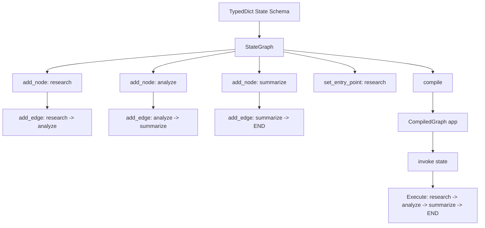
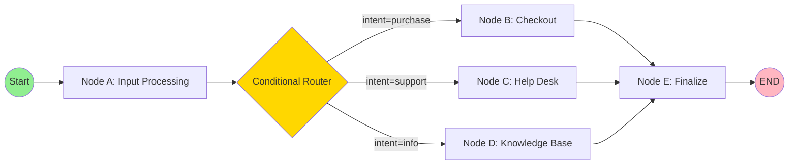
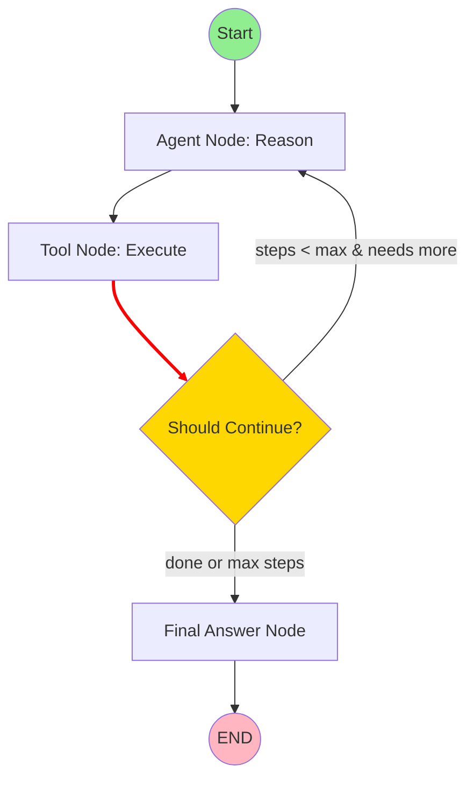
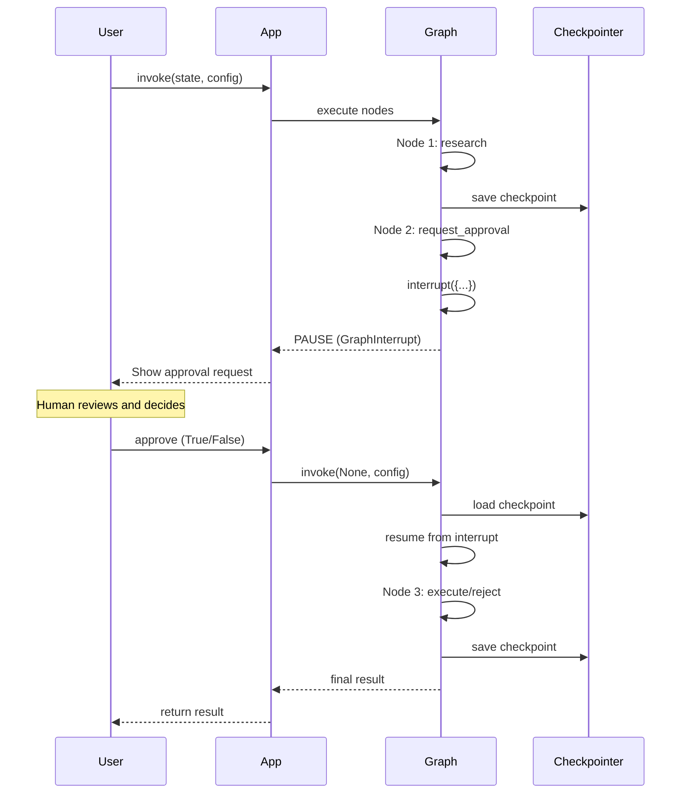
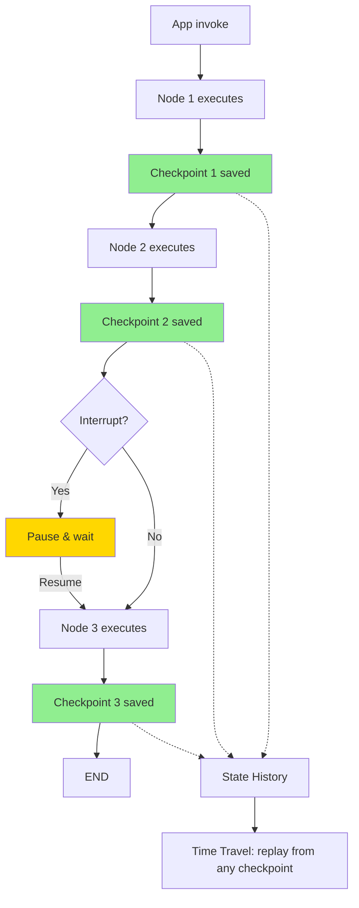

# Module 6: LangGraph Deep Dive — Diagrams

This directory contains text-based diagrams (ASCII and Mermaid) illustrating key LangGraph concepts.

---

## 1. StateGraph Architecture

### Mermaid Diagram



### ASCII Diagram

```
┌─────────────────────────────────────────────────┐
│                 StateGraph                       │
│                                                  │
│  State Schema:                                   │
│  ┌──────────────────────────────┐               │
│  │  class AgentState(TypedDict):│               │
│  │    messages: Annotated[...]  │               │
│  │    query: str                │               │
│  │    result: str               │               │
│  └──────────────────────────────┘               │
│                                                  │
│  Nodes:                                          │
│  ┌──────────┐  ┌──────────┐  ┌──────────┐      │
│  │ research │─>│ analyze  │─>│summarize │─> END│
│  └──────────┘  └──────────┘  └──────────┘      │
│       ↑                                         │
│  entry_point                                    │
│                                                  │
│  Edges:                                          │
│  research  ──(normal)──> analyze                 │
│  analyze   ──(normal)──> summarize               │
│  summarize ──(normal)──> END                     │
└──────────────────────────────────────────────────┘
           │
           │ compile()
           ▼
┌──────────────────────────────────────────────────┐
│              CompiledGraph (app)                  │
│                                                   │
│  app.invoke({"query": "AI trends"})              │
│  app.stream(state, stream_mode="updates")        │
│  app.get_state(config)                           │
└───────────────────────────────────────────────────┘
```

---

## 2. Node and Edge Relationships

### Mermaid Diagram



### ASCII Diagram

```
                    ┌─────────────────────────────────────┐
                    │         State Flows Through          │
                    │    messages, intent, result, etc.    │
                    └─────────────────────────────────────┘
                                    │
                                    ▼
┌─────────┐    ┌──────────┐    ┌───────────────────┐    ┌──────────┐    ┌───────┐
│ __start__│───>│ classify │───>│  Conditional       │───>│ handler  │───>│  END  │
│          │    │  (node)  │    │  Router (edge)     │    │  (node)  │    │       │
└─────────┘    └──────────┘    └───────────────────┘    └──────────┘    └───────┘
                                    │
                  ┌─────────────────┼─────────────────┐
                  ▼                 ▼                 ▼
            ┌──────────┐    ┌──────────┐    ┌──────────┐
            │ checkout │    │help_desk │    │knowledge │
            │          │    │          │    │  _base   │
            └──────────┘    └──────────┘    └──────────┘
                  │                 │                 │
                  └─────────────────┼─────────────────┘
                                    ▼
                              ┌──────────┐
                              │finalize  │
                              └──────────┘
                                    │
                                    ▼
                                  END

Node: Python function (state -> dict)
Edge: Fixed transition (A -> B)
Conditional Edge: Routing function (state -> next_node_name)
```

### State Flow Through Nodes

```
Initial State:                    After Node A:                   After Node B:
┌─────────────────────┐          ┌─────────────────────┐          ┌─────────────────────┐
│ query: "AI trends"  │          │ query: "AI trends"  │          │ query: "AI trends"  │
│ messages: []        │ ──────>  │ messages: [msg1]    │ ──────>  │ messages: [msg1,    │
│ result: ""          │          │ result: ""          │          │  msg2]              │
│ step: 0             │          │ step: 1             │          │ result: "summary"   │
└─────────────────────┘          └─────────────────────┘          │ step: 2             │
                                                                   └─────────────────────┘
     Node A returns:                   Node B returns:
     {messages: [msg1],                {messages: [msg2],
      step: 1}                          result: "summary",
                                        step: 2}
```

---

## 3. Cyclic Graph Execution Flow

### Mermaid Diagram



### ASCII Diagram — ReAct Agent Loop

```
┌─────────────────────────────────────────────────────────────────────┐
│                     ReAct Agent Cycle                                │
│                                                                      │
│    ┌──────────┐    ┌──────────┐    ┌───────────────────┐           │
│    │  Agent   │───>│  Tools   │───>│  Should Continue?  │           │
│    │ (reason) │    │  (act)   │    │  (conditional)     │           │
│    └──────────┘    └──────────┘    └───────────────────┘           │
│         ▲                                       │                   │
│         │                                       │                   │
│         │          ┌──────────────────────────────┘                  │
│         │          │                                                │
│         │   ┌──────┴──────┐                                        │
│         └───│  continue   │  (cycle back to Agent)                  │
│             └─────────────┘                                        │
│                                                                     │
│             ┌─────────────┐                                        │
│             │    end      │───> Final Answer ───> END               │
│             └─────────────┘                                        │
└─────────────────────────────────────────────────────────────────────┘

Execution Trace:
Step 1: Agent thinks → "I need to search for X"
Step 2: Tools execute → search_tool("X") → returns results
Step 3: Router checks → steps=1, max=5, needs more → continue
Step 4: Agent thinks → "Based on results, I need Y"
Step 5: Tools execute → search_tool("Y") → returns results
Step 6: Router checks → steps=2, has enough info → end
Step 7: Final Answer → "Here is the answer..."
Step 8: END
```

### Cycle with Max Iteration Guard

```
┌────────────────────────────────────────────────────────────┐
│                  Iteration Guard Pattern                    │
│                                                             │
│  ┌───────┐    ┌──────────┐    ┌──────────┐                │
│  │ START │───>│ process  │───>│ evaluate │                │
│  └───────┘    └──────────┘    └──────────┘                │
│                                     │                      │
│                      ┌──────────────┼──────────────┐       │
│                      ▼              ▼              ▼       │
│                ┌──────────┐  ┌──────────┐  ┌──────────┐  │
│                │  retry   │  │  accept  │  │  reject  │  │
│                │(cycle ↩) │  │(→ END)   │  │(→ END)   │  │
│                └──────────┘  └──────────┘  └──────────┘  │
│                      │                                     │
│                      └─────> back to evaluate              │
│                            (max 3 retries)                 │
└────────────────────────────────────────────────────────────┘

Routing Logic:
def route(state):
    if state["retry_count"] >= 3:
        return "reject"     # Max retries exceeded
    if state["error"] is None:
        return "accept"     # Success
    return "retry"          # Try again (creates cycle)
```

---

## 4. Human-in-the-Loop Interrupt Pattern

### Mermaid Diagram



### ASCII Diagram

```
Phase 1: Execute Until Interrupt
══════════════════════════════════════════════════════════

┌─────────┐    ┌──────────┐    ┌──────────────────┐
│  START  │───>│ research │───>│  request_approval│
│         │    │          │    │  (INTERRUPT)     │
└─────────┘    └──────────┘    └──────────────────┘
                                      │
                                      │ ⏸ PAUSE
                                      ▼
                              ┌──────────────┐
                              │  Checkpoint   │
                              │  Saved        │
                              │  thread_id=1  │
                              └──────────────┘

Phase 2: Human Review
══════════════════════════════════════════════════════════

┌─────────────────────────────────────────────────────┐
│  Human Review UI                                     │
│                                                      │
│  Task: Deploy to production                          │
│  Analysis: All tests passed, no breaking changes     │
│                                                      │
│  [Approve]  [Reject]  [Request Changes]             │
└─────────────────────────────────────────────────────┘

Phase 3: Resume Execution
══════════════════════════════════════════════════════════

┌──────────────────┐    ┌──────────┐    ┌───────┐
│ request_approval │───>│ execute  │───>│  END  │
│ (resume)         │    │          │    │       │
└──────────────────┘    └──────────┘    └───────┘
        ▲
        │
  Load checkpoint
  Apply human decision
```

### Interrupt Types

```
┌─────────────────────────────────────────────────────────────────┐
│                    Interrupt Patterns                            │
│                                                                  │
│  1. Breakpoint-Style (interrupt_before/interrupt_after)         │
│     ┌─────────┐    ┌─────────────┐    ┌─────────┐              │
│     │ Node A  │───>│ ⏸ INTERRUPT │───>│ Node B  │              │
│     └─────────┘    │  before B   │    └─────────┘              │
│                    └─────────────┘                              │
│     Use: Review state before critical operations               │
│                                                                  │
│  2. In-Node Interrupt (interrupt() function)                    │
│     ┌─────────┐    ┌─────────────────────┐    ┌─────────┐     │
│     │ Node A  │───>│ Node B: interrupt() │───>│ Node C  │     │
│     └─────────┘    │  (waits for value)  │    └─────────┘     │
│                    └─────────────────────┘                     │
│     Use: Get specific human input inside a node                │
│                                                                  │
│  3. State Update + Resume                                       │
│     ┌─────────┐    ┌─────────────┐    ┌─────────┐              │
│     │ Node A  │───>│ ⏸ PAUSED    │───>│ Node B  │              │
│     └─────────┘    │ update_state│    └─────────┘              │
│                    │ (inject data)│                             │
│                    └─────────────┘                              │
│     Use: Modify state before resuming                          │
└─────────────────────────────────────────────────────────────────┘
```

---

## 5. Checkpoint State Persistence

### Mermaid Diagram



### ASCII Diagram — Checkpoint Chain

```
Execution Timeline with Checkpoints
═══════════════════════════════════════════════════════════════════

Time ──────────────────────────────────────────────────────────>

┌─────────┐    ┌─────────┐    ┌─────────┐    ┌─────────┐
│  START  │───>│ Node A  │───>│ Node B  │───>│ Node C  │───> END
└─────────┘    └─────────┘    └─────────┘    └─────────┘
                   │              │              │
                   ▼              ▼              ▼
              ┌──────────┐  ┌──────────┐  ┌──────────┐
              │ Checkpt 1│  │ Checkpt 2│  │ Checkpt 3│
              │ ID: abc  │  │ ID: def  │  │ ID: ghi  │
              │ state: A │  │ state: B │  │ state: C │
              └──────────┘  └──────────┘  └──────────┘
                   │              │              │
                   └──────────────┼──────────────┘
                                  ▼
                    ┌─────────────────────────┐
                    │    State History         │
                    │                         │
                    │  [abc] → [def] → [ghi]  │
                    │                         │
                    │  Can replay from any    │
                    │  checkpoint ID          │
                    └─────────────────────────┘
```

### Checkpointer Architecture

```
┌──────────────────────────────────────────────────────────────────┐
│                     Checkpointer Layers                          │
│                                                                   │
│  Application Layer                                               │
│  ┌─────────────────────────────────────────────────────────────┐│
│  │  app.invoke(state, config)                                  ││
│  │  app.get_state(config)                                      ││
│  │  app.get_state_history(config)                              ││
│  │  app.update_state(config, values)                           ││
│  └─────────────────────────────────────────────────────────────┘│
│                              │                                   │
│  Checkpointer Interface      │                                   │
│  ┌─────────────────────────────────────────────────────────────┐│
│  │  Checkpointer (abstract base class)                         ││
│  │  - put(config, checkpoint, metadata)                        ││
│  │  - get_tuple(config)                                        ││
│  │  - list(config, limit, before)                              ││
│  └─────────────────────────────────────────────────────────────┘│
│                              │                                   │
│  Storage Implementations     │                                   │
│  ┌────────────┐ ┌────────────┐ ┌────────────┐ ┌────────────┐  │
│  │MemorySaver │ │SqliteSaver │ │PostgresSaver│ │ RedisSaver │  │
│  │            │ │            │ │             │ │            │  │
│  │ In-memory  │ │ File-based │ │ PostgreSQL  │ │ Redis      │  │
│  │ Dict store │ │ SQLite DB  │ │ Tables      │ │ Hash/Lists │  │
│  │            │ │            │ │             │ │            │  │
│  │ Dev/Test   │ │ Local apps │ │ Production  │ │ High-perf  │  │
│  └────────────┘ └────────────┘ └────────────┘ └────────────┘  │
└──────────────────────────────────────────────────────────────────┘
```

### Thread and Namespace Organization

```
Checkpoint Hierarchy
═══════════════════════════════════════════════════════════════

Config:
{
    "configurable": {
        "thread_id": "user-123-session-1",    ← Conversation thread
        "checkpoint_ns": ""                    ← Default namespace
    }
}

Thread: user-123-session-1
├── Checkpoint: cp_001 (after node A)
├── Checkpoint: cp_002 (after node B)
├── Checkpoint: cp_003 (interrupt point)
└── Checkpoint: cp_004 (final)

Thread: user-123-session-2
├── Checkpoint: cp_005 (after node A)
└── Checkpoint: cp_006 (final)

Thread: user-123-memory (namespace: long_term)
├── Checkpoint: cp_007 (memory update 1)
└── Checkpoint: cp_008 (memory update 2)
```

### Time Travel Flow

```
┌─────────────────────────────────────────────────────────────┐
│                    Time Travel Process                       │
│                                                              │
│  1. Get History                                              │
│     history = app.get_state_history(config)                  │
│     → [cp_001, cp_002, cp_003, cp_004]                      │
│                                                              │
│  2. Select Checkpoint                                        │
│     target = history[1]  # cp_002                           │
│                                                              │
│  3. Create Replay Config                                     │
│     replay_config = target.config                            │
│                                                              │
│  4. Resume from Checkpoint                                   │
│     result = app.invoke(None, config=replay_config)          │
│     → Execution resumes from cp_002 state                   │
│     → New checkpoints branch from this point                │
│                                                              │
│  Result: Branching timeline                                  │
│  cp_001 → cp_002 → cp_003 → cp_004  (original)             │
│              ↘ cp_005 → cp_006  (forked)                   │
└─────────────────────────────────────────────────────────────┘
```

---

## 6. Complete System Architecture

```
┌──────────────────────────────────────────────────────────────────────┐
│                        LangGraph Application                         │
│                                                                       │
│  ┌─────────────────────────────────────────────────────────────────┐ │
│  │                    StateGraph Definition                         │ │
│  │                                                                  │ │
│  │  class AgentState(TypedDict):                                   │ │
│  │      messages: Annotated[list, operator.add]                    │ │
│  │      query: str                                                 │ │
│  │      documents: list                                            │ │
│  │      approved: bool                                             │ │
│  │                                                                  │ │
│  │  graph = StateGraph(AgentState)                                 │ │
│  │  graph.add_node("research", research_node)                      │ │
│  │  graph.add_node("analyze", analyze_node)                        │ │
│  │  graph.add_node("approval", approval_node)                      │ │
│  │  graph.add_node("publish", publish_node)                        │ │
│  │                                                                  │ │
│  │  graph.set_entry_point("research")                              │ │
│  │  graph.add_edge("research", "analyze")                          │ │
│  │  graph.add_edge("analyze", "approval")                          │ │
│  │  graph.add_edge("publish", END)                                 │ │
│  │                                                                  │ │
│  │  app = graph.compile(                                           │ │
│  │      checkpointer=PostgresSaver(conn),                          │ │
│  │      interrupt_before=["approval"],                             │ │
│  │  )                                                               │ │
│  └─────────────────────────────────────────────────────────────────┘ │
│                                │                                      │
│  ┌─────────────────────────────┼───────────────────────────────────┐ │
│  │                    Runtime Execution                             │ │
│  │                                                                  │ │
│  │  config = {"configurable": {"thread_id": "session-1"}}          │ │
│  │                                                                  │ │
│  │  # Run until interrupt                                          │ │
│  │  result = app.invoke(initial_state, config)                     │ │
│  │                                                                  │ │
│  │  # Human reviews                                                │ │
│  │  app.update_state(config, {"approved": True})                   │ │
│  │                                                                  │ │
│  │  # Resume                                                       │ │
│  │  result = app.invoke(None, config)                              │ │
│  └─────────────────────────────────────────────────────────────────┘ │
└──────────────────────────────────────────────────────────────────────┘
```
