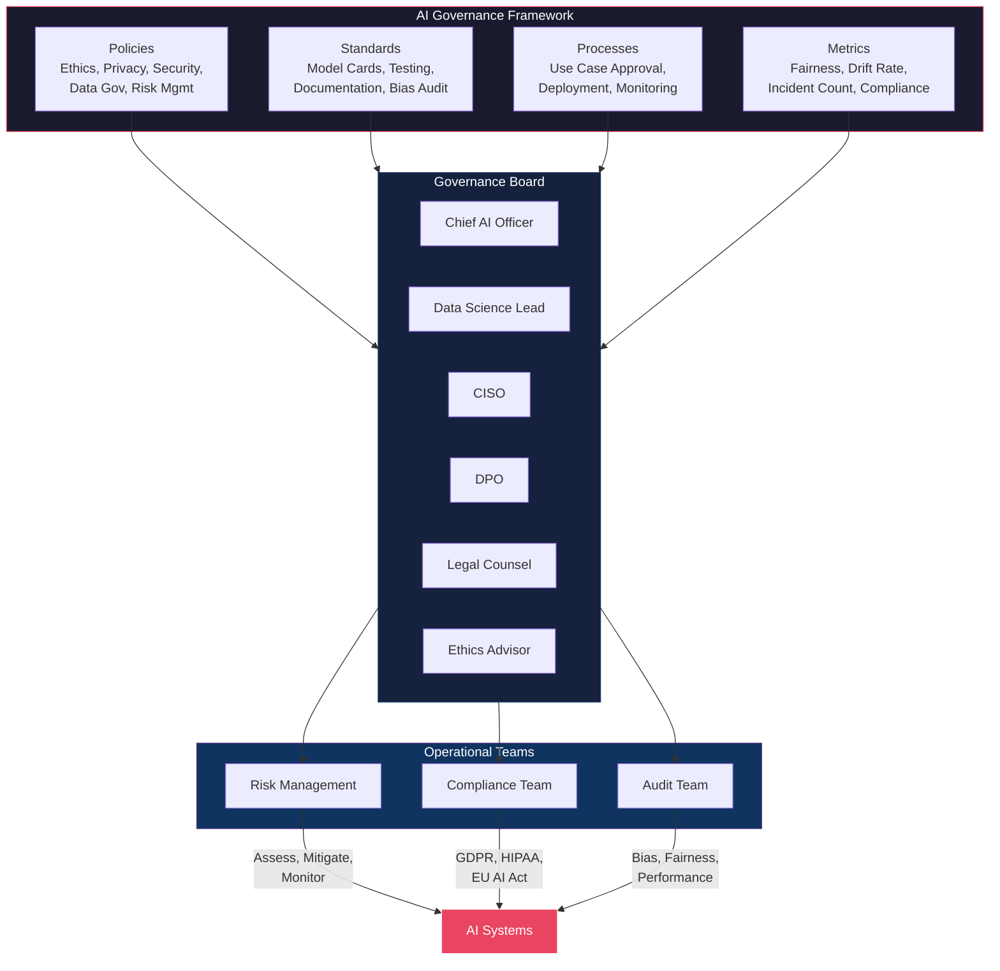
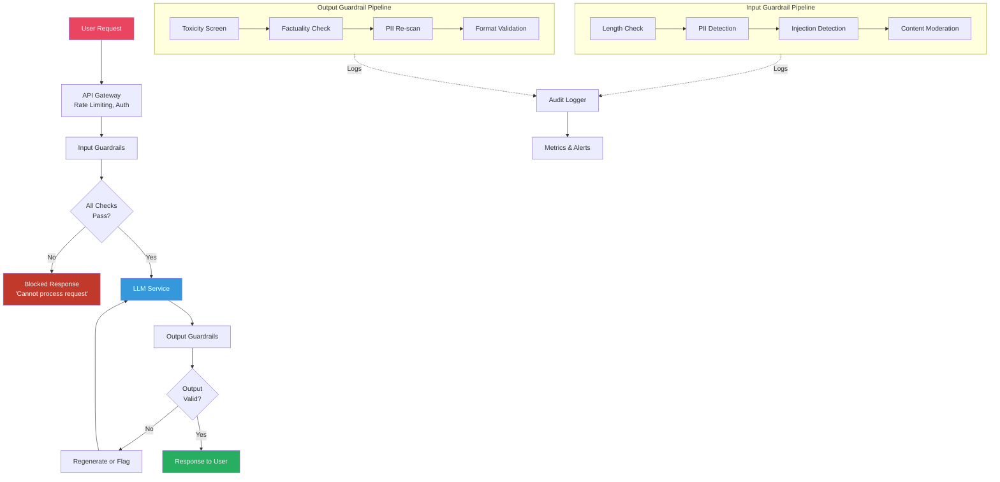
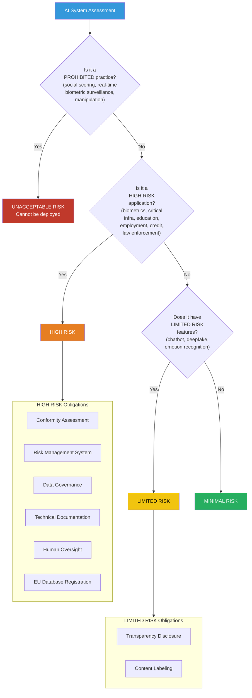
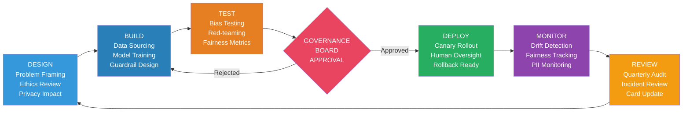
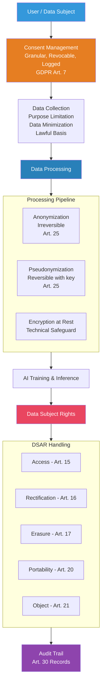

# Module 10: AI Governance & Compliance — Diagrams

## Table of Contents
1. [AI Governance Framework](#1-ai-governance-framework)
2. [Guardrail Pipeline Architecture](#2-guardrail-pipeline-architecture)
3. [EU AI Act Risk Classification Flow](#3-eu-ai-act-risk-classification-flow)
4. [Responsible AI Lifecycle](#4-responsible-ai-lifecycle)
5. [GDPR Compliance Data Flow](#5-gdpr-compliance-data-flow)

---

## 1. AI Governance Framework

### ASCII Diagram

```
┌─────────────────────────────────────────────────────────────────────────┐
│                        AI GOVERNANCE FRAMEWORK                          │
├─────────────────────────────────────────────────────────────────────────┤
│                                                                         │
│  ┌─────────────┐  ┌─────────────┐  ┌─────────────┐  ┌──────────────┐  │
│  │   POLICIES  │  │  STANDARDS  │  │  PROCESSES  │  │   METRICS    │  │
│  ├─────────────┤  ├─────────────┤  ├─────────────┤  ├──────────────┤  │
│  │ Ethics      │  │ Model Cards │  │ Use Case    │  │ Fairness     │  │
│  │ Privacy     │  │ Testing     │  │   Approval  │  │ Drift Rate   │  │
│  │ Security    │  │ Documentation│ │ Deployment  │  │ Incident     │  │
│  │ Data Gov    │  │ Bias Audit  │  │ Monitoring  │  │   Count      │  │
│  │ Risk Mgmt   │  │ Explain-    │  │ Incident    │  │ Compliance   │  │
│  │             │  │   ability   │  │   Response  │  │   Score      │  │
│  └──────┬──────┘  └──────┬──────┘  └──────┬──────┘  └──────┬───────┘  │
│         │                │                │                 │          │
│         └────────────────┼────────────────┼─────────────────┘          │
│                          │                │                            │
│                   ┌──────▼────────────────▼──────┐                     │
│                   │     GOVERNANCE BOARD          │                     │
│                   ├───────────────────────────────┤                     │
│                   │  Chief AI Officer (Chair)     │                     │
│                   │  Data Science Lead            │                     │
│                   │  CISO                         │                     │
│                   │  DPO / Privacy Officer        │                     │
│                   │  Legal Counsel                │                     │
│                   │  Ethics Advisor               │                     │
│                   │  Business Unit Reps           │                     │
│                   └──────────────┬────────────────┘                     │
│                                  │                                      │
│              ┌───────────────────┼───────────────────┐                  │
│              │                   │                   │                  │
│       ┌──────▼──────┐    ┌──────▼──────┐    ┌──────▼──────┐           │
│       │   RISK      │    │  COMPLIANCE │    │   AUDIT     │           │
│       │ MANAGEMENT  │    │   TEAM      │    │   TEAM      │           │
│       ├─────────────┤    ├─────────────┤    ├─────────────┤           │
│       │ Assess      │    │ GDPR/HIPAA  │    │ Bias Audits │           │
│       │ Mitigate    │    │ EU AI Act   │    │ Performance │           │
│       │ Monitor     │    │ SOC 2       │    │ Fairness    │           │
│       │ Report      │    │ Industry    │    │ Explain-    │           │
│       │             │    │   specific  │    │   ability   │           │
│       └─────────────┘    └─────────────┘    └─────────────┘           │
│                                                                         │
└─────────────────────────────────────────────────────────────────────────┘
```

### Mermaid Diagram



---

## 2. Guardrail Pipeline Architecture

### ASCII Diagram

```
                    USER REQUEST
                         │
                         ▼
              ┌──────────────────────┐
              │   API GATEWAY        │
              │   - Rate Limiting    │
              │   - AuthN / AuthZ    │
              └──────────┬───────────┘
                         │
                         ▼
┌─────────────────────────────────────────────────────────┐
│                  INPUT GUARDRAILS                       │
│                                                         │
│  ┌─────────┐ ┌──────────┐ ┌──────────┐ ┌────────────┐ │
│  │ Length  │ │   PII    │ │ Injection│ │  Content   │ │
│  │ Check  │ │ Detector │ │ Detector │ │ Moderation │ │
│  │        │ │          │ │          │ │   API      │ │
│  └────┬────┘ └────┬─────┘ └────┬─────┘ └─────┬──────┘ │
│       │           │            │              │        │
│       └───────────┼────────────┼──────────────┘        │
│                   │            │                       │
│            ┌──────▼────────────▼──────┐                │
│            │    INPUT VALIDATION      │                │
│            │    PASS / BLOCK          │                │
│            └────────────┬─────────────┘                │
└─────────────────────────┼───────────────────────────────┘
                          │
                   ┌──────▼──────┐
                   │             │
              PASS │         BLOCK
                   │             │
            ┌──────▼──────┐  ┌──▼──────────────┐
            │  LLM        │  │  BLOCKED        │
            │  SERVICE    │  │  RESPONSE       │
            │             │  │  "Request       │
            │             │  │   cannot be     │
            │             │  │   processed"    │
            └──────┬──────┘  └─────────────────┘
                   │
                   ▼
┌─────────────────────────────────────────────────────────┐
│                  OUTPUT GUARDRAILS                      │
│                                                         │
│  ┌──────────┐ ┌──────────┐ ┌──────────┐ ┌───────────┐ │
│  │ Toxicity │ │Factuality│ │   PII    │ │  Format   │ │
│  │ Screen   │ │  Check   │ │Re-scan   │ │ Validator │ │
│  └────┬─────┘ └────┬─────┘ └────┬─────┘ └─────┬─────┘ │
│       │            │            │              │       │
│       └────────────┼────────────┼──────────────┘       │
│                    │            │                      │
│             ┌──────▼────────────▼──────┐               │
│             │   OUTPUT VALIDATION      │               │
│             │   PASS / FLAG / BLOCK    │               │
│             └────────────┬─────────────┘               │
└──────────────────────────┼──────────────────────────────┘
                           │
                    ┌──────▼──────┐
                    │  RESPONSE   │
                    │  TO USER    │
                    └─────────────┘

         ┌──────────────────────────────────┐
         │       CROSS-CUTTING LAYER        │
         │  ┌────────┐ ┌────────┐ ┌──────┐ │
         │  │ Audit  │ │ Metric │ │Alert │ │
         │  │ Logger │ │Collect │ │ Mgr  │ │
         │  └────────┘ └────────┘ └──────┘ │
         └──────────────────────────────────┘
```

### Mermaid Diagram



---

## 3. EU AI Act Risk Classification Flow

### ASCII Diagram

```
                    ┌──────────────────┐
                    │   AI SYSTEM      │
                    │   ASSESSMENT     │
                    └────────┬─────────┘
                             │
                             ▼
              ┌──────────────────────────────┐
              │  Is the system a PROHIBITED  │
              │  practice?                   │
              │  - Social scoring            │
              │  - Real-time biometric       │
              │    surveillance (public)     │
              │  - Manipulation of           │
              │    vulnerable groups         │
              └──────────────┬───────────────┘
                             │
                    ┌────────┴────────┐
                    │                 │
                   YES               NO
                    │                 │
                    ▼                 ▼
        ┌────────────────┐  ┌──────────────────────────┐
        │  UNACCEPTABLE  │  │  Is the system a HIGH    │
        │  RISK          │  │  RISK application?       │
        │                │  │  - Biometrics            │
        │  PROHIBITED    │  │  - Critical infrastructure│
        │  Cannot be     │  │  - Education/employment  │
        │  deployed      │  │  - Essential services    │
        │                │  │  - Law enforcement       │
        └────────────────┘  │  - Migration/justice     │
                            └────────────┬─────────────┘
                                         │
                                ┌────────┴────────┐
                                │                 │
                               YES               NO
                                │                 │
                                ▼                 ▼
                ┌──────────────────────┐  ┌──────────────────────────┐
                │      HIGH RISK      │  │  Does the system have    │
                │                      │  │  LIMITED RISK features?  │
                │  Obligations:       │  │  - Chatbot (disclosure)  │
                │  - Conformity assess │  │  - Deepfake (labeling)   │
                │  - Risk management  │  │  - Emotion recognition   │
                │  - Data governance  │  └────────────┬─────────────┘
                │  - Documentation    │               │
                │  - Human oversight  │      ┌────────┴────────┐
                │  - Audit trail      │      │                 │
                │  - EU DB registry   │     YES               NO
                └──────────────────────┘      │                 │
                                              ▼                 ▼
                                  ┌────────────────┐  ┌────────────────┐
                                  │   LIMITED      │  │   MINIMAL      │
                                  │   RISK         │  │   RISK         │
                                  │                │  │                │
                                  │  Obligations:  │  │  No specific   │
                                  │  - Transparency│  │  obligations   │
                                  │  - Disclosure  │  │                │
                                  │  - Labeling    │  │  Examples:     │
                                  │                │  │  - Spam filter │
                                  │                │  │  - AI games    │
                                  └────────────────┘  └────────────────┘
```

### Mermaid Diagram



---

## 4. Responsible AI Lifecycle

### ASCII Diagram

```
┌─────────────────────────────────────────────────────────────┐
│                  RESPONSIBLE AI LIFECYCLE                     │
│                                                               │
│   ┌──────────┐    ┌──────────┐    ┌──────────┐              │
│   │  DESIGN  │───▶│  BUILD   │───▶│  TEST    │              │
│   │          │    │          │    │          │              │
│   │ Problem  │    │ Data     │    │ Bias     │              │
│   │ framing  │    │ sourcing │    │ testing  │              │
│   │ Ethics   │    │ Feature  │    │ Red-team │              │
│   │ review   │    │ engineer │    │ testing  │              │
│   │ Privacy  │    │ Model    │    │ Fairness │              │
│   │ impact   │    │ training │    │ metrics  │              │
│   │ assess   │    │ Guardrail│    │ Explaina-│              │
│   │          │    │ design   │    │ bility   │              │
│   └──────────┘    └──────────┘    └─────┬────┘              │
│                                         │                    │
│                                         ▼                    │
│                                    ┌──────────┐              │
│                                    │ APPROVAL │              │
│                                    │          │              │
│                                    │ Govern-  │              │
│                                    │ ance     │              │
│                                    │ Board    │              │
│                                    │ Review   │              │
│                                    └─────┬────┘              │
│                                          │                   │
│              ┌───────────────────────────┘                   │
│              │                                               │
│              ▼                                               │
│   ┌──────────┐    ┌──────────┐    ┌──────────┐              │
│   │  DEPLOY  │───▶│ MONITOR  │───▶│  REVIEW  │──────────┐  │
│   │          │    │          │    │          │          │  │
│   │ Canary / │    │ Drift    │    │ Quarterly│          │  │
│   │ gradual  │    │ detection│    │ bias     │          │  │
│   │ rollout  │    │ Fairness │    │ audit    │          │  │
│   │ Human-in│    │ tracking │    │ Incident │          │  │
│   │ the-loop │    │ PII leak │    │ review   │          │  │
│   │ Rollback │    │ monitor  │    │ Model    │          │  │
│   │ ready    │    │ Alerting │    │ card     │          │  │
│   └──────────┘    └──────────┘    │ update   │          │  │
│                                   └──────────┘          │  │
│                                          │               │  │
│                                          └───────────────┘  │
│                                          (Continuous cycle)  │
└─────────────────────────────────────────────────────────────┘
```

### Mermaid Diagram



---

## 5. GDPR Compliance Data Flow

### ASCII Diagram

```
┌─────────────────────────────────────────────────────────────────────┐
│                     GDPR-COMPLIANT AI DATA FLOW                      │
│                                                                      │
│  ┌───────────┐     ┌───────────────┐     ┌─────────────────────┐   │
│  │   USER    │────▶│  CONSENT      │────▶│  DATA COLLECTION    │   │
│  │           │     │  MANAGEMENT   │     │                     │   │
│  │ Provides  │     │               │     │  - Purpose limitation│   │
│  │ consent   │     │  - Granular   │     │  - Data minimization│   │
│  │ via       │     │  - Revocable  │     │  - Lawful basis     │   │
│  │ consent   │     │  - Logged     │     │  - Documented       │   │
│  │ form      │     │  - GDPR Art.7 │     │                     │   │
│  └───────────┘     └───────┬───────┘     └──────────┬──────────┘   │
│                            │                        │               │
│              ┌─────────────▼────────────────────────▼─────────┐    │
│              │              DATA PROCESSING                    │    │
│              │  ┌───────────┐  ┌──────────┐  ┌────────────┐  │    │
│              │  │ Anonymize │  │Pseudonym-│  │ Encryption │  │    │
│              │  │ (Art.25)  │  │ ize      │  │ at rest    │  │    │
│              │  └─────┬─────┘  └────┬─────┘  └─────┬──────┘  │    │
│              │        │             │               │         │    │
│              │        └─────────────┼───────────────┘         │    │
│              │                      │                         │    │
│              │              ┌───────▼───────┐                 │    │
│              │              │  AI TRAINING  │                 │    │
│              │              │  & INFERENCE  │                 │    │
│              │              └───────┬───────┘                 │    │
│              └──────────────────────┼─────────────────────────┘    │
│                                     │                               │
│              ┌──────────────────────▼─────────────────────────┐    │
│              │           DATA SUBJECT RIGHTS                  │    │
│              │                                                │    │
│              │  ┌──────┐ ┌──────┐ ┌──────┐ ┌──────┐ ┌─────┐│    │
│              │  │Access│ │Rec-  │ │Erase │ │Port- │ │Object││    │
│              │  │      │ │tify  │ │      │ │able  │ │     ││    │
│              │  │Art.15│ │Art.16│ │Art.17│ │Art.20│ │Art.21││    │
│              │  └──┬───┘ └──┬───┘ └──┬───┘ └──┬───┘ └──┬──┘│    │
│              │     └────────┴────────┴────────┴────────┘    │    │
│              │              ┌───────────────┐                │    │
│              │              │  AUDIT TRAIL  │                │    │
│              │              │  (Art. 30)    │                │    │
│              │              └───────────────┘                │    │
│              └───────────────────────────────────────────────┘    │
│                                                                      │
└─────────────────────────────────────────────────────────────────────┘
```

### Mermaid Diagram



---

## Usage Notes

- **ASCII diagrams** render correctly in any terminal or plain text viewer
- **Mermaid diagrams** render in GitHub, GitLab, VS Code (with plugin), Notion, and most modern markdown viewers
- Use these diagrams in presentations by exporting Mermaid to SVG/PNG via [mermaid.live](https://mermaid.live)
