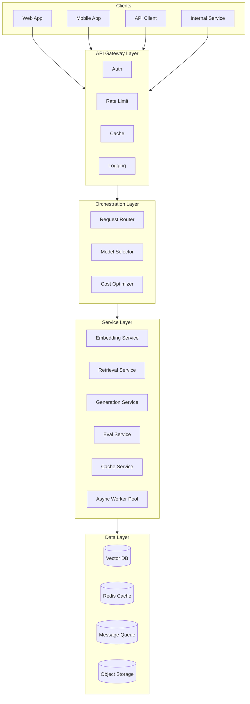
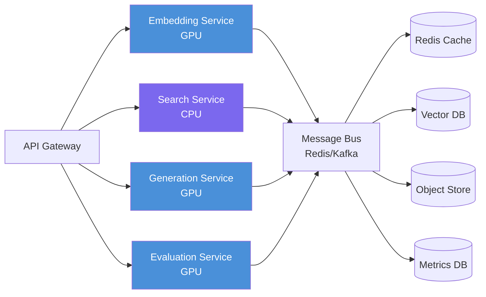
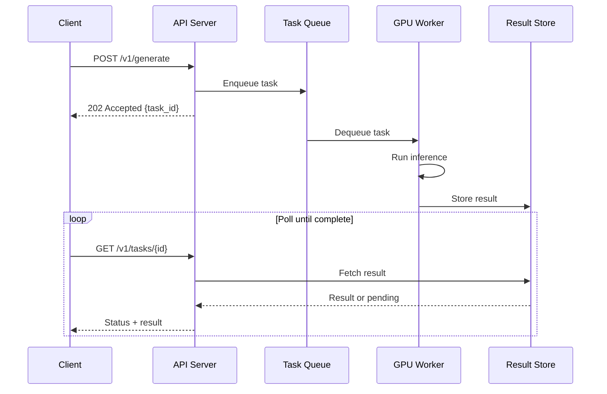
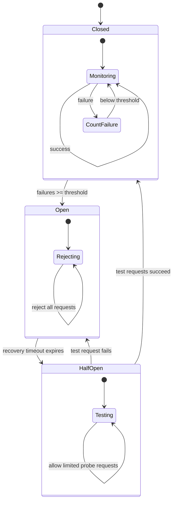
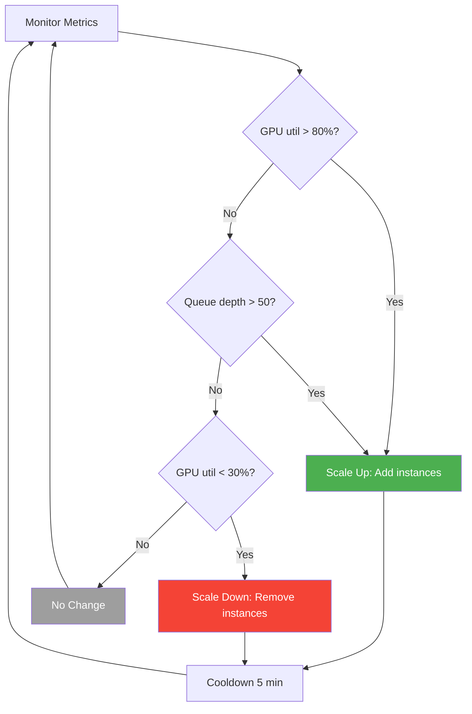
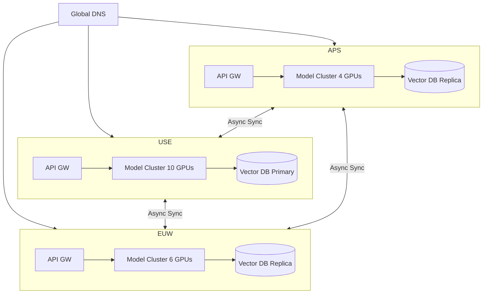
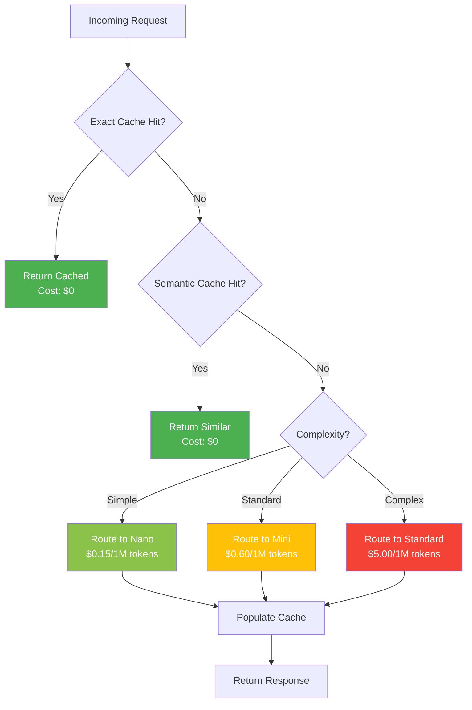
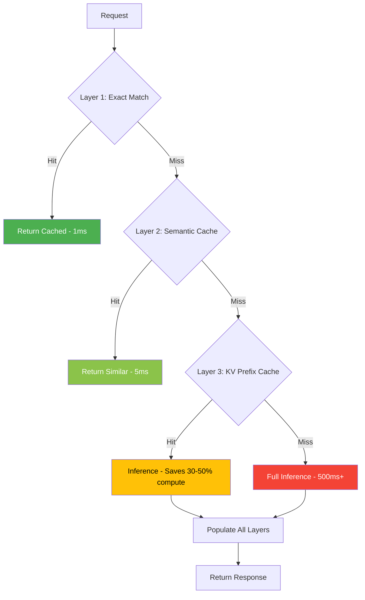
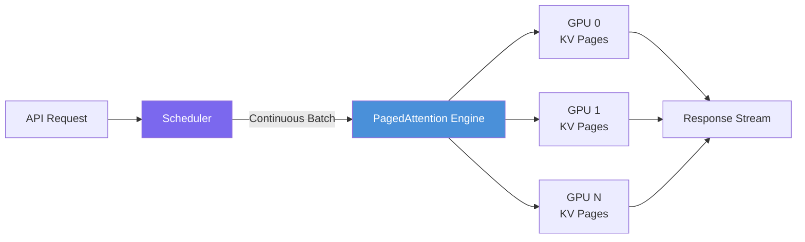
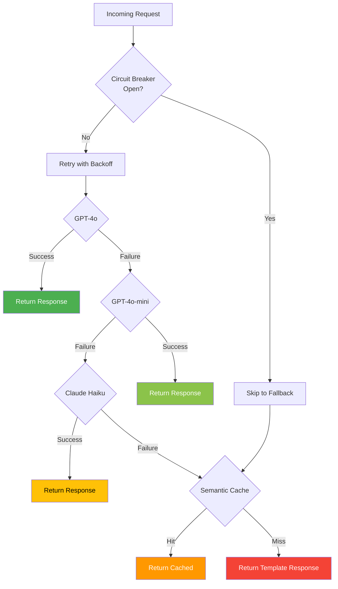

# Module 7: Architecture Design — Diagrams

Architecture diagrams for AI system design patterns. Includes ASCII and Mermaid representations.

---

## 1. Full System Architecture Overview

High-level view of a production AI serving system with all layers.

```
┌─────────────────────────────────────────────────────────────────────┐
│                         CLIENTS                                      │
│   ┌─────────┐   ┌─────────┐   ┌─────────┐   ┌─────────┐           │
│   │  Web    │   │ Mobile  │   │  API    │   │Internal │           │
│   │  App    │   │  App    │   │ Client  │   │ Service │           │
│   └────┬────┘   └────┬────┘   └────┬────┘   └────┬────┘           │
└────────┼─────────────┼─────────────┼─────────────┼─────────────────┘
         └─────────────┴──────┬──────┴─────────────┘
                              │
┌─────────────────────────────▼───────────────────────────────────────┐
│                      API GATEWAY LAYER                               │
│  ┌───────────┐ ┌──────────┐ ┌──────────┐ ┌───────────┐             │
│  │   Auth    │ │Rate Limit│ │  Cache   │ │  Logging  │             │
│  └───────────┘ └──────────┘ └──────────┘ └───────────┘             │
└─────────────────────────────┬───────────────────────────────────────┘
                              │
┌─────────────────────────────▼───────────────────────────────────────┐
│                    ORCHESTRATION LAYER                                │
│  ┌─────────────┐  ┌──────────────┐  ┌──────────────┐               │
│  │  Request    │  │   Model      │  │   Cost       │               │
│  │  Router     │  │   Selector   │  │   Optimizer  │               │
│  └──────┬──────┘  └──────┬───────┘  └──────┬───────┘               │
└─────────┼────────────────┼─────────────────┼────────────────────────┘
          │                │                 │
┌─────────▼────────────────▼─────────────────▼────────────────────────┐
│                      SERVICE LAYER                                   │
│                                                                      │
│  ┌──────────────┐  ┌──────────────┐  ┌──────────────┐              │
│  │  Embedding   │  │  Retrieval   │  │  Generation  │              │
│  │  Service     │  │  Service     │  │  Service     │              │
│  │  (GPU)       │  │  (CPU)       │  │  (GPU)       │              │
│  └──────┬───────┘  └──────┬───────┘  └──────┬───────┘              │
│         │                 │                  │                       │
│  ┌──────▼───────┐  ┌──────▼───────┐  ┌──────▼───────┐              │
│  │  Eval        │  │  Cache       │  │  Async       │              │
│  │  Service     │  │  Service     │  │  Worker Pool │              │
│  └──────────────┘  └──────────────┘  └──────────────┘              │
└──────────────────────────────────────────────────────────────────────┘
          │                 │                  │
┌─────────▼─────────────────▼──────────────────▼───────────────────────┐
│                        DATA LAYER                                     │
│  ┌──────────┐  ┌──────────┐  ┌──────────┐  ┌──────────┐            │
│  │ Vector   │  │  Redis   │  │ Message  │  │ Object   │            │
│  │ Database │  │  Cache   │  │ Queue    │  │ Storage  │            │
│  └──────────┘  └──────────┘  └──────────┘  └──────────┘            │
└──────────────────────────────────────────────────────────────────────┘
```

### Mermaid



---

## 2. Microservices Pattern for AI

Individual AI components as independently deployable services.

```
┌─────────────────────────────────────────────────────────────┐
│                     API Gateway                              │
│            (Auth, Rate Limit, Routing)                       │
└──────────┬───────────┬───────────┬───────────┬──────────────┘
           │           │           │           │
     ┌─────▼─────┐ ┌──▼──────┐ ┌─▼────────┐ ┌▼───────────┐
     │ Embedding │ │ Search  │ │Generation│ │ Evaluation │
     │ Service   │ │ Service │ │ Service  │ │ Service    │
     │           │ │         │ │          │ │            │
     │ ┌───────┐ │ │┌───────┐│ │┌────────┐│ │┌──────────┐│
     │ │GPU-0  │ │ ││CPU    ││ ││GPU-1   ││ ││GPU-2     ││
     │ │Model  │ │ ││Vector ││ ││LLM     ││ ││Judge     ││
     │ └───────┘ │ ││Search ││ │└────────┘│ │└──────────┘│
     └─────┬─────┘ │└───┬───┘│ └────┬─────┘ └─────┬──────┘
           │       └────┼───┘      │              │
     ┌─────▼────────────▼──────────▼──────────────▼──────┐
     │                  Message Bus                        │
     │            (Redis Streams / Kafka)                  │
     └────────────────────────┬───────────────────────────┘
                              │
     ┌────────────────────────▼───────────────────────────┐
     │              Shared State Layer                     │
     │  ┌────────┐  ┌────────┐  ┌────────┐  ┌────────┐  │
     │  │ Redis  │  │Vector  │  │Object  │  │Metrics │  │
     │  │ Cache  │  │  DB    │  │ Store  │  │  DB    │  │
     │  └────────┘  └────────┘  └────────┘  └────────┘  │
     └────────────────────────────────────────────────────┘
```

### Mermaid



---

## 3. Event-Driven Architecture (Async Processing)

Asynchronous processing pipeline for AI inference with message queues.

```
┌──────────┐    ┌──────────────┐    ┌─────────────────────────────┐
│  Client   │───▶│  API Server  │───▶│       Task Queue            │
│           │◀───│              │    │    (Redis / Kafka / SQS)    │
│  task_id  │    │  Validate    │    │                             │
│  returned │    │  Authenticate│    │  ┌────┐┌────┐┌────┐┌────┐ │
└──────────┘    │  Rate Limit  │    │  │ T1 ││ T2 ││ T3 ││ T4 │ │
                 └──────────────┘    │  └────┘└────┘└────┘└────┘ │
                                     └─────┬──────┬──────┬───────┘
                                           │      │      │
                                     ┌─────▼──┐┌──▼────┐┌▼──────┐
                                     │Worker 1││Worker 2││Worker N│
                                     │ (GPU)  ││ (GPU)  ││ (GPU) │
                                     └───┬────┘└───┬────┘└───┬───┘
                                         │         │         │
                                     ┌───▼─────────▼─────────▼───┐
                                     │      Result Store          │
                                     │      (Redis)               │
                                     └─────────────┬──────────────┘
                                                   │
                                          ┌────────▼────────┐
                                          │  Client Polls   │
                                          │  GET /task/{id}  │
                                          └─────────────────┘
```

### Mermaid — Sequence Diagram



---

## 4. Circuit Breaker State Machine

```
     ┌──────────────────────────────────────────┐
     │          Circuit Breaker States           │
     │                                          │
     │   CLOSED ──(failures > threshold)──► OPEN│
     │     ▲                                   │
     │     │                                   │
     │     │ (timeout expires)                  │
     │     │                                   │
     │  HALF-OPEN ◄─────────────────────────── │
     │     │                                   │
     │     └──(success)──► CLOSED              │
     │     └──(failure)──► OPEN                │
     └──────────────────────────────────────────┘
```

### Mermaid — State Diagram



---

## 5. Auto-Scaling Flow

```
                     ┌───────────────────┐
                     │  Auto Scaler      │
                     │                   │
                     │  Triggers:        │
                     │  - GPU util > 80% │
                     │  - Queue > 50     │
                     │  - P95 > 5s       │
                     └─────────┬─────────┘
                               │
         ┌─────────────────────┼─────────────────────┐
         │ Scale Up            │                      │ Scale Down
         ▼                     │                      ▼
┌───────────────┐             │            ┌───────────────┐
│ Add GPU Nodes │             │            │Remove GPU Nodes│
│               │             │            │               │
│ ┌───┐┌───┐┌───┐┌───┐┌───┐ │            │ ┌───┐┌───┐    │
│ │GPU││GPU││GPU││GPU││GPU│ │            │ │GPU││GPU│    │
│ │ 1 ││ 2 ││ 3 ││ 4 ││ 5 │ │            │ │ 1 ││ 2 │    │
│ └───┘└───┘└───┘└───┘└───┘ │            │ └───┘└───┘    │
└───────────────┘             │            └───────────────┘
                              │
                    ┌─────────▼─────────┐
                    │  Cooldown Period  │
                    │  (5 minutes)      │
                    └───────────────────┘
```

### Mermaid — Auto-Scaling Decision Flow



---

## 6. Multi-Region Deployment with Failover

```
                         ┌──────────────┐
                         │  Global DNS  │
                         │  (Route53)   │
                         └──────┬───────┘
                                │
                 ┌──────────────┼──────────────┐
                 │              │              │
         ┌───────▼──────┐ ┌────▼────────┐ ┌──▼──────────┐
         │  us-east-1   │ │ eu-west-1   │ │ ap-south-1  │
         │  PRIMARY     │ │ SECONDARY   │ │ SECONDARY   │
         │              │ │             │ │             │
         │ ┌──────────┐ │ │ ┌─────────┐ │ │ ┌─────────┐ │
         │ │API GW    │ │ │ │API GW   │ │ │ │API GW   │ │
         │ └────┬─────┘ │ │ └───┬─────┘ │ │ └───┬─────┘ │
         │      │       │ │     │       │ │     │       │
         │ ┌────▼─────┐ │ │┌────▼─────┐ │ │┌────▼─────┐ │
         │ │Model     │ │ ││Model     │ │ ││Model     │ │
         │ │Cluster   │ │ ││Cluster   │ │ ││Cluster   │ │
         │ │(10 GPUs) │ │ ││(6 GPUs)  │ │ ││(4 GPUs)  │ │
         │ └────┬─────┘ │ │└────┬─────┘ │ │└────┬─────┘ │
         │      │       │ │     │       │ │     │       │
         │ ┌────▼─────┐ │ │┌────▼─────┐ │ │┌────▼─────┐ │
         │ │Vector DB │ │ ││Vector DB │ │ ││Vector DB │ │
         │ │(Primary) │◄├─┤│(Replica) │◄├─┤│(Replica) │ │
         │ └──────────┘ │ │└──────────┘ │ │└──────────┘ │
         └──────────────┘ └─────────────┘ └─────────────┘
               │                  │                │
               └──────────────────┴────────────────┘
                     Async Replication (RPO < 5min)
```

### Mermaid — Multi-Region with Subgraphs



---

## 7. Cost Optimization — Model Routing Decision Tree

```
┌─────────────────────────────────────────────────────────────────┐
│                  COST OPTIMIZATION PYRAMID                       │
│                                                                  │
│                         ┌───────┐                               │
│                         │ Model │  Most Impact                  │
│                        ┌┤Route  ├┐                              │
│                       ┌┤└───────┘├┐                             │
│                      ┌┤│ Caching │├┐                            │
│                     ┌┤│└─────────┘│├┐                           │
│                    ┌┤││  Batching  ││├┐                          │
│                   ┌┤│││ Token Opt  │││├┐                         │
│                  ┌┤││││───────────││││├┐                        │
│                  ││││││ Infra Opt  ││││││  Least Impact          │
│                  └┴┴┴┴┴───────────┴┴┴┴┴┘                        │
│                                                                  │
│  Savings:   70%    50%    30%    20%    10%   5%               │
└─────────────────────────────────────────────────────────────────┘

┌─────────────────────────────────────────────────────────────────┐
│                  MODEL ROUTING DECISION TREE                     │
│                                                                  │
│                      ┌──────────┐                               │
│                      │ Incoming │                               │
│                      │ Request  │                               │
│                      └────┬─────┘                               │
│                           │                                     │
│                    ┌──────▼──────┐                               │
│                    │  Complexity │                               │
│                    │  Classifier │                               │
│                    └──┬───┬───┬──┘                               │
│                       │   │   │                                  │
│              ┌────────┘   │   └────────┐                        │
│              ▼            ▼            ▼                        │
│        ┌──────────┐ ┌──────────┐ ┌──────────┐                  │
│        │  Simple  │ │ Standard │ │ Complex  │                  │
│        │          │ │          │ │          │                  │
│        │ GPT-4o   │ │ GPT-4o   │ │ GPT-4o   │                  │
│        │ Nano     │ │ Mini     │ │ Standard │                  │
│        │          │ │          │ │          │                  │
│        │ $0.15/1M │ │ $0.60/1M │ │ $5.00/1M │                  │
│        │ tokens   │ │ tokens   │ │ tokens   │                  │
│        └──────────┘ └──────────┘ └──────────┘                  │
│                                                                  │
│  40% of traffic  │  40% of traffic  │  20% of traffic           │
└─────────────────────────────────────────────────────────────────┘
```

### Mermaid — Cost Optimization Flow



---

## 8. Multi-Layer Caching Architecture

```
┌──────────────────────────────────────────────────────────────┐
│                    REQUEST FLOW                                │
│                                                               │
│  Request ──▶ ┌─────────────────────────────────────────────┐ │
│              │           LAYER 1: Exact Match              │ │
│              │     Hash(model + query) → Redis lookup      │ │
│              │     Latency: ~1ms  │  Hit Rate: ~15%       │ │
│              └──────────────┬──────────────────────────────┘ │
│                             │ MISS                            │
│              ┌──────────────▼──────────────────────────────┐ │
│              │           LAYER 2: Semantic Cache           │ │
│              │     Embed query → Vector similarity search  │ │
│              │     Threshold: 0.95  │  Hit Rate: ~25%     │ │
│              └──────────────┬──────────────────────────────┘ │
│                             │ MISS                            │
│              ┌──────────────▼──────────────────────────────┐ │
│              │           LAYER 3: KV Cache                 │ │
│              │     Reuse cached KV states for prefixes     │ │
│              │     Saves 30-50% compute  │  Hit: ~20%     │ │
│              └──────────────┬──────────────────────────────┘ │
│                             │ MISS                            │
│              ┌──────────────▼──────────────────────────────┐ │
│              │           LAYER 4: Full Inference           │ │
│              │     Run model → Generate response           │ │
│              │     Latency: 500ms+  │  Cost: Full         │ │
│              └──────────────┬──────────────────────────────┘ │
│                             │                                 │
│              ┌──────────────▼──────────────────────────────┐ │
│              │         POPULATE ALL CACHE LAYERS           │ │
│              │     Store result in Layers 1, 2, 3          │ │
│              └─────────────────────────────────────────────┘ │
│                                                               │
│  Response ◀────────────────────────────────────────────────── │
└──────────────────────────────────────────────────────────────┘
```

### Mermaid — Cache Layer Flow



---

## 9. vLLM Model Serving Architecture (PagedAttention)

```
┌──────────────────────────────────────────────────┐
│                   vLLM Server                    │
│                                                  │
│  ┌────────────┐   ┌──────────────────────────┐  │
│  │   API      │   │    Scheduler              │  │
│  │  Layer     │──►│  • Continuous batching    │  │
│  │ (FastAPI)  │   │  • Preemption             │  │
│  └────────────┘   │  • Priority queues        │  │
│                    └───────────┬──────────────┘  │
│                                │                  │
│  ┌─────────────────────────────▼──────────────┐  │
│  │          PagedAttention Engine              │  │
│  │  • KV cache in non-contiguous pages        │  │
│  │  • Memory efficiency: near-zero waste      │  │
│  │  • Enables larger batch sizes              │  │
│  └────────────────────────────────────────────┘  │
│                                                  │
│  ┌────────────┐   ┌────────────┐   ┌─────────┐ │
│  │  GPU 0     │   │  GPU 1     │   │  GPU N  │ │
│  │  KV Pages  │   │  KV Pages  │   │  KV     │ │
│  └────────────┘   └────────────┘   └─────────┘ │
└──────────────────────────────────────────────────┘
```

### Mermaid — vLLM Request Flow



---

## 10. Fallback Chain with Reliability Layers



---

## Diagram Conventions

- **Solid boxes** (`┌───┐`) represent services or components
- **Arrows** (`──▶`) show data/control flow
- **Dashed lines** indicate async or secondary paths
- **Color coding** in Mermaid: Green = optimal, Yellow = acceptable, Red = costly/degraded
- **Vertical layers** represent abstraction levels (clients at top, data at bottom)
- **State diagrams** use `stateDiagram-v2` for circuit breaker and deployment patterns
- **Sequence diagrams** use `sequenceDiagram` for async request flows
