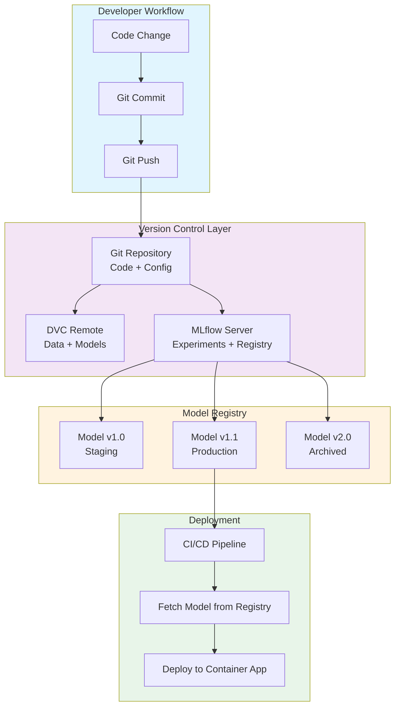
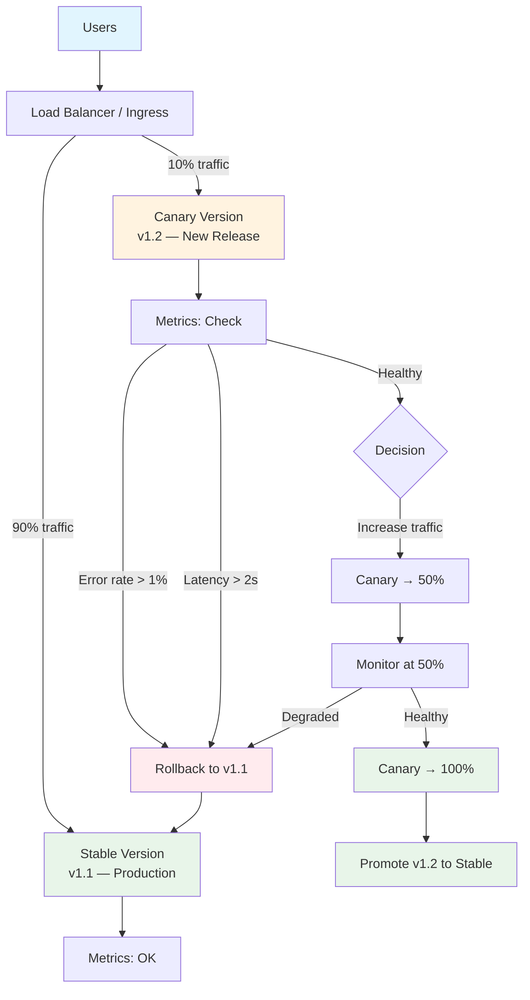
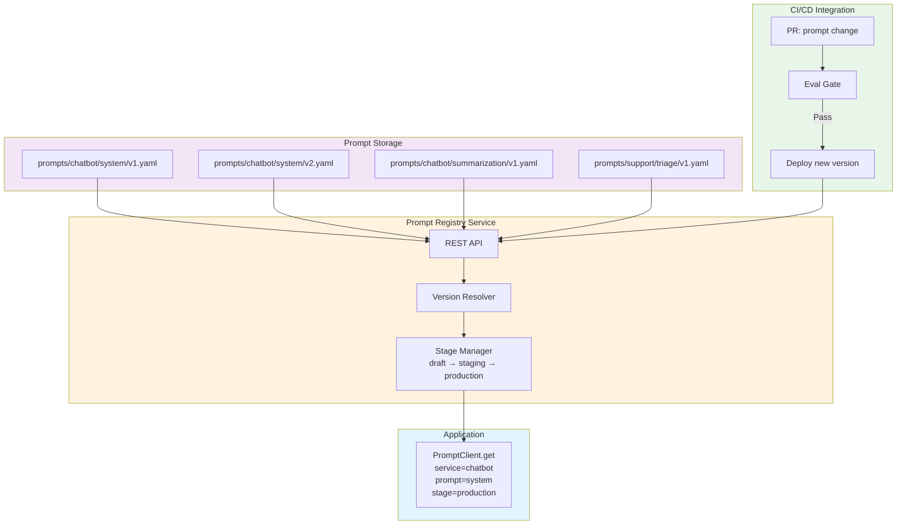
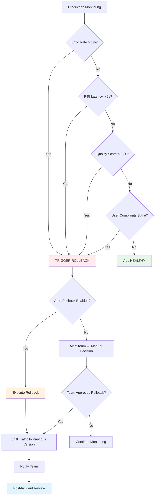
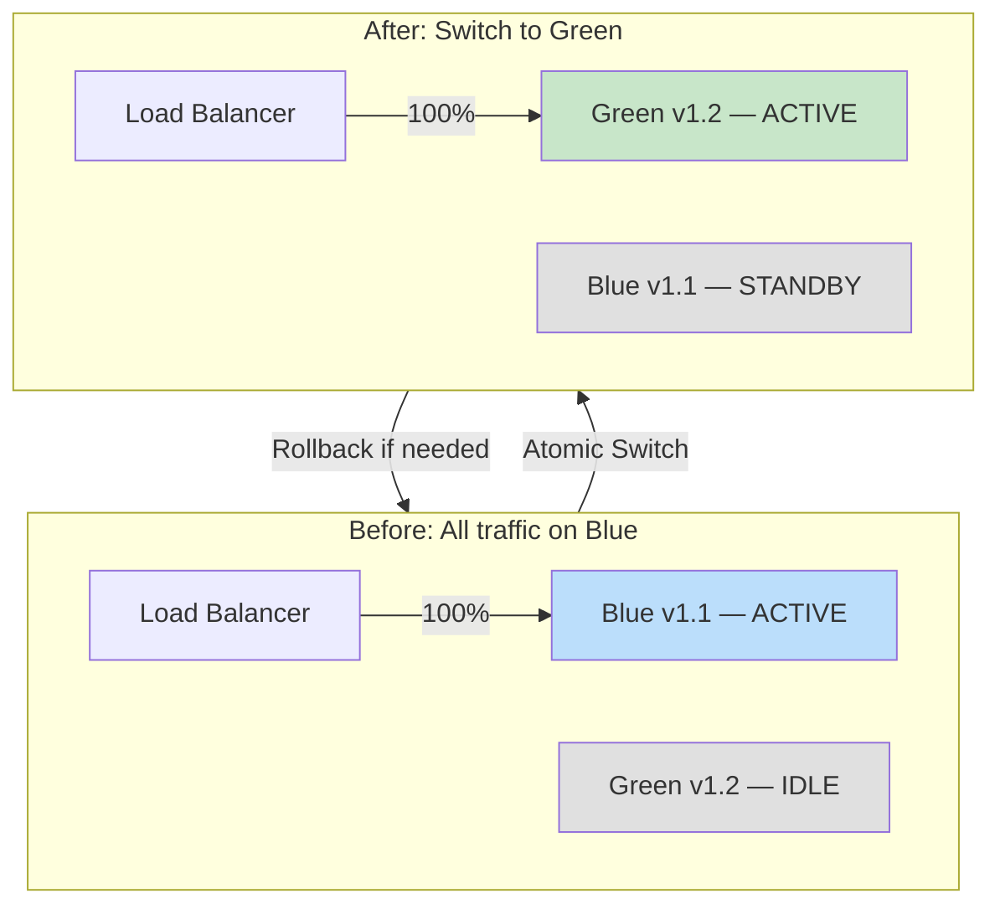
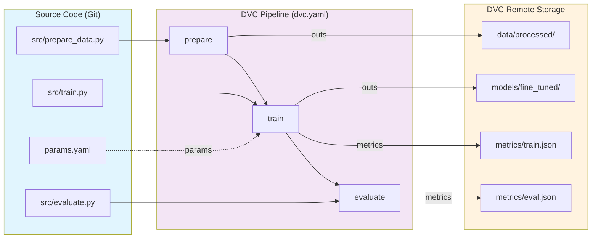

# Module 8: Diagrams — CI/CD for AI

This directory contains text-based and Mermaid diagrams illustrating key concepts from Module 8.

---

## 1. End-to-End CI/CD Pipeline for LLM Applications

### Mermaid Diagram



```mermaid
graph LR
    A[Code Push] --> B[Build]
    B --> C[Unit Tests]
    C --> D[Integration Tests]
    D --> E[AI Evaluation Gate]
    E -->|Score >= 0.80| F[Build Container]
    E -->|Score < 0.80| X[Pipeline Fail]
    F --> G[Push to ACR]
    G --> H[Deploy Staging]
    H --> I[Smoke Tests]
    I -->|Pass| J[Canary Deploy 10%]
    I -->|Fail| X
    J --> K{Monitor Canary}
    K -->|Healthy| L[Promote to 50%]
    K -->|Degraded| M[Rollback]
    L --> N{Monitor 50%}
    N -->|Healthy| O[Full Rollout 100%]
    N -->|Degraded| M
    O --> P[Production Monitor]
    P -->|Anomaly| M

    style A fill:#e1f5fe
    style E fill:#fff3e0
    style J fill:#f3e5f5
    style O fill:#e8f5e9
    style X fill:#ffebee
    style M fill:#ffebee
```

### ASCII Pipeline Diagram

```
┌──────────────────────────────────────────────────────────────────────────────────┐
│                    CI/CD PIPELINE FOR LLM APPLICATIONS                            │
├──────────────────────────────────────────────────────────────────────────────────┤
│                                                                                   │
│  ┌──────────┐   ┌──────────┐   ┌──────────┐   ┌──────────────┐                  │
│  │  SOURCE   │──▶│  BUILD   │──▶│   TEST   │──▶│   EVALUATE   │                 │
│  │          │   │          │   │          │   │  (AI Gate)   │                  │
│  │ git push │   │ pip deps │   │ unit     │   │ prompt eval  │                  │
│  │ PR merge │   │ docker   │   │ integr.  │   │ semantic sim │                  │
│  │ schedule │   │ ruff     │   │ linting  │   │ benchmark    │                  │
│  └──────────┘   └──────────┘   └──────────┘   └──────┬───────┘                  │
│                                                       │                          │
│                                              score >= 0.80?                       │
│                                                   ┌───┴───┐                      │
│                                                   │       │                      │
│                                                 YES      NO                      │
│                                                   │       │                      │
│                                                   ▼       ▼                      │
│                                          ┌────────────┐  FAIL                   │
│                                          │  PACKAGE   │  notify                 │
│                                          │ docker push│  team                   │
│                                          │ acr upload │                         │
│                                          └─────┬──────┘                         │
│                                                │                                │
│                                                ▼                                │
│                                     ┌────────────────────┐                       │
│                                     │  DEPLOY STAGING    │                       │
│                                     │  container apps    │                       │
│                                     │  slot swap         │                       │
│                                     └─────────┬──────────┘                       │
│                                               │                                  │
│                                               ▼                                  │
│                                    ┌─────────────────────┐                        │
│                                    │  SMOKE TESTS        │                        │
│                                    │  health endpoints   │                        │
│                                    │  synthetic queries  │                        │
│                                    └─────────┬───────────┘                        │
│                                              │                                   │
│                                              ▼                                   │
│                                   ┌──────────────────────┐                        │
│                                   │  CANARY DEPLOY       │                        │
│                                   │  10% → monitor       │                        │
│                                   │  50% → monitor       │                        │
│                                   │  100% → full rollout │                        │
│                                   └─────────┬────────────┘                        │
│                                             │                                    │
│                                             ▼                                    │
│                                  ┌───────────────────────┐                        │
│                                  │  PRODUCTION MONITOR   │                        │
│                                  │  latency / errors     │                        │
│                                  │  quality metrics      │                        │
│                                  │  drift detection      │                        │
│                                  └───────────┬───────────┘                        │
│                                              │                                   │
│                                     anomaly? ┼                                   │
│                                         ┌────┴────┐                              │
│                                        YES       NO                              │
│                                         │        │                               │
│                                         ▼        ▼                               │
│                                    ROLLBACK    HEALTHY                            │
│                                                                                   │
└──────────────────────────────────────────────────────────────────────────────────┘
```

---

## 2. Model Versioning Architecture

### Mermaid Diagram



### ASCII Versioning Architecture

```
┌─────────────────────────────────────────────────────────────────────────────┐
│                        MODEL VERSIONING ARCHITECTURE                         │
├─────────────────────────────────────────────────────────────────────────────┤
│                                                                              │
│  ┌─────────────────────────────────────────────────────────────────────┐    │
│  │                        DEVELOPER WORKFLOW                            │    │
│  │                                                                      │    │
│  │   ┌──────────┐    ┌──────────────┐    ┌─────────────────────────┐   │    │
│  │   │  Write   │───▶│  git commit  │───▶│  dvc add + dvc push     │   │    │
│  │   │  Code    │    │  git push    │    │  (track data/models)    │   │    │
│  │   └──────────┘    └──────┬───────┘    └────────────┬────────────┘   │    │
│  │                          │                          │                │    │
│  └──────────────────────────┼──────────────────────────┼────────────────┘    │
│                             │                          │                     │
│                             ▼                          ▼                     │
│  ┌──────────────────────────────────────────────────────────────────────┐   │
│  │                      VERSION CONTROL LAYER                           │   │
│  │                                                                       │   │
│  │  ┌─────────────────┐  ┌─────────────────┐  ┌──────────────────────┐  │   │
│  │  │  Git Repo       │  │  DVC Remote     │  │  MLflow Server       │  │   │
│  │  │                 │  │                 │  │                      │  │   │
│  │  │  • Source code  │  │  • Datasets     │  │  • Experiment logs   │  │   │
│  │  │  • Config files │  │  • Model weights│  │  • Parameters        │  │   │
│  │  │  • Prompt YAML  │  │  • Artifacts    │  │  • Metrics           │  │   │
│  │  │  • IaC templates│  │                 │  │  • Model Registry    │  │   │
│  │  └─────────────────┘  └─────────────────┘  └──────────┬───────────┘  │   │
│  └────────────────────────────────────────────────────────┼──────────────┘   │
│                                                           │                  │
│                                                           ▼                  │
│  ┌──────────────────────────────────────────────────────────────────────┐   │
│  │                        MODEL REGISTRY                                │   │
│  │                                                                       │   │
│  │  ┌───────────────┐  ┌───────────────┐  ┌───────────────┐            │   │
│  │  │  llama3-8b    │  │  llama3-8b    │  │  llama3-8b    │            │   │
│  │  │  v1.0         │  │  v1.1         │  │  v2.0         │            │   │
│  │  │  ┌─────────┐  │  │  ┌─────────┐  │  │  ┌─────────┐  │            │   │
│  │  │  │Staging  │  │  │  │Production│  │  │  │Archived │  │            │   │
│  │  │  └─────────┘  │  │  └─────────┘  │  │  └─────────┘  │            │   │
│  │  └───────────────┘  └───────┬───────┘  └───────────────┘            │   │
│  └──────────────────────────────┼───────────────────────────────────────┘   │
│                                 │                                            │
│                                 ▼                                            │
│  ┌──────────────────────────────────────────────────────────────────────┐   │
│  │                        DEPLOYMENT                                    │   │
│  │                                                                       │   │
│  │   CI/CD Pipeline ──▶ Fetch Model ──▶ Build Container ──▶ Deploy      │   │
│  └──────────────────────────────────────────────────────────────────────┘   │
│                                                                              │
└──────────────────────────────────────────────────────────────────────────────┘
```

---

## 3. Canary Deployment Traffic Flow

### Mermaid Diagram



### ASCII Canary Deployment

```
                        ┌──────────────┐
                        │    USERS     │
                        └──────┬───────┘
                               │
                               ▼
                    ┌─────────────────────┐
                    │   LOAD BALANCER     │
                    │   (Traffic Router)  │
                    └──────┬────────┬─────┘
                           │        │
                    90%    │        │   10%
                           │        │
              ┌────────────┘        └────────────┐
              │                                   │
              ▼                                   ▼
   ┌──────────────────────┐          ┌──────────────────────┐
   │    STABLE (v1.1)     │          │    CANARY (v1.2)     │
   │                      │          │                      │
   │  • Proven stable     │          │  • New prompt/model  │
   │  • Full traffic      │          │  • Limited traffic   │
   │  • Baseline metrics  │          │  • Monitor closely   │
   └──────────┬───────────┘          └──────────┬───────────┘
              │                                   │
              ▼                                   ▼
   ┌──────────────────────┐          ┌──────────────────────┐
   │    METRICS           │          │    METRICS           │
   │                      │          │                      │
   │  error_rate: 0.2%   │          │  error_rate: ???     │
   │  latency_p95: 800ms │          │  latency_p95: ???    │
   │  quality: 0.92      │          │  quality: ???        │
   └──────────────────────┘          └──────────┬───────────┘
                                                │
                                    ┌───────────┴───────────┐
                                    │   CANARY HEALTHY?     │
                                    │                       │
                                    │  error_rate  < 1%?    │
                                    │  latency_p95 < 2s?    │
                                    │  quality     > 0.80?  │
                                    └───────┬───────┬───────┘
                                           ╱         ╲
                                         YES          NO
                                         ╱              ╲
                                        ▼                ▼
                              ┌──────────────┐   ┌──────────────┐
                              │ INCREASE     │   │   ROLLBACK   │
                              │ CANARY       │   │              │
                              │              │   │  Route 100%  │
                              │  10% → 50%   │   │  to stable   │
                              │  50% → 100%  │   │  v1.1        │
                              └──────┬───────┘   └──────────────┘
                                     │
                                     ▼
                              ┌──────────────┐
                              │  PROMOTE     │
                              │  v1.2 as     │
                              │  new stable  │
                              └──────────────┘
```

---

## 4. Prompt Versioning Architecture

### Mermaid Diagram



### ASCII Prompt Versioning

```
┌─────────────────────────────────────────────────────────────────────────────┐
│                       PROMPT VERSIONING ARCHITECTURE                         │
├─────────────────────────────────────────────────────────────────────────────┤
│                                                                              │
│  ┌──────────────────────────────────────────────────────────────────────┐   │
│  │                        GIT REPOSITORY                                 │   │
│  │                                                                       │   │
│  │   prompts/                                                            │   │
│  │   ├── chatbot/                                                        │   │
│  │   │   ├── system_prompt/                                              │   │
│  │   │   │   ├── v1.yaml    ← archived                                   │   │
│  │   │   │   ├── v2.yaml    ← production    ┌────────────────────┐       │   │
│  │   │   │   └── v3.yaml    ← staging       │ version: "3.0"     │       │   │
│  │   │   └── summarization/                  │ model: gpt-4o      │       │   │
│  │   │       ├── v1.yaml                     │ system: "..."      │       │   │
│  │   │       └── v2.yaml  ← production       │ eval_score: 0.87   │       │   │
│  │   └── support/                            └────────────────────┘       │   │
│  │       └── triage/                                                       │   │
│  │           └── v1.yaml                                                   │   │
│  └──────────────────────────────────────────────────────────────────────┘   │
│                                   │                                         │
│                                   ▼                                         │
│  ┌──────────────────────────────────────────────────────────────────────┐   │
│  │                     PROMPT REGISTRY SERVICE                           │   │
│  │                                                                       │   │
│  │   ┌─────────────┐    ┌──────────────┐    ┌───────────────────┐       │   │
│  │   │  REST API   │───▶│   Version    │───▶│  Stage Manager    │       │   │
│  │   │             │    │   Resolver   │    │                   │       │   │
│  │   │  GET /prompt│    │              │    │  draft            │       │   │
│  │   │  POST /prom │    │  "latest" →  │    │  staging          │       │   │
│  │   │  PUT /prom  │    │  "v2"        │    │  production ◄──── │───────│───│
│  │   └─────────────┘    └──────────────┘    │  deprecated       │       │   │
│  │                                           └───────────────────┘       │   │
│  └──────────────────────────────────────────────────────────────────────┘   │
│                                   │                                         │
│                                   ▼                                         │
│  ┌──────────────────────────────────────────────────────────────────────┐   │
│  │                      APPLICATION RUNTIME                              │   │
│  │                                                                       │   │
│  │   prompt = registry.get(                                              │   │
│  │       service="chatbot",                                              │   │
│  │       prompt="system_prompt",                                         │   │
│  │       stage="production"  ← resolves to v2.yaml                      │   │
│  │   )                                                                   │   │
│  │                                                                       │   │
│  │   response = llm.chat(                                                │   │
│  │       system=prompt["system"],                                        │   │
│  │       user=user_input                                                 │   │
│  │   )                                                                   │   │
│  └──────────────────────────────────────────────────────────────────────┘   │
│                                                                              │
└──────────────────────────────────────────────────────────────────────────────┘
```

---

## 5. Rollback Decision Flow

### Mermaid Diagram



### ASCII Rollback Flow

```
┌──────────────────────────────────────────────────────────────────────┐
│                       ROLLBACK DECISION FLOW                         │
├──────────────────────────────────────────────────────────────────────┤
│                                                                      │
│                    ┌─────────────────────┐                            │
│                    │  PRODUCTION         │                            │
│                    │  MONITORING         │                            │
│                    └──────────┬──────────┘                            │
│                               │                                      │
│                    ┌──────────▼──────────┐                            │
│                    │  Check Error Rate   │                            │
│                    │  > 1%?              │                            │
│                    └──┬──────────────┬───┘                            │
│                      YES             NO                               │
│                       │               │                              │
│                       │    ┌──────────▼──────────┐                   │
│                       │    │  Check P95 Latency  │                   │
│                       │    │  > 2000ms?          │                   │
│                       │    └──┬──────────────┬───┘                   │
│                       │      YES             NO                      │
│                       │       │               │                     │
│                       │       │    ┌──────────▼──────────┐          │
│                       │       │    │  Check Quality      │          │
│                       │       │    │  Score < 0.80?      │          │
│                       │       │    └──┬──────────────┬───┘          │
│                       │      YES    NO               │              │
│                       │       │     │     ┌──────────▼──────────┐  │
│                       │       │     │     │  ALL METRICS OK     │  │
│                       │       │     │     │  Continue Monitor   │  │
│                       │       │     │     └─────────────────────┘  │
│                       │       │     │                              │
│               ┌───────▼───────▼─────┤                              │
│               │                     │                              │
│               ▼                     │                              │
│    ┌────────────────────┐           │                              │
│    │  AUTO-ROLLBACK     │           │                              │
│    │  ENABLED?          │           │                              │
│    └──┬─────────────┬───┘           │                              │
│      YES            NO              │                              │
│       │              │              │                              │
│       ▼              ▼              │                              │
│  ┌──────────┐  ┌───────────┐       │                              │
│  │ EXECUTE  │  │ ALERT     │       │                              │
│  │ ROLLBACK │  │ TEAM      │       │                              │
│  │          │  │ Manual    │       │                              │
│  │ Shift to │  │ Review    │       │                              │
│  │ previous │  │ Required  │       │                              │
│  │ version  │  └─────┬─────┘       │                              │
│  └────┬─────┘        │             │                              │
│       │              ▼             │                              │
│       │        ┌───────────┐       │                              │
│       │        │ APPROVE?  │       │                              │
│       │        └──┬────┬───┘       │                              │
│       │          YES    NO         │                              │
│       │           │      │         │                              │
│       ◀───────────┘      │         │                              │
│       │                  ▼         │                              │
│       ▼           ┌───────────┐    │                              │
│  ┌──────────┐     │ CONTINUE  │    │                              │
│  │ NOTIFY   │     │ MONITOR   │    │                              │
│  │ TEAM     │     └───────────┘    │                              │
│  └────┬─────┘                      │                              │
│       │                            │                              │
│       ▼                            │                              │
│  ┌──────────────┐                  │                              │
│  │ POST-MORTEM  │                  │                              │
│  │ REVIEW       │                  │                              │
│  └──────────────┘                  │                              │
│                                    │                              │
└────────────────────────────────────┴──────────────────────────────┘
```

---

## 6. Experiment Tracking Flow

### Mermaid Diagram



```mermaid
graph LR
    subgraph Experiment["Experiment Run"]
        A[Define Parameters] --> B[Train Model]
        B --> C[Log Metrics]
        C --> D[Save Artifacts]
    end

    subgraph Tracking["MLflow Tracking Server"]
        E[(Experiment DB)]
        F[Run Comparison UI]
    end

    subgraph Registry["Model Registry"]
        G[Version 1.0<br/>Stage: None]
        H[Version 1.1<br/>Stage: Staging]
        I[Version 1.2<br/>Stage: Production]
    end

    A --> E
    C --> E
    D --> E
    E --> F
    F -->|Best Run| G
    G -->|Promote| H
    H -->|Promote| I

    subgraph Deploy["Deployment"]
        J[CI/CD Pipeline]
        K[Fetch Production Model]
        L[Deploy]
    end

    I --> J
    J --> K
    K --> L

    style Experiment fill:#e1f5fe
    style Tracking fill:#f3e5f5
    style Registry fill:#fff3e0
    style Deploy fill:#e8f5e9
```

### ASCII Experiment Tracking Flow

```
┌──────────────────────────────────────────────────────────────────────────────┐
│                       EXPERIMENT TRACKING FLOW                               │
├──────────────────────────────────────────────────────────────────────────────┤
│                                                                              │
│  ┌────────────────────────────────────────────────────────────────────┐     │
│  │                        EXPERIMENT RUN                               │     │
│  │                                                                     │     │
│  │  ┌────────────┐   ┌────────────┐   ┌────────────┐   ┌──────────┐  │     │
│  │  │  Define    │──▶│   Train    │──▶│    Log     │──▶│  Save    │  │     │
│  │  │  Params    │   │   Model    │   │  Metrics   │   │ Artifacts│  │     │
│  │  │            │   │            │   │            │   │          │  │     │
│  │  │ lr, epochs │   │ GPU hours  │   │ loss, acc  │   │ model.bin│  │     │
│  │  └────────────┘   └────────────┘   └─────┬──────┘   └────┬─────┘  │     │
│  └───────────────────────────────────────────┼───────────────┼────────┘     │
│                                              │               │              │
│                                              ▼               ▼              │
│  ┌────────────────────────────────────────────────────────────────────┐     │
│  │                     MLFLOW TRACKING SERVER                         │     │
│  │                                                                     │     │
│  │    ┌─────────────────────┐     ┌──────────────────────────┐       │     │
│  │    │  (Experiment DB)    │────▶│  Run Comparison UI       │       │     │
│  │    │                     │     │                          │       │     │
│  │    │  Run 1: acc=0.89   │     │  Sort by accuracy        │       │     │
│  │    │  Run 2: acc=0.92   │     │  Best run → promote      │       │     │
│  │    │  Run 3: acc=0.91   │     │                          │       │     │
│  │    └─────────────────────┘     └────────────┬─────────────┘       │     │
│  └─────────────────────────────────────────────┼─────────────────────┘     │
│                                                │                            │
│                                                ▼                            │
│  ┌────────────────────────────────────────────────────────────────────┐     │
│  │                       MODEL REGISTRY                               │     │
│  │                                                                     │     │
│  │   ┌───────────────┐    ┌───────────────┐    ┌───────────────┐     │     │
│  │   │  v1.0         │    │  v1.1         │    │  v1.2         │     │     │
│  │   │  None         │───▶│  Staging      │───▶│  Production   │     │     │
│  │   │               │    │               │    │               │     │     │
│  │   │  [evaluate]   │    │  [validate]   │    │  [deploy]     │     │     │
│  │   └───────────────┘    └───────────────┘    └───────┬───────┘     │     │
│  └─────────────────────────────────────────────────────┼─────────────┘     │
│                                                        │                    │
│                                                        ▼                    │
│  ┌────────────────────────────────────────────────────────────────────┐     │
│  │                        DEPLOYMENT                                  │     │
│  │                                                                     │     │
│  │   CI/CD Pipeline ──▶ Fetch Model ──▶ Build Container ──▶ Deploy   │     │
│  └────────────────────────────────────────────────────────────────────┘     │
│                                                                              │
└──────────────────────────────────────────────────────────────────────────────┘
```

---

## 7. Blue-Green Deployment Strategy

### Mermaid Diagram



### ASCII Blue-Green Deployment

```
┌──────────────────────────────────────────────────────────────────────────────┐
│                       BLUE-GREEN DEPLOYMENT                                   │
├──────────────────────────────────────────────────────────────────────────────┤
│                                                                              │
│   BEFORE (Stable)                                                            │
│   ─────────────                                                              │
│                                                                              │
│                    ┌───────────────────┐                                     │
│                    │   LOAD BALANCER   │                                     │
│                    └───────┬───┬───────┘                                     │
│                          ╱     ╲                                             │
│                    100% ╱       ╲ 0%                                         │
│                       ╱         ╲                                            │
│              ┌───────▼───┐  ┌────▼──────┐                                   │
│              │   BLUE    │  │  GREEN    │                                   │
│              │  v1.1     │  │  v1.2     │                                   │
│              │  ┌─────┐  │  │  ┌─────┐  │                                   │
│              │  │ACTIVE│  │  │  │IDLE │  │                                   │
│              │  └─────┘  │  │  └─────┘  │                                   │
│              └───────────┘  └───────────┘                                   │
│                                                                              │
│                                                                              │
│   AFTER (New Release)                                                        │
│   ───────────────────                                                        │
│                                                                              │
│                    ┌───────────────────┐                                     │
│                    │   LOAD BALANCER   │                                     │
│                    └───────┬───┬───────┘                                     │
│                          ╱     ╲                                             │
│                     0% ╱       ╲ 100%                                        │
│                      ╱         ╲                                             │
│              ┌───────▼───┐  ┌────▼──────┐                                   │
│              │   BLUE    │  │  GREEN    │                                   │
│              │  v1.1     │  │  v1.2     │                                   │
│              │  ┌─────┐  │  │  ┌─────┐  │                                   │
│              │  │STDBY│  │  │  │ACTIVE│  │                                   │
│              │  └─────┘  │  │  └─────┘  │                                   │
│              └───────────┘  └───────────┘                                   │
│                                                                              │
│   Rollback: flip traffic back to Blue instantly                              │
│                                                                              │
└──────────────────────────────────────────────────────────────────────────────┘
```

---

## 8. DVC Pipeline Architecture

### Mermaid Diagram



### ASCII DVC Pipeline

```
┌──────────────────────────────────────────────────────────────────────────────┐
│                          DVC PIPELINE ARCHITECTURE                            │
├──────────────────────────────────────────────────────────────────────────────┤
│                                                                              │
│  ┌────────────────────────────────────────────────────────────────────┐     │
│  │                       SOURCE CODE (Git)                            │     │
│  │                                                                     │     │
│  │   src/prepare_data.py    src/train.py    src/evaluate.py          │     │
│  │   params.yaml                                                       │     │
│  └────────────┬──────────────────┬──────────────────┬─────────────────┘     │
│               │                  │                  │                        │
│               ▼                  ▼                  ▼                        │
│  ┌────────────────────────────────────────────────────────────────────┐     │
│  │                       DVC PIPELINE                                  │     │
│  │                                                                     │     │
│  │   ┌──────────┐      ┌──────────┐      ┌──────────┐                │     │
│  │   │ PREPARE  │─────▶│  TRAIN   │─────▶│ EVALUATE │                │     │
│  │   │          │      │          │      │          │                │     │
│  │   │ deps:    │      │ deps:    │      │ deps:    │                │     │
│  │   │  src.py  │      │  src.py  │      │  src.py  │                │     │
│  │   │  raw/    │      │  proc./  │      │  model/  │                │     │
│  │   │          │      │ params:  │      │          │                │     │
│  │   │ outs:    │      │  lr, ep  │      │ metrics: │                │     │
│  │   │  proc./  │      │          │      │  eval.js │                │     │
│  │   └──────────┘      │ outs:    │      └──────────┘                │     │
│  │                      │  model/  │                                   │     │
│  │                      │ metrics: │                                   │     │
│  │                      │  train.j │                                   │     │
│  │                      └──────────┘                                   │     │
│  └────────────────────────────────────────────────────────────────────┘     │
│               │                  │                  │                        │
│               ▼                  ▼                  ▼                        │
│  ┌────────────────────────────────────────────────────────────────────┐     │
│  │                       DVC REMOTE STORAGE                           │     │
│  │                                                                     │     │
│  │   data/processed/    models/fine_tuned/    metrics/                │     │
│  │                                                                     │     │
│  │   (Azure Blob, S3, GCS — actual files stored here)                │     │
│  └────────────────────────────────────────────────────────────────────┘     │
│                                                                              │
│   Commands:                                                                  │
│   dvc repro        → Reproduce pipeline                                      │
│   dvc push         → Upload artifacts to remote                              │
│   dvc pull         → Download artifacts from remote                          │
│   dvc metrics diff → Compare metrics across runs                             │
│                                                                              │
└──────────────────────────────────────────────────────────────────────────────┘
```
