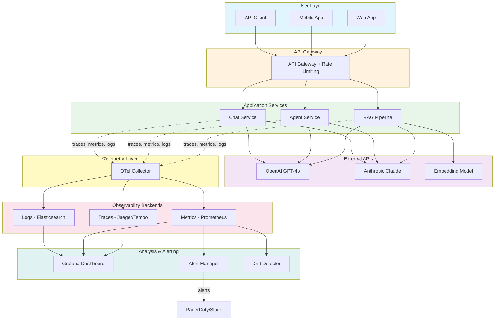
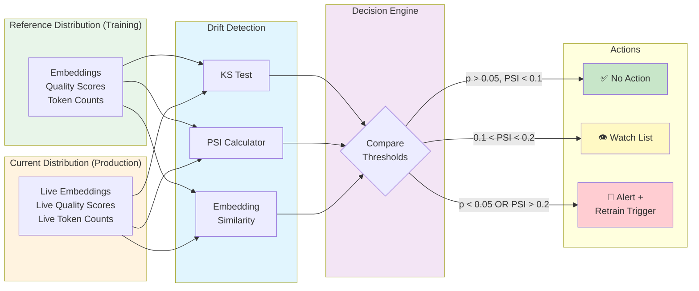
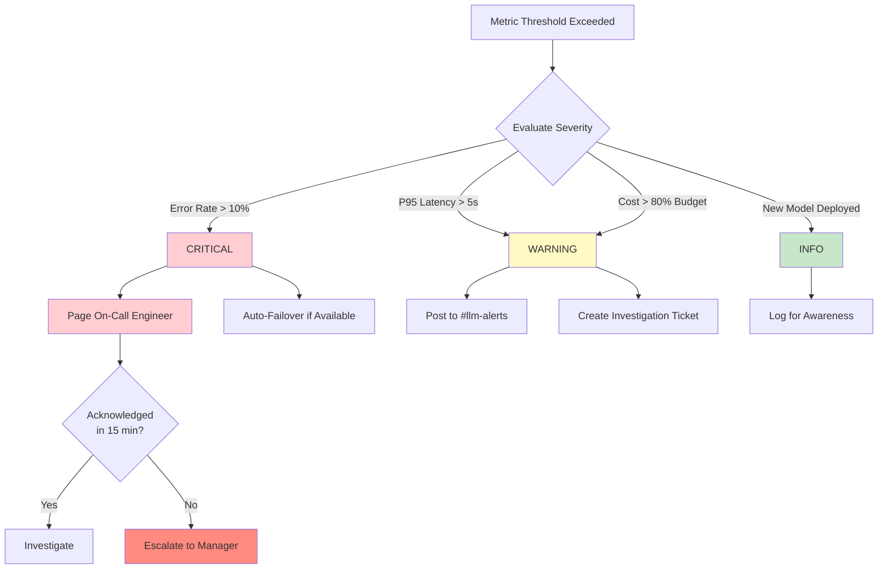
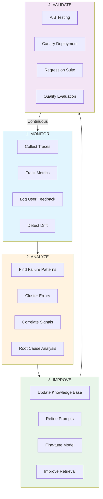
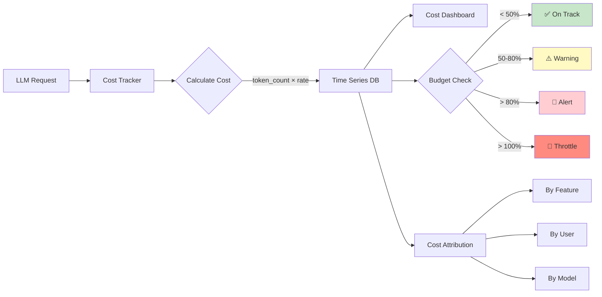

# Module 9: Diagrams — Monitoring & Observability

This directory contains text-based and Mermaid diagrams illustrating key concepts from Module 9.

---

## 1. End-to-End LLM Observability Architecture

### Mermaid Diagram



### ASCII Architecture Diagram

```
┌─────────────────────────────────────────────────────────────────────────────┐
│                        LLM OBSERVABILITY ARCHITECTURE                        │
├─────────────────────────────────────────────────────────────────────────────┤
│                                                                              │
│  ┌───────────┐  ┌───────────┐  ┌───────────┐                                │
│  │  Web App  │  │  Mobile   │  │  API      │   USER LAYER                   │
│  └─────┬─────┘  └─────┬─────┘  └─────┬─────┘                                │
│        │              │              │                                       │
│        ▼              ▼              ▼                                       │
│  ┌─────────────────────────────────────────┐                                │
│  │          API Gateway + Auth             │   GATEWAY                      │
│  │     (Rate Limiting, Request Routing)    │                                │
│  └──────────────────┬──────────────────────┘                                │
│                     │                                                        │
│        ┌────────────┼────────────┐                                          │
│        ▼            ▼            ▼                                          │
│  ┌──────────┐ ┌──────────┐ ┌──────────┐                                    │
│  │   RAG    │ │  Agent   │ │  Chat    │   SERVICES                         │
│  │ Pipeline │ │ Service  │ │ Service  │                                    │
│  │          │ │          │ │          │                                     │
│  │ Embed →  │ │ Think →  │ │ Generate │                                    │
│  │ Search → │ │ Act →    │ │ Response │                                    │
│  │ Generate │ │ Observe  │ │          │                                    │
│  └────┬─────┘ └────┬─────┘ └────┬─────┘                                    │
│       │            │            │                                           │
│       ▼            ▼            ▼                                           │
│  ┌─────────────────────────────────────────┐   EXTERNAL                     │
│  │  OpenAI  │  Anthropic  │  Embeddings   │   APIS                         │
│  └─────────────────────────────────────────┘                                │
│                                                                              │
│  ════════════════════════════════════════════   TELEMETRY LAYER              │
│       │            │            │                                           │
│       ▼            ▼            ▼                                           │
│  ┌─────────────────────────────────────────┐                                │
│  │         OpenTelemetry Collector         │                                │
│  │  Receives → Processes → Routes          │                                │
│  └───┬────────────┬────────────┬───────────┘                                │
│      │            │            │                                            │
│      ▼            ▼            ▼                                            │
│  ┌────────┐  ┌──────────┐  ┌──────────┐                                    │
│  │ Traces │  │ Metrics  │  │  Logs    │   STORAGE                          │
│  │ Jaeger │  │Prometheus│  │ Elastic  │                                    │
│  └───┬────┘  └────┬─────┘  └────┬─────┘                                    │
│      │            │             │                                           │
│      ▼            ▼             ▼                                           │
│  ┌─────────────────────────────────────────┐                                │
│  │           Grafana Dashboard             │   ANALYSIS                     │
│  │  Traffic │ Latency │ Cost │ Quality     │                                │
│  └────────────────────┬────────────────────┘                                │
│                       │                                                      │
│                       ▼                                                      │
│  ┌─────────────────────────────────────────┐                                │
│  │         Alert Manager                   │   ALERTING                     │
│  │  Critical → Page │ Warning → Channel    │                                │
│  └─────────────────────────────────────────┘                                │
└─────────────────────────────────────────────────────────────────────────────┘
```

---

## 2. Distributed Trace for a RAG Pipeline

### Mermaid Diagram



```mermaid
gantt
    title RAG Pipeline Trace - Request req_abc123 (Total: 1,850ms)
    dateFormat X
    axisFormat %L ms

    section Gateway
    Auth Validation           :a1, 0, 5
    Rate Limit Check          :a2, 0, 3

    section Retrieval
    Query Embedding           :b1, 5, 55
    Vector Search (top-5)     :b2, 55, 135
    Reranking                 :b3, 135, 185

    section LLM Generation
    Prompt Construction       :c1, 185, 190
    API Call (gpt-4o)         :c2, 190, 1790
    Response Parsing          :c3, 1790, 1835

    section Post-Processing
    Citation Formatting       :d1, 1835, 1850
```

### ASCII Trace Waterfall

```
Trace: rag-request-abc123 (Total: 1,850ms)
━━━━━━━━━━━━━━━━━━━━━━━━━━━━━━━━━━━━━━━━━━━━━━━━━━━━━━━━━━━━━━━━━━━━━━━━━━━━

0ms        200ms       400ms       600ms       800ms      1000ms    1850ms
│          │           │           │           │           │          │
├─ api_gateway (5ms)
│ ██
│
├─ retrieval_pipeline (180ms)
│ ├─ query_embedding (50ms)
│ │ ██████████
│ ├─ vector_search (80ms)
│ │ ████████████████████
│ └─ reranking (50ms)
│   ██████████
│
├─ llm_generation (1,650ms)
│ ├─ prompt_construction (5ms)
│ │ █
│ ├─ api_call gpt-4o (1,600ms)     ← Bottleneck (86% of total time)
│ │ ████████████████████████████████████████████████████████████████████
│ └─ response_parsing (45ms)
│   █████████
│
└─ post_processing (15ms)
  ███

Breakdown:
  Retrieval:   180ms ( 9.7%)  ██████████
  LLM:       1,650ms (89.2%)  ████████████████████████████████████████████████
  Other:        20ms ( 1.1%)  █
```

---

## 3. Drift Detection Pipeline

### Mermaid Diagram



### ASCII Drift Detection Flow

```
┌─────────────────────────────────────────────────────────────────────────┐
│                       DRIFT DETECTION PIPELINE                          │
├─────────────────────────────────────────────────────────────────────────┤
│                                                                         │
│  ┌───────────────────┐          ┌───────────────────┐                   │
│  │   REFERENCE DATA  │          │   CURRENT DATA    │                   │
│  │   (Training/Last  │          │   (Live Traffic)  │                   │
│  │    30 days)       │          │   (Rolling 24h)   │                   │
│  │                   │          │                   │                   │
│  │  • Embeddings     │          │  • Embeddings     │                   │
│  │  • Quality scores │          │  • Quality scores │                   │
│  │  • Token counts   │          │  • Token counts   │                   │
│  │  • Topic clusters │          │  • Topic clusters │                   │
│  └────────┬──────────┘          └────────┬──────────┘                   │
│           │                              │                              │
│           ▼                              ▼                              │
│  ┌────────────────────────────────────────────────────────────────┐     │
│  │                    STATISTICAL TESTS                           │     │
│  │                                                                │     │
│  │  ┌──────────────┐  ┌──────────────┐  ┌──────────────────┐     │     │
│  │  │  KS Test     │  │  PSI         │  │  Embedding       │     │     │
│  │  │  (continuous │  │  (population │  │  Cosine Sim.     │     │     │
│  │  │   features)  │  │   stability) │  │  (semantic)      │     │     │
│  │  └──────┬───────┘  └──────┬───────┘  └────────┬─────────┘     │     │
│  │         │                 │                    │               │     │
│  │         ▼                 ▼                    ▼               │     │
│  │  ┌────────────────────────────────────────────────────────┐   │     │
│  │  │                  COMPOSITE SCORE                       │   │     │
│  │  │  score = w1*ks_stat + w2*psi + w3*(1-cosine_sim)      │   │     │
│  │  └────────────────────────┬───────────────────────────────┘   │     │
│  └───────────────────────────┼───────────────────────────────────┘     │
│                              │                                          │
│                              ▼                                          │
│  ┌────────────────────────────────────────────────────────────────┐     │
│  │                    DECISION THRESHOLDS                         │     │
│  │                                                                │     │
│  │  Score < 0.1  ──▶  ✅  No drift detected. Continue monitoring  │     │
│  │  0.1 ≤ s < 0.3 ──▶  👁️  Moderate drift. Add to watch list     │     │
│  │  Score ≥ 0.3  ──▶  🚨  Significant drift. Trigger alert +     │     │
│  │                       evaluate retraining pipeline             │     │
│  └────────────────────────────────────────────────────────────────┘     │
└─────────────────────────────────────────────────────────────────────────┘
```

---

## 4. Alert Routing and Escalation

### Mermaid Diagram



### ASCII Alert Escalation Matrix

```
┌─────────────────────────────────────────────────────────────────────────┐
│                      ALERT ESCALATION MATRIX                            │
├──────────┬──────────────┬──────────────────┬────────────┬───────────────┤
│ Severity │ Condition    │ Channel          │ Response   │ Escalation    │
│          │              │                  │ Time       │               │
├──────────┼──────────────┼──────────────────┼────────────┼───────────────┤
│ CRITICAL │ Error rate   │ PagerDuty page   │ 15 min     │ → Manager     │
│          │ > 10%        │ + Slack #incidents│            │ at 30 min     │
│          │ Service down │                  │            │ → VP at 1 hr  │
├──────────┼──────────────┼──────────────────┼────────────┼───────────────┤
│ WARNING  │ P95 > 5s     │ Slack #llm-alerts│ 1 hour     │ → On-call     │
│          │ Cost > 80%   │ + Jira ticket    │            │ at 2 hours    │
│          │ PSI > 0.15   │                  │            │               │
├──────────┼──────────────┼──────────────────┼────────────┼───────────────┤
│ INFO     │ Deployment   │ Slack #llm-info  │ Next standup│ None         │
│          │ Traffic ±20% │ + Log entry      │            │               │
│          │ Model switch │                  │            │               │
└──────────┴──────────────┴──────────────────┴────────────┴───────────────┘
```

---

## 5. Monitoring Feedback Loop

### Mermaid Diagram



### ASCII Feedback Loop

```
┌─────────────────────────────────────────────────────────────────────────┐
│                  CONTINUOUS IMPROVEMENT FEEDBACK LOOP                   │
├─────────────────────────────────────────────────────────────────────────┤
│                                                                         │
│  ┌──────────────┐         ┌──────────────┐                              │
│  │   MONITOR    │────────▶│   ANALYZE    │                              │
│  │              │         │              │                              │
│  │ • Traces     │         │ • Patterns   │                              │
│  │ • Metrics    │         │ • Clusters   │                              │
│  │ • Feedback   │         │ • Correlate  │                              │
│  │ • Drift      │         │ • Root cause │                              │
│  └──────────────┘         └──────┬───────┘                              │
│         ▲                        │                                       │
│         │                        ▼                                       │
│         │               ┌──────────────┐         ┌──────────────┐       │
│         │               │   IMPROVE    │────────▶│   VALIDATE   │       │
│         │               │              │         │              │       │
│         │               │ • KB update  │         │ • A/B test   │       │
│         │               │ • Prompts    │         │ • Canary     │       │
│         │               │ • Fine-tune  │         │ • Regression │       │
│         │               │ • Retrieval  │         │ • Quality    │       │
│         │               └──────────────┘         └──────┬───────┘       │
│         │                                               │               │
│         └───────────────────────────────────────────────┘               │
│                         Deploy improvements                             │
│                         and continue monitoring                         │
└─────────────────────────────────────────────────────────────────────────┘
```

---

## 6. Cost Tracking Architecture

### Mermaid Diagram



### ASCII Cost Tracking Dashboard

```
┌─────────────────────────────────────────────────────────────────────────┐
│                      COST TRACKING DASHBOARD                            │
├─────────────────────────────────────────────────────────────────────────┤
│                                                                         │
│  Daily Budget: $50.00          Current Spend: $32.15 (64.3%)           │
│  ████████████████████████████████████░░░░░░░░░░░░░░░░░                  │
│                                                                         │
│  ┌───────────────────────┬───────────────────────┐                      │
│  │  BY MODEL             │  BY FEATURE           │                      │
│  │  gpt-4o:    $21.30    │  Chat:      $15.20    │                      │
│  │  gpt-4o-mini: $7.50   │  RAG:       $10.80    │                      │
│  │  claude-3.5:  $3.35   │  Agent:      $6.15    │                      │
│  └───────────────────────┴───────────────────────┘                      │
│                                                                         │
│  ┌──────────────────────────────────────────────┐                       │
│  │  HOURLY TREND (last 24h)                     │                       │
│  │  $2.50│    ╭─╮                               │                       │
│  │  $2.00│ ╭──╯  ╰──╮   ╭╮                     │                       │
│  │  $1.50│─╯        ╰───╯╰─╮                   │                       │
│  │  $1.00│                 ╰──                  │                       │
│  │  $0.50│                                      │                       │
│  │       └──────────────────────────            │                       │
│  │       00:00    06:00   12:00  18:00  24:00   │                       │
│  └──────────────────────────────────────────────┘                       │
│                                                                         │
│  Alerts: ⚠️ gpt-4o usage up 23% vs yesterday                           │
└─────────────────────────────────────────────────────────────────────────┘
```

---
