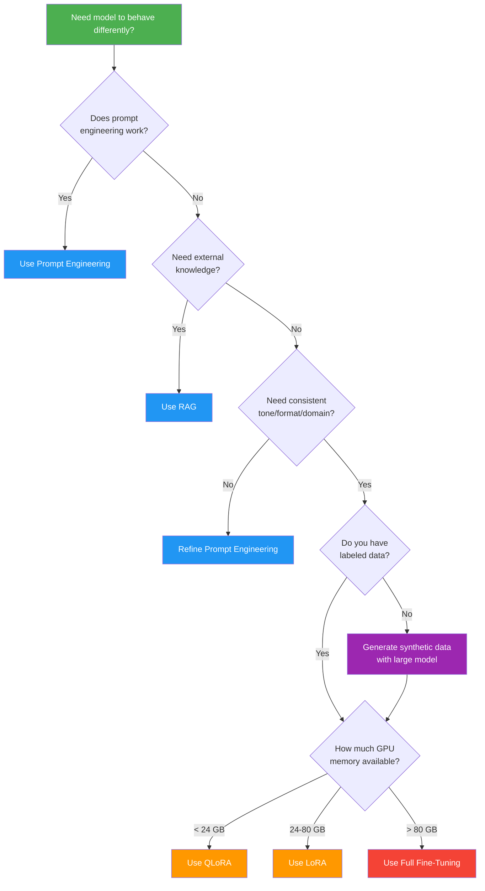
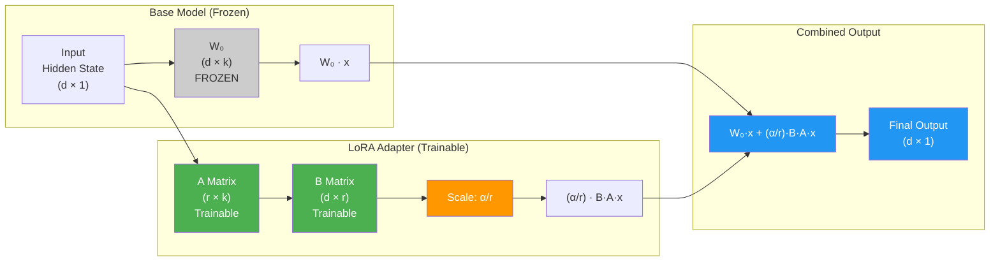
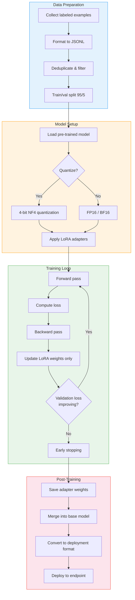

# Module 11: Diagrams — Fine-Tuning LLMs

This directory contains text-based and Mermaid diagrams illustrating key concepts from Module 11.

---

## 1. Fine-Tuning Decision Flowchart

### Mermaid Diagram



### ASCII Decision Tree

```
┌─────────────────────────────────┐
│   Need model to behave          │
│   differently?                  │
└───────────────┬─────────────────┘
                │
                ▼
    ┌───────────────────────┐
    │ Does prompt engineering│
    │ work?                  │
    └───────┬───────┬───────┘
            │       │
          YES      NO
            │       │
            ▼       ▼
    ┌──────────┐  ┌──────────────────┐
    │ Use Prompt│  │ Need external    │
    │ Engineer- │  │ knowledge?       │
    │ ing       │  └──┬──────────┬───┘
    └──────────┘     │          │
                   YES         NO
                     │          │
                     ▼          ▼
             ┌──────────┐ ┌───────────────────┐
             │ Use RAG  │ │ Need consistent   │
             └──────────┘ │ tone/format?      │
                          └──┬────────────┬───┘
                           YES           NO
                             │            │
                             ▼            ▼
                    ┌──────────────┐ ┌──────────┐
                    │ Have labeled │ │ Refine   │
                    │ data?        │ │ Prompt   │
                    └──┬────────┬──┘ └──────────┘
                     YES       NO
                       │        │
                       ▼        ▼
              ┌────────────┐ ┌────────────────┐
              │ GPU Memory?│ │ Generate data  │
              └─┬────┬──┬──┘ │ with large LLM │
                │    │  │    └───────┬────────┘
           <24GB │ 24-80 │ >80GB     │
                │    │  │           │
                ▼    ▼  ▼           ▼
             ┌────┐┌────┐┌──────┐  ┌──────┐
             │QLoRA││LoRA││Full  │  │GPU   │
             └────┘└────┘│FT    │  │Check │
                         └──────┘  └──────┘
```

---

## 2. LoRA Architecture Diagram

### Mermaid Diagram



### ASCII LoRA Architecture

```
                    Input Hidden State x (d × 1)
                           │
                 ┌─────────┴──────────┐
                 │                    │
                 ▼                    ▼
    ┌─────────────────────┐  ┌──────────────────┐
    │   Base Weight W₀    │  │   LoRA Path      │
    │   (d × k)           │  │   (Trainable)    │
    │                     │  │                  │
    │   ██ FROZEN ██      │  │       ┌───┐     │
    │   Do not update     │  │   x ──┤ A │     │
    │                     │  │       │r×k│     │
    │                     │  │       └─┬─┘     │
    │                     │  │         │       │
    │                     │  │       ┌─▼─┐     │
    │                     │  │   ┌───┤ B │     │
    │                     │  │   │   │d×r│     │
    │                     │  │   │   └─┬─┘     │
    │                     │  │   │     │       │
    │                     │  │   │  ×──▼──     │
    │                     │  │   │  α/r        │
    └──────────┬──────────┘  └───┼─────────────┘
               │                 │
               │    ┌────────────┘
               ▼    ▼
            ┌──────────────┐
            │  W₀·x + (α/r)·B·A·x  │
            │  (Addition)            │
            └──────────┬─────────────┘
                       │
                       ▼
                 Output (d × 1)

    Parameter Comparison:
    ┌───────────────────────────────────────┐
    │ Full matrix:  d × k = 4096 × 4096    │
    │             = 16,777,216 parameters   │
    │                                       │
    │ LoRA (r=16): d×r + r×k               │
    │            = 4096×16 + 16×4096        │
    │            = 131,072 parameters       │
    │                                       │
    │ Reduction: 128× fewer parameters      │
    │ Trainable: 0.78% of original          │
    └───────────────────────────────────────┘
```

---

## 3. Training Pipeline

### Mermaid Diagram



### ASCII Training Pipeline

```
┌─────────────────────────────────────────────────────────────────────┐
│                        DATA PREPARATION                             │
│                                                                     │
│  ┌──────────┐   ┌──────────┐   ┌──────────┐   ┌──────────────┐    │
│  │ Collect   │──▶│ Format   │──▶│ Dedup &  │──▶│ Train / Val  │    │
│  │ labeled   │   │ to JSONL │   │ Filter   │   │ Split (95/5) │    │
│  │ examples  │   │          │   │          │   │              │    │
│  └──────────┘   └──────────┘   └──────────┘   └──────┬───────┘    │
└───────────────────────────────────────────────────────┼────────────┘
                                                        │
┌───────────────────────────────────────────────────────┼────────────┐
│                        MODEL SETUP                     │            │
│                                                        ▼            │
│  ┌──────────────────┐   ┌───────────────┐   ┌──────────────────┐  │
│  │ Load pre-trained │──▶│ Quantize?     │──▶│ Apply LoRA       │  │
│  │ model            │   │               │   │ adapters         │  │
│  │ (e.g., Llama-2)  │   │ 4-bit NF4    │   │ r=16, α=32       │  │
│  └──────────────────┘   │ or FP16/BF16  │   │ target: q,v,k,o  │  │
│                         └───────────────┘   └────────┬─────────┘  │
└──────────────────────────────────────────────────────┼─────────────┘
                                                        │
┌───────────────────────────────────────────────────────┼─────────────┐
│                        TRAINING LOOP                   │            │
│                                                        ▼            │
│    ┌─────────────────────────────────────────────────────────┐     │
│    │                                                         │     │
│    │  ┌──────────┐  ┌──────────┐  ┌──────────┐  ┌─────────┐ │     │
│    │  │ Forward  │─▶│ Compute  │─▶│ Backward │─▶│ Update  │ │     │
│    │  │ Pass     │  │ Loss     │  │ Pass     │  │ LoRA    │ │     │
│    │  └──────────┘  └──────────┘  └──────────┘  │ Weights │ │     │
│    │       ▲                                      └────┬────┘ │     │
│    │       │         ┌─────────────────────┐          │      │     │
│    │       └─────────│ Validation Loss     │◀─────────┘      │     │
│    │                 │ improving?          │                  │     │
│    │                 │ YES → continue      │                  │     │
│    │                 │ NO  → early stop ───┼──────┐          │     │
│    │                 └─────────────────────┘      │          │     │
│    └──────────────────────────────────────────────┼──────────┘     │
└───────────────────────────────────────────────────┼────────────────┘
                                                    │
┌───────────────────────────────────────────────────┼────────────────┐
│                        POST-TRAINING              │                │
│                                                   ▼                │
│  ┌──────────┐   ┌──────────┐   ┌──────────┐   ┌──────────────┐   │
│  │ Save     │──▶│ Merge    │──▶│ Convert  │──▶│ Deploy to    │   │
│  │ adapter  │   │ W₀+BA    │   │ to ONNX/ │   │ endpoint     │   │
│  │ (~16 MB) │   │          │   │ GGUF     │   │              │   │
│  └──────────┘   └──────────┘   └──────────┘   └──────────────┘   │
└────────────────────────────────────────────────────────────────────┘
```

---

## 4. Memory Comparison Diagram

### ASCII Memory Bars

```
GPU Memory Required for Llama-2-7B Fine-Tuning:

Full Fine-Tuning (FP32)
████████████████████████████████████████████████████████████ 120 GB

LoRA (FP16 base)
██████████████████ 30 GB

QLoRA (4-bit base)
██████ 10 GB

Inference Only (4-bit)
██ 4 GB

0    20    40    60    80    100   120   140 (GB)
├─────┼─────┼─────┼─────┼─────┼─────┼─────┤
```

---

## 5. Technique Selection Matrix

### ASCII Diagram

```
┌─────────────────────────────────────────────────────────────────┐
│                   TECHNIQUE SELECTION MATRIX                     │
├─────────────────┬───────────┬───────────┬───────────┬───────────┤
│                 │ Prompt    │ RAG       │ LoRA/     │ Full      │
│                 │ Eng.      │           │ QLoRA     │ Fine-Tune │
├─────────────────┼───────────┼───────────┼───────────┼───────────┤
│ Setup Effort    │ ██░░░░░░░ │ ████░░░░░ │ ██████░░░ │ ████████░ │
│                 │ Low       │ Medium    │ Medium-Hi │ High      │
├─────────────────┼───────────┼───────────┼───────────┼───────────┤
│ GPU Memory      │ N/A       │ N/A       │ 10-30 GB  │ 120+ GB   │
├─────────────────┼───────────┼───────────┼───────────┼───────────┤
│ Data Needed     │ 0-10 ex.  │ Documents │ 100-10K   │ 1K-100K   │
├─────────────────┼───────────┼───────────┼───────────┼───────────┤
│ Output Quality  │ Good      │ Good      │ Very Good │ Best      │
├─────────────────┼───────────┼───────────┼───────────┼───────────┤
│ Knowledge Update│ Instant   │ Instant   │ Retrain   │ Retrain   │
├─────────────────┼───────────┼───────────┼───────────┼───────────┤
│ Best For        │ Proto-    │ Dynamic   │ Domain    │ Maximum   │
│                 │ typing    │ knowledge │ behavior  │ quality   │
└─────────────────┴───────────┴───────────┴───────────┴───────────┘

Decision Path:
  Start here ──▶ Prompt Eng. enough? ──Yes──▶ Done
                      │
                      No
                      │
                      ▼
                  Need external knowledge? ──Yes──▶ Use RAG
                      │
                      No
                      │
                      ▼
                  Have labeled data + GPU? ──Yes──▶ LoRA / QLoRA
                      │                            (or Full FT if
                      No                            GPU allows)
                      │
                      ▼
                  Generate synthetic data ──▶ Then fine-tune
```
