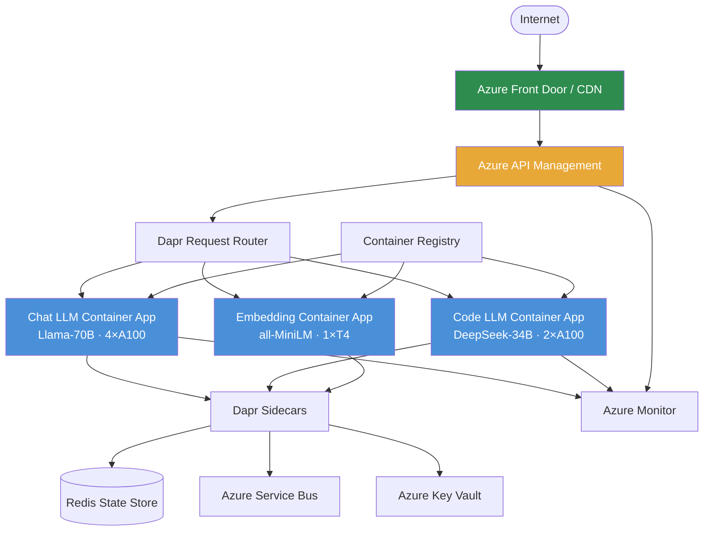
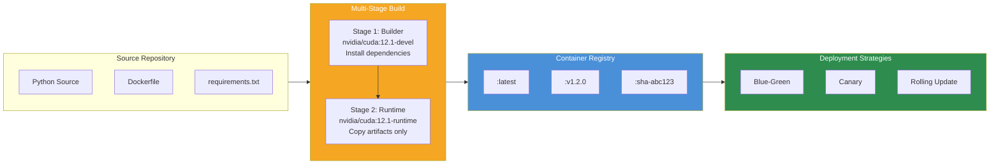
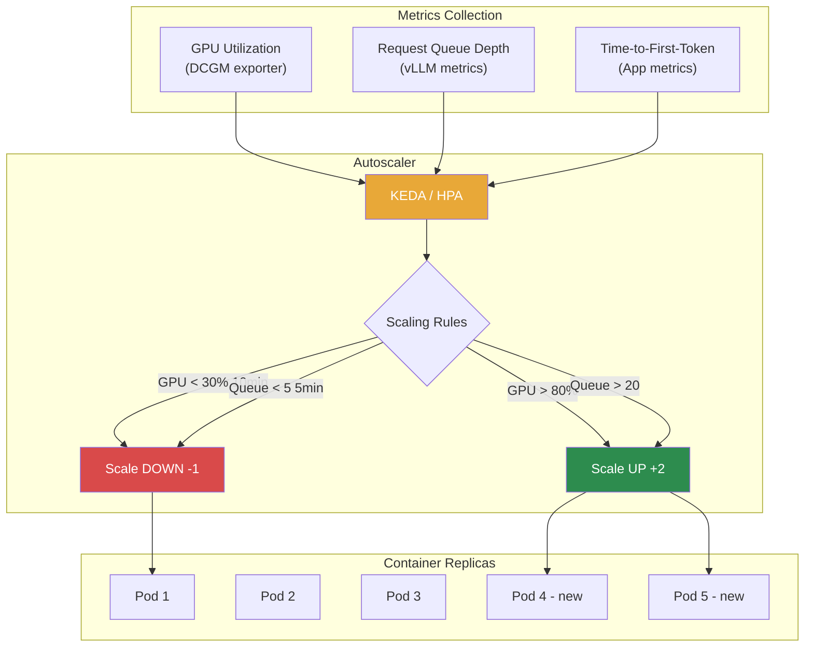
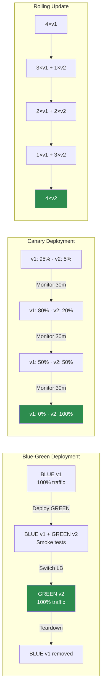
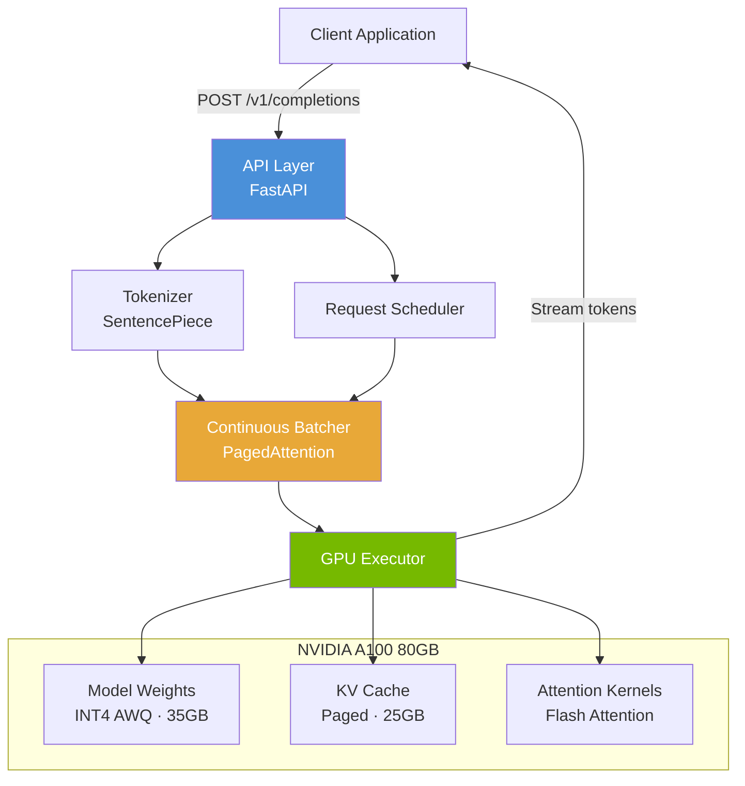
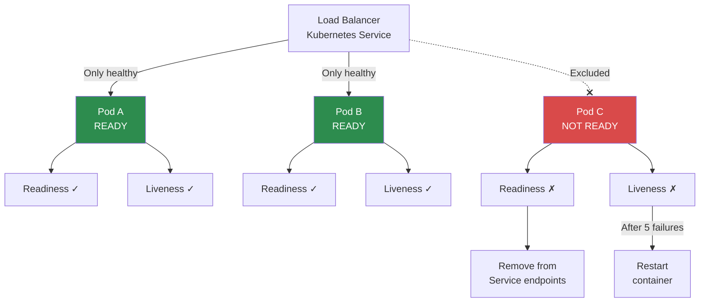

```mermaid
graph LR
    Dev[Developer Push] --> Build[Build Image<br/>ACR Build]
    Build --> Scan[Security Scan<br/>Trivy]
    Scan --> Test[Integration Tests<br/>GPU Runner]
    Test --> Perf[Performance Test<br/>Throughput Benchmark]
    Perf --> Stage[Deploy Staging<br/>Container App]
    Stage --> Smoke[Smoke Tests<br/>Health + API]
    Smoke --> Approve{Manual<br/>Approval}
    Approve -->|Approved| Canary[Canary Deploy<br/>10% traffic]
    Canary --> Monitor[Monitor 10min<br/>Error Rate < 1%]
    Monitor -->|Pass| Promote[Promote 100%]
    Monitor -->|Fail| Rollback[Rollback to v1]
    Promote --> Done[Production ✓]

    style Promote fill:#2d8c4e,color:#fff
    style Rollback fill:#d94a4a,color:#fff
    style Approve fill:#e8a838,color:#fff
```

# Module 12: Deployment Strategies — Diagrams

---

## 1. End-to-End Deployment Architecture

### ASCII Diagram

```
                              ┌──────────────────────────────────────────────────┐
                              │                  INTERNET                        │
                              └──────────────────────┬───────────────────────────┘
                                                     │
                              ┌──────────────────────▼───────────────────────────┐
                              │              Azure Front Door / CDN              │
                              │         (TLS termination, WAF, caching)          │
                              └──────────────────────┬───────────────────────────┘
                                                     │
                              ┌──────────────────────▼───────────────────────────┐
                              │              Azure API Management                │
                              │  ┌──────────┐  ┌────────────┐  ┌────────────┐   │
                              │  │   Auth   │  │Rate Limiter│  │  Response  │   │
                              │  │ (API Key)│  │(100 req/m) │  │   Cache    │   │
                              │  └─────┬────┘  └─────┬──────┘  └─────┬──────┘   │
                              │        └─────────────┼───────────────┘          │
                              └──────────────────────┬───────────────────────────┘
                                                     │
                         ┌───────────────────────────┼───────────────────────────┐
                         │    Azure Container Apps Environment (VNet)           │
                         │                           │                           │
                         │   ┌───────────────────────┼───────────────────┐       │
                         │   │                       ▼                   │       │
                         │   │            ┌──────────────────┐           │       │
                         │   │            │   Request Router │           │       │
                         │   │            │   (Dapr sidecar) │           │       │
                         │   │            └──┬─────┬─────┬──┘           │       │
                         │   │               │     │     │              │       │
                         │   │    ┌──────────▼┐ ┌──▼─────▼───┐ ┌───────▼────┐  │
                         │   │    │ Chat LLM  │ │ Code LLM   │ │ Embedding  │  │
                         │   │    │ Llama-70B │ │ DeepSeek-34│ │ all-MiniLM │  │
                         │   │    │ 4×A100    │ │ 2×A100     │ │ 1×T4      │  │
                         │   │    │ 2-8 reps  │ │ 1-4 reps   │ │ 1-2 reps  │  │
                         │   │    └───────────┘ └────────────┘ └────────────┘  │
                         │   └────────────────────────────────────────────────┘  │
                         │                                                       │
                         │   ┌────────────────────────────────────────────────┐  │
                         │   │              Shared Services (Dapr)            │  │
                         │   │  ┌──────────┐ ┌───────────┐ ┌──────────────┐  │  │
                         │   │  │ Pub/Sub  │ │  State    │ │  Secrets     │  │  │
                         │   │  │(Service  │ │(Redis for │ │ (Key Vault   │  │  │
                         │   │  │ Bus)     │ │ conv hist)│ │  integration)│  │  │
                         │   │  └──────────┘ └───────────┘ └──────────────┘  │  │
                         │   └────────────────────────────────────────────────┘  │
                         └───────────────────────────────────────────────────────┘
                                                     │
                         ┌───────────────────────────┼───────────────────────────┐
                         │  Platform Services        │                           │
                         │  ┌──────────┐  ┌──────────▼──────┐  ┌──────────────┐ │
                         │  │Key Vault │  │ Azure Monitor   │  │Container     │ │
                         │  │(Secrets) │  │ (Logs, Metrics, │  │Registry (ACR)│ │
                         │  │          │  │  Alerts, Traces)│  │              │ │
                         │  └──────────┘  └─────────────────┘  └──────────────┘ │
                         └───────────────────────────────────────────────────────┘
```

### Mermaid Diagram



---

## 2. Container Build & Deploy Flow

### ASCII Diagram

```
┌─────────────────────────────────────────────────────────────────────────────┐
│                          CONTAINER BUILD & DEPLOY FLOW                       │
└─────────────────────────────────────────────────────────────────────────────┘

┌───────────┐    ┌───────────────┐    ┌──────────────┐    ┌────────────────┐
│  Source    │    │  Multi-Stage  │    │   Container  │    │   Production   │
│  Code     │───▶│  Docker Build │───▶│   Registry   │───▶│   Deployment   │
│           │    │               │    │   (ACR)      │    │                │
└───────────┘    └───────────────┘    └──────────────┘    └────────────────┘
     │                  │                    │                     │
     │            ┌─────┴──────┐      ┌─────┴──────┐       ┌─────┴──────┐
     │            │ Stage 1:   │      │ Image Tags │       │ Blue-Green │
     │            │ Builder    │      │ :latest    │       │ Canary     │
     │            │ (dev tools,│      │ :v1.2.0    │       │ Rolling    │
     │            │  compilers)│      │ :sha-abc123│       │            │
     │            └─────┬──────┘      └────────────┘       └────────────┘
     │                  │
     │            ┌─────┴──────┐
     │            │ Stage 2:   │
     │            │ Runtime    │
     │            │ (minimal,  │
     │            │  CUDA, app)│
     │            └────────────┘
     │
┌────┴──────────────────────────────────────┐
│  Source Contents:                          │
│  ├── Dockerfile                            │
│  ├── requirements.txt                      │
│  ├── src/                                  │
│  │   ├── api/routes.py                     │
│  │   ├── api/health.py                     │
│  │   ├── api/websocket.py                  │
│  │   └── model/server.py                   │
│  └── config/                               │
│      └── vllm_config.yaml                  │
└────────────────────────────────────────────┘
```

### Mermaid Diagram



---

## 3. Scaling Patterns

### ASCII Diagram

```
┌─────────────────────────────────────────────────────────────────────────────┐
│                            AUTO-SCALING FLOW                                │
└─────────────────────────────────────────────────────────────────────────────┘

  ┌─────────────┐     ┌──────────────────┐     ┌───────────────────────────┐
  │   Metrics   │     │   Scaler (KEDA/  │     │   Container Replicas      │
  │   Sources   │────▶│   HPA)           │────▶│                           │
  │             │     │                  │     │  ┌─────┐ ┌─────┐ ┌─────┐  │
  └─────────────┘     └──────────────────┘     │  │Pod 1│ │Pod 2│ │Pod 3│  │
                                                │  │ ✓   │ │ ✓   │ │ ✓   │  │
  Metrics Sources:                             │  └─────┘ └─────┘ └─────┘  │
  ┌──────────────┐                             │                           │
  │ GPU Util >80%│ ──── Scale UP (+2 pods)     │  Traffic: ██████████░ 80% │
  └──────────────┘                             └───────────────────────────┘
  ┌──────────────┐                                    │
  │ Queue > 20   │ ──── Scale UP (+1 pod)             ▼
  └──────────────┘                             ┌───────────────────────────┐
  ┌──────────────┐                             │   After Scale-Up          │
  │ GPU Util <30%│ ──── Scale DOWN (-1 pod)    │                           │
  │ for 10 min   │                             │  ┌─────┐ ┌─────┐ ┌─────┐ │
  └──────────────┘                             │  │Pod 1│ │Pod 2│ │Pod 3│ │
                                                │  │ ✓   │ │ ✓   │ │ ✓   │ │
                                                │  └─────┘ └─────┘ └─────┘ │
                                                │  ┌─────┐ ┌─────┐         │
                                                │  │Pod 4│ │Pod 5│         │
                                                │  │ ✓   │ │ ✓   │         │
                                                │  └─────┘ └─────┘         │
                                                │                           │
                                                │  Traffic: ████████░░ 60%  │
                                                └───────────────────────────┘

  ┌──────────────────────────────────────────────────────────────────────┐
  │                        SCALE-TO-ZERO PATTERN                        │
  │                                                                      │
  │   Idle (5 min)     First Request Arrives      Scaled Up             │
  │                                                                      │
  │   ┌──────────┐     ┌──────────────────┐     ┌──────────────────┐   │
  │   │          │     │  Cold Start      │     │  ┌─────┐ ┌─────┐│   │
  │   │ 0 pods   │────▶│  1. Pull image   │────▶│  │Pod 1│ │Pod 2││   │
  │   │          │     │  2. Load model   │     │  │     │ │     ││   │
  │   │ $0/hr    │     │  3. Health check │     │  └─────┘ └─────┘│   │
  │   └──────────┘     │  ~30-120 sec     │     └──────────────────┘   │
  │                     └──────────────────┘                            │
  └──────────────────────────────────────────────────────────────────────┘
```

### Mermaid Diagram



---

## 4. Deployment Patterns Comparison

### ASCII Diagram

```
┌─────────────────────────────────────────────────────────────────────────────┐
│                         BLUE-GREEN DEPLOYMENT                               │
├─────────────────────────────────────────────────────────────────────────────┤
│                                                                             │
│   Phase 1: Blue Active              Phase 2: Deploy Green                  │
│   ┌──────────┐                      ┌──────────┐  ┌──────────┐            │
│   │  BLUE v1 │ ◀── 100% traffic     │  BLUE v1 │  │ GREEN v2 │            │
│   │  3 pods  │                      │  3 pods  │  │ 3 pods   │            │
│   └──────────┘                      └──────────┘  └──────────┘            │
│                                                          ▲                 │
│                                                     smoke tests            │
│                                                                             │
│   Phase 3: Switch                   Phase 4: Cleanup                        │
│   ┌──────────┐  ┌──────────┐       ┌──────────┐  ┌──────────┐            │
│   │  BLUE v1 │  │ GREEN v2 │ ◀──   │  (tear   │  │ GREEN v2 │ ◀── 100%  │
│   │  3 pods  │  │ 3 pods   │ 100%  │  down)   │  │ 3 pods   │            │
│   └──────────┘  └──────────┘       └──────────┘  └──────────┘            │
│                                                                             │
└─────────────────────────────────────────────────────────────────────────────┘

┌─────────────────────────────────────────────────────────────────────────────┐
│                          CANARY DEPLOYMENT                                  │
├─────────────────────────────────────────────────────────────────────────────┤
│                                                                             │
│   T+0 min                    T+30 min                   T+90 min           │
│   ┌──────────┐ ┌────────┐   ┌──────────┐ ┌────────┐  ┌──────────┐        │
│   │  v1 (95%)│ │v2 (5%) │   │  v1 (80%)│ │v2(20%)│  │  v1 (0%) │        │
│   │  8 pods  │ │1 pod   │   │  6 pods  │ │2 pods │  │          │        │
│   └──────────┘ └────────┘   └──────────┘ └────────┘  │  v2 (100%)│        │
│                                                       │  8 pods   │        │
│   Monitor: errors, latency  Monitor: same             └──────────┘        │
│   Rollback: shift to v1     Rollback: shift to v1                          │
│                                                                             │
└─────────────────────────────────────────────────────────────────────────────┘

┌─────────────────────────────────────────────────────────────────────────────┐
│                         ROLLING UPDATE                                      │
├─────────────────────────────────────────────────────────────────────────────┤
│                                                                             │
│   Step 1              Step 2              Step 3              Step 4       │
│   ┌────────┐         ┌────────┐         ┌────────┐         ┌────────┐     │
│   │v1      │         │v1      │         │        │         │        │     │
│   │pod-1   │         │pod-1   │         │        │         │        │     │
│   ├────────┤         ├────────┤         ├────────┤         ├────────┤     │
│   │v1      │         │v1      │         │v1      │         │        │     │
│   │pod-2   │         │pod-2   │         │pod-2   │         │        │     │
│   ├────────┤         ├────────┤         ├────────┤         ├────────┤     │
│   │v1      │         │v2 ◀──  │         │v2      │         │v2      │     │
│   │pod-3   │         │pod-3   │         │pod-3   │         │pod-3   │     │
│   ├────────┤         ├────────┤         ├────────┤         ├────────┤     │
│   │v1      │         │v1      │         │v2 ◀──  │         │v2      │     │
│   │pod-4   │         │pod-4   │         │pod-4   │         │pod-4   │     │
│   └────────┘         └────────┘         └────────┘         └────────┘     │
│                                                                             │
│   maxSurge: 1         New pod created    Old pod terminated  Complete      │
│   maxUnavailable: 0   before old dies    after new ready                  │
│                                                                             │
└─────────────────────────────────────────────────────────────────────────────┘
```

### Mermaid Diagram



---

## 5. Model Serving Architecture

### ASCII Diagram

```
┌─────────────────────────────────────────────────────────────────────────────┐
│                         vLLM / TGI SERVING ARCHITECTURE                     │
└─────────────────────────────────────────────────────────────────────────────┘

  Client Request                          Model Server
  ──────────────                          ────────────

  POST /v1/completions                    ┌─────────────────────────────────┐
  { "prompt": "...",                ────▶│  API Layer (FastAPI/Starlette)  │
    "max_tokens": 256 }                  │  ┌───────────┐ ┌─────────────┐  │
                                         │  │Tokenizer  │ │  Request    │  │
                                         │  │(Sentence- │ │  Scheduler  │  │
                                         │  │ Piece)    │ │             │  │
                                         │  └─────┬─────┘ └──────┬──────┘  │
                                         │        │              │         │
                                         │        ▼              ▼         │
  Streaming tokens ◀──────────────────── │  ┌─────────────────────────────┐ │
  data: {"token": "The"}                 │  │     Continuous Batcher      │ │
  data: {"token": " answer"}             │  │  (PagedAttention Scheduler) │ │
  data: {"token": " is..."}              │  └──────────────┬──────────────┘ │
  data: [DONE]                           │                 │               │
                                         │        ┌────────▼────────┐      │
                                         │        │  GPU Executor   │      │
                                         │        │  ┌────────────┐ │      │
                                         │        │  │ Model      │ │      │
                                         │        │  │ Weights    │ │      │
                                         │        │  │ (INT4 AWQ) │ │      │
                                         │        │  ├────────────┤ │      │
                                         │        │  │ KV Cache   │ │      │
                                         │        │  │ (Paged)    │ │      │
                                         │        │  ├────────────┤ │      │
                                         │        │  │ Attention  │ │      │
                                         │        │  │ Kernels    │ │      │
                                         │        │  └────────────┘ │      │
                                         │        └─────────────────┘      │
                                         └─────────────────────────────────┘
                                                        │
                                               ┌────────▼────────┐
                                               │  NVIDIA A100    │
                                               │  80GB HBM2e     │
                                               │  ┌────────────┐ │
                                               │  │Weights 35GB│ │
                                               │  │KV Cache 25GB│ │
                                               │  │Overhead 5GB │ │
                                               │  │Free     15GB│ │
                                               │  └────────────┘ │
                                               └─────────────────┘
```

### Mermaid Diagram



---

## 6. Health Check & Traffic Flow

### ASCII Diagram

```
┌─────────────────────────────────────────────────────────────────────────────┐
│                        HEALTH CHECK & TRAFFIC FLOW                          │
└─────────────────────────────────────────────────────────────────────────────┘

                     ┌──────────────────────┐
                     │    Load Balancer     │
                     │  (Kubernetes Service)│
                     └──────────┬───────────┘
                                │
                    Only routes to READY pods
                                │
            ┌───────────────────┼───────────────────┐
            │                   │                   │
     ┌──────▼──────┐    ┌──────▼──────┐    ┌──────▼──────┐
     │   Pod A     │    │   Pod B     │    │   Pod C     │
     │             │    │             │    │             │
     │ ┌─────────┐ │    │ ┌─────────┐ │    │ ┌─────────┐ │
     │ │Readiness│ │    │ │Readiness│ │    │ │Readiness│ │
     │ │ Probe   │ │    │ │ Probe   │ │    │ │ Probe   │ │
     │ │ ✓ 200   │ │    │ │ ✓ 200   │ │    │ │ ✗ 503   │ │
     │ └─────────┘ │    │ └─────────┘ │    │ └─────────┘ │
     │ ┌─────────┐ │    │ ┌─────────┐ │    │ ┌─────────┐ │
     │ │Liveness │ │    │ │Liveness │ │    │ │Liveness │ │
     │ │ Probe   │ │    │ │ Probe   │ │    │ │ Probe   │ │
     │ │ ✓ 200   │ │    │ │ ✓ 200   │ │    │ │ ✗ 503   │ │
     │ └─────────┘ │    │ └─────────┘ │    │ └─────────┘ │
     │             │    │             │    │             │
     │ Model:      │    │ Model:      │    │ Model:      │
     │ LOADED ✓    │    │ LOADED ✓    │    │ LOADING...  │
     │             │    │             │    │             │
     │ Status:     │    │ Status:     │    │ Status:     │
     │ SERVING     │    │ SERVING     │    │ NOT READY   │
     └─────────────┘    └─────────────┘    └─────────────┘
          RECEIVE            RECEIVE          EXCLUDED
          TRAFFIC            TRAFFIC          FROM LB

  ┌─────────────────────────────────────────────────────────┐
  │                    Probe Configuration                   │
  │                                                         │
  │  Readiness:  GET /health  every 10s                     │
  │              initialDelay: 60s  (model loading)         │
  │              → removes pod from Service on failure      │
  │                                                         │
  │  Liveness:   GET /health  every 30s                     │
  │              initialDelay: 120s                         │
  │              failureThreshold: 5                        │
  │              → restarts container on repeated failure    │
  └─────────────────────────────────────────────────────────┘
```

### Mermaid Diagram



---

## 7. CI/CD Pipeline Flow

### Mermaid Diagram



---

*End of Module 12 Diagrams*
