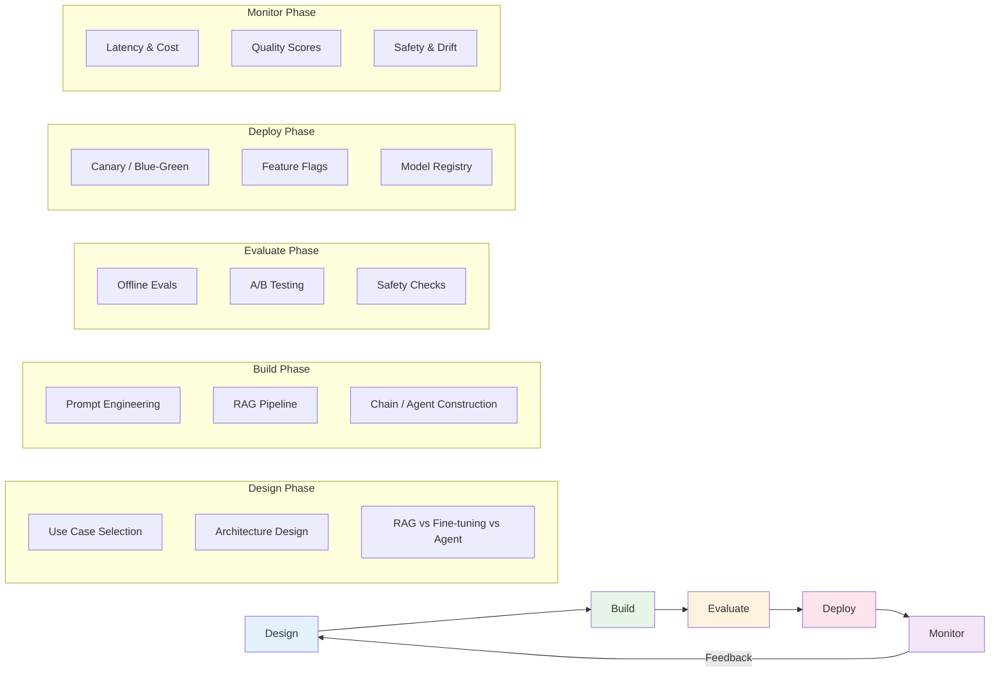
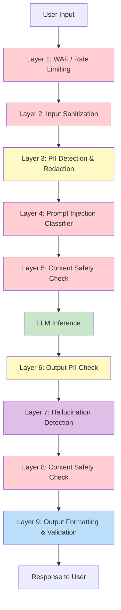
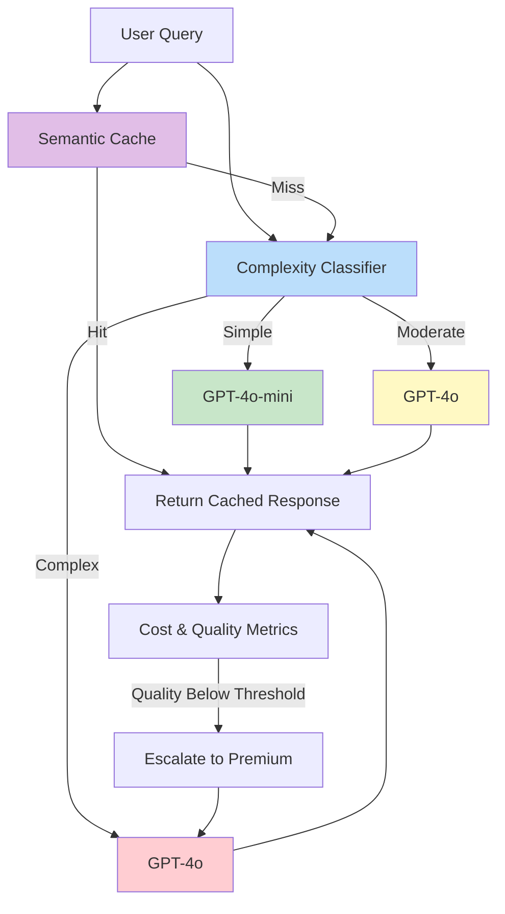

# Module 13: Diagrams — LLMOps

This directory contains text-based and Mermaid diagrams illustrating key concepts from Module 13.

---

## 1. LLMOps Lifecycle

### Mermaid Diagram



### ASCII Diagram

```
┌─────────────────────────────────────────────────────────────────────────────┐
│                          LLMOps LIFECYCLE                                    │
├─────────────────────────────────────────────────────────────────────────────┤
│                                                                              │
│  ┌──────────┐    ┌──────────┐    ┌──────────┐    ┌──────────┐    ┌────────┐│
│  │  DESIGN  │───▶│  BUILD   │───▶│ EVALUATE │───▶│  DEPLOY  │───▶│ MONITOR││
│  │          │    │          │    │          │    │          │    │        ││
│  │• Use case│    │• Prompt  │    │• Offline │    │• Canary  │    │• Latency││
│  │  select │    │  eng.    │    │  evals   │    │• Blue-   │    │• Cost  ││
│  │• Arch.  │    │• RAG     │    │• A/B test│    │  green   │    │• Quality││
│  │  design │    │  pipeline│    │• Safety  │    │• Feature │    │• Safety││
│  │• Model  │    │• Chains/ │    │  checks  │    │  flags   │    │• Drift ││
│  │  select │    │  agents  │    │          │    │          │    │        ││
│  └──────────┘    └──────────┘    └──────────┘    └──────────┘    └───┬────┘│
│       ▲                                                            │      │
│       └────────────────────── FEEDBACK LOOP ───────────────────────┘      │
│                                                                              │
└─────────────────────────────────────────────────────────────────────────────┘
```

---

## 2. LLMOps vs MLOps Comparison

### ASCII Diagram

```
┌─────────────────────────────────────┬─────────────────────────────────────┐
│              MLOps                  │              LLMOps                 │
├─────────────────────────────────────┼─────────────────────────────────────┤
│                                     │                                     │
│  Custom-trained models              │  Pre-trained foundation models      │
│         │                           │         │                           │
│         ▼                           │         ▼                           │
│  ┌─────────────────┐                │  ┌─────────────────┐                │
│  │ Training Pipeline│               │  │ Prompt Templates │               │
│  │ (PyTorch, TF)   │               │  │ Chains, Agents   │               │
│  └────────┬────────┘                │  └────────┬────────┘                │
│           │                          │           │                          │
│           ▼                          │           ▼                          │
│  ┌─────────────────┐                │  ┌─────────────────┐                │
│  │ Model Weights   │                │  │ RAG + Vector DB │                │
│  │ (ONNX, SavedM.) │                │  │ Fine-tuned LoRA │                │
│  └────────┬────────┘                │  └────────┬────────┘                │
│           │                          │           │                          │
│           ▼                          │           ▼                          │
│  ┌─────────────────┐                │  ┌─────────────────┐                │
│  │  Accuracy, F1   │                │  │ Hallucination   │                │
│  │  AUC, Precision │                │  │ Faithfulness    │                │
│  └─────────────────┘                │  │ Relevance       │                │
│                                     │  └─────────────────┘                │
│                                     │                                     │
│  MONITOR:                           │  MONITOR:                           │
│  • Data drift                       │  • Token usage                      │
│  • Prediction drift                 │  • Cost per query                   │
│  • Feature importance               │  • Latency P99                      │
│                                     │  • Safety scores                    │
└─────────────────────────────────────┴─────────────────────────────────────┘
```

---

## 3. Deployment Strategies

### Mermaid Diagram

```mermaid
graph TD
    subgraph Blue-Green
        LB1[Load Balancer] -->|100%| Blue[Blue - Current]
        LB1 -.->|0%| Green[Green - New]
        LB1 -.->|Switch| Green
    end

    subgraph Canary
        LB2[Load Balancer] -->|90%| Stable[Stable Version]
        LB2 -->|10%| Canary[Canary Version]
    end

    subgraph Shadow
        LB3[Load Balancer] -->|100%| Primary[Primary Version]
        LB3 -->|Mirror| ShadowV[Shadow Version]
        ShadowV -->|Drop| Void[Responses Discarded]
    end

    style Blue fill:#bbdefb
    style Green fill:#c8e6c9
    style Stable fill:#c8e6c9
    style Canary fill:#fff9c4
    style Primary fill:#c8e6c9
    style ShadowV fill:#e0e0e0
```

### ASCII Diagram

```
BLUE-GREEN DEPLOYMENT                CANARY DEPLOYMENT
┌──────────────────────┐             ┌──────────────────────┐
│     Load Balancer    │             │     Load Balancer    │
└──────────┬───────────┘             └──────────┬───────────┘
           │                                    │
     ┌─────┴─────┐                      ┌───────┴───────┐
     │           │                      │               │
┌────▼────┐ ┌────▼────┐          ┌─────▼─────┐  ┌──────▼──────┐
│  BLUE   │ │  GREEN  │          │  STABLE   │  │   CANARY    │
│ (v1.0)  │ │ (v2.0)  │          │   (90%)   │  │    (10%)    │
│ Active  │ │ Standby │          │           │  │             │
└─────────┘ └─────────┘          └───────────┘  └─────────────┘

Traffic: 100% → 0%                Traffic: 90% → 10%
Instant switch on success         Gradual increase if healthy


SHADOW DEPLOYMENT                  FEATURE FLAGS
┌──────────────────────┐          ┌──────────────────────┐
│     Load Balancer    │          │   Feature Flag Svc   │
└──────────┬───────────┘          └──────────┬───────────┘
           │                                 │
     ┌─────┴─────┐                    ┌──────┴──────┐
     │           │                    │             │
┌────▼────┐ ┌────▼────┐        ┌─────▼─────┐ ┌─────▼─────┐
│PRIMARY  │ │ SHADOW  │        │  FLAG ON  │ │  FLAG OFF │
│ 100%    │ │ Mirror  │        │ New Model │ │ Old Model │
│ Served  │ │ Dropped │        │  (gpt-4o) │ │(gpt-4o-mi)│
└─────────┘ └─────────┘        └───────────┘ └───────────┘
```

---

## 4. Monitoring Stack Architecture

### Mermaid Diagram

```mermaid
graph TB
    App[LLM Application] -->|Traces| OTel[OpenTelemetry Collector]
    App -->|Metrics| Prom[Prometheus]
    App -->|Logs| LogA[Log Analytics]

    OTel -->|Export| Tempo[Tempo / Jaeger]
    Prom --> Grafana[Grafana Dashboard]
    Tempo --> Grafana
    LogA --> Grafana

    Grafana --> Alert[Alert Manager]
    Alert --> Slack[Slack Notifications]
    Alert --> Pager[PagerDuty]

    subgraph LLM Metrics
        Token[Token Usage]
        Cost[Cost per Request]
        Lat[Latency P50/P99]
        Hall[Hallucination Rate]
    end

    Prom --> LLM Metrics

    style App fill:#e3f2fd
    style Grafana fill:#fff3e0
    style Alert fill:#ffebee
```

### ASCII Diagram

```
┌─────────────────────────────────────────────────────────────────────────┐
│                         MONITORING STACK                                 │
├─────────────────────────────────────────────────────────────────────────┤
│                                                                          │
│  ┌─────────────────┐                                                     │
│  │ LLM Application │                                                     │
│  │                 │                                                     │
│  │ ┌─────────────┐ │    ┌──────────────┐    ┌──────────────────┐        │
│  │ │ OpenTelemetry│─┼───▶│   Traces     │───▶│  Tempo / Jaeger  │        │
│  │ └─────────────┘ │    └──────────────┘    └──────────────────┘        │
│  │ ┌─────────────┐ │    ┌──────────────┐    ┌──────────────────┐        │
│  │ │ Prometheus  │─┼───▶│   Metrics    │───▶│   Prometheus DB  │        │
│  │ └─────────────┘ │    └──────────────┘    └──────────────────┘        │
│  │ ┌─────────────┐ │    ┌──────────────┐    ┌──────────────────┐        │
│  │ │ App Insights│─┼───▶│    Logs      │───▶│  Log Analytics   │        │
│  │ └─────────────┘ │    └──────────────┘    └──────────────────┘        │
│  └─────────────────┘                                                     │
│                                                                          │
│                         ┌──────────────────┐                             │
│                         │  Grafana          │                             │
│                         │  ┌──────────────┐ │                             │
│                         │  │ Dashboards   │ │                             │
│                         │  │ • Latency    │ │    ┌──────────────┐        │
│                         │  │ • Cost       │ │───▶│ Alert Manager│        │
│                         │  │ • Tokens     │ │    └──────┬───────┘        │
│                         │  │ • Quality    │ │           │                 │
│                         │  │ • Safety     │ │    ┌──────┴───────┐        │
│                         │  └──────────────┘ │    │  Slack /     │        │
│                         └──────────────────┘    │  PagerDuty   │        │
│                                                 └──────────────┘        │
│                                                                          │
│  LLM-SPECIFIC METRICS:                                                   │
│  ┌────────────┐ ┌────────────┐ ┌────────────┐ ┌───────────────────┐    │
│  │ Token Usage│ │ Cost/Query │ │Latency P99 │ │ Hallucination Rate│    │
│  │ (histogram)│ │ (counter)  │ │(histogram) │ │    (gauge)        │    │
│  └────────────┘ └────────────┘ └────────────┘ └───────────────────┘    │
└─────────────────────────────────────────────────────────────────────────┘
```

---

## 5. Security Defense Layers

### Mermaid Diagram



### ASCII Diagram

```
┌─────────────────────────────────────────────────────────────────────────┐
│                    SECURITY DEFENSE-IN-DEPTH                             │
├─────────────────────────────────────────────────────────────────────────┤
│                                                                          │
│  INPUT PIPELINE                                                         │
│  ─────────────                                                          │
│                                                                          │
│  User Input                                                             │
│      │                                                                   │
│      ▼                                                                   │
│  ┌──────────────────────────────┐                                       │
│  │ L1: WAF / Rate Limiting      │  Block abusive traffic                │
│  └──────────────┬───────────────┘                                       │
│                 ▼                                                        │
│  ┌──────────────────────────────┐                                       │
│  │ L2: Input Sanitization       │  Detect known injection patterns      │
│  └──────────────┬───────────────┘                                       │
│                 ▼                                                        │
│  ┌──────────────────────────────┐                                       │
│  │ L3: PII Detection            │  Redact emails, SSNs, phones          │
│  │     & Redaction              │                                       │
│  └──────────────┬───────────────┘                                       │
│                 ▼                                                        │
│  ┌──────────────────────────────┐                                       │
│  │ L4: Injection Classifier     │  ML-based prompt injection detection  │
│  └──────────────┬───────────────┘                                       │
│                 ▼                                                        │
│  ┌──────────────────────────────┐                                       │
│  │ L5: Content Safety Check     │  Hate, violence, sexual content       │
│  └──────────────┬───────────────┘                                       │
│                 │                                                        │
│                 ▼                                                        │
│  ┌──────────────────────────────┐                                       │
│  │      LLM INFERENCE           │  Azure OpenAI / Self-hosted           │
│  └──────────────┬───────────────┘                                       │
│                 │                                                        │
│  OUTPUT PIPELINE                                                        │
│  ──────────────                                                         │
│                 ▼                                                        │
│  ┌──────────────────────────────┐                                       │
│  │ L6: Output PII Check         │  Verify no PII leaked in response     │
│  └──────────────┬───────────────┘                                       │
│                 ▼                                                        │
│  ┌──────────────────────────────┐                                       │
│  │ L7: Hallucination Detection  │  Faithfulness check against context   │
│  └──────────────┬───────────────┘                                       │
│                 ▼                                                        │
│  ┌──────────────────────────────┐                                       │
│  │ L8: Content Safety Check     │  Verify output safety                 │
│  └──────────────┬───────────────┘                                       │
│                 ▼                                                        │
│  ┌──────────────────────────────┐                                       │
│  │ L9: Output Validation        │  Format, schema, completeness         │
│  └──────────────┬───────────────┘                                       │
│                 │                                                        │
│                 ▼                                                        │
│          Response to User                                               │
│                                                                          │
└─────────────────────────────────────────────────────────────────────────┘
```

---

## 6. Cost Optimization Architecture

### Mermaid Diagram



### ASCII Diagram

```
┌─────────────────────────────────────────────────────────────────────────┐
│                    COST OPTIMIZATION ARCHITECTURE                        │
├─────────────────────────────────────────────────────────────────────────┤
│                                                                          │
│  User Query                                                             │
│      │                                                                   │
│      ▼                                                                   │
│  ┌──────────────────┐                                                   │
│  │ Semantic Cache   │──── Cache Hit ────▶ Return Cached (Cost: $0)     │
│  │ (Redis + Embed.) │                                                   │
│  └────────┬─────────┘                                                   │
│           │ Cache Miss                                                   │
│           ▼                                                              │
│  ┌──────────────────┐                                                   │
│  │ Complexity       │                                                   │
│  │ Classifier       │                                                   │
│  │ (GPT-4o-mini)    │                                                   │
│  └───┬────┬────┬────┘                                                   │
│      │    │    │                                                         │
│      │    │    └───────────────┐                                         │
│      │    │                   │                                         │
│      ▼    ▼                   ▼                                         │
│  ┌──────┐ ┌──────────┐ ┌───────────┐                                   │
│  │Simple│ │Moderate  │ │ Complex   │                                   │
│  │      │ │          │ │           │                                   │
│  │$0.15 │ │$2.50     │ │$2.50      │                                   │
│  │/1M   │ │/1M in    │ │/1M in     │                                   │
│  │tokens│ │tokens    │ │tokens     │                                   │
│  └──┬───┘ └────┬─────┘ └─────┬─────┘                                   │
│     │          │             │                                          │
│     ▼          ▼             ▼                                          │
│  ┌──────────────────────────────────┐                                   │
│  │         Response                 │                                   │
│  └──────────────┬───────────────────┘                                   │
│                 │                                                        │
│                 ▼                                                        │
│  ┌──────────────────────────────────┐                                   │
│  │     Quality Evaluation           │                                   │
│  │  ┌────────────────────────────┐  │                                   │
│  │  │ If quality < threshold:    │  │                                   │
│  │  │ ESCALATE to GPT-4o        │  │                                   │
│  │  └────────────────────────────┘  │                                   │
│  └──────────────────────────────────┘                                   │
│                                                                          │
│  SAVINGS SUMMARY:                                                       │
│  ┌──────────────────────────────────────────────────────────────┐       │
│  │  Simple queries (60%):  $0.15/M  vs  $2.50/M  = 94% saved   │       │
│  │  Moderate queries (25%): $2.50/M vs  $2.50/M  = same cost   │       │
│  │  Complex queries (15%): $2.50/M  vs  $2.50/M  = same cost   │       │
│  │  Cache hits (+15%):     $0.00    vs  $2.50/M  = 100% saved  │       │
│  │  ──────────────────────────────────────────────────────────  │       │
│  │  TOTAL SAVINGS: ~60-70% compared to all-GPT-4o               │       │
│  └──────────────────────────────────────────────────────────────┘       │
└─────────────────────────────────────────────────────────────────────────┘
```
