# Module 14: Production AI Projects — Diagrams

This directory contains ASCII and Mermaid diagrams for all four capstone projects.

---

## Table of Contents

- [1. Project Architecture Overview](#1-project-architecture-overview)
- [2. Book Recommender Pipeline](#2-book-recommender-pipeline)
- [3. Customer Support State Machine](#3-customer-support-state-machine)
- [4. Market Intelligence Agent Flow](#4-market-intelligence-agent-flow)
- [5. Multi-Agent Researcher Architecture](#5-multi-agent-researcher-architecture)
- [6. Azure Infrastructure Layout](#6-azure-infrastructure-layout)
- [7. Production Deployment Flow](#7-production-deployment-flow)

---

## 1. Project Architecture Overview

### ASCII Diagram

```
┌─────────────────────────────────────────────────────────────────────────────┐
│                      Production AI Projects — Architecture                   │
│                                                                              │
│  ┌─────────────────────────────────────────────────────────────────────┐    │
│  │                         Client Layer                                 │    │
│  │  ┌──────────┐  ┌──────────┐  ┌──────────┐  ┌──────────────────┐    │    │
│  │  │ Book Rec │  │ Support  │  │ Market   │  │ Multi-Agent      │    │    │
│  │  │ UI       │  │ Chat UI  │  │ Intel UI │  │ Research UI      │    │    │
│  │  │ (React)  │  │ (React)  │  │ (React)  │  │ (React)          │    │    │
│  │  └────┬─────┘  └────┬─────┘  └────┬─────┘  └────────┬─────────┘    │    │
│  └───────┼──────────────┼──────────────┼─────────────────┼──────────────┘    │
│          │              │              │                 │                   │
│  ┌───────▼──────────────▼──────────────▼─────────────────▼──────────────┐    │
│  │                         API Gateway                                   │    │
│  │  Azure API Management: Auth · Rate Limit · Routing · Caching         │    │
│  └────────────────────────────┬─────────────────────────────────────────┘    │
│                               │                                              │
│  ┌────────────────────────────▼─────────────────────────────────────────┐    │
│  │                      Application Layer                                │    │
│  │  ┌─────────────────┐ ┌──────────────┐ ┌──────────────────────────┐   │    │
│  │  │ Book Recommender│ │ Support Eng. │ │ Market Intelligence      │   │    │
│  │  │ FastAPI         │ │ FastAPI +    │ │ + Multi-Agent Researcher │   │    │
│  │  │ (AI Search)     │ │ LangGraph    │ │ (CrewAI + LangChain)     │   │    │
│  │  └─────────────────┘ └──────────────┘ └──────────────────────────┘   │    │
│  │                       Azure Container Apps (Auto-scaling)             │    │
│  └────────────────────────────┬─────────────────────────────────────────┘    │
│                               │                                              │
│  ┌────────────────────────────▼─────────────────────────────────────────┐    │
│  │                         Data Layer                                    │    │
│  │  ┌────────────┐ ┌────────────┐ ┌────────────┐ ┌──────────────────┐   │    │
│  │  │ Azure AI   │ │ Cosmos DB  │ │ Blob Store │ │ Azure OpenAI     │   │    │
│  │  │ Search     │ │ (Sessions, │ │ (Raw docs, │ │ (GPT-4o,         │   │    │
│  │  │ (Vectors)  │ │  Memory)   │ │  reports)  │ │  Embeddings)     │   │    │
│  │  └────────────┘ └────────────┘ └────────────┘ └──────────────────┘   │    │
│  │  ┌────────────┐ ┌────────────┐                                       │    │
│  │  │ Redis Cache│ │ Key Vault  │                                       │    │
│  │  │ (Hot data) │ │ (Secrets)  │                                       │    │
│  │  └────────────┘ └────────────┘                                       │    │
│  └───────────────────────────────────────────────────────────────────────┘    │
│                                                                               │
│  ┌───────────────────────────────────────────────────────────────────────┐    │
│  │                      Observability                                     │    │
│  │  Azure Monitor · Application Insights · Log Analytics · Dashboards    │    │
│  └───────────────────────────────────────────────────────────────────────┘    │
└───────────────────────────────────────────────────────────────────────────────┘
```

### Mermaid Diagram

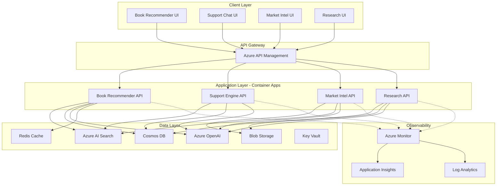

---

## 2. Book Recommender Pipeline

### ASCII Diagram

```
┌────────────────────────────────────────────────────────────────────────────┐
│                        Book Recommender Pipeline                            │
│                                                                             │
│  User Query                                                                 │
│     │                                                                       │
│     ▼                                                                       │
│  ┌─────────────────┐                                                        │
│  │  Query Analyzer │  ← GPT-4o-mini: Understand intent, extract filters    │
│  │  (LLM)          │     (genre, author, year, mood)                        │
│  └────────┬────────┘                                                        │
│           │                                                                 │
│           ▼                                                                 │
│  ┌─────────────────┐                                                        │
│  │  Embedding      │  ← text-embedding-3-small: Convert query to vector     │
│  │  Generator      │                                                        │
│  └────────┬────────┘                                                        │
│           │                                                                 │
│           ▼                                                                 │
│  ┌─────────────────────────────────────────────────────────────────┐       │
│  │                    Azure AI Search                               │       │
│  │                                                                  │       │
│  │  ┌──────────────┐  ┌──────────────┐  ┌──────────────────────┐  │       │
│  │  │ Vector Search│  │ BM25 Search  │  │ Semantic Ranking     │  │       │
│  │  │ (1536-dim)   │  │ (Keywords)   │  │ (Cross-encoder)      │  │       │
│  │  └──────┬───────┘  └──────┬───────┘  └──────────┬───────────┘  │       │
│  │         │                 │                     │              │       │
│  │         └─────────────────┼─────────────────────┘              │       │
│  │                           ▼                                    │       │
│  │              ┌─────────────────────────┐                       │       │
│  │              │  Reciprocal Rank Fusion │                       │       │
│  │              │  (Combined scoring)     │                       │       │
│  │              └────────────┬────────────┘                       │       │
│  └───────────────────────────┼────────────────────────────────────┘       │
│                              │                                             │
│                              ▼                                             │
│  ┌─────────────────────────────────────────────────────────────────┐      │
│  │                    Re-Ranking Layer                              │      │
│  │                                                                  │      │
│  │  Base Score × Genre Boost × Rating Boost × Diversity Factor     │      │
│  │                                                                  │      │
│  │  Input: 20 candidates  →  Output: Top 5 personalized results    │      │
│  └────────────────────────────┬────────────────────────────────────┘      │
│                               │                                           │
│                               ▼                                           │
│  ┌─────────────────────────────────────────────────────────────────┐      │
│  │              LLM Explanation Generator                           │      │
│  │                                                                  │      │
│  │  For each book: "Based on your interest in [X], you'll like     │      │
│  │  this because [Y]. It shares [Z] with books you've enjoyed."    │      │
│  └────────────────────────────┬────────────────────────────────────┘      │
│                               │                                           │
│                               ▼                                           │
│  ┌─────────────────────────────────────────────────────────────────┐      │
│  │                    Response Assembly                             │      │
│  │                                                                  │      │
│  │  [Book Title, Author, Cover, Score, Explanation, Buy Link] × 5  │      │
│  └─────────────────────────────────────────────────────────────────┘      │
└────────────────────────────────────────────────────────────────────────────┘
```

### Mermaid Diagram

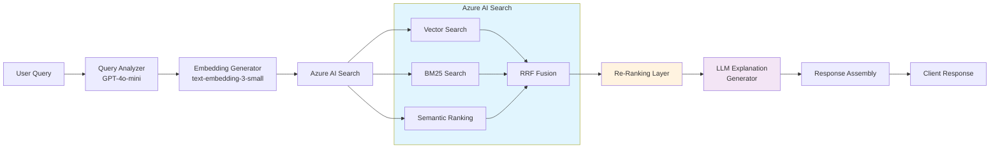

---

## 3. Customer Support State Machine

### ASCII Diagram

```
┌─────────────────────────────────────────────────────────────────────────────┐
│                   Customer Support Engine — LangGraph State Machine          │
│                                                                              │
│                               ┌─────────┐                                    │
│                          ┌───▶│  START  │                                    │
│                          │    └────┬────┘                                    │
│                          │         │                                         │
│                          │         ▼                                         │
│                          │    ┌─────────────────┐                            │
│                          │    │   Intent         │                            │
│                          │    │   Classifier     │                            │
│                          │    │  (GPT-4o-mini)   │                            │
│                          │    └────────┬─────────┘                            │
│                          │         │                                         │
│                          │    ┌──────┴──────┬───────────┐                    │
│                          │    ▼             ▼           ▼                    │
│                          │ ┌─────┐    ┌──────────┐ ┌─────────┐             │
│                          │ │ KB  │    │ Account  │ │Escalate │             │
│                          │ │Retr.│    │ Lookup   │ │ (Human) │             │
│                          │ │     │    │          │ │         │             │
│                          │ └──┬──┘    └────┬─────┘ └────┬────┘             │
│                          │    │            │            │                   │
│                          │    └────────────┼────────────┘                   │
│                          │         │                                         │
│                          │         ▼                                         │
│                          │    ┌─────────────────┐                            │
│                          │    │   Resolution     │                            │
│                          │    │   Reasoner       │                            │
│                          │    │  (GPT-4o + ctx)  │                            │
│                          │    └────────┬─────────┘                            │
│                          │         │                                         │
│                          │         ▼                                         │
│                          │    ┌─────────────────┐                            │
│                          │    │  Stream Response │                            │
│                          │    │  (WebSocket)     │                            │
│                          │    └────────┬─────────┘                            │
│                          │         │                                         │
│                          └─────────┘  (loop for multi-turn)                  │
│                               ┌────┴────┐                                    │
│                               │   END   │                                    │
│                               └─────────┘                                    │
│                                                                              │
│  State Schema:                                                                │
│  ┌─────────────────────────────────────────────────────────────────────┐     │
│  │  messages: list[Message]  (accumulated conversation)                │     │
│  │  intent: str                (billing, technical, account, etc.)     │     │
│  │  kb_results: list[Doc]      (retrieved knowledge articles)          │     │
│  │  account_info: dict         (user account data)                     │     │
│  │  resolution: str            (generated response)                    │     │
│  │  escalation_needed: bool    (flag for human handoff)                │     │
│  │  confidence: float          (classification confidence)             │     │
│  └─────────────────────────────────────────────────────────────────────┘     │
└─────────────────────────────────────────────────────────────────────────────┘
```

### Mermaid Diagram

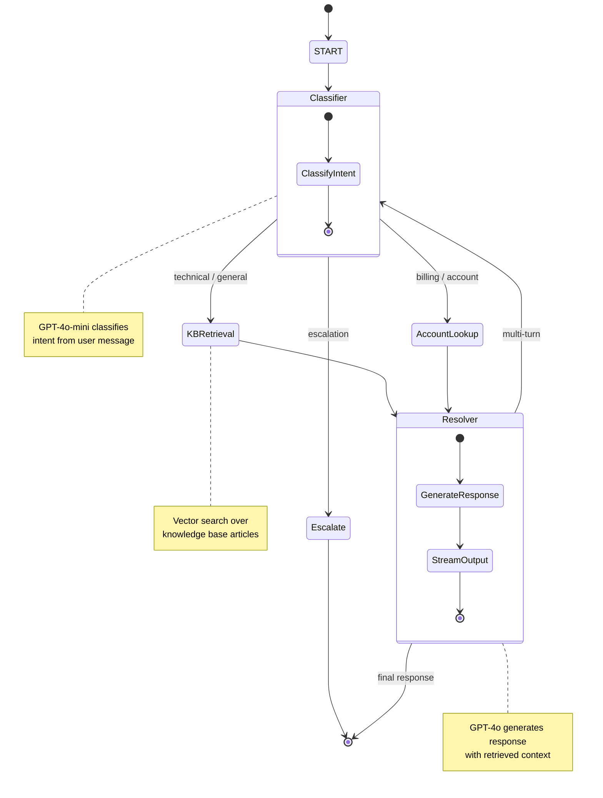

---

## 4. Market Intelligence Agent Flow

### ASCII Diagram

```
┌─────────────────────────────────────────────────────────────────────────────┐
│                   Market Intelligence Agent — Multi-Agent Flow               │
│                                                                              │
│  ┌─────────────────────────────────────────────────────────────────────┐    │
│  │                        Orchestrator Agent                            │    │
│  │                                                                      │    │
│  │  Input: "Analyze the AI chip market for Q1 2025"                    │    │
│  │  Output: Aggregated final report                                    │    │
│  └────────────────────────────┬────────────────────────────────────────┘    │
│                               │                                             │
│          ┌────────────────────┼────────────────────┐                        │
│          ▼                    ▼                    ▼                        │
│  ┌──────────────┐    ┌──────────────┐    ┌──────────────┐                 │
│  │  Retrieval   │    │  Reasoning   │    │  Validation  │                 │
│  │  Agent       │    │  Agent       │    │  Agent       │                 │
│  │              │    │              │    │              │                 │
│  │  Tools:      │    │  Analysis:   │    │  Checks:     │                 │
│  │  • Web Search│    │  • Trends    │    │  • Fact check│                 │
│  │  • RSS Feeds │    │  • Patterns  │    │  • Cross-ref │                 │
│  │  • SEC API   │    │  • Insights  │    │  • Confidence│                 │
│  │  • Playwright│    │  • Data pts  │    │  • Gap flag  │                 │
│  └──────┬───────┘    └──────┬───────┘    └──────┬───────┘                 │
│         │                   │                   │                          │
│         ▼                   ▼                   ▼                          │
│  ┌───────────────────────────────────────────────────────────────────┐    │
│  │                         Data Layer                                 │    │
│  │                                                                    │    │
│  │  ┌────────────┐  ┌────────────┐  ┌────────────┐  ┌────────────┐  │    │
│  │  │ Blob Store │  │ AI Search  │  │ Cosmos DB  │  │ Redis Cache│  │    │
│  │  │ Raw HTML,  │  │ Indexed    │  │ Reports &  │  │ Task Queue │  │    │
│  │  │ PDFs, CSV  │  │ Chunks     │  │ Metadata   │  │ & Results  │  │    │
│  │  └────────────┘  └────────────┘  └────────────┘  └────────────┘  │    │
│  └───────────────────────────────────────────────────────────────────┘    │
│                                                                              │
│  Pipeline Execution:                                                         │
│  ┌─────────┐   ┌─────────┐   ┌─────────┐   ┌─────────┐   ┌─────────┐      │
│  │ Phase 1 │──▶│ Phase 2 │──▶│ Phase 3 │──▶│ Phase 4 │──▶│ Phase 5 │      │
│  │ Retrieve│   │ Store   │   │ Analyze │   │ Validate│   │ Report  │      │
│  │ & Scrape│   │ & Index │   │ & Reason│   │ & Score │   │ & Deliver│     │
│  └─────────┘   └─────────┘   └─────────┘   └─────────┘   └─────────┘      │
└─────────────────────────────────────────────────────────────────────────────┘
```

### Mermaid Diagram

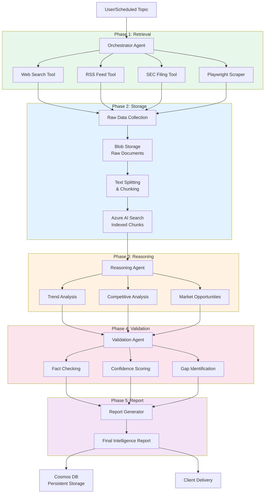

---

## 5. Multi-Agent Researcher Architecture

### ASCII Diagram

```
┌─────────────────────────────────────────────────────────────────────────────┐
│                    Multi-Agent Researcher — CrewAI Architecture              │
│                                                                              │
│  ┌─────────────────────────────────────────────────────────────────────┐    │
│  │                        CrewAI Crew                                   │    │
│  │                        Process: Sequential                           │    │
│  │                                                                      │    │
│  │  ┌──────────────┐    ┌──────────────┐    ┌──────────────┐           │    │
│  │  │  RESEARCHER  │───▶│    CRITIC    │───▶│    WRITER    │           │    │
│  │  │    Agent     │    │    Agent     │    │    Agent     │           │    │
│  │  │              │    │              │    │              │           │    │
│  │  │ Role:        │    │ Role:        │    │ Role:        │           │    │
│  │  │ Senior       │    │ Quality      │    │ Technical    │           │    │
│  │  │ Research     │    │ Reviewer     │    │ Writer       │           │    │
│  │  │ Analyst      │    │              │    │              │           │    │
│  │  │              │    │              │    │              │           │    │
│  │  │ Tools:       │    │ Tools:       │    │ Tools:       │           │    │
│  │  │ • SerperDev  │    │ • None       │    │ • None       │           │    │
│  │  │ • ScrapeWeb  │    │   (Analysis  │    │   (Writing   │           │    │
│  │  │              │    │    only)     │    │    only)     │           │    │
│  │  │ Goal:        │    │              │    │              │           │    │
│  │  │ Gather &     │    │ Goal:        │    │ Goal:        │           │    │
│  │  │ organize     │    │ Review &     │    │ Produce      │           │    │
│  │  │ findings     │    │ validate     │    │ polished     │           │    │
│  │  │              │    │              │    │ report       │           │    │
│  │  └──────────────┘    └──────────────┘    └──────────────┘           │    │
│  │        │                    │                    │                   │    │
│  │        └────────────────────┼────────────────────┘                   │    │
│  │                             ▼                                         │    │
│  │              ┌──────────────────────────────┐                         │    │
│  │              │    Shared Memory (Cosmos DB) │                         │    │
│  │              │                              │                         │    │
│  │              │  • Research findings         │                         │    │
│  │              │  • Critique notes            │                         │    │
│  │              │  • Draft versions            │                         │    │
│  │              │  • Conversation history      │                         │    │
│  │              │  • Source citations          │                         │    │
│  │              └──────────────────────────────┘                         │    │
│  └──────────────────────────────────────────────────────────────────────┘    │
│                                                                              │
│  External Sources:                                                           │
│  ┌────────────┐  ┌────────────┐  ┌────────────┐  ┌────────────────────┐    │
│  │ Serper API │  │ Arxiv API  │  │ News APIs  │  │ Custom Knowledge   │    │
│  │ (Web+News) │  │ (Papers)   │  │ (Reuters,  │  │ Base (Vector DB)   │    │
│  │            │  │            │  │  Bloomberg)│  │                    │    │
│  └────────────┘  └────────────┘  └────────────┘  └────────────────────┘    │
└─────────────────────────────────────────────────────────────────────────────┘
```

### Mermaid Diagram

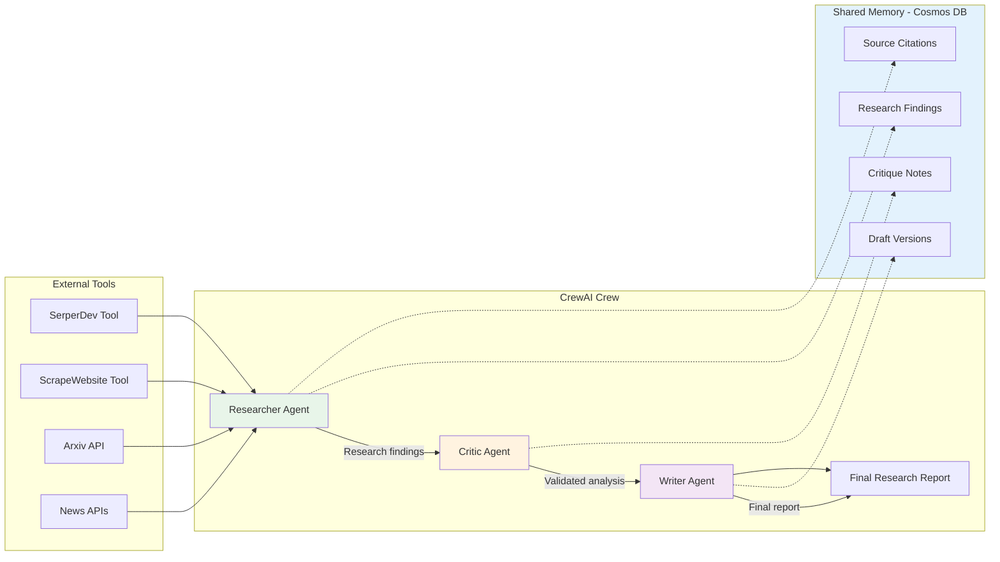

---

## 6. Azure Infrastructure Layout

### ASCII Diagram

```
┌─────────────────────────────────────────────────────────────────────────────┐
│                    Azure Infrastructure — Bicep IaC Layout                    │
│                                                                              │
│  Resource Group: rg-ai-capstone-{env}                                        │
│  ┌─────────────────────────────────────────────────────────────────────┐    │
│  │                        Networking                                    │    │
│  │  ┌─────────────────────────────────────────────────────────────┐    │    │
│  │  │  VNet: vnet-ai-capstone                                      │    │    │
│  │  │  ├── Subnet: snet-apps (Container Apps environment)         │    │    │
│  │  │  ├── Subnet: snet-services (Azure services)                 │    │    │
│  │  │  └── Subnet: snet-private (Private endpoints)               │    │    │
│  │  └─────────────────────────────────────────────────────────────┘    │    │
│  └─────────────────────────────────────────────────────────────────┘    │
│                                                                          │
│  ┌─────────────────────────────────────────────────────────────────┐    │
│  │                        AI Services                                │    │
│  │                                                                  │    │
│  │  ┌─────────────────────────┐  ┌─────────────────────────────┐   │    │
│  │  │ Azure OpenAI            │  │ Azure AI Search             │   │    │
│  │  │                         │  │                             │   │    │
│  │  │ Deployments:            │  │ SKU: Standard               │   │    │
│  │  │ • gpt-4o (10 TPM)       │  │ Partitions: 1               │   │    │
│  │  │ • gpt-4o-mini (30 TPM)  │  │ Replicas: 1                 │   │    │
│  │  │ • text-embedding-3-sm   │  │ Semantic: Enabled           │   │    │
│  │  │                         │  │ Vector: HNSW                │   │    │
│  │  └─────────────────────────┘  └─────────────────────────────┘   │    │
│  └─────────────────────────────────────────────────────────────────┘    │
│                                                                          │
│  ┌─────────────────────────────────────────────────────────────────┐    │
│  │                        Data Services                              │    │
│  │                                                                  │    │
│  │  ┌──────────────┐ ┌──────────────┐ ┌──────────────┐            │    │
│  │  │ Cosmos DB    │ │ Blob Storage │ │ Redis Cache  │            │    │
│  │  │              │ │              │ │              │            │    │
│  │  │ Serverless   │ │ Standard LRS │ │ Basic C0     │            │    │
│  │  │ Session      │ │ Containers:  │ │ Non-SSL: Off │            │    │
│  │  │ Consistency  │ │ - raw-docs   │ │ TLS 1.2      │            │    │
│  │  │              │ │ - reports    │ │              │            │    │
│  │  │ Databases:   │ │ - embeddings │              │            │    │
│  │  │ - agent-mem  │ │ - backups    │              │            │    │
│  │  │ - user-data  │ │              │              │            │    │
│  │  └──────────────┘ └──────────────┘ └──────────────┘            │    │
│  └─────────────────────────────────────────────────────────────────┘    │
│                                                                          │
│  ┌─────────────────────────────────────────────────────────────────┐    │
│  │                        Compute                                    │    │
│  │                                                                  │    │
│  │  ┌─────────────────────────────────────────────────────────┐    │    │
│  │  │  Azure Container Apps Environment                        │    │    │
│  │  │                                                          │    │    │
│  │  │  ┌─────────────┐ ┌─────────────┐ ┌───────────────────┐  │    │    │
│  │  │  │ book-rec-api│ │ support-api │ │ research-api      │  │    │    │
│  │  │  │ Min: 1      │ │ Min: 1      │ │ Min: 1            │  │    │    │
│  │  │  │ Max: 10     │ │ Max: 10     │ │ Max: 5            │  │    │    │
│  │  │  │ CPU: 1      │ │ CPU: 1      │ │ CPU: 2            │  │    │    │
│  │  │  │ Mem: 2Gi    │ │ Mem: 2Gi    │ │ Mem: 4Gi          │  │    │    │
│  │  │  │ Scale: HTTP │ │ Scale: HTTP │ │ Scale: HTTP       │  │    │    │
│  │  │  └─────────────┘ └─────────────┘ └───────────────────┘  │    │    │
│  │  └─────────────────────────────────────────────────────────┘    │    │
│  └─────────────────────────────────────────────────────────────────┘    │
│                                                                          │
│  ┌─────────────────────────────────────────────────────────────────┐    │
│  │                        Security & Observability                   │    │
│  │                                                                  │    │
│  │  ┌──────────────┐ ┌──────────────┐ ┌──────────────────────────┐ │    │
│  │  │ Key Vault    │ │ App Insights │ │ Log Analytics            │ │    │
│  │  │              │ │              │ │                          │ │    │
│  │  │ • OpenAI key │ │ • Traces     │ │ • Application logs       │ │    │
│  │  │ • Search key │ │ • Metrics    │ │ • Performance data       │ │    │
│  │  │ • Cosmos conn│ │ • Exceptions │ │ • Custom events          │ │    │
│  │  │ • Redis conn │ │ • Requests   │ │ • Security events        │ │    │
│  │  └──────────────┘ └──────────────┘ └──────────────────────────┘ │    │
│  └─────────────────────────────────────────────────────────────────┘    │
└────────────────────────────────────────────────────────────────────────────┘
```

### Mermaid Diagram

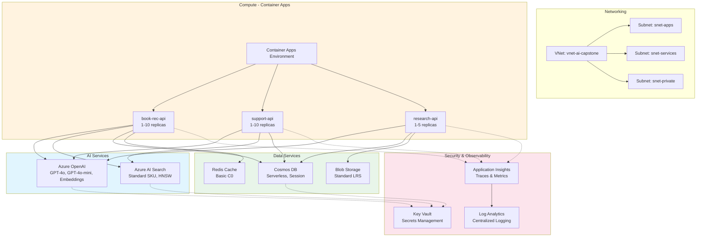

---

## 7. Production Deployment Flow

### ASCII Diagram

```
┌─────────────────────────────────────────────────────────────────────────────┐
│                    Production Deployment Flow — CI/CD Pipeline               │
│                                                                              │
│  ┌─────────┐    ┌──────────┐    ┌──────────┐    ┌──────────┐    ┌────────┐ │
│  │  Commit  │───▶│  Build   │───▶│   Test   │───▶│  Deploy  │───▶│ Monitor│ │
│  │  (Push)  │    │  & Scan  │    │  & Eval  │    │  (Canary)│    │ & Scale│ │
│  └─────────┘    └──────────┘    └──────────┘    └──────────┘    └────────┘ │
│                                                                              │
│  Stage 1: Commit                                                             │
│  ┌─────────────────────────────────────────────────────────────────────┐    │
│  │  Developer pushes to main branch                                    │    │
│  │  GitHub Actions workflow triggered                                  │    │
│  │  Paths filter: src/**, tests/**, Dockerfile, *.bicep               │    │
│  └─────────────────────────────────────────────────────────────────────┘    │
│                                                                              │
│  Stage 2: Build & Scan                                                       │
│  ┌─────────────────────────────────────────────────────────────────────┐    │
│  │  1. Checkout code                                                   │    │
│  │  2. Build Docker image                                              │    │
│  │  3. Push to Azure Container Registry                                │    │
│  │  4. Trivy vulnerability scan                                        │    │
│  │  5. Bicep template validation                                       │    │
│  └─────────────────────────────────────────────────────────────────────┘    │
│                                                                              │
│  Stage 3: Test & Evaluate                                                    │
│  ┌─────────────────────────────────────────────────────────────────────┐    │
│  │  1. Unit tests (pytest) - target: >80% coverage                     │    │
│  │  2. Integration tests (API endpoints, DB connections)               │    │
│  │  3. RAG evaluation (RAGAS metrics)                                  │    │
│  │  4. Load testing (Locust - concurrent users)                        │    │
│  │  5. Security scan (prompt injection, OWASP)                         │    │
│  └─────────────────────────────────────────────────────────────────────┘    │
│                                                                              │
│  Stage 4: Deploy (Canary)                                                    │
│  ┌─────────────────────────────────────────────────────────────────────┐    │
│  │  1. Deploy to staging environment                                   │    │
│  │  2. Run smoke tests                                                 │    │
│  │  3. Deploy canary revision (10% traffic)                            │    │
│  │  4. Monitor for 10 minutes:                                         │    │
│  │     - Error rate < 1%                                               │    │
│  │     - P99 latency < 2x baseline                                     │    │
│  │     - Token usage within budget                                     │    │
│  │  5. If healthy: Gradually increase to 25% → 50% → 100%             │    │
│  │  6. If unhealthy: Auto-rollback to previous revision                │    │
│  └─────────────────────────────────────────────────────────────────────┘    │
│                                                                              │
│  Stage 5: Monitor & Scale                                                    │
│  ┌─────────────────────────────────────────────────────────────────────┐    │
│  │  1. Azure Monitor dashboards                                        │    │
│  │  2. Application Insights traces                                     │    │
│  │  3. Custom LLM metrics (tokens, cost, hallucination rate)           │    │
│  │  4. Alert rules:                                                    │    │
│  │     - Error rate > 2% → Critical alert                              │    │
│  │     - P99 latency > 5s → Warning alert                              │    │
│  │     - Token budget > 80% → Warning alert                            │    │
│  │     - Hallucination rate > 5% → Critical alert                      │    │
│  │  5. Auto-scaling based on HTTP concurrent requests                  │    │
│  └─────────────────────────────────────────────────────────────────────┘    │
└─────────────────────────────────────────────────────────────────────────────┘
```

### Mermaid Diagram

```mermaid
flowchart LR
    subgraph Commit["Stage 1: Commit"]
        A[Developer Push\nto main]
    end

    subgraph Build["Stage 2: Build & Scan"]
        B[Docker Build]
        C[Push to ACR]
        D[Trivy Scan]
        E[Bicep Validate]
        B --> C --> D --> E
    end

    subgraph Test["Stage 3: Test & Evaluate"]
        F[Unit Tests\n>80% coverage]
        G[Integration Tests]
        H[RAG Evaluation\nRAGAS]
        I[Load Testing\nLocust]
        J[Security Scan]
        F --> G --> H --> I --> J
    end

    subgraph Deploy["Stage 4: Deploy Canary"]
        K[Deploy to Staging]
        L[Smoke Tests]
        M[Canary 10%\nMonitor 10min]
        N{Healthy?}
        O[Promote\n25% → 50% → 100%]
        P[Auto-Rollback]
        K --> L --> M --> N
        N -->|Yes| O
        N -->|No| P
    end

    subgraph Monitor["Stage 5: Monitor & Scale"]
        Q[Azure Monitor\nDashboards]
        R[App Insights\nTraces]
        S[Custom LLM\nMetrics]
        T[Alert Rules]
        U[Auto-Scaling]
        Q --> R --> S --> T --> U
    end

    A --> B
    E --> F
    J --> K
    O --> Q
    P -.->|Fix & Retry| B

    style Commit fill:#e8f5e9
    style Build fill:#e3f2fd
    style Test fill:#fff3e0
    style Deploy fill:#fce4ec
    style Monitor fill:#f3e5f5
```

---

## 8. Book Recommender — Embedding Index Structure

### ASCII — Azure AI Search Index Schema

```
┌─────────────────────────────────────────────────────────────────┐
│              Azure AI Search Index: books-index                 │
├─────────────────────────────────────────────────────────────────┤
│                                                                 │
│  Field              Type              Attributes                │
│  ─────────────────  ────────────────  ────────────────────────  │
│  book_id            String (key)      Key, retrievable          │
│  title              String            Searchable, filterable    │
│  author             String            Searchable, filterable    │
│  description        String            Searchable                │
│  genre              String            Filterable, facetable     │
│  publication_year   Int32             Filterable, sortable      │
│  avg_rating         Double            Filterable, sortable      │
│  description_vector Float[3072]       Searchable (HNSW)         │
│  cover_url          String            Retrievable               │
│  isbn               String            Filterable                │
│                                                                 │
│  Vector Config:                                                 │
│  ─────────────                                                │
│  Algorithm: HNSW (m=16, ef_construction=400)                   │
│  Metric: Cosine Similarity                                     │
│  Profile: hnsw-profile                                         │
│                                                                 │
│  Semantic Config:                                               │
│  ──────────────                                               │
│  Configuration: book-config                                    │
│  Title Field: title                                            │
│  Content Fields: description                                   │
│  Keywords Fields: genre, author                                │
│                                                                 │
└─────────────────────────────────────────────────────────────────┘
```

### Mermaid — Re-Ranking Flow

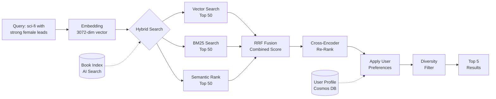

---

## 9. Customer Support — WebSocket Message Flow

### ASCII — Real-Time Streaming Sequence

```
┌──────────────┐                    ┌──────────────┐                    ┌──────────────┐
│   React      │                    │   FastAPI    │                    │   LangGraph  │
│   Frontend   │                    │   WebSocket  │                    │   Engine     │
│              │                    │   Server     │                    │              │
└──────┬───────┘                    └──────┬───────┘                    └──────┬───────┘
       │                                   │                                   │
       │  ── CONNECT /ws/session-123 ──▶  │                                   │
       │  ◀─────── 101 Switching ──────── │                                   │
       │                                   │                                   │
       │  ── {"type":"user_message", ──▶  │                                   │
       │     "content":"My order is..."}   │                                   │
       │                                   │  ── astream_events(config) ──▶   │
       │                                   │                                   │
       │                                   │  ◀── on_chat_model_stream ────── │
       │                                   │      (token chunk)                │
       │  ◀── {"type":"chunk", ────────── │                                   │
       │     "content":"I understand"}     │                                   │
       │                                   │                                   │
       │                                   │  ◀── on_chat_model_stream ────── │
       │  ◀── {"type":"chunk", ────────── │                                   │
       │     "content":" your order..."}   │                                   │
       │                                   │                                   │
       │     ... (streaming continues) ... │                                   │
       │                                   │                                   │
       │                                   │  ◀── on_chain_end ────────────── │
       │                                   │      (final state)                │
       │  ◀── {"type":"complete", ─────── │                                   │
       │     "intent":"billing",           │                                   │
       │     "escalated":false}            │                                   │
       │                                   │                                   │
```

### Mermaid — Support Conversation State Transitions

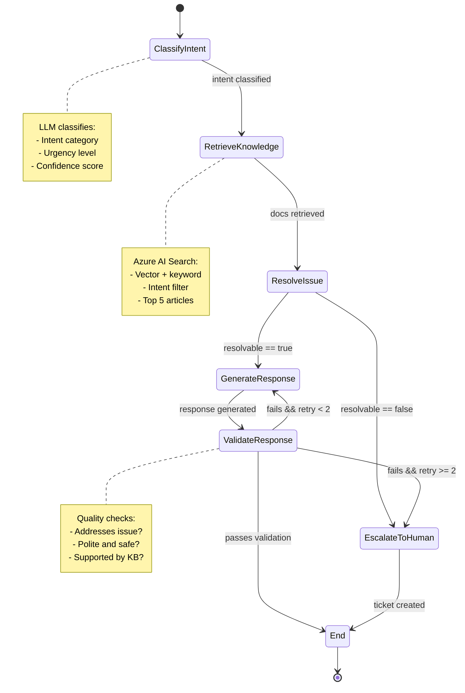

---

## 10. Market Intelligence — Map-Reduce Summarization

### ASCII — Summarization Pipeline

```
┌─────────────────────────────────────────────────────────────────────┐
│                    Map-Reduce Summarization                         │
├─────────────────────────────────────────────────────────────────────┤
│                                                                     │
│  Source Document (50,000 tokens)                                    │
│       │                                                             │
│       ▼                                                             │
│  ┌─────────────────────────────────────────────────────────────┐   │
│  │              Text Splitter (RecursiveCharacter)              │   │
│  │  Chunk size: 4000 tokens, Overlap: 200 tokens               │   │
│  └──────────────────────────┬──────────────────────────────────┘   │
│                             │                                       │
│           ┌─────────────────┼─────────────────┐                    │
│           ▼                 ▼                 ▼                    │
│     ┌───────────┐     ┌───────────┐     ┌───────────┐             │
│     │  Chunk 1  │     │  Chunk 2  │     │  Chunk N  │   (13 chunks)│
│     │  (4000 t) │     │  (4000 t) │     │  (2000 t) │             │
│     └─────┬─────┘     └─────┬─────┘     └─────┬─────┘             │
│           │                 │                 │                     │
│           ▼                 ▼                 ▼                     │
│  ┌─────────────────────────────────────────────────────────────┐   │
│  │                    MAP PHASE                                 │   │
│  │  LLM: "Write a detailed summary of the following..."        │   │
│  │                                                              │   │
│  │  Summary 1 ◀── Chunk 1    Summary 2 ◀── Chunk 2             │   │
│  │  ...                        ...                              │   │
│  │  Summary 13 ◀── Chunk 13                                    │   │
│  └──────────────────────────┬──────────────────────────────────┘   │
│                             │                                       │
│                             ▼                                       │
│  ┌─────────────────────────────────────────────────────────────┐   │
│  │                    REDUCE PHASE                              │   │
│  │  LLM: "Write a comprehensive summary combining these..."    │   │
│  │                                                              │   │
│  │  Input: Summary 1 + Summary 2 + ... + Summary 13            │   │
│  │  Output: Consolidated market intelligence summary            │   │
│  └─────────────────────────────────────────────────────────────┘   │
│                                                                     │
└─────────────────────────────────────────────────────────────────────┘
```

### Mermaid — Market Intelligence Sequence

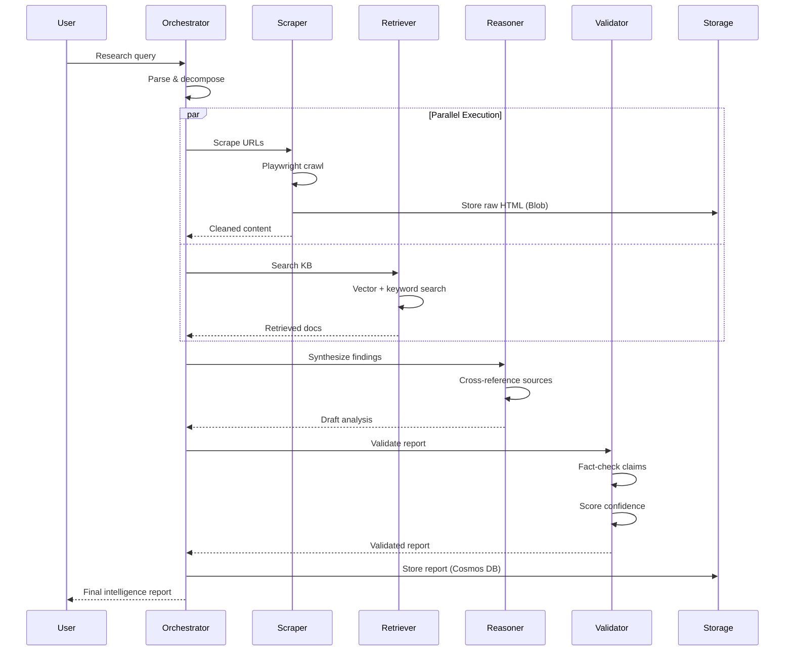

---

## 11. Multi-Agent Researcher — Shared Memory Architecture

### ASCII — Cosmos DB Memory Containers

```
┌─────────────────────────────────────────────────────────────────────┐
│              Cosmos DB Shared Memory — Multi-Agent                  │
├─────────────────────────────────────────────────────────────────────┤
│                                                                     │
│  Database: CrewMemory                                               │
│  ┌─────────────────────────────────────────────────────────────┐   │
│  │  Container: artifacts (partition: /research_id)             │   │
│  │  ─────────────────────────────────────────────────────────  │   │
│  │  {                                                          │   │
│  │    "id": "research-001-researcher-2026-04-01T10:00:00",     │   │
│  │    "research_id": "research-001",                           │   │
│  │    "agent": "researcher",                                   │   │
│  │    "content": "<markdown findings...>",                     │   │
│  │    "metadata": { "source_count": 15, "confidence": 0.85 },  │   │
│  │    "created_at": "2026-04-01T10:00:00Z",                    │   │
│  │    "ttl": 604800  // 7 days                                 │   │
│  │  }                                                          │   │
│  └─────────────────────────────────────────────────────────────┘   │
│                                                                     │
│  ┌─────────────────────────────────────────────────────────────┐   │
│  │  Container: feedback (partition: /research_id)              │   │
│  │  ─────────────────────────────────────────────────────────  │   │
│  │  {                                                          │   │
│  │    "id": "fb-research-001-2026-04-01T10:05:00",             │   │
│  │    "research_id": "research-001",                           │   │
│  │    "from_agent": "critic",                                  │   │
│  │    "to_agent": "writer",                                    │   │
│  │    "feedback": "<review notes...>",                         │   │
│  │    "quality_score": 7.5,                                    │   │
│  │    "created_at": "2026-04-01T10:05:00Z"                     │   │
│  │  }                                                          │   │
│  └─────────────────────────────────────────────────────────────┘   │
│                                                                     │
│  ┌─────────────────────────────────────────────────────────────┐   │
│  │  Container: conversations (partition: /research_id)         │   │
│  │  ─────────────────────────────────────────────────────────  │   │
│  │  {                                                          │   │
│  │    "id": "conv-research-001-001",                           │   │
│  │    "research_id": "research-001",                           │   │
│  │    "agent": "researcher",                                   │   │
│  │    "message": "Searching for AI coding assistant trends...",│   │
│  │    "timestamp": "2026-04-01T10:00:01Z"                      │   │
│  │  }                                                          │   │
│  └─────────────────────────────────────────────────────────────┘   │
│                                                                     │
│  Change Feed: Real-time notifications when agents write to memory  │
│  Consistency: Session (read-your-writes within a research session) │
│                                                                     │
└─────────────────────────────────────────────────────────────────────┘
```

### Mermaid — Agent Collaboration with Memory

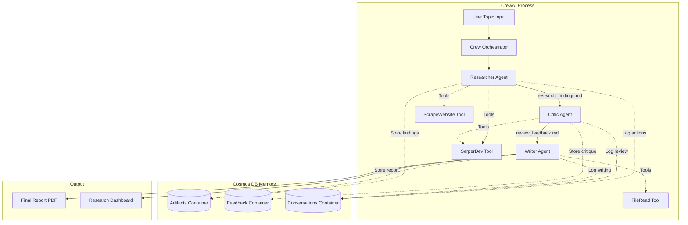

---

## 12. Azure Infrastructure — Bicep Template

### Mermaid — Infrastructure Dependencies

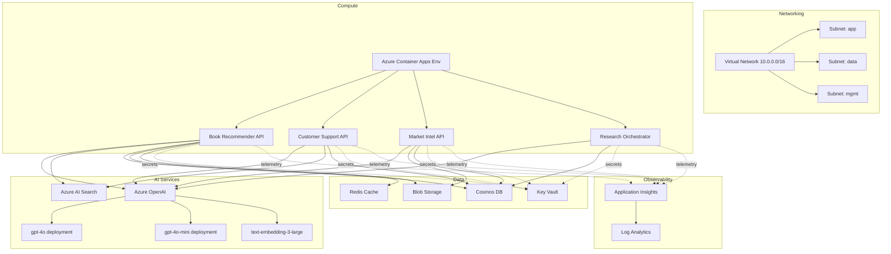

---

## 13. Production Deployment — Canary Timeline

### ASCII — Canary Deployment Timeline

```
┌─────────────────────────────────────────────────────────────────────┐
│                    Canary Deployment Timeline                       │
├─────────────────────────────────────────────────────────────────────┤
│                                                                     │
│  Time    Traffic Distribution          Action                       │
│  ──────  ────────────────────────────  ───────────────────────────  │
│  T+0     Production: 100%              Deploy new revision          │
│          Canary: 0%                    (no traffic yet)             │
│                                                                     │
│  T+1min  Production: 90%               Route 10% to canary          │
│          Canary: 10%                   Run smoke tests              │
│                                                                     │
│  T+5min  Production: 90%               Monitor metrics:             │
│          Canary: 10%                   - Error rate                 │
│                                        - p99 latency                │
│                                        - LLM quality scores         │
│                                        - Token usage rate           │
│                                                                     │
│  T+15min Production: 70%               If metrics OK:               │
│          Canary: 30%                   Increase canary to 30%       │
│                                                                     │
│  T+30min Production: 50%               Continue monitoring:         │
│          Canary: 50%                   - Compare canary vs prod     │
│                                        - Check for regressions      │
│                                                                     │
│  T+45min Production: 0%               If all metrics pass:         │
│          Canary: 100%                  Promote canary to 100%       │
│                                                                     │
│  T+46min New Production: 100%         Tag revision as stable       │
│          Old revision: retired         Clean up old revision        │
│                                                                     │
│  ─── ROLLBACK PATH ──────────────────────────────────────────────  │
│                                                                     │
│  Any     Canary: X%                  If error rate > 1% or         │
│  time    Production: (100-X)%        p99 > 5s or quality drop:     │
│                                        Immediately shift 100%      │
│                                        back to production          │
│                                        Alert on-call engineer       │
│                                                                     │
└─────────────────────────────────────────────────────────────────────┘
```

### Mermaid — Monitoring & Feedback Loop

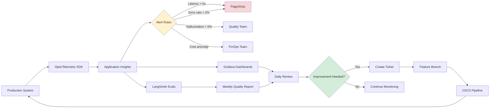

---

## Quick Reference — All Diagrams

| # | Diagram | Section | Type |
|---|---------|---------|------|
| 1 | Capstone Projects Ecosystem | 1 | ASCII + Mermaid |
| 2 | Book Recommender Pipeline | 2 | ASCII + Mermaid |
| 3 | Embedding Index Structure | 8 | ASCII |
| 4 | Re-Ranking Flow | 8 | Mermaid |
| 5 | Customer Support State Machine | 3 | ASCII + Mermaid |
| 6 | WebSocket Message Flow | 9 | ASCII |
| 7 | Support State Transitions | 9 | Mermaid |
| 8 | Market Intelligence Pipeline | 4 | ASCII + Mermaid |
| 9 | Map-Reduce Summarization | 10 | ASCII |
| 10 | Market Intelligence Sequence | 10 | Mermaid |
| 11 | Multi-Agent Researcher | 5 | ASCII + Mermaid |
| 12 | Shared Memory Architecture | 11 | ASCII |
| 13 | Agent Collaboration with Memory | 11 | Mermaid |
| 14 | Azure Infrastructure Layout | 6 | ASCII + Mermaid |
| 15 | Infrastructure Dependencies | 12 | Mermaid |
| 16 | CI/CD Pipeline | 7 | ASCII + Mermaid |
| 17 | Canary Deployment Timeline | 13 | ASCII |
| 18 | Monitoring Feedback Loop | 13 | Mermaid |

---

## 8. Book Recommender — Embedding Index Structure

### ASCII — Azure AI Search Index Schema

```
┌─────────────────────────────────────────────────────────────────┐
│              Azure AI Search Index: books-index                 │
├─────────────────────────────────────────────────────────────────┤
│                                                                 │
│  Field              Type              Attributes                │
│  ─────────────────  ────────────────  ────────────────────────  │
│  book_id            String (key)      Key, retrievable          │
│  title              String            Searchable, filterable    │
│  author             String            Searchable, filterable    │
│  description        String            Searchable                │
│  genre              String            Filterable, facetable     │
│  publication_year   Int32             Filterable, sortable      │
│  avg_rating         Double            Filterable, sortable      │
│  description_vector Float[3072]       Searchable (HNSW)         │
│  cover_url          String            Retrievable               │
│  isbn               String            Filterable                │
│                                                                 │
│  Vector Config:                                                 │
│  ─────────────                                                │
│  Algorithm: HNSW (m=16, ef_construction=400)                   │
│  Metric: Cosine Similarity                                     │
│  Profile: hnsw-profile                                         │
│                                                                 │
│  Semantic Config:                                               │
│  ──────────────                                               │
│  Configuration: book-config                                    │
│  Title Field: title                                            │
│  Content Fields: description                                   │
│  Keywords Fields: genre, author                                │
│                                                                 │
└─────────────────────────────────────────────────────────────────┘
```

### Mermaid — Re-Ranking Flow


---

## 9. Customer Support — WebSocket Message Flow

### ASCII — Real-Time Streaming Sequence

```
┌──────────────┐                    ┌──────────────┐                    ┌──────────────┐
│   React      │                    │   FastAPI    │                    │   LangGraph  │
│   Frontend   │                    │   WebSocket  │                    │   Engine     │
│              │                    │   Server     │                    │              │
└──────┬───────┘                    └──────┬───────┘                    └──────┬───────┘
       │                                   │                                   │
       │  ── CONNECT /ws/session-123 ──▶  │                                   │
       │  ◀─────── 101 Switching ──────── │                                   │
       │                                   │                                   │
       │  ── {"type":"user_message", ──▶  │                                   │
       │     "content":"My order is..."}   │                                   │
       │                                   │  ── astream_events(config) ──▶   │
       │                                   │                                   │
       │                                   │  ◀── on_chat_model_stream ────── │
       │                                   │      (token chunk)                │
       │  ◀── {"type":"chunk", ────────── │                                   │
       │     "content":"I understand"}     │                                   │
       │                                   │                                   │
       │                                   │  ◀── on_chat_model_stream ────── │
       │  ◀── {"type":"chunk", ────────── │                                   │
       │     "content":" your order..."}   │                                   │
       │                                   │                                   │
       │     ... (streaming continues) ... │                                   │
       │                                   │                                   │
       │                                   │  ◀── on_chain_end ────────────── │
       │                                   │      (final state)                │
       │  ◀── {"type":"complete", ─────── │                                   │
       │     "intent":"billing",           │                                   │
       │     "escalated":false}            │                                   │
       │                                   │                                   │
```

### Mermaid — Support Conversation State Transitions


---

## 10. Market Intelligence — Map-Reduce Summarization

### ASCII — Summarization Pipeline

```
┌─────────────────────────────────────────────────────────────────────┐
│                    Map-Reduce Summarization                         │
├─────────────────────────────────────────────────────────────────────┤
│                                                                     │
│  Source Document (50,000 tokens)                                    │
│       │                                                             │
│       ▼                                                             │
│  ┌─────────────────────────────────────────────────────────────┐   │
│  │              Text Splitter (RecursiveCharacter)              │   │
│  │  Chunk size: 4000 tokens, Overlap: 200 tokens               │   │
│  └──────────────────────────┬──────────────────────────────────┘   │
│                             │                                       │
│           ┌─────────────────┼─────────────────┐                    │
│           ▼                 ▼                 ▼                    │
│     ┌───────────┐     ┌───────────┐     ┌───────────┐             │
│     │  Chunk 1  │     │  Chunk 2  │     │  Chunk N  │   (13 chunks)│
│     │  (4000 t) │     │  (4000 t) │     │  (2000 t) │             │
│     └─────┬─────┘     └─────┬─────┘     └─────┬─────┘             │
│           │                 │                 │                     │
│           ▼                 ▼                 ▼                     │
│  ┌─────────────────────────────────────────────────────────────┐   │
│  │                    MAP PHASE                                 │   │
│  │  LLM: "Write a detailed summary of the following..."        │   │
│  │                                                              │   │
│  │  Summary 1 ◀── Chunk 1    Summary 2 ◀── Chunk 2             │   │
│  │  ...                        ...                              │   │
│  │  Summary 13 ◀── Chunk 13                                    │   │
│  └──────────────────────────┬──────────────────────────────────┘   │
│                             │                                       │
│                             ▼                                       │
│  ┌─────────────────────────────────────────────────────────────┐   │
│  │                    REDUCE PHASE                              │   │
│  │  LLM: "Write a comprehensive summary combining these..."    │   │
│  │                                                              │   │
│  │  Input: Summary 1 + Summary 2 + ... + Summary 13            │   │
│  │  Output: Consolidated market intelligence summary            │   │
│  └─────────────────────────────────────────────────────────────┘   │
│                                                                     │
└─────────────────────────────────────────────────────────────────────┘
```

### Mermaid — Market Intelligence Sequence


---

## 11. Multi-Agent Researcher — Shared Memory Architecture

### ASCII — Cosmos DB Memory Containers

```
┌─────────────────────────────────────────────────────────────────────┐
│              Cosmos DB Shared Memory — Multi-Agent                  │
├─────────────────────────────────────────────────────────────────────┤
│                                                                     │
│  Database: CrewMemory                                               │
│  ┌─────────────────────────────────────────────────────────────┐   │
│  │  Container: artifacts (partition: /research_id)             │   │
│  │  ─────────────────────────────────────────────────────────  │   │
│  │  {                                                          │   │
│  │    "id": "research-001-researcher-2026-04-01T10:00:00",     │   │
│  │    "research_id": "research-001",                           │   │
│  │    "agent": "researcher",                                   │   │
│  │    "content": "<markdown findings...>",                     │   │
│  │    "metadata": { "source_count": 15, "confidence": 0.85 },  │   │
│  │    "created_at": "2026-04-01T10:00:00Z",                    │   │
│  │    "ttl": 604800  // 7 days                                 │   │
│  │  }                                                          │   │
│  └─────────────────────────────────────────────────────────────┘   │
│                                                                     │
│  ┌─────────────────────────────────────────────────────────────┐   │
│  │  Container: feedback (partition: /research_id)              │   │
│  │  ─────────────────────────────────────────────────────────  │   │
│  │  {                                                          │   │
│  │    "id": "fb-research-001-2026-04-01T10:05:00",             │   │
│  │    "research_id": "research-001",                           │   │
│  │    "from_agent": "critic",                                  │   │
│  │    "to_agent": "writer",                                    │   │
│  │    "feedback": "<review notes...>",                         │   │
│  │    "quality_score": 7.5,                                    │   │
│  │    "created_at": "2026-04-01T10:05:00Z"                     │   │
│  │  }                                                          │   │
│  └─────────────────────────────────────────────────────────────┘   │
│                                                                     │
│  ┌─────────────────────────────────────────────────────────────┐   │
│  │  Container: conversations (partition: /research_id)         │   │
│  │  ─────────────────────────────────────────────────────────  │   │
│  │  {                                                          │   │
│  │    "id": "conv-research-001-001",                           │   │
│  │    "research_id": "research-001",                           │   │
│  │    "agent": "researcher",                                   │   │
│  │    "message": "Searching for AI coding assistant trends...",│   │
│  │    "timestamp": "2026-04-01T10:00:01Z"                      │   │
│  │  }                                                          │   │
│  └─────────────────────────────────────────────────────────────┘   │
│                                                                     │
│  Change Feed: Real-time notifications when agents write to memory  │
│  Consistency: Session (read-your-writes within a research session) │
│                                                                     │
└─────────────────────────────────────────────────────────────────────┘
```

### Mermaid — Agent Collaboration with Memory


---

## 12. Azure Infrastructure — Bicep Template

### Mermaid — Infrastructure Dependencies


---

## 13. Production Deployment — Canary Timeline

### ASCII — Canary Deployment Timeline

```
┌─────────────────────────────────────────────────────────────────────┐
│                    Canary Deployment Timeline                       │
├─────────────────────────────────────────────────────────────────────┤
│                                                                     │
│  Time    Traffic Distribution          Action                       │
│  ──────  ────────────────────────────  ───────────────────────────  │
│  T+0     Production: 100%              Deploy new revision          │
│          Canary: 0%                    (no traffic yet)             │
│                                                                     │
│  T+1min  Production: 90%               Route 10% to canary          │
│          Canary: 10%                   Run smoke tests              │
│                                                                     │
│  T+5min  Production: 90%               Monitor metrics:             │
│          Canary: 10%                   - Error rate                 │
│                                        - p99 latency                │
│                                        - LLM quality scores         │
│                                        - Token usage rate           │
│                                                                     │
│  T+15min Production: 70%               If metrics OK:               │
│          Canary: 30%                   Increase canary to 30%       │
│                                                                     │
│  T+30min Production: 50%               Continue monitoring:         │
│          Canary: 50%                   - Compare canary vs prod     │
│                                        - Check for regressions      │
│                                                                     │
│  T+45min Production: 0%               If all metrics pass:         │
│          Canary: 100%                  Promote canary to 100%       │
│                                                                     │
│  T+46min New Production: 100%         Tag revision as stable       │
│          Old revision: retired         Clean up old revision        │
│                                                                     │
│  ─── ROLLBACK PATH ──────────────────────────────────────────────  │
│                                                                     │
│  Any     Canary: X%                  If error rate > 1% or         │
│  time    Production: (100-X)%        p99 > 5s or quality drop:     │
│                                        Immediately shift 100%      │
│                                        back to production          │
│                                        Alert on-call engineer       │
│                                                                     │
└─────────────────────────────────────────────────────────────────────┘
```

### Mermaid — Monitoring & Feedback Loop


---

## Quick Reference — All Diagrams

| # | Diagram | Section | Type |
|---|---------|---------|------|
| 1 | Capstone Projects Ecosystem | 1 | ASCII + Mermaid |
| 2 | Book Recommender Pipeline | 2 | ASCII + Mermaid |
| 3 | Embedding Index Structure | 8 | ASCII |
| 4 | Re-Ranking Flow | 8 | Mermaid |
| 5 | Customer Support State Machine | 3 | ASCII + Mermaid |
| 6 | WebSocket Message Flow | 9 | ASCII |
| 7 | Support State Transitions | 9 | Mermaid |
| 8 | Market Intelligence Pipeline | 4 | ASCII + Mermaid |
| 9 | Map-Reduce Summarization | 10 | ASCII |
| 10 | Market Intelligence Sequence | 10 | Mermaid |
| 11 | Multi-Agent Researcher | 5 | ASCII + Mermaid |
| 12 | Shared Memory Architecture | 11 | ASCII |
| 13 | Agent Collaboration with Memory | 11 | Mermaid |
| 14 | Azure Infrastructure Layout | 6 | ASCII + Mermaid |
| 15 | Infrastructure Dependencies | 12 | Mermaid |
| 16 | CI/CD Pipeline | 7 | ASCII + Mermaid |
| 17 | Canary Deployment Timeline | 13 | ASCII |
| 18 | Monitoring Feedback Loop | 13 | Mermaid |

---

*End of Module 14 Diagrams*
