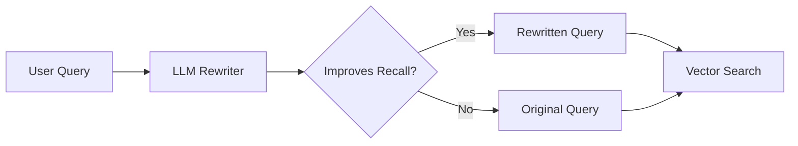
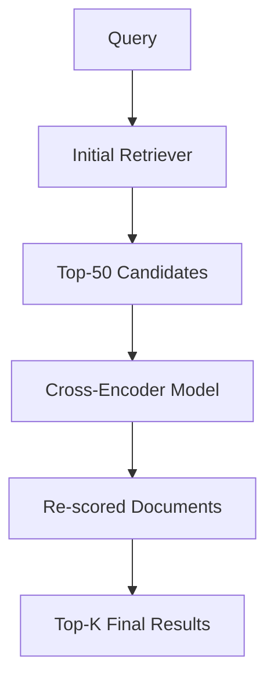
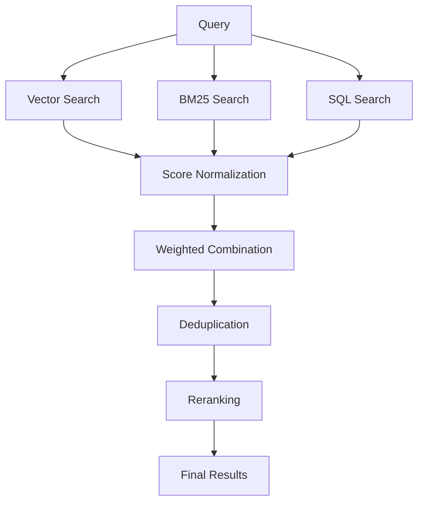
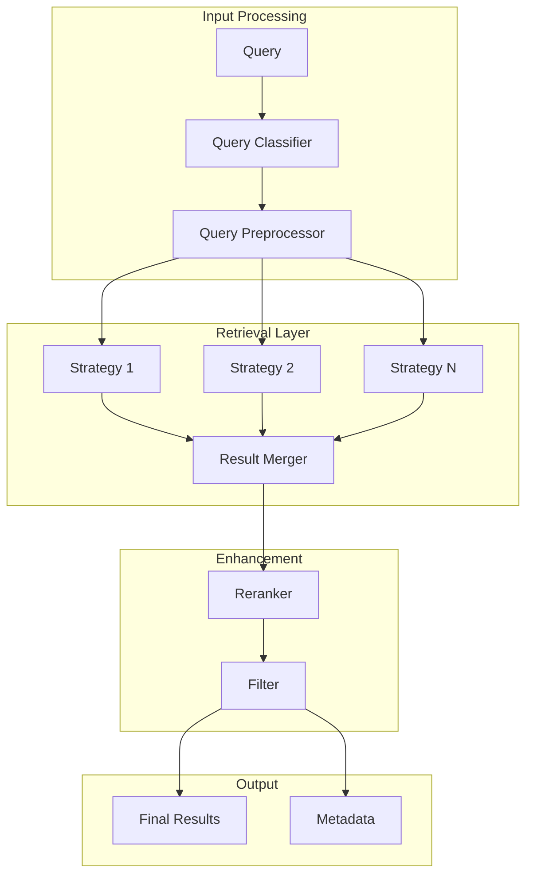

# Retrieval Techniques - Concepts

## Overview

Advanced retrieval strategies are critical for building high-quality RAG systems. This document covers query transformation, reranking, hybrid search, and production deployment considerations.

---

## 1. Query Rewriting

Transform user queries to improve retrieval accuracy.

### 1.1 LLM-Based Rewriting



**Implementation:**
```python
class LLMQueryRewriter:
    """Rewrite queries using LLM for better retrieval."""
    
    def __init__(self, llm):
        self.llm = llm
        self.rewrite_prompt = PromptTemplate(
            input_variables=["query"],
            template="""Rewrite the following query to improve retrieval 
            from a knowledge base. Focus on:
            1. Expanding abbreviations
            2. Using synonyms
            3. Adding relevant context
            4. Reformulating for search
            
            Original query: {query}
            
            Rewritten query:"""
        )
    
    def rewrite(self, query: str) -> str:
        prompt = self.rewrite_prompt.format(query=query)
        rewritten = self.llm.generate(prompt)
        return rewritten.strip()
```

### 1.2 HyDE (Hypothetical Document Embeddings)

Generate hypothetical documents and use them for retrieval:

```python
class HyDERetriever:
    """HyDE: Hypothetical Document Embeddings."""
    
    def __init__(self, llm, embedding_model, vector_store):
        self.llm = llm
        self.embedding_model = embedding_model
        self.vector_store = vector_store
    
    def retrieve(self, query: str, k: int = 5) -> List[Document]:
        # Step 1: Generate hypothetical document
        hypo_doc = self._generate_hypothetical(query)
        
        # Step 2: Embed the hypothetical document
        hypo_embedding = self.embedding_model.encode(hypo_doc)
        
        # Step 3: Search using hypothetical embedding
        results = self.vector_store.similarity_search(
            hypo_embedding, k=k
        )
        
        return results
    
    def _generate_hypothetical(self, query: str) -> str:
        prompt = f"""Generate a hypothetical document that would contain 
        the answer to this query: {query}
        
        Write as if you are explaining the topic comprehensively:"""
        
        return self.llm.generate(prompt)
```

### 1.3 Query Expansion with Synonyms

```python
class SynonymExpander:
    """Expand queries with synonyms and related terms."""
    
    def __init__(self):
        self.synonym_dict = {
            'buy': ['purchase', 'acquire', 'get'],
            'cheap': ['affordable', 'inexpensive', 'budget'],
            'fast': ['quick', 'rapid', 'speedy'],
            # Domain-specific synonyms can be added
        }
    
    def expand(self, query: str) -> List[str]:
        words = query.lower().split()
        expanded = [query]  # Keep original
        
        for word in words:
            if word in self.synonym_dict:
                for synonym in self.synonym_dict[word]:
                    expanded_query = query.replace(word, synonym)
                    expanded.append(expanded_query)
        
        return expanded
```

---

## 2. Reranking

Improve initial retrieval results through intelligent reranking.

### 2.1 Cross-Encoder Reranking



**Implementation:**
```python
from sentence_transformers import CrossEncoder

class CrossEncoderReranker:
    """Rerank results using a cross-encoder model."""
    
    def __init__(self, model_name: str = "cross-encoder/ms-marco-MiniLM-L-6-v2"):
        self.model = CrossEncoder(model_name)
    
    def rerank(self, query: str, 
               documents: List[str], 
               top_k: int = 10) -> List[Tuple[str, float]]:
        
        # Create query-document pairs
        pairs = [(query, doc) for doc in documents]
        
        # Get scores
        scores = self.model.predict(pairs)
        
        # Sort by score
        scored_docs = sorted(
            zip(documents, scores), 
            key=lambda x: x[1], 
            reverse=True
        )
        
        return scored_docs[:top_k]
```

### 2.2 MMR (Maximal Marginal Relevance)

Balance relevance with diversity:

```python
class MMRReranker:
    """Maximal Marginal Relevance for diverse results."""
    
    def __init__(self, embedding_model, lambda_mult: float = 0.5):
        """
        lambda_mult: Balance between relevance (0) and diversity (1)
        """
        self.embedding_model = embedding_model
        self.lambda_mult = lambda_mult
    
    def rerank(self, query: str, 
               documents: List[Document], 
               k: int = 5) -> List[Document]:
        
        query_embedding = self.embedding_model.encode(query)
        doc_embeddings = self.embedding_model.encode(
            [doc.page_content for doc in documents]
        )
        
        # Calculate relevance scores
        relevance_scores = cosine_similarity(
            [query_embedding], doc_embeddings
        )[0]
        
        selected = []
        selected_indices = []
        
        for _ in range(k):
            best_score = -float('inf')
            best_idx = None
            
            for idx, doc in enumerate(documents):
                if idx in selected_indices:
                    continue
                
                # Relevance component
                rel = relevance_scores[idx]
                
                # Diversity component (similarity to selected docs)
                if selected:
                    selected_embs = [doc_embeddings[i] for i in selected_indices]
                    div = max(
                        cosine_similarity([doc_embeddings[idx]], [emb])[0][0]
                        for emb in selected_embs
                    )
                else:
                    div = 0
                
                # MMR score
                mmr_score = self.lambda_mult * rel - (1 - self.lambda_mult) * div
                
                if mmr_score > best_score:
                    best_score = mmr_score
                    best_idx = idx
            
            selected.append(documents[best_idx])
            selected_indices.append(best_idx)
        
        return selected
```

---

## 3. Hybrid Search

Combine multiple search methods for robust retrieval.

### 3.1 Vector + Keyword Search

```python
class HybridSearch:
    """Combine vector and keyword search."""
    
    def __init__(self, vector_store, bm25_index, 
                 vector_weight: float = 0.5):
        self.vector_store = vector_store
        self.bm25_index = bm25_index
        self.vector_weight = vector_weight
    
    def search(self, query: str, k: int = 10) -> List[Document]:
        # Vector search
        vector_results = self.vector_store.similarity_search(
            query, k=k*2
        )
        
        # Keyword search
        keyword_results = self.bm25_index.search(query, k=k*2)
        
        # Normalize scores
        normalized = self._normalize_scores(vector_results, keyword_results)
        
        # Combine and deduplicate
        combined = self._combine_results(normalized, k)
        
        return combined
    
    def _normalize_scores(self, vector_results, keyword_results):
        """Normalize scores to 0-1 range."""
        # Implementation
        pass
```

### 3.2 Ensemble Methods



---

## 4. Multi-Step Retrieval

Iterative retrieval for complex queries.

### 4.1 Query Decomposition

```python
class QueryDecomposer:
    """Decompose complex queries into simpler sub-queries."""
    
    def __init__(self, llm):
        self.llm = llm
    
    def decompose(self, query: str) -> List[str]:
        prompt = f"""Decompose this complex question into simpler 
        sub-questions that can be answered independently.
        
        Complex question: {query}
        
        List of sub-questions (one per line):"""
        
        result = self.llm.generate(prompt)
        sub_questions = [q.strip() for q in result.split('\n') if q.strip()]
        
        return sub_questions
    
    def retrieve_decomposed(self, query: str, retriever, k: int = 5) -> List[Document]:
        # Decompose
        sub_queries = self.decompose(query)
        
        # Retrieve for each sub-query
        all_docs = []
        for sq in sub_queries:
            docs = retriever.retrieve(sq, k=k)
            all_docs.extend(docs)
        
        # Deduplicate
        unique_docs = self._deduplicate(all_docs)
        
        return unique_docs
```

### 4.2 Agent-Based Retrieval

```python
class AgentRetriever:
    """Use agents for intelligent retrieval."""
    
    def __init__(self, tools: List[RetrievalTool], llm):
        self.tools = tools
        self.llm = llm
    
    def retrieve(self, query: str) -> List[Document]:
        # Use LLM to decide which tools to use
        plan = self._plan_retrieval(query)
        
        all_docs = []
        for step in plan:
            tool = self._get_tool(step['tool'])
            docs = tool.retrieve(step['query'])
            all_docs.extend(docs)
            
            # Use results to inform next step
            if step.get('use_results'):
                context = "\n".join([d.page_content for d in docs])
                next_query = f"{step['query']}\n\nContext:\n{context}"
        
        return all_docs
```

---

## 5. Production System Design

### 5.1 Retrieval Pipeline Architecture



### 5.2 Caching for Retrieval

```python
class RetrievalCache:
    """Cache retrieval results for performance."""
    
    def __init__(self, redis_client, ttl: int = 3600):
        self.redis = redis_client
        self.ttl = ttl
    
    def get_cached(self, query_embedding: np.ndarray) -> List[Document]:
        cache_key = self._hash_embedding(query_embedding)
        cached = self.redis.get(cache_key)
        
        if cached:
            return pickle.loads(cached)
        return None
    
    def cache(self, query_embedding: np.ndarray, 
              results: List[Document]):
        cache_key = self._hash_embedding(query_embedding)
        self.redis.setex(
            cache_key, 
            self.ttl, 
            pickle.dumps(results)
        )
```

### 5.3 Error Handling

```python
class ResilientRetriever:
    """Handle failures gracefully."""
    
    def __init__(self, retrievers: List[Retriever]):
        self.retrievers = retrievers
    
    def retrieve(self, query: str, k: int = 5) -> List[Document]:
        errors = []
        
        for retriever in self.retrievers:
            try:
                results = retriever.retrieve(query, k=k)
                if results:
                    return results
            except Exception as e:
                errors.append((retriever, str(e)))
                logger.warning(f"Retriever {retriever} failed: {e}")
        
        # All retrievers failed
        if errors:
            raise RetrievalError(
                f"All retrievers failed: {errors}"
            )
        
        return []
```

---

## 6. Evaluation Integration

### 6.1 Measuring Retrieval Quality

```python
def evaluate_retrieval(test_dataset, retriever):
    """Evaluate retrieval quality."""
    from ragas import evaluate
    from ragas.metrics import (
        context_precision,
        context_recall,
        context_relevance
    )
    
    results = evaluate(
        dataset=test_dataset,
        metrics=[context_precision, context_recall, context_relevance],
        # Provide your retrieval function
        llm=your_llm,
        embeddings=your_embeddings
    )
    
    return results
```

### 6.2 A/B Testing

```python
class RetrievalExperiment:
    """A/B test different retrieval strategies."""
    
    def __init__(self, variant_a, variant_b, experiment_id):
        self.variant_a = variant_a
        self.variant_b = variant_b
        self.experiment_id = experiment_id
    
    def run(self, query: str) -> Dict:
        result_a = self.variant_a.retrieve(query)
        result_b = self.variant_b.retrieve(query)
        
        # Track metrics
        metrics = {
            'query': query,
            'variant_a_count': len(result_a),
            'variant_b_count': len(result_b),
            'experiment_id': self.experiment_id
        }
        
        return metrics
```

---

## Summary

Key retrieval techniques:

1. **Query Rewriting** - Transform queries for better matching
2. **Reranking** - Improve initial results with cross-encoders
3. **Hybrid Search** - Combine multiple search strategies
4. **Multi-step Retrieval** - Handle complex queries
5. **Production Design** - Caching, resilience, and monitoring

---

## References

- [HyDE Paper](https://arxiv.org/abs/2212.10496)
- [MMR Algorithm](https://www.cs.cmu.edu/afs/cs.cmu.edu/project/learn-20/lib/photoz/.g/.gtk/users/cbahl/plateforme/html/media/p119-carbonell.pdf)
- [LangChain Retrieval](https://python.langchain.com/docs/modules/data_connection/)
