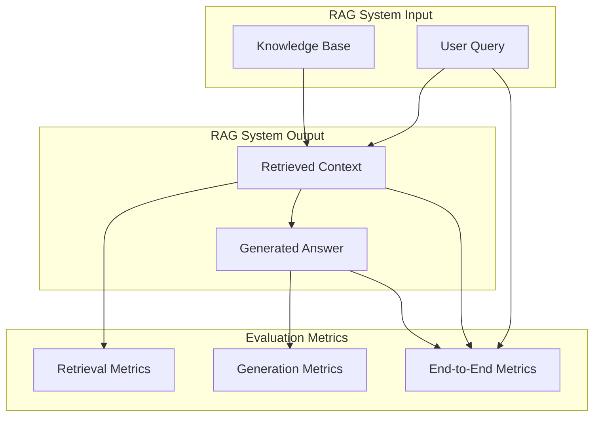
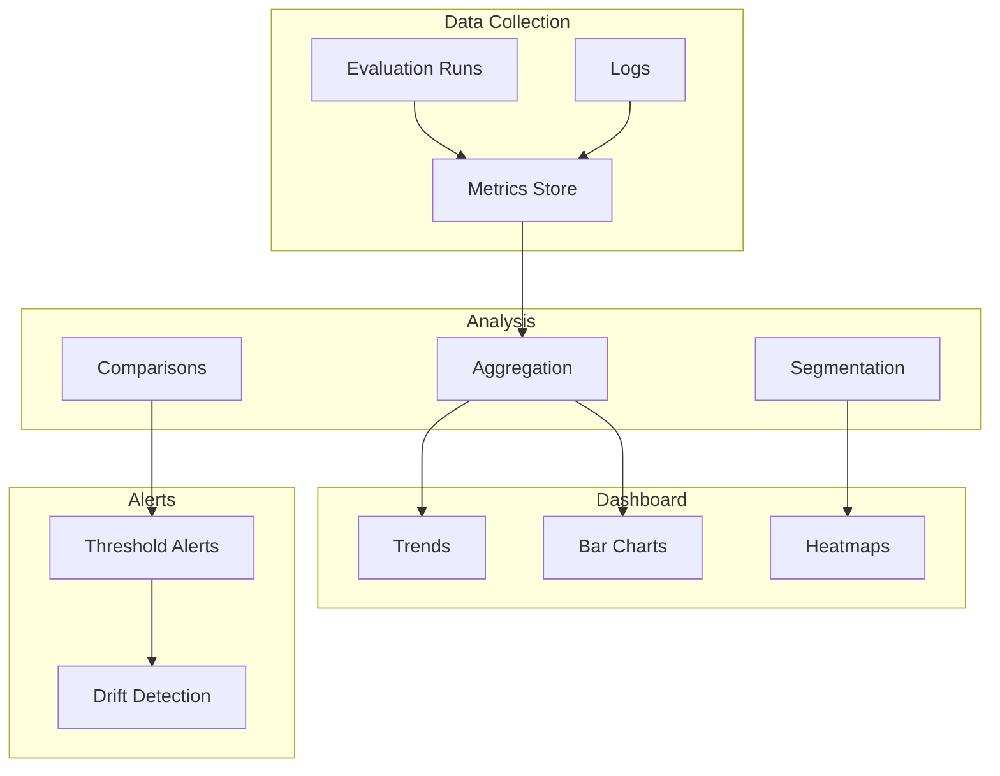

# RAG Evaluation - Concepts

## Overview

Evaluating RAG systems is essential for understanding their quality and improving them over time. This guide covers metrics, frameworks, benchmarking, and practical evaluation strategies.

---

## 1. Evaluation Framework Overview



---

## 2. Retrieval Metrics

### 2.1 Precision and Recall

**Precision@K**: Fraction of retrieved documents that are relevant

```python
def precision_at_k(retrieved_docs: List[Document], 
                   relevant_docs: List[str]) -> float:
    """
    Precision@K = (# of relevant docs retrieved) / K
    
    Args:
        retrieved_docs: Top K documents from retrieval
        relevant_docs: List of actually relevant document IDs
    
    Returns:
        Precision score between 0 and 1
    """
    retrieved_ids = {doc.metadata.get('id') for doc in retrieved_docs}
    relevant_set = set(relevant_docs)
    
    relevant_retrieved = retrieved_ids.intersection(relevant_set)
    
    return len(relevant_retrieved) / len(retrieved_docs) if retrieved_docs else 0.0
```

**Recall@K**: Fraction of relevant documents retrieved

```python
def recall_at_k(retrieved_docs: List[Document],
               relevant_docs: List[str]) -> float:
    """
    Recall@K = (# of relevant docs retrieved) / (total # of relevant docs)
    """
    retrieved_ids = {doc.metadata.get('id') for doc in retrieved_docs}
    relevant_set = set(relevant_docs)
    
    relevant_retrieved = retrieved_ids.intersection(relevant_set)
    
    return len(relevant_retrieved) / len(relevant_set) if relevant_set else 0.0
```

### 2.2 Mean Reciprocal Rank (MRR)

```python
def mean_reciprocal_rank(queries_results: List[Tuple[str, List[Document]]]) -> float:
    """
    MRR = (1/N) * Σ(1/rank_i)
    
    Where rank_i is the rank of the first relevant document for query i
    """
    reciprocal_ranks = []
    
    for query, retrieved_docs in queries_results:
        rank = None
        for i, doc in enumerate(retrieved_docs, 1):
            if doc.metadata.get('is_relevant'):
                rank = i
                break
        
        if rank:
            reciprocal_ranks.append(1.0 / rank)
        else:
            reciprocal_ranks.append(0.0)
    
    return sum(reciprocal_ranks) / len(reciprocal_ranks) if reciprocal_ranks else 0.0
```

### 2.3 Normalized Discounted Cumulative Gain (NDCG)

```python
def ndcg_at_k(retrieved_docs: List[Document], 
              relevance_scores: Dict[str, float], 
              k: int = 10) -> float:
    """
    NDCG = DCG / IDCG
    
    Measures ranking quality considering graded relevance.
    """
    def dcg(scores):
        return sum((2**rel - 1) / np.log2(i + 2) 
                   for i, rel in enumerate(scores))
    
    # Get relevance scores for retrieved docs
    retrieved_scores = [
        relevance_scores.get(doc.metadata.get('id'), 0)
        for doc in retrieved_docs[:k]
    ]
    
    # Calculate DCG
    dcg_value = dcg(retrieved_scores)
    
    # Calculate IDCG (ideal DCG)
    ideal_scores = sorted(relevance_scores.values(), reverse=True)[:k]
    idcg_value = dcg(ideal_scores)
    
    return dcg_value / idcg_value if idcg_value > 0 else 0.0
```

---

## 3. Generation Metrics

### 3.1 Faithfulness

Measures whether the generated answer is grounded in the retrieved context:

```python
def faithfulness_score(answer: str, contexts: List[str]) -> float:
    """
    Faithfulness = Does the answer use only information from context?
    
    Implementation uses NLI model:
    - For each claim in answer, check if it entails any context
    - Faithfulness = (# of faithful claims) / (total # of claims)
    """
    from transformers import pipeline
    
    nli_model = pipeline("zero-shot-classification", 
                        model="facebook/bart-large-mnli")
    
    # Extract claims from answer (simplified)
    claims = extract_claims(answer)
    
    faithful_claims = 0
    for claim in claims:
        # Check if any context entails this claim
        for context in contexts:
            result = nli_model(
                hypothesis=claim,
                premise=context,
                candidate_labels=["entailment", "contradiction", "neutral"]
            )
            if result['labels'][0] == 'entailment':
                faithful_claims += 1
                break
    
    return faithful_claims / len(claims) if claims else 1.0
```

### 3.2 Answer Relevance

```python
def answer_relevance_score(question: str, answer: str) -> float:
    """
    Answer Relevance = Does the answer address the question?
    
    Uses embedding similarity between question and answer.
    """
    from sklearn.metrics.pairwise import cosine_similarity
    
    question_emb = embedding_model.encode(question)
    answer_emb = embedding_model.encode(answer)
    
    similarity = cosine_similarity([question_emb], [answer_emb])[0][0]
    
    return float(similarity)
```

### 3.3 Context Utilization

```python
def context_utilization(contexts: List[str], answer: str) -> Dict:
    """
    Analyze how well the answer uses the retrieved context.
    """
    context_text = " ".join(contexts)
    
    # Count how much of answer comes from context
    answer_words = set(answer.lower().split())
    context_words = set(context_text.lower().split())
    
    overlapping_words = answer_words.intersection(context_words)
    
    # Calculate coverage
    coverage = len(overlapping_words) / len(answer_words) if answer_words else 0
    
    # Identify unique answer words not in context
    unique_words = answer_words - context_words
    
    return {
        'coverage': coverage,
        'unique_words': list(unique_words),
        'is_grounded': len(unique_words) < len(answer_words) * 0.2
    }
```

---

## 4. End-to-End Metrics

### 4.1 RAGAs (RAG Assessment)

```python
from ragas import evaluate
from ragas.metrics import (
    faithfulness,
    answer_relevancy,
    context_precision,
    context_recall
)

def evaluate_ragas(test_dataset, rag_pipeline):
    """
    Evaluate RAG system using RAGAs framework.
    """
    # Prepare evaluation data
    eval_data = []
    
    for item in test_dataset:
        query = item['question']
        ground_truth = item['ground_truth']
        
        # Get RAG response
        response = rag_pipeline.query(query)
        
        eval_data.append({
            'question': query,
            'answer': response['answer'],
            'ground_truth': ground_truth,
            'contexts': [doc.page_content for doc in response['contexts']]
        })
    
    # Evaluate
    results = evaluate(
        eval_data,
        metrics=[
            faithfulness,
            answer_relevancy,
            context_precision,
            context_recall
        ]
    )
    
    return results
```

### 4.2 Custom Evaluation Framework

```python
class RAGEvaluator:
    """Comprehensive RAG evaluation system."""
    
    def __init__(self, config: EvalConfig):
        self.retrieval_metrics = [
            'precision@k',
            'recall@k', 
            'mrr',
            'ndcg@k'
        ]
        self.generation_metrics = [
            'faithfulness',
            'answer_relevancy',
            'context_utilization',
            'toxicity',
            'coherence'
        ]
    
    def evaluate(self, test_set: TestDataset) -> EvaluationResult:
        results = {
            'retrieval': {},
            'generation': {},
            'overall': {}
        }
        
        for query_data in test_set.queries:
            # Retrieval evaluation
            retrieval_scores = self._evaluate_retrieval(query_data)
            
            # Generation evaluation
            generation_scores = self._evaluate_generation(query_data)
            
            # Aggregate
            results['retrieval'].update(retrieval_scores)
            results['generation'].update(generation_scores)
        
        # Calculate overall scores
        results['overall'] = self._calculate_overall(results)
        
        return EvaluationResult(results)
```

---

## 5. Benchmark Datasets

### 5.1 Common Benchmarks

| Dataset | Description | Use Case |
|---------|-------------|----------|
| **MS MARCO** | Bing search queries with relevance labels | Passage retrieval |
| **Natural Questions** | Google search queries with answers | Open-domain QA |
| **TriviaQA** | Trivia questions with evidence | Complex QA |
| **HotpotQA** | Multi-hop questions | Multi-document reasoning |
| **PopQA** | Entity-based questions | Long-tail knowledge |

### 5.2 Creating Custom Benchmarks

```python
class BenchmarkCreator:
    """Create custom evaluation datasets."""
    
    def __init__(self):
        self.questions = []
        self.ground_truths = []
    
    def add_sample(self, question: str, 
                   ground_truth: str,
                   relevant_docs: List[str],
                   metadata: Dict = None):
        """Add a sample to the benchmark."""
        self.questions.append(question)
        self.ground_truths.append({
            'answer': ground_truth,
            'relevant_docs': relevant_docs,
            'metadata': metadata or {}
        })
    
    def export(self, path: str):
        """Export benchmark to file."""
        benchmark = [
            {
                'question': q,
                'ground_truth': gt['answer'],
                'relevant_docs': gt['relevant_docs'],
                'metadata': gt['metadata']
            }
            for q, gt in zip(self.questions, self.ground_truths)
        ]
        
        with open(path, 'w') as f:
            json.dump(benchmark, f, indent=2)
    
    @staticmethod
    def from_documents(documents: List[Document], 
                      num_questions_per_doc: int = 3) -> 'BenchmarkCreator':
        """Generate questions from documents using LLM."""
        creator = BenchmarkCreator()
        
        for doc in documents:
            # Generate questions
            questions = generate_questions_from_context(
                doc.page_content, 
                num_questions_per_doc
            )
            
            for question in questions:
                creator.add_sample(
                    question=question,
                    ground_truth=extract_answer(question, doc.page_content),
                    relevant_docs=[doc.metadata.get('id')]
                )
        
        return creator
```

---

## 6. Evaluation Visualization

### 6.1 Dashboard Architecture



### 6.2 Metrics Visualization Code

```python
def create_evaluation_dashboard(eval_results: Dict):
    """Create visualization dashboard for evaluation results."""
    import plotly.express as px
    import plotly.graph_objects as go
    
    # Retrieval metrics over time
    fig_retrieval = px.line(
        eval_results['retrieval_timeline'],
        x='timestamp',
        y=['precision@k', 'recall@k', 'mrr'],
        title='Retrieval Metrics Over Time'
    )
    
    # Generation metrics distribution
    fig_generation = px.violin(
        eval_results['generation_samples'],
        y='faithfulness',
        title='Faithfulness Score Distribution'
    )
    
    # Component comparison
    fig_comparison = go.Figure(data=[
        go.Bar(name='Current', 
               x=['Retrieval', 'Generation', 'Overall'],
               y=[current_ret, current_gen, current_overall]),
        go.Bar(name='Previous', 
               x=['Retrieval', 'Generation', 'Overall'],
               y=[prev_ret, prev_gen, prev_overall])
    ])
    
    return fig_retrieval, fig_generation, fig_comparison
```

---

## 7. Continuous Evaluation

### 7.1 Automated Evaluation Pipeline

```python
class ContinuousEvaluator:
    """Run evaluation continuously in production."""
    
    def __init__(self, evaluation_interval: int = 3600):
        self.interval = evaluation_interval
        self.test_set = self._load_test_set()
        self.results_history = []
    
    async def run_evaluation(self, rag_pipeline):
        """Run evaluation on schedule."""
        logger.info("Starting evaluation run")
        
        # Sample queries
        sample_queries = self._sample_queries()
        
        results = []
        for query in sample_queries:
            result = self._evaluate_query(rag_pipeline, query)
            results.append(result)
        
        # Aggregate results
        aggregated = self._aggregate_results(results)
        
        # Store in history
        self.results_history.append({
            'timestamp': datetime.now(),
            'results': aggregated
        })
        
        # Check for regressions
        self._check_regressions(aggregated)
        
        return aggregated
    
    def _check_regressions(self, current_results):
        """Check if metrics have regressed."""
        if not self.results_history:
            return
        
        previous = self.results_history[-1]['results']
        
        for metric, value in current_results.items():
            if metric in previous:
                change = value - previous[metric]
                threshold = 0.05  # 5% threshold
                
                if change < -threshold:
                    logger.warning(
                        f"Metric {metric} regressed by {change:.2%}"
                    )
                    # Trigger alert
                    self._trigger_alert(metric, previous[metric], value)
```

### 7.2 A/B Testing Framework

```python
class ABTestEvaluator:
    """A/B test different RAG configurations."""
    
    def __init__(self, variant_a, variant_b, traffic_split: float = 0.5):
        self.variant_a = variant_a
        self.variant_b = variant_b
        self.split = traffic_split
        
        self.experiments = []
    
    def run_experiment(self, experiment_id: str, 
                      queries: List[str]) -> ABTestResult:
        """Run A/B test and analyze results."""
        
        results_a = []
        results_b = []
        
        for query in queries:
            # Get responses from both variants
            response_a = self.variant_a.query(query)
            response_b = self.variant_b.query(query)
            
            # Evaluate both
            eval_a = self._evaluate_response(query, response_a)
            eval_b = self._evaluate_response(query, response_b)
            
            results_a.append(eval_a)
            results_b.append(eval_b)
        
        # Statistical analysis
        statistical_results = self._statistical_analysis(results_a, results_b)
        
        return ABTestResult(
            experiment_id=experiment_id,
            variant_a_metrics=self._aggregate(results_a),
            variant_b_metrics=self._aggregate(results_b),
            statistical_significance=statistical_results,
            winner=self._determine_winner(statistical_results)
        )
```

---

## 8. Quality Assurance Checklist

### Pre-Deployment

- [ ] Run full evaluation on test set
- [ ] Verify all metrics above thresholds
- [ ] Check for regressions vs previous version
- [ ] Validate edge cases
- [ ] Review sample outputs manually

### Post-Deployment

- [ ] Monitor live metrics
- [ ] Set up alerting for regressions
- [ ] Schedule regular evaluations
- [ ] Collect user feedback
- [ ] Update test sets with real queries

### Continuous

- [ ] Track metrics over time
- [ ] Analyze failure cases
- [ ] Iteratively improve based on evaluation
- [ ] Benchmark against baselines

---

## Summary

Key evaluation components:

1. **Retrieval Metrics** - Precision, Recall, MRR, NDCG
2. **Generation Metrics** - Faithfulness, Relevance, Utilization
3. **End-to-End** - RAGAs framework, custom metrics
4. **Benchmarks** - Standard datasets and custom creation
5. **Continuous Evaluation** - Automated pipelines, A/B testing

---

## References

- [RAGAs Documentation](https://docs.ragas.io/)
- [HuggingFace Evaluate](https://huggingface.co/evaluate-metric)
- [MS MARCO Leaderboard](https://microsoft.github.io/msmarco/)
