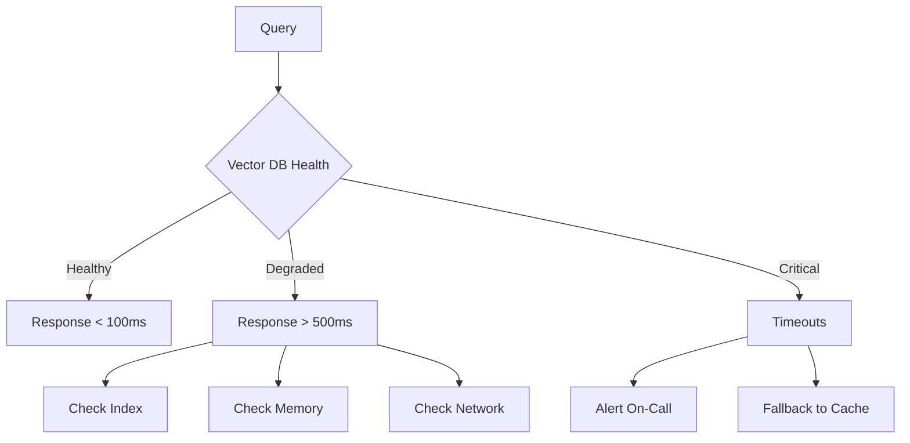
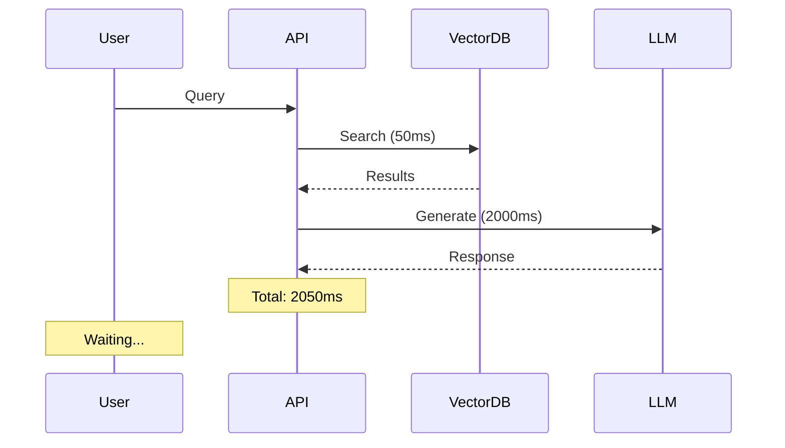

# Common Production Issues in RAG Systems

## Overview

This document catalogs frequently encountered issues in production RAG systems, organized by system component. Understanding these issues helps in early detection and prevention.

---

## 1. Retrieval Layer Issues

### 1.1 Poor Retrieval Quality

**Symptoms:**
- Irrelevant documents returned in top results
- Missing relevant documents in search results
- Low precision and recall metrics

**Root Causes:**
- Suboptimal chunking strategy for the domain
- Embedding model not suited for domain vocabulary
- Mismatch between query language and document language
- Vector database not properly tuned

**Detection:**
```python
# Check retrieval metrics
from ragas import evaluate
from ragas.metrics import context_precision, context_recall

results = evaluate(
    dataset=retrieval_dataset,
    metrics=[context_precision, context_recall]
)
```

### 1.2 Vector Database Performance Degradation

**Symptoms:**
- Increased query latency over time
- Memory usage spikes
- Index fragmentation

**Root Causes:**
- No regular index maintenance
- Insufficient resource allocation
- Growing dataset without capacity planning



### 1.3 Embedding Model Drift

**Symptoms:**
- Gradual decline in retrieval relevance
- Changes in returned document distributions
- Increased "no relevant documents" responses

**Root Causes:**
- Embedding model updates without re-indexing
- Domain vocabulary evolution
- Training data drift

---

## 2. Data Pipeline Issues

### 2.1 Document Processing Failures

**Symptoms:**
- Incomplete document ingestion
- Encoding errors in processed text
- Missing metadata

**Root Causes:**
- Unsupported document formats
- Large file sizes exceeding limits
- Corrupted source documents

```python
# Robust document loading with error handling
def load_document_safely(file_path: str) -> Optional[Document]:
    try:
        # Check file size first
        if os.path.getsize(file_path) > MAX_FILE_SIZE:
            logger.warning(f"File {file_path} exceeds size limit")
            return None
            
        # Try different loaders
        loaders = [PDFLoader, DocxLoader, TextLoader]
        for loader in loaders:
            try:
                return loader(file_path).load()
            except Exception:
                continue
                
        logger.error(f"Failed to load {file_path}")
        return None
    except Exception as e:
        logger.error(f"Error processing {file_path}: {e}")
        return None
```

### 2.2 Inconsistent Chunking

**Symptoms:**
- Variable quality of generated responses
- Some queries returning empty results
- Overlapping or missing content

**Root Causes:**
- Non-deterministic chunking algorithms
- Different chunk sizes for similar documents
- No validation of chunk quality

### 2.3 Data Freshness Issues

**Symptoms:**
- Outdated information in responses
- Users receiving stale documents
- Knowledge base not reflecting recent changes

**Root Causes:**
- No automated re-indexing pipeline
- Failure in incremental update jobs
- Long indexing queues

---

## 3. Generation Layer Issues

### 3.1 Hallucinations

**Symptoms:**
- Generated content not grounded in retrieved context
- Responses containing factually incorrect information
- Model making up citations or references

**Root Causes:**
- Insufficient context provided to LLM
- LLM not properly instructed to use context
- Context window limitations
- Prompt engineering issues

**Detection:**
```python
# Check faithfulness using RAGAs
from ragas.metrics import faithfulness

result = evaluate(
    metrics=[faithfulness],
    # ground_truth: what the correct answer should be
    # answer: what the model generated
    # contexts: retrieved documents
)
```

### 3.2 Context Overflow

**Symptoms:**
- Truncated responses
- Incomplete answers
- API errors with context length limits

**Root Causes:**
- Retrieved documents exceeding context window
- No document prioritization strategy
- Inefficient prompt formatting

### 3.3 Response Quality Degradation

**Symptoms:**
- Varying response quality across queries
- Degraded performance for certain query types
- Inconsistent tone or format

**Root Causes:**
- Temperature or other LLM parameters not optimized
- Prompt drift over time
- Different LLM versions producing varied outputs

---

## 4. Infrastructure Issues

### 4.1 Latency Spikes

**Symptoms:**
- P99 latency significantly higher than P50
- User complaints about slow responses
- Timeout errors in logs



**Root Causes:**
- Vector database overloaded
- LLM API rate limits
- Network issues
- Cold starts in serverless environments

### 4.2 Rate Limiting

**Symptoms:**
- 429 HTTP errors
- Rejected requests
- Degraded user experience

**Root Causes:**
- Exceeding API provider limits
- No request queuing
- Sudden traffic spikes

### 4.3 Cost Escalation

**Symptoms:**
- Unexpected billing increases
- Resource utilization spikes
- Uncontrolled API calls

**Root Causes:**
- No cost monitoring
- Retry storms
- Inefficient caching
- Debug logging in production

---

## 5. Security & Compliance Issues

### 5.1 Data Leakage

**Symptoms:**
- Sensitive data in logs
- Unauthorized data access
- Compliance violations

**Root Causes:**
- Insufficient input sanitization
- Verbose error messages
- Improper access controls

### 5.2 Prompt Injection

**Symptoms:**
- Unexpected system behavior
- Jailbreak attempts succeeding
- Malicious outputs

**Root Causes:**
- No input validation
- Insufficient prompt guardrails
- User input directly in prompts

---

## 6. Observability Issues

### 6.1 Missing Debugging Information

**Symptoms:**
- Unable to reproduce issues
- Missing context in error reports
- Difficult to trace failures

**Root Causes:**
- Insufficient logging
- No request tracing
- Missing correlation IDs

### 6.2 Alert Fatigue

**Symptoms:**
- Important alerts missed
- Low signal-to-noise ratio
- Team desensitization

**Root Causes:**
- Overly sensitive thresholds
- No alert grouping
- Missing error categorization

---

## Issue Priority Matrix

| Issue Category | Frequency | Impact | Priority |
|---------------|-----------|--------|----------|
| Retrieval Quality | High | High | P0 |
| Latency Spikes | Medium | High | P0 |
| Hallucinations | High | High | P0 |
| Cost Escalation | Medium | Medium | P1 |
| Data Freshness | Low | Medium | P1 |
| Security Issues | Low | Critical | P0 |
| Rate Limiting | Medium | Medium | P1 |

---

## Next Steps

- [Debugging Techniques](./debugging_techniques.md) - Learn systematic approaches to diagnose issues
- [Solutions & Best Practices](./solutions.md) - Implement proven fixes
- [System Design for Production](./system_design.md) - Build resilient systems
