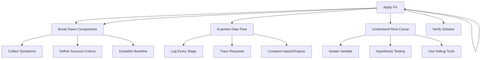
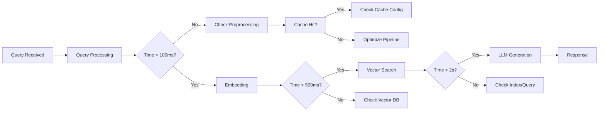

# Debugging Techniques for RAG Systems

## Introduction

Systematic debugging is essential for maintaining production RAG systems. This guide provides techniques for identifying, isolating, and resolving issues efficiently.

---

## 1. The DEBUG Framework

A structured approach to debugging RAG systems:



### D - Define the Problem
- Collect specific symptoms
- Define what "correct" looks like
- Establish performance baselines

### E - Examine Data Flow
- Log inputs and outputs at each stage
- Trace request lifecycles
- Compare expected vs actual behavior

### B - Break Down Components
- Test each component in isolation
- Identify the failing subsystem
- Understand component interactions

### U - Understand Root Cause
- Form hypotheses
- Test each systematically
- Use debugging tools

### A - Apply Fix
- Implement smallest fix first
- Avoid temporary workarounds
- Document the change

### P - Prove It Works
- Verify fix resolves original issue
- Check for regressions
- Monitor for side effects

---

## 2. Component-Level Debugging

### 2.1 Debugging Retrieval

**Step 1: Inspect Query Processing**
```python
def debug_retrieval(query: str, vector_store):
    # Log original query
    logger.info(f"Original query: {query}")
    
    # Check preprocessing
    processed_query = preprocess(query)
    logger.info(f"Processed query: {processed_query}")
    
    # Get embedding
    query_embedding = embedding_model.encode(processed_query)
    logger.info(f"Query embedding shape: {query_embedding.shape}")
    
    # Retrieve
    results = vector_store.similarity_search(
        query_embedding,
        k=10,
        include_metadata=True
    )
    
    # Log results
    for i, doc in enumerate(results):
        logger.info(f"Rank {i}: {doc.page_content[:100]}... (score: {doc.metadata.get('score')})")
    
    return results
```

**Step 2: Analyze Embedding Quality**
```python
def diagnose_embedding_issues(query: str, expected_docs: List[str]):
    """Check if embeddings are working correctly."""
    query_embedding = embedding_model.encode(query)
    
    # Check embedding statistics
    print(f"Embedding dimension: {len(query_embedding)}")
    print(f"Embedding mean: {np.mean(query_embedding):.4f}")
    print(f"Embedding std: {np.std(query_embedding):.4f}")
    print(f"Embedding min: {np.min(query_embedding):.4f}")
    print(f"Embedding max: {np.max(query_embedding):.4f}")
    
    # Check similarity to known documents
    for doc in expected_docs:
        doc_embedding = embedding_model.encode(doc)
        similarity = cosine_similarity([query_embedding], [doc_embedding])[0][0]
        print(f"Similarity to '{doc[:50]}...': {similarity:.4f}")
```

**Step 3: Test Chunk Boundaries**
```python
def debug_chunking(document: str, chunk_size: int = 500):
    """Analyze how document is being chunked."""
    from langchain.text_splitter import RecursiveCharacterTextSplitter
    
    splitter = RecursiveCharacterTextSplitter(
        chunk_size=chunk_size,
        chunk_overlap=50
    )
    
    chunks = splitter.split_text(document)
    
    print(f"Total chunks: {len(chunks)}")
    for i, chunk in enumerate(chunks):
        print(f"\n--- Chunk {i} ---")
        print(f"Length: {len(chunk)}")
        print(f"First 100 chars: {chunk[:100]}...")
        
        # Check for mid-sentence splits
        if i > 0:
            prev_chunk = chunks[i-1]
            print(f"Previous chunk ends with: '...{prev_chunk[-30:]}'")
            print(f"Current chunk starts with: '{chunk[:30]}...'")
```

### 2.2 Debugging Generation

**Step 1: Inspect Prompt Construction**
```python
def debug_prompt_construction(context: str, question: str, system_prompt: str):
    """Visualize the full prompt being sent to LLM."""
    prompt = f"{system_prompt}\n\nContext: {context}\n\nQuestion: {question}\n\nAnswer:"
    
    print("=" * 80)
    print("FULL PROMPT:")
    print("=" * 80)
    print(prompt)
    print("=" * 80)
    print(f"Total tokens (approx): {len(prompt.split())}")
    print(f"Context tokens: {len(context.split())}")
    print(f"Question tokens: {len(question.split())}")
```

**Step 2: Check Context Relevance**
```python
def diagnose_context_relevance(question: str, retrieved_docs: List[Document]):
    """Analyze if retrieved docs are relevant to the question."""
    question_keywords = set(question.lower().split())
    
    for i, doc in enumerate(retrieved_docs):
        doc_text = doc.page_content.lower()
        doc_keywords = set(doc_text.split())
        
        # Calculate keyword overlap
        overlap = question_keywords.intersection(doc_keywords)
        relevance = len(overlap) / len(question_keywords)
        
        print(f"\nDoc {i}:")
        print(f"  Relevance score: {relevance:.2%}")
        print(f"  Overlapping keywords: {overlap}")
        print(f"  Preview: {doc.page_content[:150]}...")
```

**Step 3: Validate LLM Responses**
```python
def debug_llm_response(prompt: str, response: str, contexts: List[str]):
    """Analyze the LLM response for issues."""
    
    print("=" * 80)
    print("LLM RESPONSE ANALYSIS")
    print("=" * 80)
    
    # Check if response uses context
    response_lower = response.lower()
    context_mentioned = any(ctx.lower()[:100] in response_lower for ctx in contexts)
    print(f"Response references context: {context_mentioned}")
    
    # Check for hallucinations (basic check)
    hallucination_indicators = [
        "according to", "stated that", "the document says"
    ]
    has_citations = any(phrase in response_lower for phrase in hallucination_indicators)
    print(f"Response makes claims: {has_citations}")
    
    # Response length analysis
    print(f"Response length: {len(response)} chars, {len(response.split())} words")
```

---

## 3. Systematic Troubleshooting

### 3.1 Latency Debugging



**Debug Script:**
```python
import time
from functools import wraps
import logging

def profile_rag_pipeline(func):
    """Decorator to profile RAG pipeline performance."""
    @wraps(func)
    def wrapper(*args, **kwargs):
        timings = {}
        
        # Profile each stage
        start = time.time()
        # ... execute stages with timing
        timings['total'] = time.time() - start
        
        logger.info(f"Pipeline timings: {timings}")
        return timings
    return wrapper

def diagnose_latency(query: str, rag_pipeline):
    """Systematic latency diagnosis."""
    
    # Stage 1: Embedding
    start = time.time()
    query_embedding = rag_pipeline.embedding_model.encode(query)
    embedding_time = time.time() - start
    print(f"Embedding time: {embedding_time*1000:.2f}ms")
    
    # Stage 2: Vector search
    start = time.time()
    docs = rag_pipeline.vector_store.similarity_search(query_embedding)
    search_time = time.time() - start
    print(f"Vector search time: {search_time*1000:.2f}ms")
    
    # Stage 3: Prompt construction
    start = time.time()
    prompt = rag_pipeline.build_prompt(query, docs)
    prompt_time = time.time() - start
    print(f"Prompt construction time: {prompt_time*1000:.2f}ms")
    
    # Stage 4: LLM generation
    start = time.time()
    response = rag_pipeline.llm.generate(prompt)
    generation_time = time.time() - start
    print(f"LLM generation time: {generation_time*1000:.2f}ms")
    
    # Stage 5: Post-processing
    start = time.time()
    final_response = rag_pipeline.post_process(response)
    postprocess_time = time.time() - start
    print(f"Post-processing time: {postprocess_time*1000:.2f}ms")
    
    total_time = embedding_time + search_time + prompt_time + generation_time + postprocess_time
    print(f"\nTotal time: {total_time*1000:.2f}ms")
    
    return {
        'embedding': embedding_time,
        'search': search_time,
        'prompt': prompt_time,
        'generation': generation_time,
        'postprocess': postprocess_time,
        'total': total_time
    }
```

### 3.2 Quality Debugging

```python
def diagnose_quality_issues(question: str, expected_answer: str, 
                            rag_response: str, retrieved_docs: List[str]):
    """Systematic quality issue diagnosis."""
    
    from ragas import evaluate
    from ragas.metrics import faithfulness, answer_relevancy, context_precision
    
    # Create evaluation dataset
    eval_dataset = [{
        'question': question,
        'answer': rag_response,
        'ground_truth': expected_answer,
        'contexts': [doc.page_content for doc in retrieved_docs]
    }]
    
    # Evaluate
    results = evaluate(
        dataset=eval_dataset,
        metrics=[faithfulness, answer_relevancy, context_precision]
    )
    
    print("Quality Metrics:")
    print(f"  Faithfulness: {results['faithfulness']:.2f}")
    print(f"  Answer Relevancy: {results['answer_relevancy']:.2f}")
    print(f"  Context Precision: {results['context_precision']:.2f}")
    
    # Diagnose specific issues
    if results['faithfulness'] < 0.5:
        print("\n⚠️ LOW FAITHFULNESS:")
        print("  - Check if retrieved context contains answer")
        print("  - Verify prompt instructs LLM to use context")
        print("  - Look for hallucinated information")
    
    if results['answer_relevancy'] < 0.5:
        print("\n⚠️ LOW ANSWER RELEVANCY:")
        print("  - Check if retrieved docs answer the question")
        print("  - Verify query rewriting is effective")
        print("  - Review chunking strategy")
```

---

## 4. Observability Debugging

### 4.1 Structured Logging

```python
import logging
import json
from datetime import datetime
from uuid import uuid4

class RAGLogger:
    """Structured logging for RAG systems."""
    
    def __init__(self, logger_name: str):
        self.logger = logging.getLogger(logger_name)
        
    def log_request(self, request_id: str, query: str, user_id: str = None):
        self.logger.info(json.dumps({
            "request_id": request_id,
            "timestamp": datetime.utcnow().isoformat(),
            "event": "request_received",
            "query": query,
            "user_id": user_id
        }))
    
    def log_retrieval(self, request_id: str, num_docs: int, 
                     retrieval_time: float, docs: List[Document]):
        self.logger.info(json.dumps({
            "request_id": request_id,
            "timestamp": datetime.utcnow().isoformat(),
            "event": "retrieval_complete",
            "num_docs": num_docs,
            "retrieval_time_ms": retrieval_time * 1000,
            "doc_ids": [doc.metadata.get('id') for doc in docs],
            "doc_scores": [doc.metadata.get('score') for doc in docs]
        }))
    
    def log_generation(self, request_id: str, generation_time: float,
                      response: str, token_count: int):
        self.logger.info(json.dumps({
            "request_id": request_id,
            "timestamp": datetime.utcnow().isoformat(),
            "event": "generation_complete",
            "generation_time_ms": generation_time * 1000,
            "response_length": len(response),
            "token_count": token_count
        }))
    
    def log_error(self, request_id: str, error: Exception, 
                  context: dict = None):
        self.logger.error(json.dumps({
            "request_id": request_id,
            "timestamp": datetime.utcnow().isoformat(),
            "event": "error",
            "error_type": type(error).__name__,
            "error_message": str(error),
            "context": context or {}
        }))
```

### 4.2 Request Tracing

```python
from opentelemetry import trace
from opentelemetry.sdk.trace import TracerProvider
from opentelemetry.sdk.trace.export import BatchSpanProcessor
from opentelemetry.exporter.jaeger.thrift import JaegerExporter

# Setup tracing
trace.set_tracer_provider(TracerProvider())
tracer = trace.get_tracer(__name__)

def trace_rag_pipeline(query: str):
    """Trace a complete RAG pipeline."""
    with tracer.start_as_current_span("rag_pipeline") as span:
        span.set_attribute("query", query)
        span.set_attribute("operation", "rag_pipeline")
        
        # Embedding span
        with tracer.start_as_current_span("embed_query") as embed_span:
            embed_span.set_attribute("operation", "embed")
            embedding = embed_model.encode(query)
        
        # Retrieval span
        with tracer.start_as_current_span("retrieve") as retrieve_span:
            retrieve_span.set_attribute("operation", "retrieve")
            docs = vector_store.similarity_search(embedding)
            retrieve_span.set_attribute("num_docs", len(docs))
        
        # Generation span
        with tracer.start_as_current_span("generate") as generate_span:
            generate_span.set_attribute("operation", "generate")
            response = llm.generate(prompt)
        
        return response
```

---

## 5. Common Debugging Scenarios

### Scenario 1: "Wrong documents retrieved"

```python
# Debug workflow
1. Check query preprocessing - is the query being modified?
2. Inspect the query embedding - is it meaningful?
3. Test embedding similarity directly - cosine_similarity(query_emb, doc_embs)
4. Examine retrieved document scores - are they reasonable?
5. Check vector DB index health - is the index fragmented?
```

### Scenario 2: "LLM ignores context"

```python
# Debug workflow
1. Print the full prompt - what is the LLM seeing?
2. Check context formatting - is it clear and readable?
3. Verify context contains the answer - can humans find it?
4. Test with simpler context - does it work with less?
5. Try different prompts - does prompt engineering help?
```

### Scenario 3: "Inconsistent responses"

```python
# Debug workflow
1. Check temperature setting - is it too high?
2. Log the exact prompt each time - are they identical?
3. Compare retrieved docs - are they the same?
4. Test with fixed seed - does setting seed help?
5. Check for non-determinism in any pipeline stage
```

---

## Next Steps

- [Solutions & Best Practices](./solutions.md) - Apply fixes for identified issues
- [System Design for Production](./system_design.md) - Build robust systems
- [RAG Evaluation](../06_rag_evaluation/concepts.md) - Measure system performance
