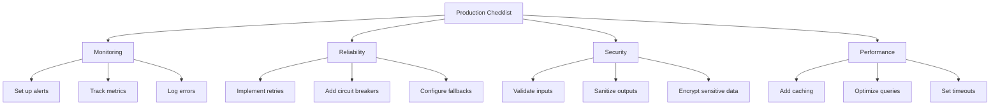

# Solutions & Best Practices

## Introduction

This document provides proven solutions and best practices for addressing common production issues in RAG systems.

---

## 1. Retrieval Solutions

### 1.1 Improving Retrieval Quality

**Solution: Hybrid Search**

Combine vector search with keyword search for better retrieval:

```python
from langchain.retrievers import ContextualCompressionRetriever
from langchain.retrievers.document_compressors import CrossEncoderReranker
from langchain_community.cross_encoders import HuggingFaceCrossEncoder

class HybridRetriever:
    def __init__(self, vector_store, bm25_retriever):
        self.vector_store = vector_store
        self.bm25_retriever = bm25_retriever
        
    def get_relevant_documents(self, query: str) -> List[Document]:
        # Get results from both retrievers
        vector_results = self.vector_store.similarity_search(query, k=20)
        bm25_results = self.bm25_retriever.get_relevant_documents(query)
        
        # Combine and deduplicate
        combined = self._combine_results(vector_results, bm25_results)
        
        # Re-rank
        reranked = self._rerank(query, combined)
        
        return reranked[:10]
    
    def _combine_results(self, vec_docs, bm25_docs):
        seen = set()
        combined = []
        for doc in vec_docs + bm25_docs:
            doc_id = doc.metadata.get('id', doc.page_content[:50])
            if doc_id not in seen:
                seen.add(doc_id)
                combined.append(doc)
        return combined
```

**Solution: Adaptive Chunking**

Use different chunk sizes based on document type:

```python
class AdaptiveChunker:
    def __init__(self):
        self.chunk_configs = {
            'technical': {'size': 1000, 'overlap': 200},
            'legal': {'size': 500, 'overlap': 100},
            'general': {'size': 800, 'overlap': 150},
            'qa': {'size': 300, 'overlap': 50}
        }
        
    def chunk_document(self, text: str, doc_type: str = 'general') -> List[str]:
        config = self.chunk_configs.get(doc_type, self.chunk_configs['general'])
        
        splitter = RecursiveCharacterTextSplitter(
            chunk_size=config['size'],
            chunk_overlap=config['overlap'],
            separators=["\n\n", "\n", ". ", " "]
        )
        
        return splitter.split_text(text)
    
    def detect_doc_type(self, text: str) -> str:
        # Simple heuristic - could use ML classifier
        if any(word in text.lower() for word in ['plaintiff', 'defendant', 'court']):
            return 'legal'
        elif any(word in text.lower() for word in ['function', 'class', 'import']):
            return 'technical'
        elif '?' in text:
            return 'qa'
        return 'general'
```

### 1.2 Vector Database Optimization

**Solution: Regular Index Maintenance**

```python
class VectorDBMaintenance:
    def __init__(self, vector_store):
        self.vector_store = vector_store
        
    def regular_maintenance(self):
        """Perform regular maintenance tasks."""
        # 1. Rebuild index periodically
        self.rebuild_index()
        
        # 2. Optimize storage
        self.optimize_storage()
        
        # 3. Clean up deleted vectors
        self.cleanup_deleted()
        
    def rebuild_index(self, schedule: str = "weekly"):
        """Rebuild index to maintain performance."""
        # For Pinecone
        # self.vector_store.rebuild()
        
        # For Weaviate
        # self.vector_store.schema.deleter('vectorIndex')
        # self.vector_store.schema.create('vectorIndex')
        
        logger.info("Index rebuilt successfully")
        
    def optimize_storage(self):
        """Compress and optimize storage."""
        # Implementation depends on vector DB
        pass
```

---

## 2. Generation Solutions

### 2.1 Reducing Hallucinations

**Solution: Grounded Generation**

```python
class GroundedGenerator:
    def __init__(self, llm):
        self.llm = llm
        
    def generate(self, query: str, context: List[Document]) -> str:
        # Build prompt with explicit grounding instructions
        context_text = "\n\n".join([
            f"Document {i+1}:\n{doc.page_content}"
            for i, doc in enumerate(context)
        ])
        
        prompt = f"""You are a helpful AI assistant. Use ONLY the provided 
context to answer the question. If you cannot find the answer in the 
context, say "I don't have enough information to answer this question."

Context:
{context_text}

Question: {query}

Instructions:
1. Use only information from the provided context
2. If citing specific information, mention which document it came from
3. If the answer is not in the context, explicitly state that
4. Do not make up information

Answer:"""
        
        response = self.llm.generate(prompt)
        
        # Verify response is grounded
        grounded_response = self._verify_grounding(response, context)
        
        return grounded_response
    
    def _verify_grounding(self, response: str, context: List[Document]) -> str:
        """Verify response is grounded in context."""
        # Simple check - could use NER or fact verification
        response_lower = response.lower()
        
        for doc in context:
            # Check for obvious contradictions
            doc_lower = doc.page_content.lower()
            # Add verification logic here
            
        return response
```

**Solution: citations Generation**

```python
class CitationGenerator:
    def generate_with_citations(self, query: str, context: List[Document]) -> Dict:
        """Generate response with source citations."""
        
        # Generate response
        response = self.llm.generate(self._build_prompt(query, context))
        
        # Extract citations
        citations = self._extract_citations(response, context)
        
        return {
            'response': response,
            'citations': citations,
            'sources': [doc.metadata for doc in context]
        }
    
    def _extract_citations(self, response: str, context: List[Document]) -> List[int]:
        """Identify which documents support the response."""
        # Implementation uses semantic similarity between
        # response sentences and source documents
        pass
```

### 2.2 Handling Context Overflow

**Solution: Smart Context Management**

```python
class ContextManager:
    def __init__(self, max_tokens: int = 4000):
        self.max_tokens = max_tokens
        self.tokenizer = tiktoken.get_encoding("cl100k_base")
        
    def select_documents(self, query: str, 
                        documents: List[Document], 
                        k: int = None) -> List[Document]:
        """Intelligently select documents to fit in context."""
        
        if k is None:
            k = self._estimate_k(len(documents))
            
        # Score documents by relevance
        scored_docs = self._score_documents(query, documents)
        
        # Select documents that fit in context
        selected = []
        current_tokens = 0
        
        for doc, score in scored_docs:
            doc_tokens = len(self.tokenizer.encode(doc.page_content))
            
            if current_tokens + doc_tokens <= self.max_tokens:
                selected.append(doc)
                current_tokens += doc_tokens
                
            if len(selected) >= k:
                break
                
        return selected
    
    def _estimate_k(self, num_docs: int) -> int:
        """Estimate optimal number of documents."""
        # Average tokens per document
        avg_tokens = self.max_tokens // num_docs
        # Reserve space for query and response
        return min(num_docs, (self.max_tokens * 0.6) // avg_tokens)
```

---

## 3. Performance Solutions

### 3.1 Caching Strategy

```python
from functools import lru_cache
import hashlib
import json

class RAGCache:
    def __init__(self, redis_client=None):
        self.redis = redis_client
        self.local_cache = {}
        
    def get_cached_response(self, query: str, 
                           retrieved_doc_ids: List[str]) -> Optional[str]:
        """Check cache for similar query."""
        
        cache_key = self._make_key(query, retrieved_doc_ids)
        
        # Check Redis
        if self.redis:
            cached = self.redis.get(cache_key)
            if cached:
                return cached
                
        # Check local cache
        return self.local_cache.get(cache_key)
    
    def cache_response(self, query: str, 
                      retrieved_doc_ids: List[str], 
                      response: str):
        """Cache the response."""
        
        cache_key = self._make_key(query, retrieved_doc_ids)
        
        # Cache in Redis
        if self.redis:
            self.redis.setex(cache_key, 3600, response)  # 1 hour TTL
            
        # Cache locally
        self.local_cache[cache_key] = response
        
    def _make_key(self, query: str, doc_ids: List[str]) -> str:
        """Create cache key."""
        key_data = f"{query}|{','.join(sorted(doc_ids))}"
        return hashlib.md5(key_data.encode()).hexdigest()
```

### 3.2 Rate Limiting Handler

```python
from tenacity import retry, stop_after_attempt, wait_exponential

class RateLimitedLLM:
    def __init__(self, llm, max_retries: int = 3):
        self.llm = llm
        self.max_retries = max_retries
        
    @retry(
        stop=stop_after_attempt(3),
        wait=wait_exponential(multiplier=1, min=2, max=10)
    )
    def generate(self, prompt: str) -> str:
        try:
            return self.llm.generate(prompt)
        except RateLimitError as e:
            logger.warning(f"Rate limit hit, retrying: {e}")
            raise
            
    def generate_with_fallback(self, prompt: str) -> str:
        """Try primary, fall back to secondary if rate limited."""
        
        try:
            return self.generate(prompt)
        except RateLimitError:
            logger.warning("Primary LLM rate limited, trying fallback")
            return self.fallback_llm.generate(prompt)
```

---

## 4. Reliability Solutions

### 4.1 Circuit Breaker

```python
from datetime import datetime, timedelta

class CircuitBreaker:
    def __init__(self, failure_threshold: int = 5, 
                 timeout: int = 60):
        self.failure_threshold = failure_threshold
        self.timeout = timeout
        self.failures = 0
        self.last_failure_time = None
        self.state = "closed"  # closed, open, half-open
        
    def call(self, func, *args, **kwargs):
        if self.state == "open":
            if self._should_attempt_reset():
                self.state = "half-open"
            else:
                raise CircuitBreakerOpenError()
                
        try:
            result = func(*args, **kwargs)
            self._on_success()
            return result
        except Exception as e:
            self._on_failure()
            raise
            
    def _on_success(self):
        self.failures = 0
        self.state = "closed"
        
    def _on_failure(self):
        self.failures += 1
        self.last_failure_time = datetime.now()
        
        if self.failures >= self.failure_threshold:
            self.state = "open"
            logger.warning("Circuit breaker opened")
            
    def _should_attempt_reset(self):
        return (datetime.now() - self.last_failure_time).seconds > self.timeout
```

### 4.2 Fallback Strategies

```python
class RAGFallback:
    def __init__(self, primary_rag, fallback_rag):
        self.primary = primary_rag
        self.fallback = fallback_rag
        
    def query(self, query: str) -> Dict:
        """Try primary, fall back on failure."""
        
        try:
            # Try primary with timeout
            result = self._call_with_timeout(
                self.primary.query, 
                query, 
                timeout=5.0
            )
            result['source'] = 'primary'
            return result
            
        except Exception as e:
            logger.warning(f"Primary failed: {e}, trying fallback")
            
            try:
                result = self.fallback.query(query)
                result['source'] = 'fallback'
                result['warning'] = f'Primary failed: {e}'
                return result
            except Exception as fallback_error:
                logger.error(f"Fallback also failed: {fallback_error}")
                raise
                
    def _call_with_timeout(self, func, query, timeout):
        # Implementation using asyncio or threading
        pass
```

---

## 5. Best Practices Checklist

### 5.1 Development Best Practices

- [ ] Use environment variables for all API keys
- [ ] Implement structured logging from the start
- [ ] Add request IDs for tracing
- [ ] Version your prompts
- [ ] Test with realistic data volumes
- [ ] Monitor costs in development

### 5.2 Production Best Practices



### 5.3 Operational Best Practices

- [ ] Regular index maintenance
- [ ] Monitor embedding drift
- [ ] Track cost per query
- [ ] Set up A/B testing for prompts
- [ ] Maintain runbooks for common issues
- [ ] Regular security audits

---

## 6. Implementation Examples

### 6.1 Complete Production RAG

```python
class ProductionRAG:
    def __init__(self, config: RAGConfig):
        # Initialize components
        self.cache = RAGCache(config.redis)
        self.circuit_breaker = CircuitBreaker()
        self.llm = RateLimitedLLM(config.llm)
        self.retriever = HybridRetriever(config.vector_store, config.bm25)
        self.context_manager = ContextManager(config.max_tokens)
        self.logger = RAGLogger(__name__)
        
    def query(self, query: str) -> Dict:
        request_id = str(uuid4())
        self.logger.log_request(request_id, query)
        
        try:
            # Check cache
            cached = self._check_cache(query)
            if cached:
                return cached
                
            # Retrieve with fallback
            docs = self._retrieve_with_fallback(query)
            
            # Manage context
            selected_docs = self.context_manager.select_documents(query, docs)
            
            # Generate with retries
            response = self._generate_with_retry(query, selected_docs)
            
            # Cache result
            self._cache_response(query, selected_docs, response)
            
            self.logger.log_success(request_id, response)
            
            return {
                'response': response,
                'sources': [doc.metadata for doc in selected_docs],
                'request_id': request_id
            }
            
        except Exception as e:
            self.logger.log_error(request_id, e)
            raise
```

---

## Next Steps

- [System Design for Production](./system_design.md) - Architecture patterns
- [RAG Evaluation](../06_rag_evaluation/concepts.md) - Measuring performance
