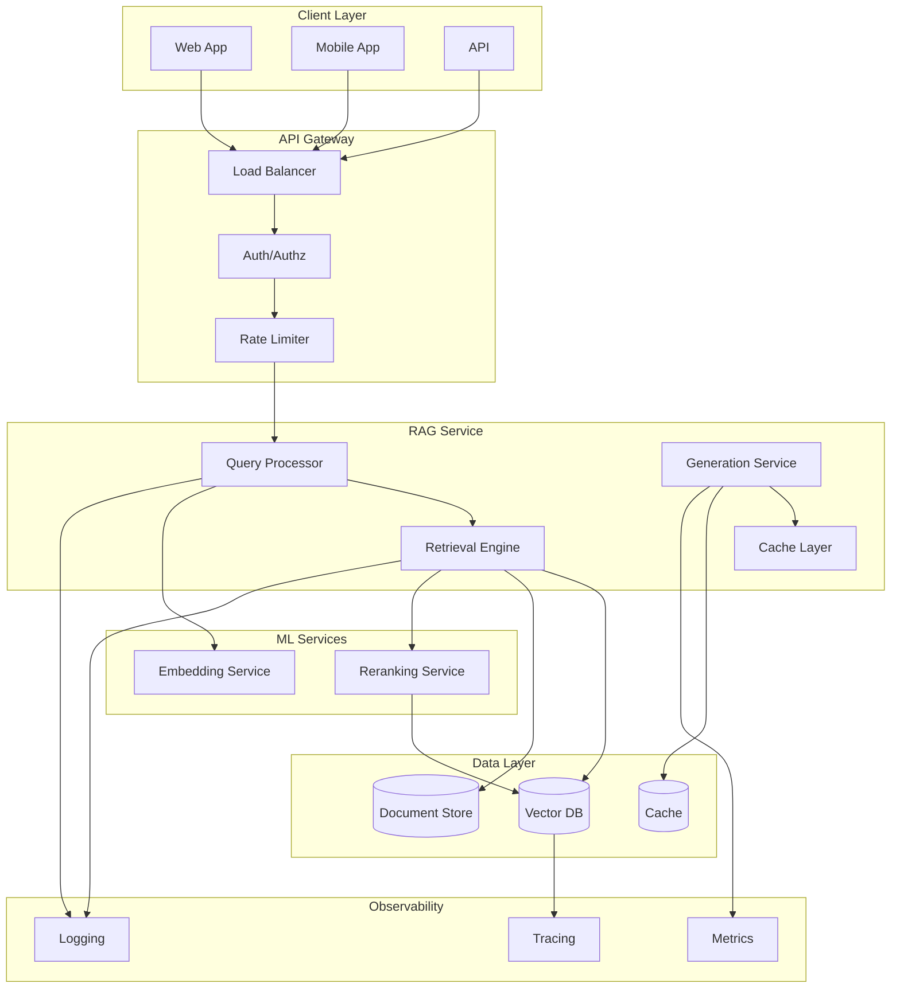
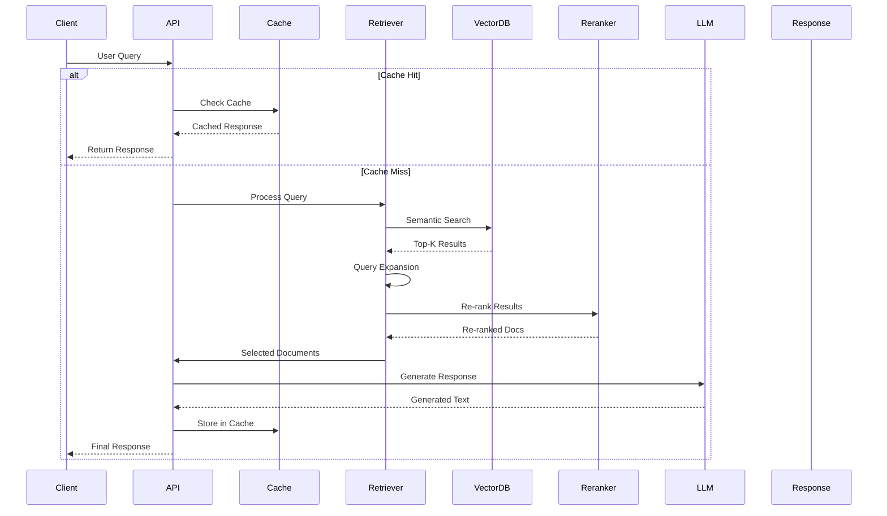
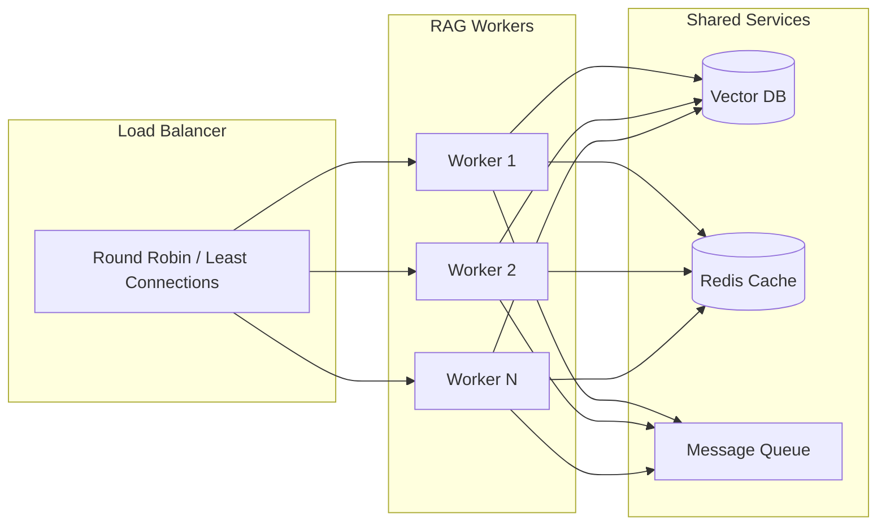
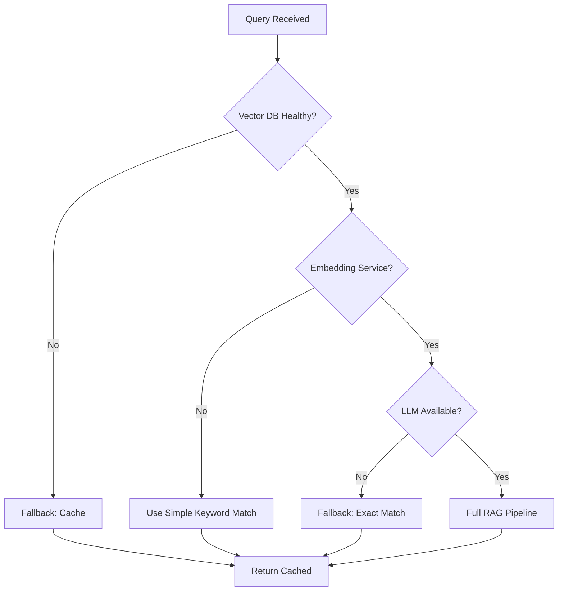
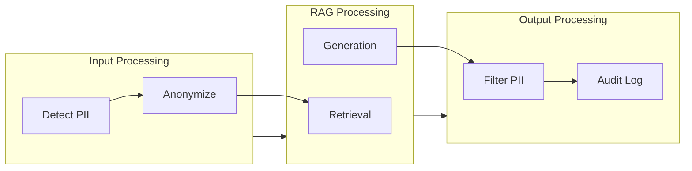
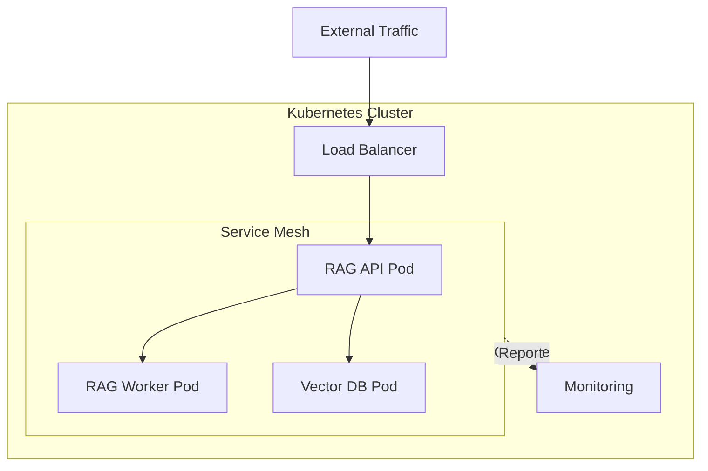

# System Design for Production

## Introduction

Building a production-grade RAG system requires careful architectural decisions. This guide covers the key components, patterns, and best practices for deploying reliable RAG systems at scale.

---

## 1. High-Level Architecture

### 1.1 Core Components



### 1.2 Data Flow



---

## 2. Component Design

### 2.1 Query Processing Pipeline

```python
class QueryProcessor:
    """Handles query preprocessing and transformation."""
    
    def __init__(self):
        self.query_expander = QueryExpander()
        self.query_classifier = QueryClassifier()
        self.intent_detector = IntentDetector()
        
    def process(self, query: str) -> ProcessedQuery:
        # Step 1: Parse and clean
        cleaned = self._clean_query(query)
        
        # Step 2: Classify query type
        query_type = self.query_classifier.classify(cleaned)
        
        # Step 3: Detect intent
        intent = self.intent_detector.detect(cleaned)
        
        # Step 3: Expand query
        expanded = self.query_expander.expand(cleaned)
        
        # Step 4: Generate embedding
        embedding = self.embedding_model.encode(expanded)
        
        return ProcessedQuery(
            original=query,
            cleaned=cleaned,
            expanded=expanded,
            embedding=embedding,
            query_type=query_type,
            intent=intent
        )
```

### 2.2 Retrieval Engine

```python
class RetrievalEngine:
    """Multi-strategy retrieval with fallback."""
    
    def __init__(self, config: RetrievalConfig):
        self.strategies = {
            'semantic': SemanticSearch(config.vector_store),
            'keyword': KeywordSearch(config.bm25_index),
            'hybrid': HybridSearch(config.vector_store, config.bm25_index)
        }
        self.reranker = CrossEncoderReranker(config.reranker_model)
        
    def retrieve(self, query: ProcessedQuery, 
                 k: int = 10) -> List[RankedDocument]:
        
        # Determine which strategy to use
        strategy = self._select_strategy(query)
        
        # Initial retrieval
        candidates = strategy.search(query.embedding, k=k*2)
        
        # Re-rank
        reranked = self.reranker.rerank(query.expanded, candidates)
        
        # Filter low-quality results
        filtered = self._filter_results(reranked, threshold=0.3)
        
        return filtered[:k]
    
    def _select_strategy(self, query: ProcessedQuery) -> SearchStrategy:
        """Select retrieval strategy based on query type."""
        if query.query_type == 'factual':
            return self.strategies['keyword']
        elif query.query_type == 'semantic':
            return self.strategies['semantic']
        else:
            return self.strategies['hybrid']
```

### 2.3 Generation Service

```python
class GenerationService:
    """Handles LLM interaction with proper safeguards."""
    
    def __init__(self, config: GenerationConfig):
        self.llm = config.llm
        self.prompt_builder = PromptBuilder(config.template)
        self.guardrails = Guardrails(config.guardrail_config)
        self.token_limiter = TokenLimiter(config.max_tokens)
        
    def generate(self, query: str, 
                context: List[Document]) -> GenerationResult:
        
        # Check input guardrails
        self.guardrails.check_input(query)
        
        # Build and validate prompt
        prompt = self.prompt_builder.build(query, context)
        
        # Check token limits
        if not self.token_limiter.validate(prompt):
            context = self.token_limiter.trim(context)
            prompt = self.prompt_builder.build(query, context)
        
        # Generate
        response = self.llm.generate(prompt)
        
        # Check output guardrails
        validated_response = self.guardrails.check_output(response)
        
        return GenerationResult(
            text=validated_response,
            prompt=prompt,
            tokens_used=self.token_limiter.count(prompt + response),
            model=self.llm.model_name
        )
```

---

## 3. Scalability Patterns

### 3.1 Horizontal Scaling



**Implementation:**
```python
class RAGWorker:
    def __init__(self, worker_id: int):
        self.worker_id = worker_id
        self.retriever = RetrievalEngine()
        self.generator = GenerationService()
        
    def process_request(self, request: Request) -> Response:
        # Each worker is stateless
        # All state is in shared services
        pass

# Kubernetes deployment
# apiVersion: apps/v1
# kind: Deployment
# spec:
#   replicas: 3
#   template:
#     spec:
#       containers:
#       - name: rag-worker
#         resources:
#           requests:
#             memory: "2Gi"
#             cpu: "1"
#           limits:
#             memory: "4Gi"
#             cpu: "2"
```

### 3.2 Caching Architecture

```mermaid
flowchart TB
    subgraph Client["Client Request"]
        Q[Query]
    end
    
    subgraph Cache["Multi-Layer Cache"]
        L1[L1: In-Memory]
        L2[L2: Redis]
        L3[L3: CDN]
    end
    
    subgraph Backend["Backend Services"]
        RAG[RAG Pipeline]
        VDB[(Vector DB)]
        LLM[LLM API]
    end
    
    Q --> L1
    
    alt L1 Hit
        L1 -->|Return| Client
    else
        L1 --> L2
        alt L2 Hit
            L2 -->|Return + Populate L1| Client
        else
            L2 --> L3
            alt L3 Hit
                L3 -->|Return + Populate L2| Client
            else
                L3 --> RAG
                RAG --> VDB
                RAG --> LLM
                LLM -->|Response| RAG
                RAG -->|Populate All Levels| Client
            end
        end
    end
```

### 3.3 Async Processing

```python
import asyncio
from queue import Queue
from threading import Thread

class AsyncRAGProcessor:
    """Handle high throughput with async processing."""
    
    def __init__(self, queue_size: int = 1000):
        self.request_queue = Queue(maxsize=queue_size)
        self.response_futures = {}
        self.worker_thread = Thread(target=self._process_queue)
        
    async def query(self, query: str) -> str:
        """Submit query and wait for result."""
        future = asyncio.Future()
        request_id = str(uuid4())
        
        self.request_queue.put({
            'id': request_id,
            'query': query,
            'future': future
        })
        
        return await future
    
    def _process_queue(self):
        """Background worker processes requests."""
        while True:
            request = self.request_queue.get()
            
            try:
                result = self._sync_process(request['query'])
                request['future'].set_result(result)
            except Exception as e:
                request['future'].set_exception(e)
```

---

## 4. Reliability Patterns

### 4.1 Circuit Breaker Implementation

```python
class RAGCircuitBreaker:
    """Circuit breaker for external dependencies."""
    
    def __init__(self):
        self.vector_db_cb = CircuitBreaker(
            failure_threshold=5,
            timeout=60
        )
        self.llm_cb = CircuitBreaker(
            failure_threshold=3,
            timeout=120
        )
        
    def query_with_circuit_breaker(self, query: str) -> Response:
        try:
            # Try vector DB
            docs = self.vector_db_cb.call(
                self.retriever.retrieve, query
            )
            
            # Try LLM
            response = self.llm_cb.call(
                self.generator.generate, query, docs
            )
            
            return response
            
        except CircuitBreakerOpenError:
            # Return fallback response
            return self.fallback.respond(
                "Service temporarily unavailable. "
                "Please try again later."
            )
```

### 4.2 Graceful Degradation



---

## 5. Observability Architecture

### 5.1 Metrics Collection

```python
from prometheus_client import Counter, Histogram, Gauge

# Define metrics
REQUESTS_TOTAL = Counter(
    'rag_requests_total',
    'Total RAG requests',
    ['endpoint', 'status']
)

LATENCY = Histogram(
    'rag_request_duration_seconds',
    'Request latency',
    ['endpoint']
)

RETRIEVAL_COUNT = Histogram(
    'rag_retrieved_documents',
    'Number of documents retrieved'
)

TOKEN_USAGE = Counter(
    'rag_tokens_total',
    'Total tokens used',
    ['model', 'type']
)

QUALITY_SCORE = Gauge(
    'rag_quality_score',
    'Quality score from evaluation',
    ['metric']
)

class RAGMetrics:
    @staticmethod
    def record_request(endpoint: str, status: str):
        REQUESTS_TOTAL.labels(endpoint=endpoint, status=status).inc()
        
    @staticmethod
    def record_latency(endpoint: str, duration: float):
        LATENCY.labels(endpoint=endpoint).observe(duration)
        
    @staticmethod
    def record_retrieval(count: int):
        RETRIEVAL_COUNT.observe(count)
```

### 5.2 Health Checks

```python
class RAGHealthCheck:
    """Comprehensive health checks."""
    
    async def check_health(self) -> Dict:
        checks = {
            'vector_db': await self._check_vector_db(),
            'llm': await self._check_llm(),
            'cache': await self._check_cache(),
            'embedding': await self._check_embedding()
        }
        
        overall = all(
            check['status'] == 'healthy' 
            for check in checks.values()
        )
        
        return {
            'status': 'healthy' if overall else 'unhealthy',
            'checks': checks,
            'timestamp': datetime.utcnow().isoformat()
        }
    
    async def _check_vector_db(self) -> Dict:
        try:
            # Simple query test
            result = self.vector_db.test_connection()
            return {'status': 'healthy', 'latency_ms': result.latency}
        except Exception as e:
            return {'status': 'unhealthy', 'error': str(e)}
```

---

## 6. Security Architecture

### 6.1 Authentication & Authorization

```python
class RAGSecurity:
    """Security middleware for RAG services."""
    
    def __init__(self, auth_provider):
        self.auth = auth_provider
        self.rate_limiter = RateLimiter()
        
    async def authenticate(self, request: Request) -> AuthResult:
        # Verify JWT
        token = request.headers.get('Authorization')
        if not token:
            raise UnauthorizedError("Missing token")
            
        claims = await self.auth.verify_token(token)
        
        # Check rate limit
        if not await self.rate_limiter.check(claims.user_id):
            raise RateLimitError()
            
        return AuthResult(
            user_id=claims.user_id,
            permissions=claims.permissions,
            tenant_id=claims.tenant_id
        )
    
    def authorize(self, auth_result: AuthResult, 
                  resource: str) -> bool:
        # Check if user can access resource
        return resource in auth_result.permissions
```

### 6.2 Data Privacy



---

## 7. Deployment Architecture

### 7.1 Kubernetes Deployment

```yaml
# deployment.yaml
apiVersion: apps/v1
kind: Deployment
metadata:
  name: rag-api
spec:
  replicas: 3
  selector:
    matchLabels:
      app: rag-api
  template:
    metadata:
      labels:
        app: rag-api
    spec:
      containers:
      - name: api
        image: rag-api:latest
        ports:
        - containerPort: 8000
        resources:
          requests:
            memory: "2Gi"
            cpu: "1000m"
          limits:
            memory: "4Gi"
            cpu: "2000m"
        env:
        - name: VECTOR_DB_URL
          valueFrom:
            secretKeyRef:
              name: rag-secrets
              key: vector-db-url
        - name: OPENAI_API_KEY
          valueFrom:
            secretKeyRef:
              name: rag-secrets
              key: openai-api-key
        readinessProbe:
          httpGet:
            path: /health
            port: 8000
          initialDelaySeconds: 10
          periodSeconds: 5
        livenessProbe:
          httpGet:
            path: /health
            port: 8000
          initialDelaySeconds: 30
          periodSeconds: 10
```

### 7.2 Service Mesh



---

## 8. Cost Optimization

### 8.1 Cost Tracking

```python
class CostTracker:
    """Track and optimize RAG costs."""
    
    def __init__(self):
        self.costs = defaultdict(float)
        self.budgets = {
            'daily': 100.0,
            'monthly': 2000.0
        }
        
    def track(self, component: str, cost: float):
        self.costs[component] += cost
        self._check_budgets()
        
    def _check_budgets(self):
        daily_total = sum(self.costs.values())
        
        if daily_total > self.budgets['daily'] * 0.9:
            logger.warning(f"Approaching daily budget: ${daily_total}")
            # Trigger cost-saving measures
            self._enable_aggressive_caching()
            self._reduce_retrieval_k()
```

### 8.2 Optimization Strategies

| Strategy | Cost Savings | Impact |
|----------|--------------|--------|
| Aggressive caching | 30-50% | Minimal |
| Smaller embedding models | 20-40% | Low |
| Reduce retrieval K | 15-30% | Medium |
| Batching LLM requests | 10-20% | Low |
| Use cheaper LLM for simple queries | 25-40% | Medium |

---

## Summary

Production RAG systems require:

1. **Scalability** - Horizontal scaling, caching, async processing
2. **Reliability** - Circuit breakers, fallbacks, retries
3. **Observability** - Metrics, logging, tracing, health checks
4. **Security** - Auth, authorization, data privacy
5. **Cost Optimization** - Tracking, budgeting, optimization strategies

---

## Next Steps

- [RAG Evaluation](../06_rag_evaluation/concepts.md) - Measure your system's performance
- Review [Common Issues](./common_issues.md) - Know what to watch for
