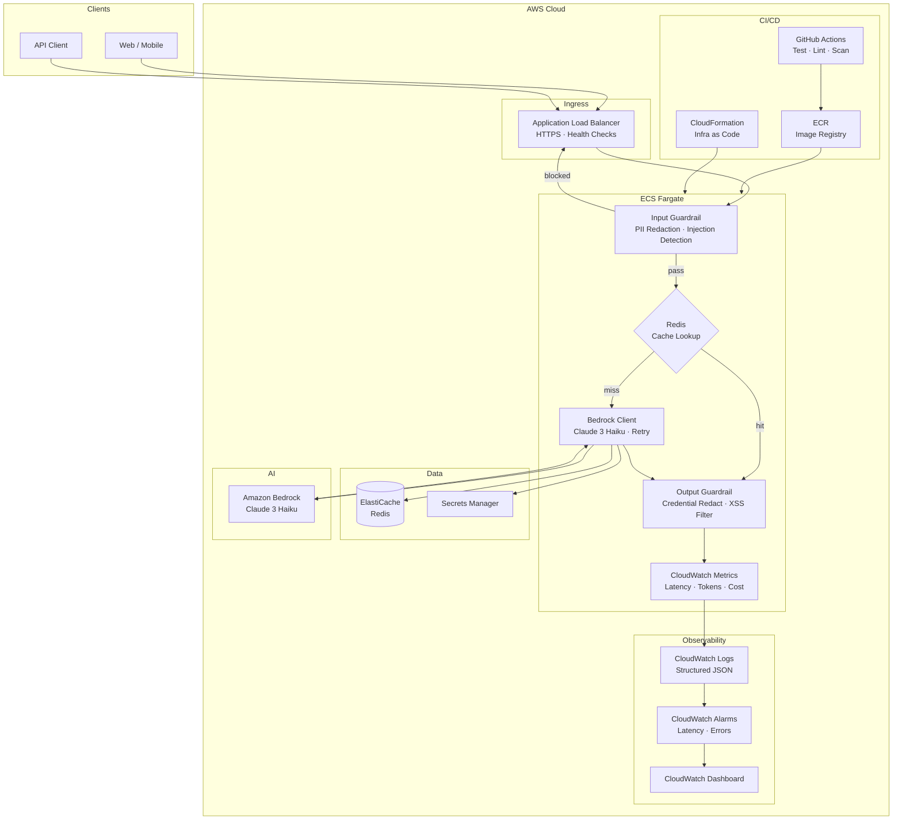

# AWS LLM App — Production LLMOps Reference

A production-ready LLM API powered by **Amazon Bedrock (Claude 3)** and deployed on **AWS ECS Fargate** with guardrails, caching, observability, and CI/CD.

---

## System Architecture



---

### Architecture at a Glance

```
╔═════════════════════════════════════════════════════════════════════╗
║  CLIENTS                                                             ║
║       [ Web / Mobile ]          [ API Client / SDK ]                 ║
╚══════════════════════╦══════════════════════╦════════════════════════╝
                       ▼                      ▼
╔═════════════════════════════════════════════════════════════════════╗
║  INGRESS                                                             ║
║  ┌──────────────────────────────────────────────────────────────┐   ║
║  │  Application Load Balancer  │  HTTPS · Health Checks · TLS  │   ║
║  └──────────────────────────────────────────────────────────────┘   ║
╚══════════════════════════════════════╦══════════════════════════════╝
                                       ▼
╔═════════════════════════════════════════════════════════════════════╗
║  ECS FARGATE                                                         ║
║                                                                      ║
║  ┌───────────────────────────────────────────────────────────┐      ║
║  │  INPUT GUARDRAIL                                           │      ║
║  │  • PII Redaction  (email / phone / SSN / credit card)      │      ║
║  │  • Prompt Injection Detection                              │      ║
║  │  • Length Limit                                            │      ║
║  └────────────────────────┬──────────────────────────────────┘      ║
║                      pass │  block ──▶ 400 Error                     ║
║                            ▼                                         ║
║  ┌───────────────────────────────────────────────────────────┐      ║
║  │  CACHE LOOKUP  (ElastiCache Redis)                         │      ║
║  │       HIT  ──▶  return cached response  (zero LLM cost)   │      ║
║  │      MISS  ──▶  forward to Bedrock Client                  │      ║
║  └──────────────────────┬────────────────────────────────────┘      ║
║                          │ MISS                                      ║
║                          ▼                                           ║
║  ┌───────────────────────────────────────────────────────────┐      ║
║  │  BEDROCK CLIENT  ──────────────────────▶  Amazon Bedrock  │      ║
║  │  • Claude 3 Haiku                         Claude 3 Haiku  │      ║
║  │  • Retry with exponential backoff  ◀──────────────────────│      ║
║  │  • Token tracking + cost estimate                          │      ║
║  │  • Store response in Redis cache                           │      ║
║  └──────────────────────┬────────────────────────────────────┘      ║
║                          ▼                                           ║
║  ┌───────────────────────────────────────────────────────────┐      ║
║  │  OUTPUT GUARDRAIL                                          │      ║
║  │  • Credential / API key redaction                         │      ║
║  │  • Script injection (XSS) removal                         │      ║
║  └──────────────────────┬────────────────────────────────────┘      ║
║                          ▼                                           ║
║  ┌───────────────────────────────────────────────────────────┐      ║
║  │  CLOUDWATCH METRICS                                        │      ║
║  │  RequestCount · Latency · InputTokens · OutputTokens       │      ║
║  │  EstimatedCostUSD · CacheHit · GuardrailBlock              │      ║
║  └───────────────────────────────────────────────────────────┘      ║
╚══════════╦══════════════════════════════════════╦════════════════════╝
           ▼                                      ▼
╔══════════════════════════╗       ╔═════════════════════════════════╗
║  DATA LAYER              ║       ║  OBSERVABILITY                  ║
║  ┌──────────────────────┐║       ║  ┌─────────────────────────────┐║
║  │  ElastiCache Redis   │║       ║  │  CloudWatch Logs            │║
║  │  Response cache      │║       ║  │  Structured JSON · JSON fmt │║
║  │  TTL: 1 hour         │║       ║  └──────────────┬──────────────┘║
║  └──────────────────────┘║       ║                 ▼               ║
║  ┌──────────────────────┐║       ║  ┌─────────────────────────────┐║
║  │  Secrets Manager     │║       ║  │  CloudWatch Alarms          │║
║  │  No credentials      │║       ║  │  Latency p95 > 5s           │║
║  │  in code / env vars  │║       ║  │  Error count > 10/min       │║
║  └──────────────────────┘║       ║  └──────────────┬──────────────┘║
╚══════════════════════════╝       ║                 ▼               ║
                                   ║  ┌─────────────────────────────┐║
╔══════════════════════════╗       ║  │  CloudWatch Dashboard       │║
║  CI/CD PIPELINE          ║       ║  │  Cost · Latency · Tokens    │║
║  ┌──────────────────────┐║       ║  └─────────────────────────────┘║
║  │  GitHub Actions      │║       ╚═════════════════════════════════╝
║  │  Test → Lint → Scan  │║
║  └──────────┬───────────┘║
║             ▼            ║
║  ┌──────────────────────┐║
║  │  ECR Image Registry  │║
║  │  Versioned by git SHA│║
║  └──────────┬───────────┘║
║             ▼            ║
║  ┌──────────────────────┐║
║  │  CloudFormation      │║
║  │  Deploy → Health Chk │║
║  │  Auto Rollback       │║
║  └──────────────────────┘║
╚══════════════════════════╝
```

---

## LLMOps Pillars Implemented

| Pillar | Implementation |
|---|---|
| **Guardrails — Input** | PII redaction, prompt injection detection, length limits |
| **Guardrails — Output** | Credential redaction, XSS sanitization |
| **Observability** | Structured JSON logs → CloudWatch Logs; custom metrics → CloudWatch |
| **Caching** | ElastiCache Redis — duplicate requests served at zero cost |
| **Resilience** | Tenacity retry + exponential backoff; ECS deployment circuit breaker |
| **Security** | IAM Task Role (no static credentials), Secrets Manager, non-root container |
| **Cost Control** | Per-request token + cost tracking pushed to CloudWatch |
| **CI/CD** | GitHub Actions: test → lint → security scan → build → deploy → health check → rollback |
| **IaC** | CloudFormation — VPC, ECS, ALB, ElastiCache, Secrets Manager, IAM, Auto Scaling, Alarms |
| **Auto Scaling** | ECS Service Auto Scaling on CPU utilization (target 70%) |

---

## Project Structure

```
aws-llm-app/
├── app/
│   ├── main.py           # FastAPI app — full request pipeline
│   ├── config.py         # Settings via env vars
│   ├── models.py         # Request/response schemas
│   ├── guardrails.py     # Input + output guards (single file)
│   ├── llm_client.py     # Bedrock client + retry + cost tracking
│   ├── monitoring.py     # Structured logging + CloudWatch metrics
│   └── cache.py          # Redis cache (ElastiCache)
├── tests/
│   └── test_guardrails.py
├── infrastructure/
│   └── cloudformation.yml  # All AWS resources as code
├── .github/workflows/
│   └── deploy.yml           # CI + CD in one workflow
├── Dockerfile               # Multi-stage, non-root
├── requirements.txt
└── .env.example
```

---

## Prerequisites

- [AWS CLI v2](https://docs.aws.amazon.com/cli/latest/userguide/install-cliv2.html) configured (`aws configure`)
- Docker + Docker Buildx
- Python 3.11+
- Amazon Bedrock access enabled for Claude 3 Haiku in your AWS account
  - Enable at: AWS Console → Bedrock → Model Access → Request access

---

## Deployment: Step-by-Step

### Step 1 — Clone and configure

```bash
git clone <repo-url>
cd aws-llm-app
cp .env.example .env
```

### Step 2 — Configure AWS CLI

```bash
aws configure
# Enter: Access Key ID, Secret Access Key, Region (us-east-1), Output (json)
```

### Step 3 — Create ECR repository

```bash
export APP_NAME=llm-app
export AWS_REGION=us-east-1
export ACCOUNT_ID=$(aws sts get-caller-identity --query Account --output text)
export ECR_REPO="${ACCOUNT_ID}.dkr.ecr.${AWS_REGION}.amazonaws.com/${APP_NAME}"

aws ecr create-repository \
  --repository-name "$APP_NAME" \
  --region "$AWS_REGION" \
  --image-scanning-configuration scanOnPush=true
```

### Step 4 — Build and push Docker image

```bash
IMAGE_TAG=$(git rev-parse --short HEAD)

aws ecr get-login-password --region "$AWS_REGION" \
  | docker login --username AWS --password-stdin "$ECR_REPO"

docker build --platform linux/amd64 -t "${ECR_REPO}:${IMAGE_TAG}" .
docker push "${ECR_REPO}:${IMAGE_TAG}"
```

### Step 5 — Deploy CloudFormation stack

```bash
export ENVIRONMENT=dev   # dev | staging | prod

aws cloudformation deploy \
  --template-file infrastructure/cloudformation.yml \
  --stack-name "${APP_NAME}-${ENVIRONMENT}" \
  --parameter-overrides \
      Environment="$ENVIRONMENT" \
      ImageTag="$IMAGE_TAG" \
      EcrRepo="$ECR_REPO" \
  --capabilities CAPABILITY_NAMED_IAM \
  --region "$AWS_REGION"
```

This provisions:
- VPC with public + private subnets across 2 AZs
- ECS Cluster + Fargate task definition
- Application Load Balancer
- ElastiCache Redis (response cache)
- Secrets Manager (for secrets)
- IAM Task Role (Bedrock + CloudWatch + Secrets Manager access)
- Auto Scaling (CPU-based, target 70%)
- CloudWatch Alarms (latency + error rate)
- Deployment circuit breaker with auto-rollback

### Step 6 — Verify the deployment

```bash
ALB_URL=$(aws cloudformation describe-stacks \
  --stack-name "${APP_NAME}-${ENVIRONMENT}" \
  --query "Stacks[0].Outputs[?OutputKey=='ALBURL'].OutputValue" \
  --output text)

# Health check
curl "${ALB_URL}/health"

# Test chat endpoint
curl -X POST "${ALB_URL}/v1/chat" \
  -H "Content-Type: application/json" \
  -d '{"messages": [{"role": "user", "content": "What is LLMOps?"}]}'
```

### Step 7 — Enable Amazon Bedrock model access

```bash
# Via AWS Console (required before first use):
# AWS Console → Bedrock → Model Access → Request access → Claude 3 Haiku
# Or via CLI:
aws bedrock put-foundation-model-entitlement \
  --model-id anthropic.claude-3-haiku-20240307-v1:0
```

### Step 8 — Set up GitHub Actions (CI/CD)

Add these secrets to your GitHub repository (`Settings → Secrets`):

| Secret | Value |
|---|---|
| `AWS_ACCESS_KEY_ID` | IAM user access key (CI role) |
| `AWS_SECRET_ACCESS_KEY` | IAM user secret key |

Pushes to `main` → deploys to `dev`. Pushes to `release/*` → deploys to `prod`.

---

## Running Locally

```bash
# Start Redis locally
docker run -d -p 6379:6379 redis:7-alpine

# Run with local AWS credentials (uses your ~/.aws/credentials)
pip install -r requirements.txt
uvicorn app.main:app --reload --port 8000

# API docs
open http://localhost:8000/docs
```

---

## Running Tests

```bash
pip install -r requirements.txt -r requirements-dev.txt
pytest tests/ -v --cov=app --cov-report=term-missing
```

---

## API Reference

### `POST /v1/chat`

```json
{
  "messages": [
    {"role": "user", "content": "Explain RAG in simple terms."}
  ],
  "session_id": "optional-uuid",
  "max_tokens": 500
}
```

**Response** includes: `message`, `token_usage`, `latency_ms`, `model`, `guardrail_passed`, `cached`.

### `GET /health` — Liveness check

---

## Cost Monitoring

All requests push `EstimatedCostUSD` to CloudWatch. Create a billing alarm:

```bash
aws cloudwatch put-metric-alarm \
  --alarm-name "llm-app-daily-cost" \
  --metric-name EstimatedCharges \
  --namespace AWS/Billing \
  --statistic Maximum \
  --period 86400 \
  --threshold 10 \
  --comparison-operator GreaterThanThreshold \
  --alarm-actions <your-sns-topic-arn>
```

---

## Teardown

```bash
aws cloudformation delete-stack \
  --stack-name "${APP_NAME}-${ENVIRONMENT}" \
  --region "$AWS_REGION"

aws ecr delete-repository \
  --repository-name "$APP_NAME" \
  --force \
  --region "$AWS_REGION"
```
