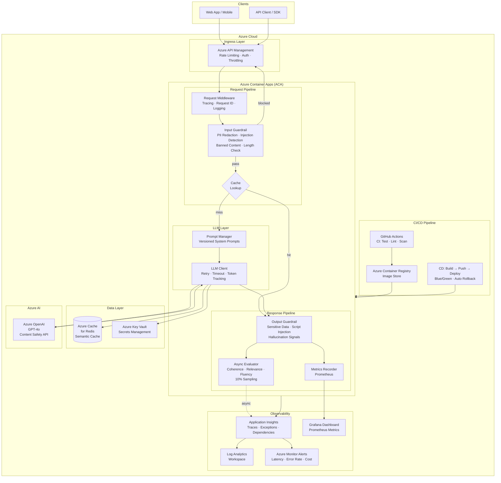

# Azure LLM App — Production LLMOps Reference

A production-ready LLM API deployed on **Azure Container Apps** with comprehensive LLMOps practices: guardrails, observability, evaluation, CI/CD, caching, and security.

---

## System Architecture



---

### Architecture at a Glance

```
╔══════════════════════════════════════════════════════════════════════════════════════╗
║                              CLIENTS                                                 ║
║          [ Web App / Mobile ]            [ API Client / SDK ]                        ║
╚══════════════════════════╦═════════════════════════╦═══════════════════════════════╝
                           ▼                         ▼
╔══════════════════════════════════════════════════════════════════════════════════════╗
║  INGRESS LAYER                                                                       ║
║  ┌──────────────────────────────────────────────────────────────┐                   ║
║  │  Azure API Management  │  Rate Limiting · Auth · Throttling  │                   ║
║  └──────────────────────────────────────────────────────────────┘                   ║
╚══════════════════════════════════════╦═════════════════════════════════════════════╝
                                       ▼
╔══════════════════════════════════════════════════════════════════════════════════════╗
║  AZURE CONTAINER APPS                                                                ║
║                                                                                      ║
║  ① REQUEST PIPELINE                                                                  ║
║  ┌─────────────────────┐   ┌────────────────────────────────────────────┐           ║
║  │  Request Middleware  │──▶│  INPUT GUARDRAIL                           │           ║
║  │  Tracing · Req ID   │   │  • PII Redaction (email/phone/SSN/CC)      │           ║
║  └─────────────────────┘   │  • Prompt Injection Detection              │           ║
║                             │  • Banned Content Filter                  │           ║
║                             │  • Length Check                           │           ║
║                             └──────────────────┬──────────────────────-┘           ║
║                                          pass  │  block ──▶ 400 Error               ║
║                                                ▼                                    ║
║  ┌─────────────────────────────────────────────────────┐                            ║
║  │  CACHE LOOKUP  (Azure Redis)                         │                            ║
║  │       HIT ──▶ skip LLM call, return cached result   │                            ║
║  │      MISS ──▶ continue to LLM Layer                 │                            ║
║  └────────────────────────┬────────────────────────────┘                            ║
║                            │ MISS                                                    ║
║  ② LLM LAYER               ▼                                                        ║
║  ┌───────────────────────────────────────────────────────────────┐                  ║
║  │  Prompt Manager                    LLM Client                  │                  ║
║  │  • Versioned system prompts  ──▶  • Retry (exponential)        │──▶ Azure OpenAI ║
║  │  • Variable substitution          • Token tracking             │◀── GPT-4o       ║
║  │  • Prompt metadata logging        • Cost estimation            │                  ║
║  └───────────────────────────────────────────────────────────────┘                  ║
║                                                │                                     ║
║  ③ RESPONSE PIPELINE                           ▼                                    ║
║  ┌─────────────────────────────────────────────────────────────┐                    ║
║  │  OUTPUT GUARDRAIL                                            │                    ║
║  │  • Credential / API key redaction                           │                    ║
║  │  • Script injection (XSS) sanitization                      │                    ║
║  │  • Hallucination signal logging                              │                    ║
║  └─────────────────────────────┬───────────────────────────────┘                    ║
║                                 │                                                    ║
║               ┌─────────────────┴──────────────────┐                                ║
║               ▼                                     ▼                                ║
║  ┌────────────────────────┐          ┌───────────────────────────┐                  ║
║  │  Metrics Recorder      │          │  Async Evaluator (10%)    │                  ║
║  │  Prometheus counters   │          │  Coherence · Relevance    │                  ║
║  │  Latency histograms    │          │  Fluency · Groundedness   │                  ║
║  └────────────────────────┘          └───────────────────────────┘                  ║
╚══════════╦═══════════════════════════════════════════════════════════════╦══════════╝
           ▼                                                               ▼
╔══════════════════════════════╗              ╔═══════════════════════════════════════╗
║  DATA LAYER                  ║              ║  OBSERVABILITY                        ║
║  ┌────────────────────────┐  ║              ║  ┌─────────────────────────────────┐  ║
║  │  Azure Cache for Redis │  ║              ║  │  Application Insights           │  ║
║  │  Semantic response     │  ║              ║  │  Traces · Exceptions · Deps     │  ║
║  │  cache  TTL: 1hr       │  ║              ║  └────────────┬────────────────────┘  ║
║  └────────────────────────┘  ║              ║               ▼                       ║
║  ┌────────────────────────┐  ║              ║  ┌─────────────────────────────────┐  ║
║  │  Azure Key Vault       │  ║              ║  │  Log Analytics Workspace        │  ║
║  │  Secrets · RBAC        │  ║              ║  └────────────┬────────────────────┘  ║
║  │  Managed Identity      │  ║              ║               ▼                       ║
║  └────────────────────────┘  ║              ║  ┌─────────────────────────────────┐  ║
╚══════════════════════════════╝              ║  │  Azure Monitor Alerts           │  ║
                                              ║  │  Latency · Error Rate · Cost    │  ║
╔══════════════════════════════╗              ║  └─────────────────────────────────┘  ║
║  AZURE AI                    ║              ╚═══════════════════════════════════════╝
║  ┌────────────────────────┐  ║
║  │  Azure OpenAI          │  ║              ╔═══════════════════════════════════════╗
║  │  GPT-4o deployment     │  ║              ║  CI/CD PIPELINE                       ║
║  │  Content Safety API    │  ║              ║  ┌─────────────────────────────────┐  ║
║  └────────────────────────┘  ║              ║  │  GitHub Actions CI              │  ║
╚══════════════════════════════╝              ║  │  Lint → Test → Scan → Build     │  ║
                                              ║  └──────────────┬──────────────────┘  ║
                                              ║                 ▼                      ║
                                              ║  ┌─────────────────────────────────┐  ║
                                              ║  │  Azure Container Registry       │  ║
                                              ║  │  Versioned image store          │  ║
                                              ║  └──────────────┬──────────────────┘  ║
                                              ║                 ▼                      ║
                                              ║  ┌─────────────────────────────────┐  ║
                                              ║  │  CD: Deploy → Health Check      │  ║
                                              ║  │  Blue/Green · Auto Rollback     │  ║
                                              ║  └─────────────────────────────────┘  ║
                                              ╚═══════════════════════════════════════╝
```

---

## LLMOps Pillars Implemented

| Pillar | Implementation |
|---|---|
| **Guardrails — Input** | PII redaction, prompt injection detection, banned content, length limits |
| **Guardrails — Output** | Sensitive data redaction, script injection sanitization, hallucination signal logging |
| **Observability** | Structured JSON logs, Prometheus metrics, Azure App Insights traces |
| **Evaluation** | Async sampled scoring (coherence, relevance, fluency, groundedness) |
| **Caching** | Redis semantic cache — identical requests served in <5ms at zero LLM cost |
| **Resilience** | Tenacity retry with exponential backoff, health checks, graceful degradation |
| **Security** | Managed identity, Key Vault secrets, non-root container, Trivy image scan |
| **Cost Control** | Token usage tracking, per-request cost estimation, cache-hit metrics |
| **CI/CD** | GitHub Actions: lint → test → security scan → build → deploy → health check → rollback |
| **IaC** | Azure Bicep for repeatable infra (OpenAI, ACA, Redis, Key Vault, App Insights) |
| **Versioning** | Prompt registry with semantic versions, container image tagging by git SHA |
| **Rate Limiting** | Per-IP rate limiting via SlowAPI + Azure API Management |

---

## Project Structure

```
azure-llm-app/
├── app/
│   ├── main.py                  # FastAPI app, request pipeline
│   ├── config.py                # Pydantic settings (env vars)
│   ├── models.py                # Request/response schemas
│   ├── guardrails/
│   │   ├── input_guard.py       # PII, injection, banned content
│   │   └── output_guard.py      # Sensitive data, XSS, hallucination
│   ├── llm/
│   │   ├── client.py            # Azure OpenAI client + retry
│   │   └── prompts.py           # Versioned prompt templates
│   ├── monitoring/
│   │   ├── logger.py            # Structured JSON logger + App Insights
│   │   └── metrics.py           # Prometheus metrics definitions
│   ├── evaluation/
│   │   └── evaluator.py         # Async quality evaluation
│   └── cache/
│       └── redis_cache.py       # Semantic Redis cache
├── tests/
│   ├── test_guardrails.py       # Unit tests for guardrails
│   └── test_api.py              # Integration tests for endpoints
├── infrastructure/
│   ├── bicep/
│   │   └── main.bicep           # All Azure resources as code
│   └── scripts/
│       └── deploy.sh            # End-to-end deploy script
├── .github/workflows/
│   ├── ci.yml                   # Test, lint, security scan, docker build
│   └── cd.yml                   # Build, push, deploy, health check, rollback
├── Dockerfile                   # Multi-stage, non-root, health check
├── docker-compose.yml           # Local dev (app + redis + prometheus + grafana)
├── requirements.txt
└── .env.example
```

---

## Prerequisites

- [Azure CLI](https://docs.microsoft.com/en-us/cli/azure/install-azure-cli) (`az`)
- [Docker](https://docs.docker.com/get-docker/) + Docker Buildx
- [jq](https://stedolan.github.io/jq/)
- Python 3.11+
- Azure subscription with:
  - Contributor role on the target resource group
  - Azure OpenAI access approved (request at https://aka.ms/oai/access)

---

## Deployment: Step-by-Step

### Step 1 — Clone and configure

```bash
git clone <repo-url>
cd azure-llm-app
cp .env.example .env
# Fill in your Azure OpenAI endpoint and API key in .env
```

### Step 2 — Login to Azure

```bash
az login
az account set --subscription "<your-subscription-id>"
```

### Step 3 — Create the resource group

```bash
export ENVIRONMENT=dev   # or staging / prod
export APP_NAME=llmapp
export LOCATION=eastus

az group create \
  --name "${APP_NAME}-${ENVIRONMENT}-rg" \
  --location "$LOCATION"
```

### Step 4 — Deploy all Azure infrastructure (Bicep)

```bash
az deployment group create \
  --resource-group "${APP_NAME}-${ENVIRONMENT}-rg" \
  --template-file infrastructure/bicep/main.bicep \
  --parameters \
      environment="$ENVIRONMENT" \
      appName="$APP_NAME" \
      location="$LOCATION" \
      imageTag="latest"
```

This provisions:
- Azure OpenAI (GPT-4o deployment)
- Azure Container Apps environment
- Azure Cache for Redis
- Azure Key Vault (with RBAC)
- Azure Container Registry
- Application Insights + Log Analytics workspace
- User-assigned Managed Identity (no passwords for infra access)

### Step 5 — Store the OpenAI API key in Key Vault

```bash
KV_NAME="${APP_NAME}${ENVIRONMENT}-kv"   # adjust to exact resource name from Step 4 output

az keyvault secret set \
  --vault-name "$KV_NAME" \
  --name "azure-openai-api-key" \
  --value "<your-azure-openai-api-key>"
```

### Step 6 — Build and push the Docker image

```bash
# Get ACR login server
ACR_SERVER=$(az acr show \
  --resource-group "${APP_NAME}-${ENVIRONMENT}-rg" \
  --name "${APP_NAME}${ENVIRONMENT}acr" \
  --query loginServer -o tsv)

az acr login --name "${APP_NAME}${ENVIRONMENT}acr"

docker build --platform linux/amd64 -t "${ACR_SERVER}/llm-app:latest" .
docker push "${ACR_SERVER}/llm-app:latest"
```

### Step 7 — Re-deploy Container App with the image

```bash
az containerapp update \
  --resource-group "${APP_NAME}-${ENVIRONMENT}-rg" \
  --name "${APP_NAME}-${ENVIRONMENT}-app" \
  --image "${ACR_SERVER}/llm-app:latest"
```

### Step 8 — Verify the deployment

```bash
APP_FQDN=$(az containerapp show \
  --resource-group "${APP_NAME}-${ENVIRONMENT}-rg" \
  --name "${APP_NAME}-${ENVIRONMENT}-app" \
  --query "properties.configuration.ingress.fqdn" -o tsv)

# Health check
curl "https://${APP_FQDN}/health"

# Test the chat endpoint
curl -X POST "https://${APP_FQDN}/v1/chat" \
  -H "Content-Type: application/json" \
  -d '{"messages": [{"role": "user", "content": "What is LLMOps?"}]}'
```

### Step 9 — Set up GitHub Actions (CI/CD)

```bash
# Create service principal for GitHub Actions
az ad sp create-for-rbac \
  --name "github-actions-llmapp" \
  --role Contributor \
  --scopes "/subscriptions/<subscription-id>/resourceGroups/${APP_NAME}-${ENVIRONMENT}-rg" \
  --sdk-auth
```

Copy the JSON output and add it as a GitHub secret named `AZURE_CREDENTIALS`.

Pushes to `main` will now automatically build, push, deploy, run health checks, and roll back on failure.

---

## Running Locally

```bash
# Start all services (app + redis + prometheus + grafana)
docker compose up

# App API
open http://localhost:8000/docs

# Prometheus metrics
open http://localhost:9090

# Grafana dashboard (admin / admin)
open http://localhost:3000
```

---

## Running Tests

```bash
pip install -r requirements.txt pytest pytest-cov pytest-asyncio
pytest tests/ -v --cov=app --cov-report=term-missing
```

---

## API Reference

### `POST /v1/chat`

```json
{
  "messages": [
    {"role": "user", "content": "Explain LLMOps in 2 sentences."}
  ],
  "session_id": "optional-session-uuid",
  "max_tokens": 500,
  "temperature": 0.7,
  "user_id": "optional-user-id"
}
```

**Response** includes: `message`, `token_usage`, `latency_ms`, `guardrail_input`, `guardrail_output`, `cached`.

### `GET /health` — Liveness + dependency check
### `GET /metrics` — Prometheus metrics endpoint

---

## Cost Monitoring

The app tracks per-request cost in `llm_estimated_cost_usd_total` (Prometheus) and logs it to Application Insights. Set Azure Budget Alerts on the resource group to get notified when spend exceeds a threshold.

```bash
az consumption budget create \
  --budget-name "llm-app-monthly" \
  --amount 50 \
  --time-grain Monthly \
  --resource-group "${APP_NAME}-${ENVIRONMENT}-rg" \
  --notifications key=Actual,threshold=80,contactEmails=["you@example.com"]
```

---

## Teardown

```bash
az group delete --name "${APP_NAME}-${ENVIRONMENT}-rg" --yes --no-wait
```
